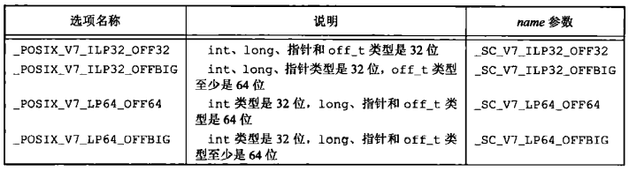
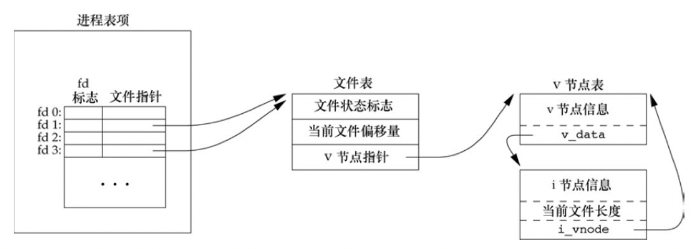

# 第三章 文件I/O

[TOC]


## 3.1 引言


## 3.2 文件描述符

文件描述符是一个非负整数。

一些常用关联：

- 0 标准输入
- 1 标准输出
- 2 标准错误

Linux 3.2.0/FreeBSD 8.0/Mac OS X 10.6.8/Solaris 10以后的操作系统，文件描述符的变化范围几乎是**无限的**，它只受到系统配置的存储器数量，整型的字长以及系统管理员所配置的软限制和硬限制的约束。


## 3.3 函数open和openat

```c++
#include <fcntl>
int open(const char* path, int oflag, ...);
int openat(int fd, const char* path, int oflag, ...);
```

- `fd` 文件描述符

  1. 如果path是绝对路径名，fd被忽略，open=openat
  2. 如果path是相对路径名，fd参数指出了相对路径在文件系统中的开始地址
  3. 如果path是相对路径名且fd参数具有特殊值AT_FDCWD，路径名在当前工作目录中获取

- `path` 要打开或创建文件的名字

- `oflag` 选项

  必选一个的操作选项：

  - `O_RDONLY` 只读打开
  - `O_WRONLY` 只写打开
  - `O_RDWR` 读写打开
  - `O_EXEC` 只执行打开
  - `O_SEARCH` 只搜索打开（应用于目录，在目录打开时验证它的搜索权限）

  可选的操作选项：

  - `O_APPEND` 每次写时都追加到文件的尾端
  - `O_CLOEXEC` 把FD_CLOEXEC常量设置为文件描述符标志
  - `O_CREAT` 若此文件不存在则创建它
  - `O_DIRECTORY` 如果path引用的不是目录，则出错
  - `O_EXCL` 如果同时指定了O_CREAT，而文件已存在，则出错
  - `O_NOCTTY ` 如果path引用的是终端设备，则不将该设备分配作为此进程的控制终端
  - `O_NOFOLLOW` 如果path引用的是一个符号链接，则出错
  - `O_NONBLOCK` 如果path引用的是一个FIFO，一个块特殊文件或一个字符特殊文件，则此选项为文件的本次打开操作和后续I/O操作设置非阻塞方式
  - `O_SYNC` 使每次write等待物理I/O操作完成，包括由该write操作引起的文件属性更新所需的I/O

- 返回值

  - 成功：文件描述符
  - 失败：-1

*打开文件/目录。*

`TOCTTOU错误（time-of-check-to-time-of-use）`如果有两个基于文件的函数调用，其中第二个调用依赖于第一个调用的结果，那么程序是脆弱的；因为两个调用并不是原子操作，在两个函数调用之间文件可能改变了，这样也就造成了第一个调用的结果就不在有效，使得程序最终的结果是错误的。


## 3.4 函数creat

```c++
#include <fcntl.h>
int create(const char* path, mode_t mode);
```

- `path` 路径
- `mode` 创建模式
- 返回值
  - 成功：只写文件描述符
  - 失败：-1

*创建一个新文件，等效于：`open(path, O_RDWR|O_CREAT|O_TRUNC, mode);`。*


## 3.5 函数close

```c++
#include <unistd.h>
int close(int fd);
```

- `fd` 文件描述符
- 返回值
  - 成功：0
  - 失败：-1

*关闭文件。*


## 3.6 函数lseek

```c++
#include <unistd.h>
off_t lseek(int fd, off_t offset, int whence);
```

- `fd` 文件描述符
- `offset` 偏移量
- `whence` 位置
  - `SEEK_SET` 将文件的偏移量设置为距文件开始处offset个字节
  - `SEEK_CUR` 将文件偏移量设置为其当前值加offset，offset可正可负
  - `SEEK_END` 将文件的偏移量设置为文件长度加offset，offset可正可负
- 返回值
  - 成功：新的文件偏移量
  - 失败：-1

*为一个打开的文件设置偏移量。*

Single UNIX Specification向应用程序提供了一种方法，使其通过sysconf函数确定支持何种环境：



*sysconf的数据大小选项和name参数*

例1：

```c++
#include "apue.h"
int 
main(void)
{
    if (lseek(STDIN_FILENO, 0, SEEK_CUR) == -1)
        printf("cannot seek\n");
    else
        printf("seek OK\n");
    exit(0);
}
```

*测试标准输入能够被设置偏移量*

例2：

```c++
TODO
```

*创建一个具有空洞的文件*


## 3.7 函数read

```c++
#include <unistd.h>
ssize_t read(int fd, void *buf, size_t nbytes);
```

- `fd` 文件描述符
- `buf` 缓冲区
- `nbytes` 要求读的长度
- 返回值
  - 成功：读到的字节数
  - 已到文件尾：0
  - 失败：-1

*从文件中读数据。*

以下这些情况会导致实际读到的字节数少于要求读的字节数：

- 读普通文件时，在读到要求字节数之前已到达了文件尾
- 从终端设备读时，网络中的缓冲机制可能造成返回值小于所要求读的字节数
- 从管道或FIFO读时，如若管道包含的字节少于所需的数量，那么read将只返回实际可用的字节数
- 当从某些面向记录的设备（如磁带）读时，一次最多返回一个记录
- 当一信号造成中断，而已经读了部分数据量时


## 3.8 函数write

```c++
#include <unistd.h>
ssize_t write(int fd, const void* buf, size_t nbytes);
```

- `fd` 文件描述符
- `buf` 缓冲区
- `nbytes` 要写入的字节数
- 返回值
  - 成功：已写的字节数==要写入的字节数
  - 失败：-1或已写的字节数<要写入的字节数

*写数据到文件。*


## 3.9 I/O的效率

```c++
TODO
```

*将标注输入复制到标准输出*

大多数文件系统为改善性能都采用某种预读（read ahead）技术，当检测到正进行顺序读取时，系统就试图读入比应用所要求的更多数据，并假想应用很快就会读这些数据。


## 3.10 文件共享

内核使用3种数据结构表示打开文件，他们之间的关系决定了在文件共享方面一个进程对另一个进程可能产生的影响：

1. 每个进程在进程表中都有一个记录项，记录项中包含一张打开文件描述符表，可将其视为一个矢量，每个描述符占用一项。与每个文件描述符相关联的是：
   - 文件描述符标志(close_on_exec)
   - 指向一个文件表项的指针
2. 内核为所有打开文件维持一张文件表，每张文件表包含：
   - 文件状态标志（读，写，添写，同步和非阻塞等）
   - 当前文件偏移量
   - 指向该文件v节点表项的指针
3. 每个打开文件（或设备）都有一个v节点（v-node）结构。v节点包含了文件类型和对此文件进行各种操作函数的指针。对于大多数文件，v节点还包含了该文件的i节点（i-node，索引节点）。这些信息是在打开文件时从磁盘上读入内存的，所以，文件的所有相关信息都是随时可用的。

**注意：Linux没有使用v节点，而是使用了通用i节点结构。虽然两种实现有所不同，但在概念上，v节点与i节点是一样的。两者都指向文件系统特有的i节点结构。**

例，打开文件的内核数据结构：


例，两个独立进程各自打开同一个文件：


不同操作对文件数据结构的影响：

- 在完成每个`write`后，在文件表项中的当前文件偏移量即增加所写入的字节数。如果这导致当前文件偏移量超出当前文件长度，则将i节点表项中的当前文件长度设置为当前文件偏移量（也就是该文件加长了）。
- 如果用`O_APPEND`标志打开一个文件，则相应标志也被设置到文件表项的文件状态标志中。每次对这种具有追加写标志的文件执行写操作时，文件表项中的当前文件偏移量首先会被设置为i节点表项中的文件长度。这就使得每次写入的数据都追加到文件的当前尾端处。
- 若一个文件用`lseek`定位到文件当前的尾端，则文件表项中的当前文件偏移量被设置为i节点表项中的当前文件长度（与用O_APPEND标志打开文件有所区别）。
- lseek函数只修改文件表项中的当前文件偏移量，不进行任何I/O操作。


## 3.11 原子操作

多个进程对同一个文件同时进行读写操作时，会产生问题，它的解决方法是使用原子操作。

原子操作（atomic operation）指的是由多步组成的一个操作。如果该操作原子性的执行，则要么执行完所有步骤，要么一步也不执行，不可能只执行所有步骤的一个子集。

以下为原子操作的方法：

1. 在打开文件时设置`O_APPEND`标志

2. 使用XSI扩展，该扩展允许原子性的定位并执行I/O

   ```c
   #include <unistd.h>
   ssize_t pread(int fd, void *buf, size_t nbytes, off_t offset);
   ssize_t pwrite(int fd, const void* buf, size_t nbytes, off_t offset);
   ```


## 3.12 函数dup和dup2

```c++
#include <unistd.h>
int dup(int fd);
int dup2(int fd, int fd2);
```

- `fd` 待复制的文件描述符
- `fd2` 用来指定返回的文件描述符的值
  - 如果`fd2`已经打开，先关闭它
  - 如果`fd`等于`fd2`，则`dup2`返回`fd2`而不关闭它
  - 其它情况，`fd2`的`FD_CLOEXEC`文件描述符标志被清除，`fd2`在进程调用exec时是打开状态
- 返回值
  - 成功：新的文件描述符
  - 失败：-1

*复制一个现有的文件描述符。*

例，返回的新描述符与参数fd共性同一个文件表项时的结构：




## 3.13 函数sync, fsync和fdatasync

```c++
#include <unistd.h>
int fsync(int fd);
int fdatasync(int fd);
void sync(void);
```

- `fd` 文件描述符
- 返回值
  - 成功：0
  - 失败：-1

`sync`只是将所有修改过的块缓冲区排入写队列，然后就返回，**它并不等实际写磁盘操作结束。**

`fsync`只对由文件描述符fd指定的一个文件起作用，并且等待写磁盘操作结束才返回。

`fdatasync`类似于`fsync`，但它只影响文件的数据部分。而除数据外，fsync还会同步更新文件的属性。

延迟写（delayed write）：传统的UNIX系统实现在内核中设有缓冲区高速缓存或页高速缓存，大多数磁盘I/O都通过缓冲区进行。当我们向文件写入数据时，内核通常先将数据复制到缓冲区中，然后排入队列，晚些时候再写入磁盘。


## 3.14 函数fcntl

```c++
#include<fcntl.h>
int fcntl(int fd, int cmd, ...);
```

- `fd` 文件描述符
- `cmd` 命令
  - `F_DUPFD` 复制文件描述符，新文件描述符作为函数值返回。
  - `F_DUPFD_CLOEXEC` 复制文件描述符，设置与新描述符关联的FD_CLOEXEC文件描述符标志的值，返回新文件描述符。
  - `F_GETFD` 对应于fd的文件描述符标志作为函数值返回。
  - `F_SETFD` 对于fd设置文件描述符标志。
  - `F_GETFL` 对应于fd的文件状态标志作为函数值返回。
  - `F_SETFL` 将文件状态标志设置为第3个参数的值（取为整型值），此参数可以为：O_APPEND,O_NONBLOCK,O_SYNC,O_DSYNC,O_RSYNC,O_FSYNC,O_ASYNC。
  - `F_GETOWN` 获取当前接受SIGIO和SIGURG信号的进程ID或进程组ID。
  - `F_SETOWN` 设置接收SIGIO和SIGURG信号的进程ID或进程组ID。
- 返回值
  - 成功：取决于cmd的值
  - 失败：-1

fcntl有5种功能：

1. 复制一个已有的描述符（cmd=F_DUPFD或F_DUPFD_CLOEXEC）
2. 获取/设置文件描述符标志（cmd=F_GETFD或F_SETFD）
3. 获取/设置文件状态标志（cmd=F_DETFL或F_SETFL）
4. 获取/设置异步I/O所有权（cmd=F_GETOWN或F_SETOWN）
5. 获取/设置记录锁（cmd=F_GETLK，F_SETLK或F_SETLKW）

对于fcntl的文件状态标志：

| 文件状态标志 | 说明                              |
| ------------ | --------------------------------- |
| O_RDONLY     | 只读打开                          |
| O_WRONLY     | 只写打开                          |
| O_RDWR       | 读，写打开                        |
| O_EXEC       | 只执行打开                        |
| O_SEARCH     | 只搜索打开目录                    |
| O_APPEND     | 追加写                            |
| O_NONBLOCK   | 非阻塞模式                        |
| O_SYNC       | 等待写完成（数据和属性）          |
| O_DSYNC      | 等待写完成（仅数据）              |
| O_RSYNC      | 同步读和写                        |
| O_FSYNC      | 等待写完成（仅FreeBSD和Mac OS X） |
| O_ASYNC      | 异步I/O（仅FreeBSD和Mac OS X）    |

### 用例

```c++
#include <fcntl.h>
fcntl(fd, F_GETFL, O_SYNC);
```

### 同步写

```c++
set_fl(STDOUT_FILENO, O_SYNC);
```

使每次write都要等待，直至数据已写到磁盘上再返回，设置`O_SYNC`标志回增加系统时间和时钟时间。

例1：

```c++
TODO
```

*对于指定的描述符打印文件标志*

例2：

```c++
TODO
```

*对一个文件描述符开启一个或多个文件状态标志*


## 3.15 函数ioctl

```c++
#include <unistd.h>
#include <sys/ioctl.h>
int ioctl(int fd, int request, ...);
```

- `fd` 文件描述符
- `request` 
- 返回值
  - 成功：其它值
  - 失败：-1

UNIX系统实现用它进行很多杂项设备操作，有些实现甚至将它扩展到用于普通文件。

FreeBSD中通用的ioctl操作：

| 类别      | 常量名  | 头文件              | ioctl数 |
| --------- | ------- | ------------------- | ------- |
| 盘标号    | DIOxxx  | `<sys/disklable.h>` | 4       |
| 文件I/O   | FIOxxx  | `<sys/filio.h>`     | 14      |
| 磁带I/O   | MTIOxxx | `<sys/mtio.h>`      | 11      |
| 套接字I/O | SIOxxx  | `<sys/sockio.h>`    | 73      |
| 终端I/O   | TIOxxx  | `<sys/ttycom.h>`    | 43      |


## 3.16 /dev/fd

```c++
fd=open("/dev/fd/0", O_RDWR);
```

**注意：Linux把文件描述符映射成指向底层物理文件的符号链接，在/dev/fd文件上使用creat会导致底层文件被截断。**


## 3.17 小结

