# 第四章 文件和目录

[TOC]


## 4.1 引言


## 4.2 函数stat, fstat, fstatat和lstat

```c++
#include <sys/stat.h>
int stat(const char *restrict pathname, struct stat *restrict buf); // 返回指定路径上文件的信息
int fstat(int fd, struct stat *buf); // 返回文件描述符指向的文件的信息
int lstat(const char *restrict pathname, struct stat *restrict buf); // 返回符号链接的有关信息
int fstatat(int fd, const char *restrict pathname, struct stat *restrict buf, int flag); // 返回目录的文件统计信息
```

- `fd` 文件描述符

- `pathname` 文件路径

- `buf` 用于返回文件信息

  ```c++
  struct stat {
      mode_t          st_mode;
      ino_t           st_ino;
      dev_t           st_dev;
      dev_t           st_rdev;
      nlink_t         st_nlink;
      uid_t           std_uid;
      gid_t           st_gid;
      off_t           st_size;
      struct timespec st_atime;
      struct timespec st_mtime;
      struct timespec st_ctime;
      blksize_t       st_blksize;
      blkcnt_t        st_blocks;
  };
  ```

- `flag` 标志

- `返回值`

  - 成功：0
  - 失败：-1

*获取文件信息。*


## 4.3 文件类型

文件类型：

- 普通文件（regular file）
- 目录文件（directory file）
- 块特殊文件（block special file）
- 字符特殊文件（character special file）
- FIFO
- 套接字（socket）
- 符号链接（symbolic link）

文件类型宏：

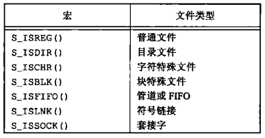

*在<sys/stat.h>中的文件类型宏*

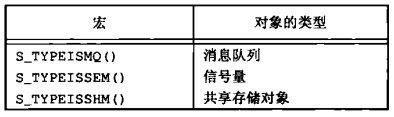

*在<sys/stat.h>中的IPC类型宏*

例：

```c++
#include "apue.h"
int 
main(int argc, char *argv[])
{
    int i; 
    struct stat buf;
    char *ptr;
    for (i = 1; i < argc; i++) {
        printf("%s: ", argv[i]);
        if (lstat(argv[i], &buf) < 0) {
            err_ret("lstat error");
            continue;
        }
        if (S_ISREG(buf.st_mode))
            ptr = "regular";
        else if (S_ISDIR(buf.st_mode))
            ptr = "directory";
        else if (S_ISCHR(buf.st_mode))
            ptr = "character special";
        else if (S_ISBLK(buf.st_mode))
            ptr = "block special";
        else if (S_ISFIFO(buf.st_mode))
            ptr = "fifo";
        else if (S_ISLNK(buf.st_mode))
            ptr = "symbolic link";
        else if (S_ISSOCK(buf.st_mode))
            ptr = "socket";
        else
            ptr = "** unknown mode **";
        printf("%s\n", ptr);
    }
    exit(0);
}
```

*对每个命令行参数打印文件类型*


## 4.4 设置用户ID和设置组ID

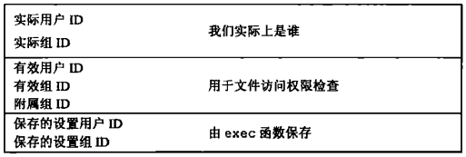

*与每个进程相关联的用户ID和组ID*


## 4.5 文件访问权限

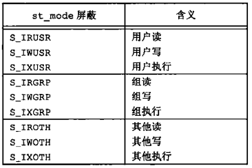

*9个访问权限位，取自<sys/stat.h>*

权限访问规则：

1. 我们用名字打开任一类型的文件时，对该名字中包含的每一个目录，包括它可能隐含的当前工作目录都应具有执行权限。
2. 对于一个文件的读权限决定了我们是否能够打开现有文件进行读操作。这与open函数的O_RDONLY和O_RDWR标志有关。
3. 对于一个文件的写权限决定了我们是否能够打开现有文件进行写操作。这与open函数的O_WRONLY和O_RDWR标志有关。
4. 为了在open函数中对一个文件指定O_TRUNC标志，必须对该文件具有写权限。
5. 为了在一个目录中创建一个新文件，必须对该目录具有写权限和执行权限。
6. 为了删除一个现有文件，必须对包含该文件的目录具有写权限和执行权限。对该文件本身则不需要有读，写权限。
7. 如果用7个exec函数中的人任何一个执行某个文件，都必须对该文件具有执行权限。该文件还必须是一个普通文件。

进程每次打开，创建或删除一个文件时，内核就进行文件访问权限测试，测试逻辑如下：

1. 若进程的有效用户ID是0（超级用户），则允许访问。
2. 若进程的有效用户ID等于文件的所有者ID（也就是进程拥有此文件），那么如果所有者适当的访问权限位被设置，则允许访问；否则拒绝访问。
3. 若进程的有效组ID或进程组的附属组ID之一等于文件的组ID，那么如果组适当的访问权限位被设置，则允许访问；否则拒绝访问。
4. 若其他用户适当的访问权限位被设置，则允许访问；否则拒绝访问。


## 4.6 新文件和目录的所有权

新文件的用户ID设置为进程的有效用户ID，POSIX.1允许实现选择下列之一作为新文件的组ID：

1. 新文件的组ID可以是进程的有效组ID。
2. 新文件的组ID可以是它所在目录的组ID。


## 4.7 函数access和faccessat

```c++
#include <unistd.h>
int access(const char *pathname, int mode);
int faccessat(int fd, const char *pathname, int mode, int flag);
```

- `fd` 文件描述符

- `pathname` 绝对/相对路径

- `mode` 模式

  | mode | 说明         |
  | ---- | ------------ |
  | R_OK | 测试读权限   |
  | W_OK | 测试写权限   |
  | X_OK | 测试执行权限 |

- `flags` 标志

- `返回值`

  - 成功：0
  - 失败：-1

*进行访问权限测试。*

例：

```c++
#include "apue.h"
#include <fcntl.h>
int 
main(int argc, char *argv[])
{
    if (argc != 2)
        err_quit("usage: a.out <pathname>");
    if (access(argv[1], R_OK) < 0)
        err_ret("access error for %s", argv[1]);
    else
        printf("read access OK\n");
    if (open(argv[1], O_RDONLY) < 0)
        err_ret("open error for %s", argv[1]);
    else
        printf("open for reading OK\n");
    exit(0);
}
```

*access函数实例*


## 4.8 函数umask

```c++
#include <sys/stat.h>
mode_t umask(mode_t cmask);
```

- `cmask` 访问权限位（见上面“9个访问权限位，取自<sys/stat.h>”）
- `返回值` 由之前的文件模式所创建的屏蔽字

*为进程设置文件模式创建屏蔽字*

例：

```c++
#include "apue.h"
#include <fcntl.h>
#define RWRWRW (S_IRUSR|S_IWUSR|S_IRGRP|S_IWGRP|S_IROTH|S_IWOTH)
int 
main(void)
{
    umask(0);
    if (creat("foo", RWRWRW) < 0)
        err_sys("creat error for foo");
    umask(S_IRGRP | S_IWGRP | S_IROTH | S_IWOTH);
    if (creat("bar", RWRWRW) < 0)
        err_sys("creat error for bar");
    exit(0);
}
```

*umask函数实例*

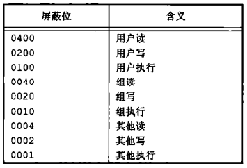

*umask文件访问权限位*


## 4.9 函数chmod, fchmod和fchmodat

```c++
#include <sys/stat.h>
int chmod(const char *pathname, mode_t mode); // 更改指定路径上文件的访问权限
int fchmod(int fd, mode_t mode); // 更改已打开文件的访问权限
int fchmodat(int fd, const char *pathname, mode_t mode, int flag); // 以指定行为来更改绝对/相对路径的文件的访问权限
```

- `fd`文件描述符

- `pathname` 路径

- `mode` 访问权限

  | mode    | 说明                         |
  | ------- | ---------------------------- |
  | S_ISUID | 执行时设置用户ID。           |
  | S_ISGID | 执行时设置组ID。             |
  | S_ISVTX | 保存正文（黏着位）。         |
  | S_IRWXU | 用户（所有者）读，写和执行。 |
  | S_IRUSR | 用户（所有者）读。           |
  | S_IWUSR | 用户（所有者）写。           |
  | S_IXUSR | 用户（所有者）执行。         |
  | S_IRWXG | 组读，写和执行。             |
  | S_IRGRP | 组读。                       |
  | S_IWGRP | 组写。                       |
  | S_IXGRP | 组执行。                     |
  | S_IRWXO | 其它读，写和执行。           |
  | S_IPOTH | 其它读。                     |
  | S_IWOTH | 其它写。                     |
  | S_IXOTH | 其它执行。                   |

  *chmod函数的mode常量，取自<sys/stat.h>*

- `flag` 用于改变fchmodat的行为

*更改文件的访问权限*

例：

```c++
#include "apue.h"
int 
main(void)
{
    struct stat statbuf;
    if (stat("foo", &statbuf) < 0)
        err_sys("stat error for foo");
    if (chmod("foo", (statbuf.st_mode & ~S_IXGRP) | S_ISGID) < 0)
        err_sys("chmod error for foo");
    if (chmod("bar", S_IRUSR | S_IWUSR | S_IRGRP | S_IROTH) < 0)
        err_sys("chmod error for bar");
    exit(0);
}
```

*chmod函数实例*

chmod函数在下列条件下自动清除两个权限位：

- Solaris等系统对用于普通文件的黏着位赋予了特殊含义，在这些系统上如果试图设置普通文件的黏着位（S_ISVTX），而且有没有超级用户权限，那么mode中的黏着位自动被关闭。
- 新创建文件的组ID可能不是调用进程所属的组。


## 4.10 黏着位

只有对一个设置了黏着位的目录具有写权限并且满足下列条件之一，才能删除或重命名该目录下的文件：

- 拥有此文件；
- 拥有此目录；
- 是超级用户。


## 4.11 函数chown, fchown, fchownat和lchown

```c++
#include <unistd.h>
int chown(const char *pathname, uid_t owner, gid_t group); // 更改文件的用户ID和组ID
int fchown(int fd, uid_t owner, git_t group); // 改变fd指向的打开文件的所有者
int fchownat(int fd, const char *pathname, uid_t owner, gid_t group, int flag);  // 已指定模式更改符号链接本身（而不是所指向文件）的所有者
int lchown(const char *pathname, uid_t owner, gid_t group); // 更改符号链接本身（而不是所指向文件）的所有者
```

- `pathname` 路径
- `fd` 文件描述符
- `owner` 用户ID
- `group` 组ID
- `flag` 标志

*更改文件/链接的用户ID和组ID*

若`_POSIX_CHOWN_RESTRICTED`对指定的文件生效，则：

1. 只有超级用户进程能更改该文件的用户ID；
2. 如果进程拥有此文件（其有效用户ID等于该文件的用户ID），参数owner等于-1或文件的用户ID，并且参数group等于进程的有效组ID或进程的附属组ID之一，那么一个非超级用户进程可以更改该文件的组ID。


## 4.12 文件长度

stat结构成员`st_size`表示以字节为单位的文件的长度，此字段只对普通文件，目录文件和符号链接有意义。


## 4.13 文件截断

```c++
#include <unistd.h>
int truncate(const char *pathname, off_t length);
int ftruncate(int fd, off_t length);
```

- `fd` 文件描述符
- `pathname` 路径
- `length` 截断后的长度

*根据文件路径/描述符来截断文件；如果截断前文件长度>length，则length以外的数据将无法访问；如果截断前文件长度<length，文件尾端到length之间的数据读作0。*


## 4.14 文件系统

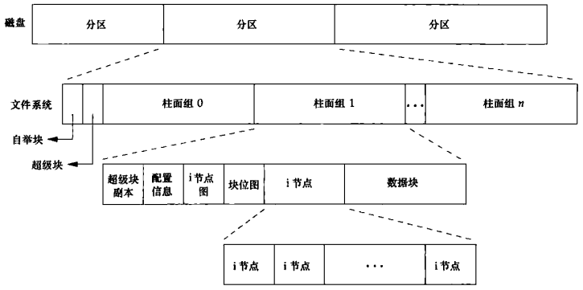

*磁盘，分区和文件系统*

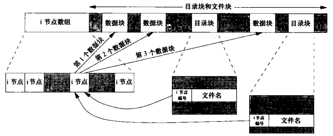

*柱面组的i节点和数据块*

- 每个i节点都有一个链接计数，用来表示指向该i节点的目录数；当链接计数为0时才可以删除该文件。
- 符号类型（symbolic link），它的实际内容（在数据块中）包含了该符号链接所指向的文件的名字。
- i节点包含了文件有关的所有信息：
  - 文件类型
  - 文件访问权限位
  - 文件长度
  - 指向文件数据块的指针
  - ...
- 目录项中的i节点编号指向同一文件系统中相应i节点，一个目录项不能指向另一个文件系统的i节点。
- 当在不更换文件系统的情况下为一个文件重命名时，该文件的实际内容并未移动，只需构造一个指向现有i节点的新目录项，并删除老的目录项，链接计数不会改变。

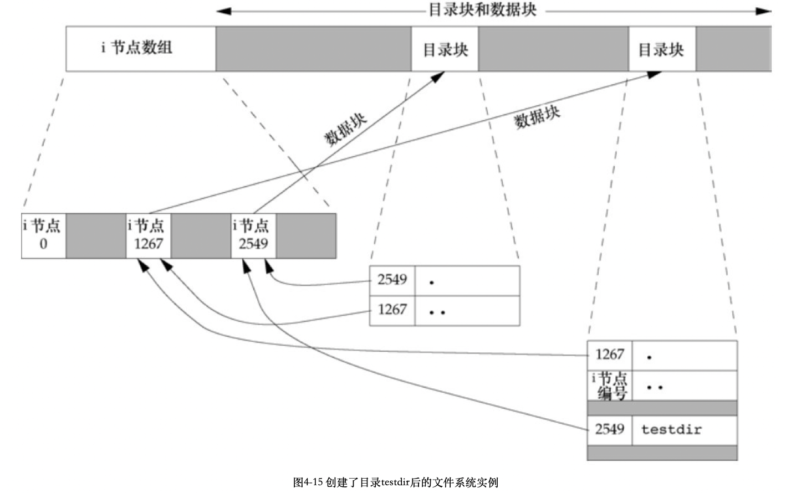

*创建目录testdir后的文件系统实例*


## 4.15 函数link, linkat, unlink, unlinkat和remove

```c++
#include <unistd.h>
int link(const char *existingpath, const char *newpath);
int linkat(int efd, const char *existingpath, int nfd, const char *newpath, int flag);
```

- `existingpath` 现有文件路径
- `newpath` 链接文件路径（需要保证此路径不存在）
- `efd` 现有文件的文件描述符
- `nfd` 链接文件的文件描述符
- `newpath` 链接文件路径
- `flag` 标志，标识创建链接的链接or文件的链接
- `返回值`
  - 成功：0
  - 失败：-1

*创建一个指向现有文件的链接*

```c++
#include <unistd.h>
int unlink(const char *pathname);
int unlinkat(int fd, const char *pathname, int flag);
```

- `pathname` 路径
- `fd` 文件描述符
- `flag` 标志
- `返回值`
  - 成功：0
  - 出错：-1

*删除目录项（只有当链接计数达到0时，该文件的内容才可被删除！！！）*

例：

```c++
#include "apue.h"
#include <fcntl.h>
int 
main(void)
{
    if (open("tempfile", O_RDWR) < 0)
        err_sys("open error");
    if (unlink("tempfile") < 0)
        err_sys("unlink error");
    printf("file unlinked\n");
    sleep(15);
    printf("done\n");
    exit(0);
}
```

*打开一个文件，然后unlink它*

```c++
#include <stdio.h>
int remove(const char *pathname);
```

- `pathname` 路径
- `返回值` 
  - 成功：0
  - 失败：-1

*解除对一个文件或目录的链接（对于文件，等同于unlink；对于目录，等同于rmdir）。*


## 4.16 函数rename和renameat

```c++
#include <stdio.h>
int rename(const char *oldname, const char *newname);
int renameat(int oldfd, const char *oldname, int newfd, const char *newname);
```

- `oldname` 旧名字
  
  1. 如果oldname指的是一个文件，那么为该文件或符号链接重命名。
  2. 如果oldname指的是一个目录，那么为该目录重命名。
  3. 如果oldname或newname引用符号链接，则处理链接本身，而不是它所引用的文件。
  4. 不能对`.`和`..`重命名。
  4. 如果oldname和newname引用同一文件，则函数不做任何更改而成功返回。
- `newname` 新名字
- `oldfd` 旧文件描述符
- `newfd` 新文件描述符
- `返回值` 

  成功：0

  失败：-1

*对文件/目录进行重命名*


## 4.17 符号链接

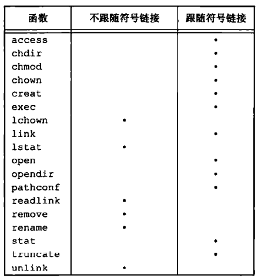

*各个函数对符号链接的处理*

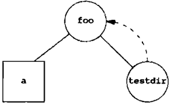

*构成循环的符号链接testdir*


## 4.18 创建和读取符号链接

```c++
#include <unistd.h>
int symlink(const char *actualpath, const char *sympath);
int symlinkat(const char *actualpath, int fd, const char *sympath);
```

- `actualpath` 真实地址
- `sympath` 符号链接
- `fd` 文件描述符
- `返回值`
  - 成功：0
  - 失败：-1

*创建一个符号链接*

```c++
#include <unistd.h>
ssize_t readlink(const char *restrict pathname, char *restrict buf, size_t bufsize);
ssize_t readlinkat(int fd, const char *restrict pathanme, char *restrict buf, size_t bufsize);
```

- `pathname` 链接文件路径
- `buf` 缓冲区
- `bufsize` 缓冲区长度
- `fd` 文件描述符
- `返回值`
  - 成功：读取的字节数
  - 失败：-1

*打开链接并读连接中的名字*


## 4.19 文件的时间

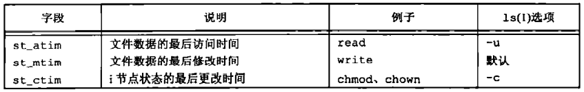

*与每个文件相关的3个时间值*

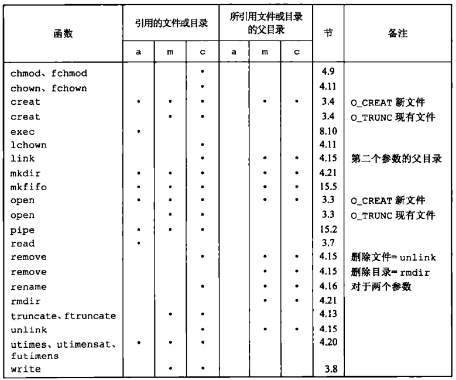

*各种函数对访问，修改和状态更改时间的作用*


## 4.20 函数futimens, utimenstat和utimes

```c++
#include <sys/stat.h>
int futimens(int fd, const struct timespec times[2]);
int utimensat(int fd, const char *path, const struct timespec times[2], int flag);
```

- `fd` 文件套接字

- `times` 时间值

  - [0]：访问时间
  - [1]：修改时间

  时间戳可以按以下方式指定：

  1. 如果times参数是一个空指针，则访问时间和修改时间两者都设置为当前时间；
  2. 如果times参数指向两个timespec结构的数组，任一数组元素的tv_nsec字段的值为UTIME_NOW，相应的时间戳就设置为当前时间，忽略相应的tv_sec字段。
  3. 如果times参数指向两个timespec结构的数组，任一数组元素的tv_nsec字段的值为UTIME_ONIT，相应的时间戳保持不变，忽略相应的tv_sec字段。
  4. 如果times参数指向两个timespec结构的数组，且tv_nsec字段的值为既不是UTIME_NOW也不是UTIME_OMIT，在这种情况下，相应的时间戳设置为相应的tv_sec和tv_nsec字段的值。

- `path` 文件路径

- `flag` 标记

- `返回值`

  - 成功：0
  - 失败：-1

*修改文件的时间（精度：ns）*

```c++
#include <sys/time.h>
int utimes(const char *pathname, const struct timeval times[2]);
```

- `pathname` 路径名

- `times` 时间值

  ```c++
  struct timeval {
      time_t tv_sec; // sec
      long tv_usec;  // ms
  }
  ```

- `返回值`

  成功：0

  失败：-1

*修改路径的时间*

例：

```c++
#include "apue.h"
#include <fcntl.h>
int 
main(int argc, char *argv[])
{
    int i, fd;
    struct stat statbuf;
    struct timespec times[2];
    for (i = 1; i < argc; i++) {
        if (stat(argv[i], &statbuf) < 0) { /* fetch current times */
            err_ret("%s: stat error", argv[i]);
            continue;
        }
        if ((fd = open(argv[i], O_RDWR | O_TRUNC)) < 0) { /* truncate */
            err_ret("%s: open error", argv[i]);
            continue;
        }
        times[0] = statbuf.st_atim;
        times[1] = statbuf.st_mtim;
        if (futimens(fd, times) < 0) /* reset times */
            err_ret("%s: futimens error", argv[i]);
        close(fd);
    }
    exit 0;
}
```

*futimens函数示例*


## 4.21 函数mkdir,mkdirat和rmdir

```c++
#include <sys/stat.h>
int mkdir(const char *pathname, mode_t mode);
int mkdirat(int fd, const char *pathname, mode_t mode);
```

- `pathname` 路径
- `mode` 文件访问权限
- `fd` 文件描述符
- `返回值`
  - 成功：0
  - 失败：-1

*创建一个新的空目录。*

```c++
#include <unistd.h>
int rmdir(const char *pathname);
```

- `pathname` 路径
- `返回值`
  - 如果没有其它进程打开此目录，释放由此目录占用的空间；
  - 如果有1个或多个进程打开此目录，在函数返回前删除最后一个连接及`.`和`..`项；

*将目录的链接计数设置为0。*


## 4.22 读目录

对某个目录具有访问权限的任一用户都可以读该目录，为了防止文件系统混乱，只有**内核**才能写目录。

```c++
#include <dirent.h>
DIR *opendir(const char *pathname);
DIR *fdopendir(int fd);
```

- `pathname` 路径名
- `fd` 文件描述符
- `返回值`
  - 成功：目录指针；
  - 失败：NULL；

*把文件/文件描述符转换成目录。*

```c++
#include <dirent.h>
struct dirent *readdir(DIR *dp);
```

- `dp` 目录指针
- `返回值`
  - 成功：目录指针；
  - 在目录尾或失败：NULL；

*读目录流并返回第一个目录项。*

```c++
#include <dirent.h>
void rewinddir(DIR *dp);
```

- `dp` 目录指针
- `返回值`
  - 成功：o；
  - 失败：-1；

*设置目录流读取位置为原来开头的读取位置*

```c++
#include <dirent.h>
int closedir(DIR *dp);
```

- `dp` 目录指针
- `返回值`
  - 成功：0；
  - 失败：-1；

*关闭目录流*

```c++
#include <dirent.h>
long telldir(DIR *dp);
void seekdir(DIR *dp, long loc);
```

- `dp` 目录指针
- `loc` 偏移量
- `返回值` 偏移量

*返回/设置目录流目前的读取位置*

例：

```c++
#include "apue.h"
#include <dirent.h>
#include <limits.h>
/* function type that is called for each filename */
typedef int Myfunc(const char *, const struct stat *, int);
static  int myftw(char *, Myfunc *);
static  int dopath(Myfunc *);
static  long nreg, ndir, nblk, nchr, nfifo, nslink, nsock, ntot;
int 
main(int argc, char *argv[])
{
    int ret;
    if (argc != 2)
        err_quit("usage: ftw <starting-pathname>");
    ret = myftw(argv[1], myfunc);
    ntot = nreg + ndir + nblk + nchr + nfifo + nslink + nsock;
    if (ntot == 0)
        ntot = 1;
    printf("regular files = %71d, %5.2f %%\n", nreg,
          nreg * 100.0 / ntot);
    printf("directories = %71d, %5.2f %%\n", ndir,
          ndir * 100.0 / ntot);
    printf("block special = %71d, %5.2f %%\n", ndir,
          nblk * 100.0 / ntot);
    printf("char special = %71d, %5.2f %%\n", ndir,
          nchr * 100.0 / ntot);
    printf("FIFOs = %71d, %5.2f %%\n", ndir,
          nfifo * 100.0 / ntot);
    printf("symbolic links = %71d, %5.2f %%\n", ndir,
          nslink * 100.0 / ntot);
    printf("sockets = %71d, %5.2f %%\n", ndir,
          nsock * 100.0 / ntot);
    exit(ret);
}
/*
 * Descend through the hierarchy, starting at "pathname".
 * The caller's func() is called for every file.
 */
#define FTW_F   1
#define FTW_D   2
#define FTW_DNR 3
#define FTW_NS  4
static char *fullpath;
static size_t pathlen;
static int 
myftw(char *pathname, Myfunc *func)
{
    fullpath = path_alloc(&pathlen); /* malloc PATH_MAX + 1 bytes */
                                     /* ({Flgure 2.16}) */
    if (pathlen <= strlen(pathname)) {
        pathlen = strlen(pathname) * 2;
        if ((fullpath = realloc(fullpath, pathlen)) == NULL)
            err_sys("realloc failed");
    }
    strcpy(fullpath, pathname);
    return (dopath(func));
}

static int 
dopath(Myfunc* func)
{
    struct stat   statbuf;
    struct dirent *dirp;
    DIR           *dp;
    int           ret, n;
    if (lstat(fullpath, &statbuf) < 0)
        return (func(fullpath, &statbuf, FTW_NS))；
    if (S_ISDIR(statbuf.st_mode) == 0)
        return (func(fullpath, &statbuf, FTW_F));
    if ((ret = func(fullpath, &statbuf, FW_D)) != 0)
        return (ret);
    n = strlen(fullpath);
    if (n + NAME_MAX + 2 > pathlen) {
        pathlen *= 2;
        if ((fullpath = realloc(fullpath, pathlen)) == NULL)
            err_sys("realloc failed");
    }
    fullpath[n++] = '/n';
    fullpath[n] = 0;
    if ((dp = opendir(fullpath)) == NULL)
        return (func(fullpath, &statbuf, FTW_DNR));
    while ((dirp = readdir(dp)) != NULL) {
        if (strcmp(dirp->d_name, ".") == 0 ||
            strcmp(dirp->d_name, "..") == 0)
            continue;
        strcpy(&fullpath[n], dirp->d_name);
        if ((ret = dopath(func)) != 0)
            break;
    }
    fullpath[n - 1] = 0;
    if (closedir(dp) < 0)
        err_ret("can't close directory %s", fullpath);
    return (ret);
}
static int 
myfunc(const char *pathname, const struct stat *statptr, int type)
{
    switch (type) {
        case FTW_F:
            switch (statptr->st_mode & S_IFMT) {
                case S_IFREG: nreg++; break;
                case S_IFBLK: nblk++; break;
                case S_IFCHR: nchr++; break;
                case S_IFIFO: nfifo++; break;
                case S_IFLnk: nslink++; break;
                case S_IFSOCK: nsock++; break;
                case S_IFDIR: 
                    err_dump("for S_IFDIR for %s", pathname);
            }
            break;
        case FTW_D:
            ndir++;
            break;
        case FTW_DNR:
            err_ret("can't read directory %s", pathname);
            break;
        case FTW_NS:
            err_ret("stat error for %s", pathname);
            break;
        default:
            err_dump("unknown type %d for pathname %s", type, pathname);
    }
    return (0);
}
```

*递归降序遍历目录层次结构，并按文件类型计数*


## 4.23 函数chdir,fchdir和getcwd

```c++
#include <unistd.h>
int chdir(const char *pathname);
int fchdir(int fd);
```

- `pathname` 路径名
- `fd` 文件描述符
- `返回值`
  - 成功：0；
  - 失败：-1；

*更改当前工作目录。*

例：

```c++
#include "apue.h"
int 
main(void)
{
    if (chdir("/tmp") < 0)
        err_sys("chdir failed");
    printf("chdir to /tmp succeeded\n");
    exit(0);
}
```

*chdir函数实例*

```c++
#include <unistd.h>
char *getcwd(char *buf, size_t size);
```

- `buf` 缓冲区
- `size` 缓冲区长度（字节，路径名+null）
- `返回值`
  - 成功：buf
  - 失败：NULL

*返回当前目录的完整绝对路径。*

例：

```c++
#include "apue.h"
int 
main(void)
{
    char *ptr;
    size_t size;
    if (chdir("/usr/spool/uucppublic") < 0)
        err_sys("chdir failed");
    ptr = path_alloc(&size);
    if (getcwd(ptr, size) == NULL)
        err_sys("getcwd failed");
    printf("cwd = %s\n", ptr);
    exit(0);
}
```

*getcwd函数实例*


## 4.24 设备特殊文件

例：

```c++
#include "apue.h"
#ifdef SOLARIS
#include <sys/mkdev.h>
#endif
int 
main(int argc, char *argv[])
{
    int i;
    struct stat buf;
    for (i = 1; i < argc; i++) {
        printf("%s: ", argv[i]);
        if (stat(argv[i], &buf) < 0) {
            err_ret("stat error");
            continue;
        }
        printf("dev = %d/%d", major(buf.st_dev), minor(buf.st_dev));
        if (S_ISCHR(buf.st_mode) || S_ISBLK(buf.st_mode)) {
            printf("(%s)rdev = %d/%d",
                   (S_ISCHR(buf.st_mode)) ? "character" : "block",
                   major(buf.st_rdev), minor(buf.st_rdev));
        }
        printf("\n");
    }
    exit(0);
}
```

*打印st_dev和st_rdev值*


## 4.25 文件访问权限位小结

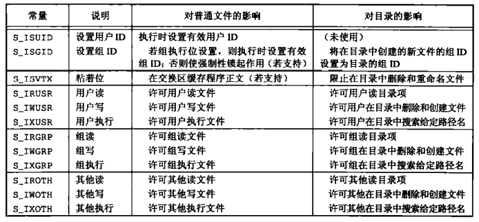

*文件访问权限位小结*
