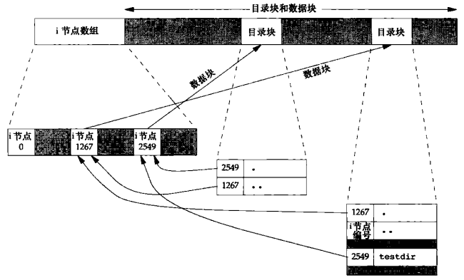

# 第四章 文件和目录

[TOC]


## 4.1 引言


## 4.2 函数stat, fstat, fstatat和lstat

```c++
#include <sys/stat.h>
int stat(const char *restrict pathname, struct stat *restrict buf); // 返回指定路径上文件的信息
int fstat(int fd, struct stat *buf); // 返回文件描述符指向的文件的信息
int lstat(const char *restrict pathname, struct stat *restrict buf); // 返回符号链接的有关信息
int fstatat(int fd, const char *restrict pathname, struct stat *restrict buf, int flag); // 返回目录的文件统计信息
```

- `fd` 文件描述符

- `pathname` 文件路径

- `buf` 用于返回文件信息

  ```c++
  struct stat {
      mode_t          st_mode;
      ino_t           st_ino;
      dev_t           st_dev;
      dev_t           st_rdev;
      nlink_t         st_nlink;
      uid_t           std_uid;
      gid_t           st_gid;
      off_t           st_size;
      struct timespec st_atime;
      struct timespec st_mtime;
      struct timespec st_ctime;
      blksize_t       st_blksize;
      blkcnt_t        st_blocks;
  };
  ```

- `flag` 标志

- `返回值`

  - 成功：0
  - 失败：-1

*获取文件信息。*


## 4.3 文件类型

文件类型：

- 普通文件（regular file）
- 目录文件（directory file）
- 块特殊文件（block special file）
- 字符特殊文件（character special file）
- FIFO
- 套接字（socket）
- 符号链接（symbolic link）


*在<sys/stat.h>中的文件类型宏*


*在<sys/stat.h>中的IPC类型宏*

例：

```c++
TODO
```

*对每个命令行参数打印文件类型*


## 4.4 设置用户ID和设置组ID


*与每个进程相关联的用户ID和组ID*


## 4.5 文件访问权限


*9个访问权限位，取自<sys/stat.h>*

权限访问规则：

1. 我们用名字打开任一类型的文件时，对该名字中包含的每一个目录，包括它可能隐含的当前工作目录都应具有执行权限。
2. 对于一个文件的读权限决定了我们是否能够打开现有文件进行读操作。这与open函数的O_RDONLY和O_RDWR标志有关。
3. 对于一个文件的写权限决定了我们是否能够打开现有文件进行写操作。这与open函数的O_WRONLY和O_RDWR标志有关。
4. 为了在open函数中对一个文件指定O_TRUNC标志，必须对该文件具有写权限。
5. 为了在一个目录中创建一个新文件，必须对该目录具有写权限和执行权限。
6. 为了删除一个现有文件，必须对包含该文件的目录具有写权限和执行权限。对该文件本身则不需要有读，写权限。
7. 如果用7个exec函数中的人任何一个执行某个文件，都必须对该文件具有执行权限。该文件还必须是一个普通文件。

进程每次打开，创建或删除一个文件时，内核就进行文件访问权限测试，测试逻辑如下：

1. 若进程的有效用户ID是0（超级用户），则允许访问。
2. 若进程的有效用户ID等于文件的所有者ID（也就是进程拥有此文件），那么如果所有者适当的访问权限位被设置，则允许访问；否则拒绝访问。
3. 若进程的有效组ID或进程组的附属组ID之一等于文件的组ID，那么如果组适当的访问权限位被设置，则允许访问；否则拒绝访问。
4. 若其他用户适当的访问权限位被设置，则允许访问；否则拒绝访问。


## 4.6 新文件和目录的所有权

新文件的用户ID设置为进程的有效用户ID，POSIX.1允许实现选择下列之一作为新文件的组ID：

1. 新文件的组ID可以是进程的有效组ID。
2. 新文件的组ID可以是它所在目录的组ID。


## 4.7 函数access和faccessat

```c++
#include <unistd.h>
int access(const char *pathname, int mode);
int faccessat(int fd, const char *pathname, int mode, int flag);
```

- `fd` 文件描述符

- `pathname` 绝对/相对路径

- `mode` 模式

  | mode | 说明         |
  | ---- | ------------ |
  | R_OK | 测试读权限   |
  | W_OK | 测试写权限   |
  | X_OK | 测试执行权限 |

- `flags` 标志

- `返回值`

  - 成功：0
  - 失败：-1

*进行访问权限测试。*

例：

```c++
TODO
```

*access函数实例*


## 4.8 函数umask

```c++
#include <sys/stat.h>
mode_t umask(mode_t cmask);
```

- `cmask` 访问权限位（见上面“9个访问权限位，取自<sys/stat.h>”）
- `返回值` 由之前的文件模式所创建的屏蔽字

*为进程设置文件模式创建屏蔽字*

例：

```c++
TODO
```

*umask函数实例*


*umask文件访问权限位*


## 4.9 函数chmod, fchmod和fchmodat

```c++
#include <sys/stat.h>
int chmod(const char *pathname, mode_t mode); // 更改指定路径上文件的访问权限
int fchmod(int fd, mode_t mode); // 更爱已打开文件的访问权限
int fchmodat(int fd, const char *pathname, mode_t mode, int flag); // 以指定行为来更改绝对/相对路径的文件的访问权限
```

- `fd`文件描述符

- `pathname` 路径

- `mode` 访问权限

  

  *chmod函数的mode常量，取自<sys/stat.h>*

- `flag` 用于改变fchmodat的行为

*更改文件的访问权限*

例：

```c++
TODO
```

*chmod函数实例*

chmod函数在下列条件下自动清除两个权限位：

- Solaris等系统对用于普通文件的黏着位赋予了特殊含义，在这些系统上如果试图设置普通文件的黏着位（S_ISVTX），而且有没有超级用户权限，那么mode中的黏着位自动被关闭。
- 新创建文件的组ID可能不是调用进程所属的组。


## 4.10 黏着位

只有对一个设置了黏着位的目录具有写权限并且满足下列条件之一，才能删除或重命名该目录下的文件：

- 拥有此文件；
- 拥有此目录；
- 是超级用户。


## 4.11 函数chown, fchown, fchownat和lchown

```c++
#include <unistd.h>
int chown(const char *pathname, uid_t owner, gid_t group); // 更改文件的用户ID和组ID
int fchown(int fd, uid_t owner, git_t group); // 改变fd指向的打开文件的所有者
int fchownat(int fd, const char *pathname, uid_t owner, gid_t group, int flag);  // 已指定模式更改符号链接本身（而不是所指向文件）的所有者
int lchown(const char *pathname, uid_t owner, gid_t group); // 更改符号链接本身（而不是所指向文件）的所有者
```

- `pathname` 路径
- `fd` 文件描述符
- `owner` 用户ID
- `group` 组ID
- `flag` 标志

*更改文件/链接的用户ID和组ID*

若`_POSIX_CHOWN_RESTRICTED`对指定的文件生效，则：

1. 只有超级用户进程能更改该文件的用户ID；
2. 如果进程拥有此文件（其有效用户ID等于该文件的用户ID），参数owner等于-1或文件的用户ID，并且参数group等于进程的有效组ID或进程的附属组ID之一，那么一个非超级用户进程可以更改该文件的组ID。


## 4.12 文件长度

stat结构成员`st_size`表示以字节为单位的文件的长度，此字段只对普通文件，目录文件和符号链接有意义。


## 4.13 文件截断

```c++
#include <unistd.h>
int truncate(const char *pathname, off_t length);
int ftruncate(int fd, off_t length);
```

- `fd` 文件描述符
- `pathname` 路径
- `length` 截断后的长度

*根据文件路径/描述符来截断文件；如果截断前文件长度>length，则length以外的数据将无法访问；如果截断前文件长度<length，文件尾端到length之间的数据读作0。*


## 4.14 文件系统


*磁盘，分区和文件系统*


*柱面组*

- 每个i节点都有一个链接计数，用来表示指向该i节点的目录数；当链接计数为0时才可以删除该文件。
- 符号类型（symbolic link），它的实际内容（在数据块中）包含了该符号链接所指向的文件的名字。
- i节点包含了文件有关的所有信息：
  - 文件类型
  - 文件访问权限位
  - 文件长度
  - 指向文件数据块的指针
  - ...
- 目录项中的i节点编号指向同一文件系统中相应i节点，一个目录项不能指向另一个文件系统的i节点。
- 当在不更换文件系统的情况下为一个文件重命名时，该文件的实际内容并未移动，只需构造一个指向现有i节点的新目录项，并删除老的目录项，链接计数不会改变。



*创建目录testdir后的文件系统实例*


## 4.15 函数link, linkat, unlink, unlinkat和remove

```c++
#include <unistd.h>
int link(const char *existingpath, const char *newpath);
int linkat(int efd, const char *existingpath, int nfd, const char *newpath, int flag);
```

- `existingpath` 现有文件路径
- `newpath` 链接文件路径（需要保证此路径不存在）
- `efd` 现有文件的文件描述符
- `nfd` 链接文件的文件描述符
- `newpath` 链接文件路径
- `flag` 标志，标识创建链接的链接or文件的链接
- `返回值`
  - 成功：0
  - 失败：-1

*创建一个指向现有文件的链接*

```c++
#include <unistd.h>
int unlink(const char *pathname);
int unlinkat(int fd, const char *pathname, int flag);
```

- `pathname` 路径
- `fd` 文件描述符
- `flag` 标志
- `返回值`
  - 成功：0
  - 出错：-1

*删除目录项（只有当链接计数达到0时，该文件的内容才可被删除！！！）*

例：

```c++
TODO
```

*打开一个文件，然后unlink它*

```c++
#include <stdio.h>
int remove(const char *pathname);
```

- `pathname` 路径
- `返回值` 
  - 成功：0
  - 失败：-1

*解除对一个文件或目录的链接（对于文件，等同于unlink；对于目录，等同于rmdir）。*


## 4.16 函数rename和renameat

```c++
#include <stdio.h>
int rename(const char *oldname, const char *newname);
int renameat(int oldfd, const char *oldname, int newfd, const char *newname);
```

- `oldname` 
  1. 如果oldname指的是一个文件，那么为该文件或符号链接重命名。
  2. 如果oldname指的是一个目录，那么为该目录重命名。
  3. 如果oldname或newname引用符号链接，则处理链接本身，而不是它所引用的文件。
  4. 不能对`.`和`..`重命名。
  4. 如果oldname和newname引用同一文件，则函数不做任何更改而成功返回。
- `newname`
- `oldfd`
- `newfd`

*对文件/目录进行重命名*

TODO
