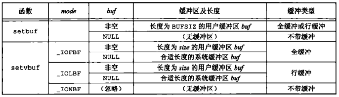
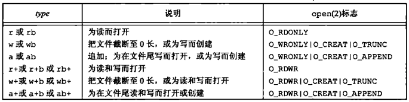
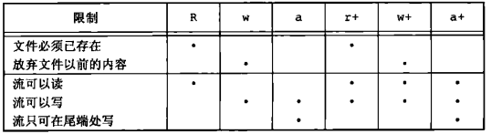
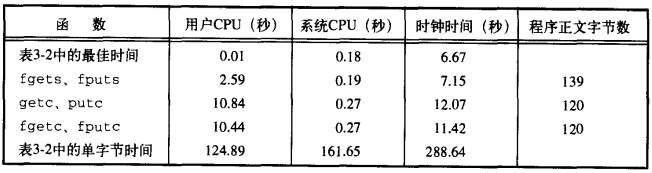
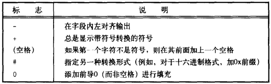
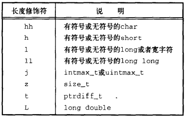
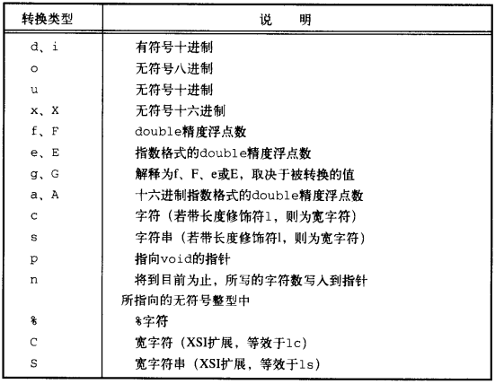
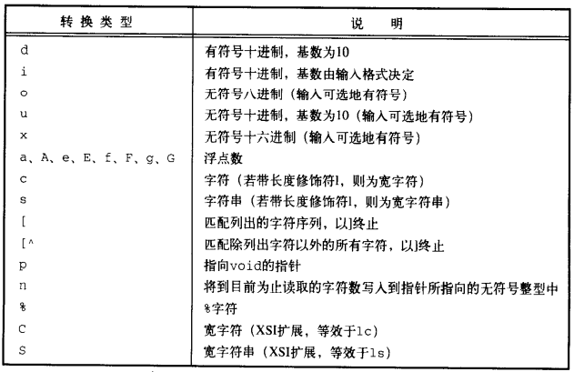

# 第五章 标准I/O库

[TOC]


## 5.1 引言


## 5.2 流和FILE对象

```c++
#include <stdio.h>
#include <wchar.h>
int fwide(FILE *fp, int mode);
```

- `fp` 文件流

- `mode` 模式

  - `< 0` 试图使指定的流是字节定向的；
  - `= 0` 将不试图设置流的定向，但返回标识该流定向的值；
  - `> 0` 试图使指定的流是宽定向的。

- `返回值`

  流是宽定向的：`> 0`

  流是未定向的：`0`

  流是字节定向的：`< 0`

*设置流的定向*


## 5.3 标准输入，标准输出和标准错误

```c++
#include <stdio.h>
```

- `stdin` 标准输入
- `stdout` 标准输出
- `stderr` 标准错误


## 5.4 缓冲

标准I/O提供了以下3种类型的缓冲：

- `全缓冲` 在填满标准I/O缓冲区后才进行实际I/O操作；
- `行缓冲` 当输入/输出中遇到换行符时，标准I/O执行I/O操作；
- `不带缓冲` 标准I/O库不对字符进行缓冲存储。

```c++
#include <stdio.h>
void setbuf(FILE *restrict fp, char *restrict buf);
int setvbuf(FILE *restrict fp, char *restrict buf, int mode, size_t size);
```

- `fp` 文件流

- `buf` 缓冲区（长度为BUFSIZ）

- `mode` 缓冲类型

  - `_IOFBF` 全缓冲
  - `_IOLBF` 行缓冲
  - `_IONBF` 不带缓冲

- `size` 缓冲区长度

- `返回值`

  成功：0

  失败：非0

*设置缓冲区属性*



*setbuf和setvbuf函数*

```c++
#include <stdio.h>
int fflush(FILE *fp);
```

- `fp` 文件流

- `返回值`

  成功：0

  失败：EOF

*强制冲洗一个流*


## 5.5 打开流

```c++
#include <stdio.h>
FILE *fopen(const char *restrict pathname, const char *restrict type);
FILE *freopen(const char *restrict pathname, const char *restrict type, FILE *restrict fp);
FILE *fdopen(int fd, const char *type);
```

- `pathname` 路径

- `type` 打开模式

  

  *打开标准I/O流的type参数*

- `fd` 文件描述符

- `返回值`

*打开/重新打开一个标准I/O流*



*打开一个标准I/O流的6种不同方式*

`POSIX.1`要求实现使用如下的权限位集来创建文件：`S_IRUSR | S_IWUSR | S_IRGRP | S_IWGRP | S_IROTH | S_IWOTH`。

```c++
#include <stdio.h>
int fclose(FILE *fp);
```

- `fp` 流

- `返回值`

  成功：0

  失败：EOF

*关闭流*


## 5.6 读和写流

读/写不同类型的I/O：

- 每次一个字符的I/O；
- 每次一行的I/O；
- 直接I/O。

```c++
#include <stdio.h>
int getc(FILE *fp);
int fgetc(FILE *fp);
int getchar(void);
```

- `fp` 流

- `返回值`

  成功：下一个字符

  到达文件尾或出错：EOF

*一次读一个字符*

```c++
#include <stdio.h>
int ferror(FILE *fp);
int feof(FILE *fp);
void clearerr(FILE *fp);
```

- `fp` 流

- `返回值`

  条件为真：非0

  条件为假：0

*判断错误类型*

```c++
#include <stdio.h>
int ungetc(int c, FILE *fp);
```

- `c` 字符

- `fp` 流

- `返回值`

  成功：c

  失败：EOF

*将从流中读取的字符再退回流中*

```c++
#include <stdio.h>
int putc(int c, FILE *fp);
int fputc(int c, FILE *fp);
int putchar(int c);
```

- `c` 字符

- `fp` 流

- `返回值`

  成功：c

  失败：EOF

*写单个字符到流中*


## 5.7 每次一行I/O

```c++
#include <stdio.h>
char *fgets(char *restrict buf, int n, FILE *restrict fp);
char *gets(char *buf);
```

- `buf` 缓冲区

- `n` 缓冲区长度

- `fp` 流

- `返回值`

  成功：buf

  到达文件尾或出错：NULL

*从流中读一行字符串*

```c++
#include <stdio.h>
int fputs(const char *restrict str, FILE *restrict fp);
int puts(const char *str);
```

- `str` 字符串

- `fp` 流

- `返回值`

  成功：非负值

  失败：EOF

*将一行字符串（null结尾）写入到流*


## 5.8 标准I/O的效率

例：

```c++
TODO
```

*用getc和putc将标准输入复制到标准输出*

例：

```c++
TODO
```

*用fgets和fputs将标准输入复制到标准输出*



*使用标准I/O例程得到的计时结果*


## 5.9 二进制I/O

```c++
#include <stdio.h>
size_t fread(void *restrict ptr, size_t size, size_t nobj, FILE *restrict fp);
size_t fwrite(const void *restrict ptr, size_t size, size_t nobj, FILE *restrict fp);
```

- `ptr` 缓冲区
- `size` 缓冲区长度
- `nobj` 要读/写的数据长度
- `fp` 流
- `返回值`对象数

*读/写二进制数据*


## 5.10 定位流

定位标准I/O流的方法：

- `ftell`和`fseek`函数；
- `ftello`和`fseeko`函数；
- `fgetpos`和`fsetpos`函数。

```c++
#include <stdio.h>
long ftell(FILE *fp);
```

- `fp` 流

- `返回值`

  成功：当前文件位置指示

  失败：-1

*定位标准I/O流*

```c++
#include <stdio.h>
int fseek(FILE *fp, long offset, int whence);
```

- `fp` 流

- `offset` 偏移量

- `whence` 位置

  - `SEEK_SET` 将文件的偏移量设置为距文件开始处offset个字节
  - `SEEK_CUR` 将文件偏移量设置为其当前值加offset，offset可正可负
  - `SEEK_END` 将文件的偏移量设置为文件长度加offset，offset可正可负

- `返回值`

  成功：0

  失败：非0

*定位标准I/O流*

```c++
#include <stdio.h>
void rewind(FILE *fp);
```

- `fp` 流

*TODO*

```c++
#include <stdio.h>
off_t ftello(FILE *fp);
```

- `fp` 流

- `返回值`

  成功：当前文件位置指示

  失败：-1

*TODO*

```c++
#include <stdio.h>
int feeko(FILE *fp, off_t offset, int whence);
```

- `fp` 流

- `offset` 偏移量

- `whence` 位置

  - `SEEK_SET` 将文件的偏移量设置为距文件开始处offset个字节
  - `SEEK_CUR` 将文件偏移量设置为其当前值加offset，offset可正可负
  - `SEEK_END` 将文件的偏移量设置为文件长度加offset，offset可正可负

- `返回值`

  成功：0

  失败：非0

*TODO*

```c++
#include <stdio.h>
int fgetpos(FILE *restrict fp, fpos_t *restrict pos);
int fsetpos(FILE *fp, const fpos_t *pos);
```

- `fp` 流

- `pos` 当前位置

- `返回值`

  成功：0

  失败：非0

*获取/设置流的当前位置*


## 5.11 格式化I/O

```c++
#include <stdio.h>
#include <stdarg.h>
int printf(const char *restrict format, ...);
int vprintf(const char *restrict format, va_list arg);

int fprintf(FILE *restrict fp, const char *restrict format, ...);
int vfprintf(FILE *restrict fp, const char *restrict format, va_list arg);
```

- `format` 格式化字符串

- `fp` 流

- `返回值`

  成功：字符数

  失败：负数

*格式化输出字符到流*

```c++
#include <stdio.h>
#include <stdarg.h>
int sprintf(char *restrict buf, const char *restrict format, ...);
int vsprintf(char *restrict buf, const char *restrict format, va_list arg);

int snprintf(char *restrict buf, size_t n, const char *restrict format, ...);
int vsnprintf(char *restrict buf, size_t n, const char *restruct format, va_list arg);
```

- `buf` 缓冲区

- `format` 格式化字符串

- `n` 缓冲区长度

- `返回值`

  成功：存入数组的字符数

  失败：负数

*格式化输出字符串到缓冲区*



*转换说明中的标志部分*



*转换说明中的长度修饰符*



*转换说明中的转换类型部分*

```c++
#include <stdio.h>
#include <stdarg.h>
int scanf(const char *restrict format, ...);
int vscanf(const char *restrict format, va_list arg);

int fscanf(FILE *restrict fp, const char *restrict format, ...);
int vfscanf(FIEL *restrict fp, const char *restrict format, va_list arg);

int sscanf(const char *restrict buf, const char *restrict format, ...);
int vsscanf(const char *restrict buf, const char *restrict format, va_list arg);
```

- `format` 格式化字符串

- `fp` 流

- `buf` 缓冲区

- `返回值`

  成功：输入的项数

  出错或再任意变换前已到达文件结尾：EOF

*格式化输入*



*转换说明中的转换类型*


## 5.12 实现细节

```c++
#include <stdio.h>
int fileno(FILE *fp);
```

- `fp` 流
- `返回值` 与流相关联的文件描述符

*获得流的描述符*

例：

```c++
TODO
```

*对各个标准I/O流打印缓冲状态信息*


## 5.13 临时文件

```c++
#include <stdio.h>
char *tmpnam(char *ptr);
```

- `ptr` 文件路径
- `返回值` 创建的临时文件路径

*创建一个与现有文件名不同的临时文件路径（此函数最多调用`TMP_MAX`次）*

```c++
#include <stdio.h>
FILE *tmpfile(void);
```

- `返回值`

  成功：文件指针

  失败：NULL

*创建临时文件*

例：

```c++
TODO
```

*tmpnam和tmpfile函数实例*

```c++
#include <stdio.h>
char *tempnam(const char *directory, const char *prefix);
```

- `directory` 目录
- `prefix` 前缀
- `返回值` 指向唯一路径名的指针

*是tmpnam的一个变体，它允许调用者为所产生的路径名指定目录和前缀，按下列顺序判断其条件并使用第一个为真的作为目录：*

*1. 如果定义了环境变量TMPDIR，则用其作为目录；*

*2. 如果参数directory非NULL，则用其作为目录；*

*3. 将`<stdio.h>`中的字符串`P_tmpdir`用作目录；*

*4. 将本地目录（通常是/tmp）用作目录。*

例：

```c++
TODO
```

*演示tempnam函数*

```c++
#include <stdlib.h>
int mkstemp(char *template);
```

- `template` 创建的模板依据

- `返回值`

  成功：文件描述符

  失败：-1

*创建临时文件*


## 5.14 标准I/O的替代软件


## 5.15 小结

