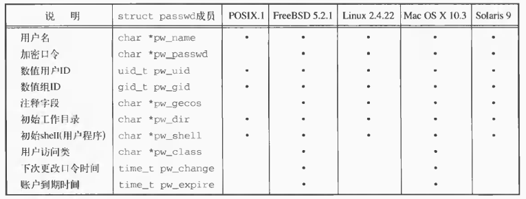
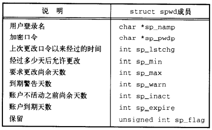
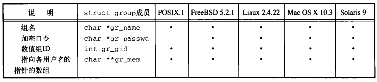
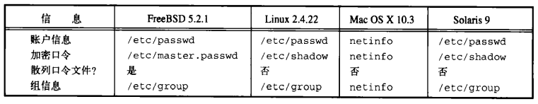
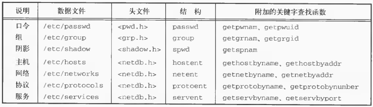
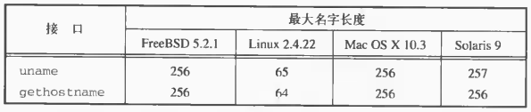
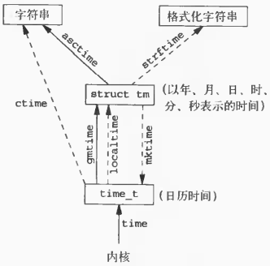
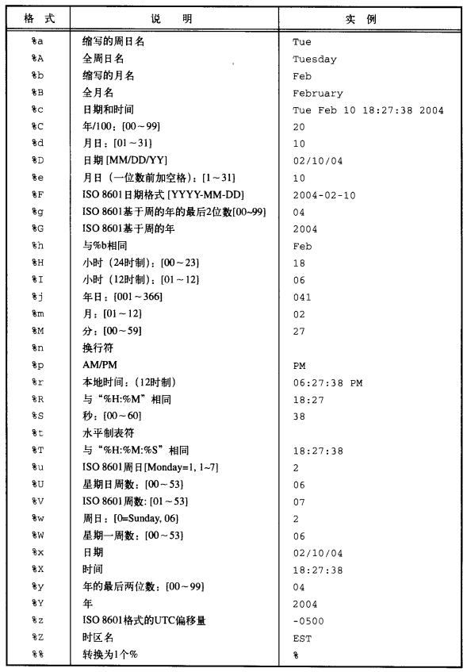

# 第6章 系统数据文件和信息

[TOC]


## 6.1 引言


## 6.2 口令文件



*/etc/passwd文件中的字段*

```c++
#include <pwd.h>
struct passwd *getpwuid(uid_t uid);
struct passwd *getpwnam(const char *name);
```

- `uid` 用户ID

- `name` 用户登陆名

- `返回值`

  成功：passwd指针

  失败：NULL

*获取口令文件项*

```c++
#include <pwd.h>
struct passwd *getpwent(void);
void setpwent(void);
void endpwent(void);
```

- `返回值`

  成功：passwd指针

  失败或到达文件结尾：NULL

*获得/设置/关闭 口令文件内容*

例：

```c++
#include <pwd.h>
#include <stddef.h>
#include <string.h>

struct passwd *getpwnam(const char *name)
{
    struct passwd *ptr;
    setpwent();
    while ((ptr = getpwent()) != NULL)
        if (strcmp(name, ptr->pw_name) == 0)
            break;
    endpwent();
    return(ptr);
}
```

*getpwnam函数*


## 6.3 阴影口令



*/etc/shadow文件中的字段*

```c++
#include <shadow.h>
struct spwd *getspnam(const char *name);
struct spwd *getspent(void);
void setspent(void);
void endspent(void);
```

- `name` 口令文件

- `返回值`

  成功：spwd指针

  出错：NULL

*访问口令文件*


## 6.4 组文件



*/etc/group文件中的字段*

```c++
#include <grp.h>
struct group *getgrgid(gid_t gid);
struct group *getgrnam(const char *name);
```

- `gid` 组ID

- `name` 组名

- `返回值`

  成功：group指针

  失败：NULL

*根据组名/数值组ID查看组信息*

```c++
#include <grp.h>
struct group *getgrent(void);
void setgrent(void);
void endgrent(void);
```

- `返回值`

  成功：group指针

  失败/到达文件结尾：NULL

*搜索整个组文件*


## 6.5 附加组ID

```c++
#include <unistd.h>
int getgroups(int gidsetsize, gid_t grouplist[]);
```

- `gidsetsize` 数组容量

- `grouplist` 数组

- `返回值`

  成功：附加组ID

  失败：-1

*将附加组ID添加到grouplist数组中*

```c++
#include <grp.h>
#include <unistd.h>
int setgroups(int ngroups, const gid_t grouplist[]);
```

- `ngroups` ID数组容量

- `grouplist` ID数组

- `返回值`

  成功：0

  失败：-1

*设置附加组ID表*

```c++
#include <grp.h>
#include <unistd.h>
int initgroups(const char *username, gid_t basegid);
```

- `usrname` 用户名

- `basegid` 组ID

- `返回值`

  成功：0

  失败：-1

*设置组文件中用户名的映射关系*


## 6.6 实现的区别



*账户实现的区别*


## 6.7 其它数据文件

一般情况下，对于每个数据文件至少有以下三个函数：

- get函数：读下一个记录。
- set函数：打开相应数据文件，然后反绕该文件。
- end函数：关闭相应数据文件。



*存取系统数据文件的类似例程*


## 6.8登录账户记录

大多数UNIX系统提供以下数据文件：

- utmp文件：记录当前登录进系统的各个用户；
- wtmp文件：跟踪各个登录和注销事件。

```c++
struct utmp {
    char ut_line[8]; // tty: ttyh0, ttyd0, ...
    char ut_name[8]; // 登录名
    long ut_time;    // 从epoch以来的秒数
};
```


## 6.9 系统标识

```c++
#include <sys/utsname.h>
int uname(struct utsname *name);
```

- `name` 操作系统信息

  ```c++
  struct utsname {
      char sysname[];
      char nodename[];
      char release[];
      char version[];
      char machine[];
  };
  ```

- `返回值`

  成功：非0值

  失败：-1

*返回与当前主机和操作系统有关的信息*

```c++
#include <unistd.h>
int gethostname(char *name, int namelen);
```

- `name` 返回的主机名字符串

- `namelen` 主机名字符串长度

- `返回值`

  成功：0

  失败：-1

*返回主机名*



*系统标识名字限制*


## 6.10 时间和日期例程

```c++
#include <time.h>
time_t time(time_t *calptr);
```

- `calptr` 

- `返回值`

  成功：时间值

  失败：-1

*返回当前时间和日期*

```c++
#include <sys/time.h>
int gettimeofday(struct timeval *restrict tp, void *restrict tzp);
```

- `tp` 时间信息

  ```c++
  struct timeval {
      time_t tv_sec;  // 秒
      long   tv_usec; // 微妙
  };
  ```

- `tzp` 时区（唯一合法值是NULL）

- `返回值` 总是0

*返回（更高分辨率级别，ms）的当前时间和日期*



*各个时间函数之间的关系*

```c++
struct tm {
    int tm_sec;
    int tm_min;
    int tm_hour;
    int tm_mday;
    int tm_mon;
    int tm_year;
    int tm_wday;
    int tm_yday;
    int tm_isdst;
};
```

````c++
#include <time.h>
struct tm *gmtime(const time_t *calptr);
struct tm *localtime(const time_t *calptr);
````

- `calptr` 日历时间
- `返回值` 指向tm结构的指针

*将日历时间转换为国际标准时间/本地时间*

```c++
#include <time.h>
time_t mktime(struct tm *tmptr);
```

- `tmptr` 本地时间

- `返回值`

  成功：日历时间

  失败：-1

*将本地时间转换成日历时间*

```c++
#include <time.h>
char *asctime(const struct tm *tmptr);
char *ctime(const time_t *ctlptr);
```

- `tmptr` 本地时间
- `ctlptr` 日历时间
- `返回值` 指向以null结尾的字符串的指针

*将本地时间/日历时间转换成字符串*

```c++
#include <time.h>
size_t strftime(char *restrict buf, size_t maxsize,
                const char *restrict format,
                const struct tm *restrict tmptr);
```

- `buf` 字符串数组

- `maxsize` 数组容量

- `format` 字符串格式

- `tmptr` 要格式化的时间值

- `返回值`

  成功：返回存入数组的字符数

  失败：0

*格式化时间*



*strftime的转换说明*


## 6.11 小结


