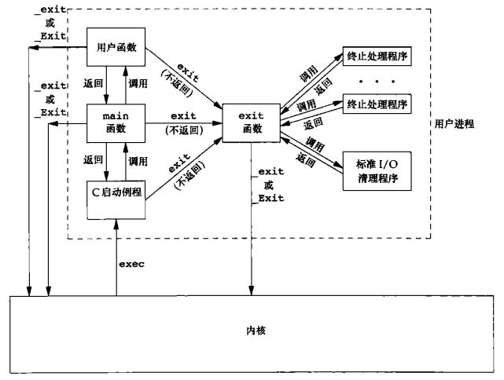
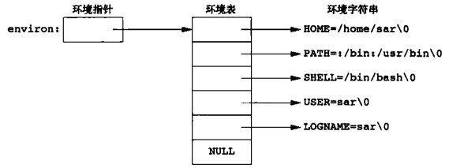
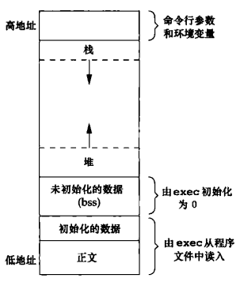
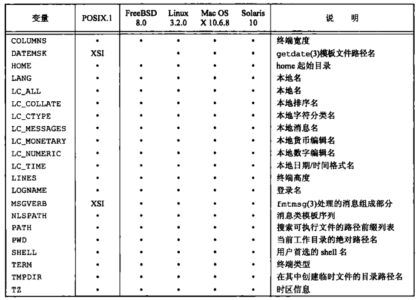
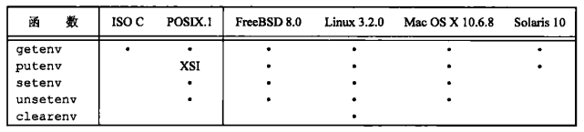
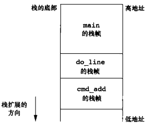
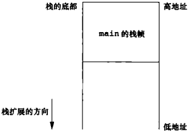
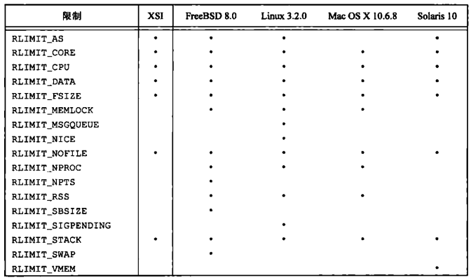

# 第七章 进程环境

[TOC]


## 7.1 引言


## 7.2 main函数

```c++
int main(int argc, char *argv[]);
```

- `argc` 参数数量
- `argv` 参数集合

*所有函数的入口：main函数。*


## 7.3 进程终止

终止（termination）进程的方法：

- 正常终止
  - 从main返回；
  - 调用exit；
  - 调用`_exit`或`_Exit`；
  - 最后一个线程从其启动例程返回；
  - 从最后一个线程调用`pthread_exit`。
- 异常终止
  - 调用`abort`；
  - 接到一个信号；
  - 最后一个线程对取消请求做出响应。

```c++
#include <stdlib.h>
void exit(int status);
```

- `status` 终止状态

*执行完清理操作：对于所有打开流调用fclose函数，冲刷输出缓冲中的所有数据；然后返回内核。*

```c++
#include <stdlib.h>
void _Exit(int status);

#include <unistd.h>
void _exit(int status);
```

- `status` 终止状态

*立即返回内核，不做清理。*

例：

```c++
#include <stdio.h>
main()
{
    printf("hello, world\n");
}
```

*经典C程序*

```c++
#include <stdlib.h>
int atexit(void (*func)(void));
```

- `func`
- `返回值`
  - 成功：0
  - 失败：非0

*注册`终止处理程序（exit handler）`，最多32个且不做去重。*



*一个C程序是如何启动和终止的*

例：

```c++
#include "apue.h"
static void my_exit1(void);
static void my_exit2(void);
int 
main(void)
{
    if (atexit(my_exit2) != 0)
        err_sys("can't register my_exit2");
    if (atexit(my_exit1) != 0)
        err_sys("can't register my_exit1");
    if (atexit(my_exit1) != 0)
        err_sys("can't register my_exit1");
    printf("main is done\n");
    return(0);
}
static void 
my_exit(void)
{
    printf("first exit handler\n");
}
static void 
my_exit2(void)
{
    printf("second exit handler\n");
}
```

*终止处理程序实例*


## 7.4 命令行参数

当执行一个程序时，调用exec的进程可将命令行参数传递给该新程序。

例：

```c++
TODO
```

*将所有命令行参数回显到标准输出*


## 7.5 环境表

```c++
extern char **environ;
```

全局变量`environ`又叫`环境指针（environment pointer）`，包含了一张环境表。



*由5各字符串组成的环境*


## 7.6 C程序的存储空间布局



*典型的存储空间安排*

- `正文段` CPU执行的机器指令部分，只读+可共享；

- `初始化数据段` 包含程序中需明确地赋初值的变量，例：

  ```c++
  int maxcount = 99;
  ```

- `未初始化数据段（bss）`，例：

  ```c++
  long sum[1000];
  ```

- `栈` 自动变量以及每次函数调用时所需保存的信息都存放在此段中；

  每次函数调用时，其返回地址以及调用者的环境信息都放在栈中；递归函数每次调用自身时，就用一个新的栈帧，因此一次函数调用实例中的变量集不会影响另一次函数调用实例中的变量。

- `堆` 用于动态存储分配。


## 7.7 共享库

- 无共享库方式创建可执行文件

  ```sh
  gcc -static hello.c
  ```

- 以共享库方式创建可执行文件

  ```sh
  gcc hello.c # gcc默认使用共享库
  ```


## 7.8 存储空间分配

```c++
#include <stdlib.h>
void *malloc(size_t size);
```

- `size` 长度（字节数）
- `返回值`
  - 成功：非空指针
  - 失败：NULL

*分配指定字节数的存储区，此存储区中的初始值不确定。*

```c++
#include <stdlib.h>
void *calloc(size_t mobj, size_t size);
```

- `mobj`
- `size` 长度（字节数）
- `返回值`
  - 成功：非空指针
  - 失败：NULL

*为指定数量指定长度的对象分配存储空间，该空间中的每bit都初始化为0。*

```c++
#include <stdlib.h>
void *realloc(void *ptr, size_t newsize);
```

- `ptr` 旧的分配区指针
- `newsize` 长度（字节数）
- `返回值`
  - 成功：非空指针
  - 失败：NULL

*增加或减少以前分配区的长度；当增加长度时，可能需将以前分配区的内容移到另一个足够大的区域，以便在尾端提供增加的存储区，而新增区域内的初始值则不确定。*

```c++
#include <stdlib.h>
void free(void *ptr);
```

- `ptr` 分配区指针

*释放存储空间。*


## 7.9 环境变量

```c++
#include <stdlib.h>
char *getenv(const char *name);
```

- `name` 键
- `返回值`
  - 成功：与name关联的指针
  - 失败：NULL

*获取环境变量值。*



*Single UNIX Specification定义的环境变量*



*对于各种环境表函数的支持*

```c++
#include <stdlib.h>
int putenv(char *str);
```

- `str` 格式为`name=value的`键值对
- `返回值`
  - 成功：0
  - 失败：非0

*取形式为`name=value`的字符串，将其放到环境表中；如果name已经存在，则先删除其原来的定义。*

```c++
#include <stdlib.h>
int setenv(const char *name, const char *value, int rewrite);
```

- `name` 键
- `value` 值
- `rewrite` 是否重写该值（0：保留现有定义，非0：删除现有定义）
- `返回值`
  - 成功：0
  - 失败：-1

*将name设置为value；如果name已经存在：1.如果rewrite非0，则首先删除其现有的定义；2.如果rewrite为0，则不删除其现有定义。*

```c++
#include <stdlib.h>
int unsetenv(const char *name);
```

- `str` 键
- `返回值`
  - 成功：0
  - 失败：-1

*删除指定key的环境变量。*


## 7.10 函数setjmp和longjmp

例：



*调用cmd_add后的各个栈帧*

```c++
TODO
```

*进行命令处理程序的典型骨架部分*

```c++
#include <setjmp.h>
int setjmp(jmp_buf env);
```

- `env` 保存恢复栈状态的所有信息
- `返回值`
  - 直接调用：0
  - 从longjmp返回：非0

*设置非局部跳转信息*

```c++
#include <setjmp.h>
void longjmp(jmp_buf env, int val);
```

- `env` 保存恢复栈状态的所有信息
- `val` 从setjmp处返回的值

*非局部跳转*

例：



*在调用longjmp后的栈帧*

```c++
#include "apue.h"
#include <setjmp.h>
#define TOK_ADD 5
jmp_buf jmpbuffer;
int 
main(void)
{
    char line[MAXLINE];
    if (setjmp(jmpbuffer) != 0)
        printf("error");
    while (fgets(line, MAXLINE, stdin) != NULL)
        do_line(line);
    exit(0);
}
...
void 
cmd_add(void)
{
    int token;
    token = get_token();
    if (token < 0)
        longjmp(jmpbuffer, 1);
}
```

*setjmp和longjmp实例*

例：

```c++
TODO
```

*longjmp对各类变量的影响*

例：

```c++
TODO
```

*自动变量的不正确使用*


## 7.11函数getrlimit和setrlimit

```c++
#include <sys/resource.h>
int getrlimit(int resource, struct rlimit *rlptr);
int setrlimit(int resource, const struct rlimit *rlptr);
```

- `resource` 资源

- `rlptr` 限制值

  ```c++
  struct rlimit {
      rlim_t rlim_cur; // 软限制
      rlim_t rlim_max; // 硬限制
  };
  ```

- `返回值`

  - 成功：0
  - 失败：非0

*设置/更改进程的资源限制*

更改资源限制时，须遵循以下规则：

1. 任何一个进程都可将一个软限制值更改为<=其硬限制值；
2. 任何一个进程都可降低其硬限制值，但它必须>=其软限制值，这种操作不可逆；
3. 只有超级用户进程可以提高硬限制值。



*对资源限制的支持*

- `RLIMIT_AS` 进程总的可用存储空间的最大长度（字节）；
- `RLIMIT_CORE` core文件的最大字节数，若其值为0则阻止创建core文件；
- `RLIMIT_CPU` CPU时间的最大量值（秒），当超过此软限制时，向该进程发送SIGXCPU信号；
- `RLIMIT_DATA` 数据段的最大字节长度；
- `RLIMIT_FSIZE` 可以创建的文件的最大字节长度；当超过此软限制时，则向该进程发送SIGXFSZ信号；
- `RLIMIT_MEMLOCK` 一个进程使用`mlock(2)`能够锁定在存储空间中的最大字节长度；
- `RLIMIT_MSGQUEUE` 进程为POSIX消息队列可分配的最大存储字节数；
- `RLIMIT_NICE` 为了影响进程的调度优先级，nice值可设置的最大限制；
- `RLIMIT_NOFILE` 每个进程能打开的最多文件数；
- `RLIMIT_NPROC` 每个实际用户ID可拥有的最大子进程数；
- `RLIMIT_NPTS` 用户可同时打开的伪终端的最大数量；
- `RLIMIT_RSS` 最大驻内存集字节长度（resident set size in bytes, RSS）；
- `RLIMIT_SBSIZE` 在任一给定时刻，一个用户可以占用的套接字缓冲区的最大长度（字节）；
- `RLIMIT_SIGPENDING` 一个进程可排队的信号最大数量；
- `RLIMIT_STACK` 栈的最大字节长度；
- `RLIMIT_SWAP` 用户可消耗的交换空间的最大字节数；
- `RLIMIT_VMEM` 这是`RLIMIT_AS`的同义词。

例：

```c++
TODO
```

*打印当前资源限制*


## 7.12 小结

