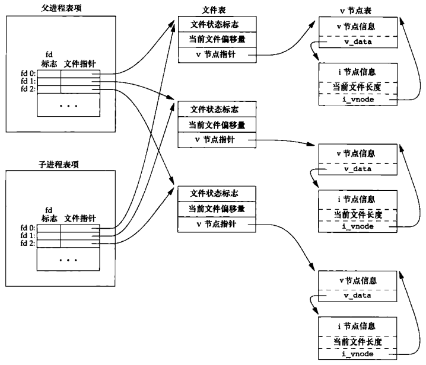
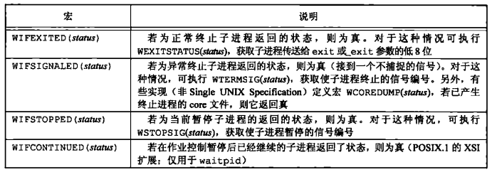
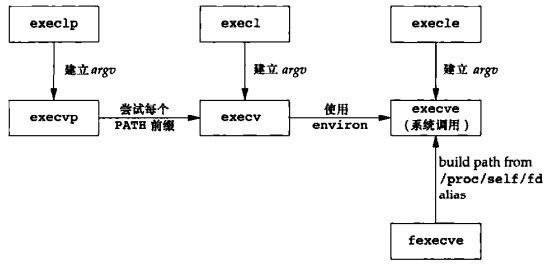
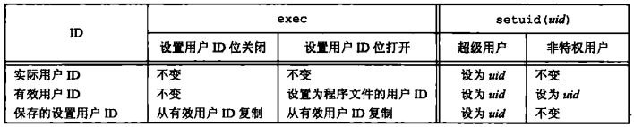
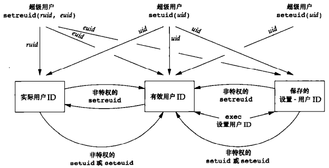
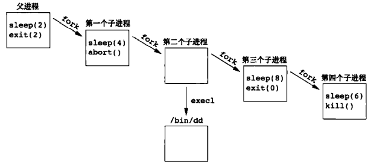

# 第八章 进程控制

[TOC]


## 8.1 引言


## 8.2 进程标识

每个进程都有一个**可复用的非负整型**表示唯一进程ID；ID为0的进程通常是调度进程（又名`交换进程（swapper）`），ID为1通常是`init进程`。

```c++
#include <unistd.h>
pid_t getpid(void);  // 进程ID
pid_t getppid(void); // 父进程ID
uid_t getuid(void);  // 进程实际用户ID
uid_t geteuid(void); // 进程有效用户ID
gid_t getgid(void);  // 进程实际组ID
gid_t getegid(void); // 进程有效组ID
```

*返回进程的ID/父进程ID/实际用户ID/有效用户ID/实际组ID/有效组ID*

## 8.3 函数fork

```c++
#include <unistd.h>
pid_t fork(void);
```

- `子进程返回值` 0
- `父进程返回值`
  - 成功：子进程ID
  - 失败：-1

*创建子进程*

例：

```c++
#include "apue.h"
int glob = 6;
char buf[] = "a write to stdout\n";
int 
main(void)
{
    int var;
    pid_t pid;
    var = 88;
    if (write(STDOUT_FILENO, buf, sizeof(buf) - 1) != sizeof(buf) - 1)
        err_sys("write error");
    printf("before fork\n");
    if ((pid = fork()) < 0) {
        err_sys("fork error");
    } else if (pid == 0) {
        glob++;
        var++;
    } else {
        sleep(2);
    }
    printf("pid = %d, glob = %d, var = %d\n", getpid(), glob, var);
    exit(0);
}
```

*fork函数实例*



*fork之后父进程和子进程之间对打开文件的共享*

父进程的以下属性由子进程继承：

- 实际用户ID，实际组ID，有效用户ID，有效组ID
- 附属组ID
- 进程组ID
- 会话ID
- 控制终端
- 设置用户ID标志和设置组ID标志
- 当前工作目录
- 根目录
- 文件模式创建屏蔽字
- 信号屏蔽和安排
- 对任一打开文件描述符的执行时关闭（close-on-exec）标志
- 环境
- 连接的共享存储段
- 存储映像
- 资源限制

父进程和子进程之间的的区别：

- fork的返回值不同。
- 进程ID不同。
- 这两个进程的父进程ID不同：子进程的父进程ID是创建它的进程的ID，而父进程的父进程ID则不变。
- 子进程的`tms_utime, tms_stime, tms_cutime和tms_ustime`的值设置为0。
- 子进程不继承父进程设置的文件锁。
- 子进程的未处理闹钟被清除。
- 子进程的未处理信号集设置为空集。

fork失败的原因：

- 系统中已经有太多的进程；
- 实际用户ID的进程总数超过了系统限制。


## 8.4 函数vfork

`vfork`函数用于创建一个新进程，该新进程的目的是exec一个新程序。

`vfork`和`fork`之间的区别：

1. `vfork`保证子进程先运行，在子进程调用`exec`或exit之后父进程才可能被调度运行；

例：

```c++
#include "apue.h"
int glob = 6;
int 
main(void)
{
    int var;
    pid_t pid;
    var = 88;
    printf("before vfork\n");
    if ((pid = vfork()) < 0) {
        err_sys("vfork error");
    } else if (pid == 0) {
        glob++;
        var++;
        _exit(0);
    }
    printf("pid = %d, glob = %d, var = %d\n", getpid(), glob, var);
    exit(0);
}
```

*vfork函数实例*


## 8.5 函数exit

进程的5种正常终止方式：

1. 在`main`函数内执行`return`语句。
2. 调用`exit`函数。
3. 调用`_exit`或`_Exit`函数。
4. 进程的最后一个线程在其启动例程中执行返回语句。
5. 进程的最后一个线程调用`pthread_exit`函数。

进程的3种异常终止方式：

1. 调用`abort`，产生SIGABRT信号。
2. 当进程接受到某些信号时，信号可由进程自身，其它进程或内核产生。
3. 调用`_exit`或`_Exit`函数。


## 8.6函数wait和waitpid

```c++
#include <sys/wait.h>
pid_t wait(int *statloc);
```

- `statloc`
  - 空指针：不关心终止状态
  - 非空指针：存放子进程的终止状态
- `返回值`
  - 成功：进程ID
  - 失败：0或-1

*查找终结的子进程（阻塞）*

```c++
#include <sys/wait.h>
pid_t waitpid(pid_t pid, int *statloc, int options);
```

- `pid` 指定子进程ID

  - `-1` 等待任一子进程；
  - `>0` 等待进程ID与pid相等的子进程；
  - `0` 等待组ID等于调用进程组ID的任一子进程；
  - `<-1` 等待组ID等于pid绝对值的任一子进程。

- `statloc`

  - 空指针：不关心终止状态
  - 非空指针：存放子进程的终止状态

- `options` 选项参数

  | 常量       | 说明                                                         |
  | ---------- | ------------------------------------------------------------ |
  | WCONTINUED | 若实现支持作业控制，那么由`pid`指定的任一子进程在停止后已经继续，但其状态尚未报告，则返回其状态（POSIX.1的XSI扩展） |
  | WNOHANG    | 若由`pid`指定的子进程并不是立即可用的，则`waitpid`不阻塞，此时其返回值为0 |
  | WUNTRACED  | 若某实现支持作业控制，而由`pid`指定的任一子进程已处于停止状态，并且其状态自停止以来还未报告过，则返回其状态，WIFSTOPPED宏确定返回值是否对应于一个停止的子进程 |

- `返回值`

  - 成功：进程ID
  - 失败：0或-1

*查找终结的子进程（阻塞/非阻塞）*



*检查wait和waitpid所返回的终止状态的宏；waitpid提供了以下wait函数没有的功能：*

*1. waitpid可等待一个特定的进程，而wait则返回任一终止子进程的状态；*

*2. waitpid提供了一个wait的非阻塞版本；有时希望获取一个子进程的状态，但不想阻塞；*

*3. waitpid通过WUNTRACED和WCONTINUED选项支持作业控制。*

例：

```c++
#include "apue.h"
#include <sys/wait.h>
void
pr_exit(int status)
{
    if (WIFEXITED(status))
        printf("normal termination, exit status = %d\n", WEXITSTATUS(status));
    else if (WIFSIGNALED(status))
        printf("abnormal termination, signal number = %d%s\n", WTERMSIG(status),
               #ifdef WCOREDUMP
               	   WCOREDUMP(status) ? "（core file generated）" : "");
               #else
    			"");
    		  #endif
    			else if (WIFSTOPPED(status))
                    printf("child stopped, signal number = %d\n", WSTOPSIG(status));
}
```

*打印exit状态的说明*

例：

```c++
#include "apue.h"
#include <sys/wait.h>
int 
main(void)
{
    pid_t pid;
    int status;
    if ((pid = fork()) < 0)
        err_sys("fork error");
    else if (pid == 0)
        exit(7);
    if (wait(&status) != pid)
        err_sys("wait error");
    pr_exit(status);
    if ((pid = fork()) < 0)
        err_sys("fork error");
    else if (pid == 0)
        abort();
    if (wait(&status) != pid)
        err_sys("wait error");
    pr_exit(status);
    if ((pid = fork()) < 0)
        err_sys("fork error");
    else if (pid == 0)
        status /= 0;
    if (wait(&status) != pid)
        err_sys("wait error");
    pr_exit(status);
    exit(0);
}
```

*演示不同的exit值*

例：

```c++
#include "apue.h"
#include <sys/wait.h>
int 
main(void)
{
    pid_t pid;
    if ((pid = fork()) < 0) {
        err_sys("fork error");
    } else if (pid == 0) {
        if ((pid = fork()) < 0)
            err_sys("fork error");
        else if (pid > 0)
            exit(0);
        sleep(2);
        printf("second child, parent pid = %d\n", getppid());
        exit(0);
    }
    if (waitpid(pid, NULL, 0) != pid)
        err_sys("waitpid error");
    exit(0);
}
```

*fork两次以避免僵死进程*


## 8.7 函数waitid

```c++
#include <sys/wait.h>
int waitid(idtype_t idtype, id_t id, siginfo_t *infop, int options);
```

- `idtype` ID类型

  | 常量   | 说明                                                         |
  | ------ | ------------------------------------------------------------ |
  | P_PID  | 等待一特定进程：`id`包含要等待子进程的进程ID                 |
  | P_PGID | 等待一特定进程组中的任一子进程：`id`包含要等待子进程的进程组ID |
  | P_ALL  | 等待任一子进程：忽略`id`                                     |

- `id` 进程ID

- `infop` 指向造成子进程状态改变有关信号的信息

- `options` 选项

  | 常量       | 说明                                                         |
  | ---------- | ------------------------------------------------------------ |
  | WCONTINUED | 等待一进程，它以前曾被停止，此后又已继续，但其状态尚未报告   |
  | WEXITED    | 等待已退出的进程                                             |
  | WNOHANG    | 如无可用的子进程退出状态，立即返回而非阻塞                   |
  | WNOWAIT    | 不破坏子进程退出状态。该子进程退出状态可由后续的`wait`, `waitid`或`waitpid`调用取得 |
  | WSTOPPED   | 等待一进程，它已经停止，但其状态尚未报告                     |

- `返回值`

  - 成功：0
  - 失败：-1

*获得进程终止状态*


## 8.8 函数wait3和wait4

```c++
#include <sys/types.h>
#include <sys/wait.h>
#include <sys/time.h>
#include <sys/resource.h>
pid_t wait3(int *statloc, int options, struct rusage *rusage);
pid_t wait4(pid_t pid, int *statloc, int options, struct rusage *rusage);
```

- `statloc`
  - 空指针：不关心终止状态
  - 非空指针：存放子进程的终止状态
- `options`  选项
- `rusage` 资源概况信息
- `pid` 进程ID
- `返回值`
  - 成功：进程ID
  - 失败：-1

*通过内核返回由终止进程及其所有子进程使用的资源概况*

| 函数    | pid  | options | rusage | POSIX.1 | Free BSD 8.0 | Linux 3.2.0 | MacOSX 10.6.8 | Solaris 10 |
| ------- | ---- | ------- | ------ | ------- | ------------ | ----------- | ------------- | ---------- |
| wait    |      |         |        | *       | *            | *           | *             | *          |
| waitid  | *    | *       |        | *       |              | *           | *             | *          |
| waitpid | *    | *       |        | *       | *            | *           | *             | *          |
| wait3   |      | *       | *      |         | *            | *           | *             | *          |
| wait4   | *    | *       | *      |         | *            | *           | *             | *          |

*不同系统上各个wait函数所支持的参数*


## 8.9 竞争条件

例：

```c++
#include "apue.h"

static void charatatime(char *);

int 
main(void)
{
    pid_t pid;
    if ((pid = fork()) < 0) {
        err_sys("fork error");
    } else if (pid == 0) {
        charatatime("output from child\n");
    } else {
        charatatime("output from parent\n");
    }
    exit(0);
}

static void 
charatatime(char *str)
{
    char *ptr;
    int c;
    setbuf(stdout, NULL);
    for (ptr = str; (c = *ptr++) != 0; )
        putc(c, stdout);
}
```

*带有竞争条件的程序*


## 8.10 函数exec

```c++
#include <unistd.h>
int execl(const char *pathname, const char *arg0, ...);
int execv(const char *pathname, char *const argv[]);
int execle(const char *pathname, const char *arg0, ...);
int execve(const char *pathname, char *const argv[], char *const envp[]);
int execlp(const char *filename, const char *arg0, ...);
int execvp(const char *filename, char *const argv[]);
int fexecve(int fd, char *const argv[], char *const envp[]);
```

- `pathname` 路径名
  - 如果包含`/`，则将其视为路径名；
  - 否则按PATH环境变量，在它所指定的各目录中搜寻可执行文件。
- `argx` 各种参数
- `返回值`
  - 成功：不返回
  - 失败：-1

*执行程序*

| 函数             | pathname | filename | fd   | 参数表 | argv[] | environ | envp[] |
| ---------------- | -------- | -------- | ---- | ------ | ------ | ------- | ------ |
| execl            | *        |          |      | *      |        | *       |        |
| execlp           |          | *        |      | *      |        | *       |        |
| execle           | *        |          |      | *      |        |         | *      |
| execv            | *        |          |      |        | *      | *       |        |
| execvp           |          | *        |      |        | *      | *       |        |
| execve           | *        |          |      |        | *      |         | *      |
| fexecve          |          |          | *    |        | *      |         | *      |
| （名字中的字母） |          | p        | f    | l      | v      |         | e      |

*7个exec函数之间的区别*



*7个exec函数之间的关系*

例：

```c++
#include "apue.h"
#include <sys/wait.h>

char *env_init[] = {"USER=unknown", "PATH=/tmp", NULL};

int 
main(void)
{
    pid_t pid;
    if ((pid = fork()) < 0) {
        err_sys("fork error");
    } else if (pid == 0) {
        if (execle("/home/sar/bin/echoall", "echoall", "myarg1",
                   "MY ARG2", (char *)0, env_init) < 0)
            err_sys("execle error");
    }
    if (waitpid(pid, NULL, 0) < 0)
        err_sys("wait error");
    if ((pid = fork()) < 0) {
        err_sys("fork error");
    } else if (pid == 0) {
        if (execlp("echoall", "echoall", "only 1 arg", (char *)0) < 0)
            err_sys("execlp error");
    }
    exit(0);
}
```

*exec函数实例*

例：

```c++
#include "apue.h"
int 
main(int argc, char *argv[])
{
    int i;
    char **ptr;
    extern char **environ;
    for (i = 0; i < argc; i++)
        printf("argv[%d]: %s\n", i, argv[i]);
    for (ptr = environ; *ptr != 0; ptr++)
        printf("%s\n", *ptr);
    exit(0);
}
```

*回显所有命令行参数和所有环境字符串*


## 8.11 更改用户ID和更改组ID

```c++
#include <unistd.h>
int setuid(uid_t uid);
```

- `uid` 用户ID
- `返回值`
  - 成功：0
  - 失败：-1

*设置实际用户ID和有效用户ID，逻辑如下：*

1. *如果进程具有超级用户特权，则setuid函数将实际用户ID，有效用户ID以及保存的设置用户ID（saved set-user-ID）设置为uid；*
2. *若进程没有超级用户特权，但是uid等于实际用户ID或保存的设置用户ID，则setuid只将有效用户ID设置为uid，不更改实际用户ID和保存的设置用户ID；*
3. *如果上面两个条件都不满足，则errno设置为EPERM，并返回-1。*

*更改3个用户ID的不同方法：*



```c++
#include <unistd.h>
int setgid(gid_t gid);
```

- `gid` 组ID
- `返回值`
  - 成功：0
  - 失败：-1

*设置实际组ID和有效组ID*

```c++
#include <unistd.h>
int setreuid(uid_t ruid, uid_t euid);
```

- `ruid` 实际用户ID和有效用户ID
- `euid` 实际用户ID和有效用户ID
- `返回值`
  - 成功：0
  - 失败：-1

*交换实际用户ID和有效用户ID*

```c++
#include <unistd.h>
int setregid(gid_t rgid, gid_t egid);
```

- `rgid` 实际组ID和有效组ID
- `egid` 实际组ID和有效组ID
- `返回值`
  - 成功：0
  - 失败：-1

*交换实际用户ID和有效用户ID*

```c++
#include <unistd.h>
int seteuid(uid_t uid);
```

- `uid` 有效用户ID
- `返回值`
  - 成功：0
  - 失败：-1

*更改有效用户ID*



*设置不同用户ID的各函数*

```c++
#include <unistd.h>
int setegid(gid_t gid);
```

- `gid` 有效组ID
- `返回值`
  - 成功：0
  - 失败：-1

*更改有效组ID*


## 8.12 解释器文件

例：

```c++
#include "apue.h"
#include <sys/wait.h>

int 
main(void)
{
    pid_t pid;
    if ((pid = fork()) < 0) {
        err_sys("fork error");
    } else if (pid == 0) {
        if (execl("/home/sar/bin/testinterp",
                  "testinterp", "myarg1", "MY ARG2", (char *)0) < 0)
            err_sys("execl error");
    }
    if (waitpid(pid, NULL, 0) < 0)
        err_sys("waitpid error");
    exit(0);
}
```

*执行一个解释器文件的程序*

例：

```c++
#!/usr/bin/awk -f
# Note: on Solaris, use nawk instead
BEGIN {
    for (i = 0; i < ARGC; i++)
        printf "ARGV[%d] = %s\n", i, ARGV[i]
    exit
}
```

*作为解释器文件的awk程序*


## 8.13 函数system

```c++
#include <stdlib.h>
int system(const char *cmdstring);
```

- `cmdstring` 命令
- `返回值`
  - `fork`失败或者`waitpid`返回除`EINTR`之外的出错：返回-1，并设置errno以指示错误类型；
  - `exec`失败：如同`shell`执行了`exit(127)`一样；
  - `fork`，`exec`和`waitpid`都执行成功：返回shell的终止状态。

*执行命令；相对于直接使用fork和exec，system进行了所需的各种出错处理以及各种信号处理，更为安全。*

```c++
#include <sys/wait.h>
#include <errno.h>
#include <unistd.h>
int 
system(const char *cmdstring)
{
    pid_t pid;
    int status;
    if (cmdstring == NULL)
        return(1);
    if ((pid = fork()) < 0) {
        status = -1;
    } else if (pid == 0) {
        execl("/bin/sh", "sh", "-c", cmdstring, (char *)0);
        _exit(127);
    } else {
        while (waitpid(pid, &status, 0) < 0) {
            if (errno != EINTR) {
                status = -1;
                break;
            }
        }
    }
    
    return(status);
}
```

*system函数的实现（没有对信号进行处理）*

例：

```c++
#include "apue.h"
#include <sys/wait.h>

int 
main(void)
{
	int status;
    if ((status = system("date")) < 0)
        err_sys("system() error");
    pr_exit(status);
    if ((status = system("nosuchcommand")) < 0)
        err_sys("system() error");
    pr_exit(status);
    if ((status = system("who; exit 44")) < 0)
        err_sys("system() error");
    pr_exit(status);
    exit(0);
}
```

*调用system函数*

例：

```c++
#include "apue.h"

int 
main(int argc, char *argv[])
{
    int status;
    if (argc < 2)
        err_quit("command-line argument required");
    if ((status = system(argv[1])) < 0)
        err_sys("system() error");
    pr_exit(status);
    exit(0);
}
```

*用system执行命令行参数*

例：

```c++
#include "apue.h"

int 
main(void)
{
    printf("real uid = %d, effective uid = %d\n", getuid(), geteuid());
    exit(0);
}
```

*打印实际用户ID和有效用户ID*


## 8.14 进程会计

```c++
typedef u_short comp_t;
struct acct
{
    char  ac_flag;
    char  ac_stat;
    uid_t ac_uid;
    gid_t ac_gid;
    dev_t ac_tty;
    time_t ac_btime;
    comp_t ac_utime;
    comp_t ac_stime;
    comp_t ac_etime;
    comp_t ac_mem;
    comp_t ac_io;
    comp_t ac_rw;
    char ac_comm[8];
};
```

| ac_flag | 说明                               | FreeBSD 8.0 | Linux 3.2.0 | Mac OS X 10.6.8 | Solaris 10 |
| ------- | ---------------------------------- | ----------- | ----------- | --------------- | ---------- |
| AFORK   | 进程是由fork产生的，但从未调用exec | *           | *           | *               | *          |
| ASU     | 进程使用超级用户特权               |             | *           | *               | *          |
| ACORE   | 进程转储core                       | *           | *           | *               |            |
| AXSIG   | 进程由一个信号杀死                 | *           | *           | *               |            |
| AEXPND  | 扩展的会计条目                     |             |             |                 | *          |
| ANVER   | 新记录格式                         | *           |             |                 |            |

*会计记录中的ac_flag值*

例：



*会计处理实例的进程结构*

```c++
#include "apue.h"

int 
main(void)
{
    pid_t pid;
    if ((pid = fork()) < 0)
        err_sys("fork error");
    else if (pid != 0) {
        sleep(2);
        exit(2);
    }
    
    if ((pid = fork()) < 0)
        err_sys("fork error");
    else if (pid != 0) {
        sleep(4);
        abort();
    }
    
    if ((pid = fork()) < 0)
        err_sys("fork error");
    else if (pid != 0) {
        execl("/bin/dd", "dd", "if=/etc/passwd", "of=/dev/null", NULL);
        exit(7);
    }
    
    if ((pid = fork()) < 0)
        err_sys("fork error");
    else if (pid != 0) {
        sleep(8);
        exit(0);
    }
    
    sleep(6);
    kill(getpid(), SIGKILL);
    exit(6);
}
```

*产生会计数据的程序*

```c++
#include "apue.h"
#include <sys/acct.h>

#if defined(BSD)
#define acct acctv2
#define ac_flag ac_trailer.ac_flag
#define FMT "%-*,*s e = %.0f, chars = %.0f, %c %c %c %c\n"
#elif defined(HAS_AC_STAT)
#define FMT "%-*,*s e = %61d, chars = %71d, stat = %3u: %c %c %c %c\n"
#else
#define FMT "%-*,*s e = %61d, chars = %71d, %c %c %c %c\n"
#endif
#if defined(LINUX)
#define acct acct_v3
#endif

#if !defined(HAS_ACORE)
#define ACORE 0
#endif
#if !defined(HAS_AXSIG)
#define AXSIG 0
#endif

#if !defined(BSD)
static unsigned long
compt2ulong(comp_t comptime)
{
    unsigned long val;
    int exp;
    val = comptime & 0x1fff;
    exp = (comptime >> 13) & 7;
    while (exp-- > 0)
        val *= 8;
    return(val);
}
#endif

int 
main(int argc, char *argv[])
{
    struct acct acdata;
    FILE *fp;
    
    if (argc != 2)
        err_quit("usage: pracct filename");
    if ((fp = fopen(argv[1], "r")) == NULL)
        err_sys("can't open %s", argv[1]);
    while (fread(&acdata, sizeof(acdata), 1, fp) == 1) {
        printf(FMT, (int)sizeof(acdata.ac_comm),
               (int)sizeof(acdata.ac_comm), acdata.ac_comm,
#if defined(BSD)
               acdata.ac_etime, acdata.ac_io,
#else
              compt2ulong(acdata.ac_etime), compt2ulong(acdata.ac_io),
#endif
#if defined(HAS_AC_STAT)
               (unsigned char)acdata.ac_stat,
#endif
               acdata.ac_flag & ACORE ? 'D' : ' ',
               acdata.ac_flag & AXSIG ? 'X' : ' ',
               acdata.ac_flag & AFORK ? 'F' : ' ',
               acdata.ac_flag & ASU   ? 'S' : ' ');
    }
    if (ferror(fp))
        err_sys("read error");
    exit(0);
}
```

*打印从系统会计文件中选出的字段*


## 8.15 用户标识

```c++
#include <unistd.h>
char *getlogin(void);
```

- `返回值`
  - 成功：指向登录名字字符串的指针
  - 失败：NULL

*获得登录名*


## 8.16 进程调度

```c++
#include <unistd.h>
int mice(int incr);
```

- `incr` 增量
- `返回值`
  - 成功：新的nice值
  - 失败：-1

*设置当前进程的nice值（调度优先级）*

```c++
#include <sys/resource.h>
int getpriority(int which, id_t who);
```

- `which` 类别
  - `PRIO_PROCESS` 进程
  - `PRIO_PGRP` 进程组
  - `PRIO_USER` 用户ID
- `who` 进程/进程组/用户ID
- `返回值`
  - 成功：返回[-NZERO, NZERO-1]之间的值
  - 失败：-1

*返回指定对象的nice值（调度优先级）*

```c++
#include <sys/resource.h>
int setpriority(int which, id_t who, int value);
```

- `which` 类别
  - `PRIO_PROCESS` 进程
  - `PRIO_PGRP` 进程组
  - `PRIO_USER` 用户ID
- `who` 进程/进程组/用户ID
- `value` 值
- `返回值`
  - 成功：0
  - 失败：-1

*设置指定对象的nice值（调度优先级）*

例：

```c++
#include "apue.h"
#include <errno.h>
#include <sys/time.h>

#if defined(MACOS)
#include <sys/syslimits.h>
#elif defined(SOLARIS)
#include <limits.h>
#elif defined(BSD)
#include <sys/param.h>
#endif

unsigned long long count;
struct timeval end;

void 
checktime(char *str)
{
    struct timeval tv;
    gettimeofday(&tv, NULL);
    if (tv.tv_sec >= end.tv_sec && tv.tv_usec >= end.tv_usec) {
        printf("%s count = %11d\n", str, count);
        exit(0);
    }
}

int 
main(int argc, char *argv[])
{
    pid_t pid;
    char *s;
    int nzero, ret;
    int adj = 0;
    
    setbuf(stdout, NULL);
#if defined(NZERO)
    nzero = NZERO;
#elif defined(_SC_NZERO)
    nzero = sysconf(_SC_NZERO);
#else
#error NZERO undefined
#endif
    printf("NZERO = %d\n", nzero);
    if (argc == 2)
        adj = strtol(argv[1], NULL, 10);
    gettimeofday(&end, NULL);
    end.tv_sec += 10;
    if ((pid = fork()) < 0) {
        err_sys("fork failed");
    } else if(pid == 0) {
        s = "child";
        printf("current nice value in child is %d, adjusting by %d\n",
               nice(0) + nzero, adj);
        errno = 0;
        if ((ret = nice(adj)) == -1 && errno != 0)
            err_sys("child set scheduling priority");
        printf("now child nice value is %d\n", ret + nzero);
    } else {
        s = "parent";
        printf("current nice value in parent is %d\n", nice(0) + nzero);
    }
    for(;;) {
        if (++count == 0)
            err_quit("%s counter wrap", s);
        checktime(s);
    }
}
```

*更改nice值的效果*


## 8.17 进程时间

```c++
#include <sys/times.h>
clock_t times(struct tms *buf);
```

- `buf` 时间

  ```c++
  struct tms {
      clock_t tms_utime;
      clock_t tms_stime;
      clock_t tms_cutime;
      clock_t tms_cstime;
  };
  ```

- `返回值`

  - 成功：流逝的墙上时钟时间（以时钟滴答数为单位）
  - 失败：-1

*获得墙上时钟时间*

例：

```c++
#include "apue.h"
#include <sys/times.h>

static void pr_times(clock_t, struct tms *);
static void do_cmd(char *);

int 
main(int argc, char *argv[])
{
    int i;
    setbuf(stdout, NULL);
    for (i = 1; i < argc; i++)
        do_cmd(argv[i]);
    exit(0);
}

static void 
do_cmd(char *cmd)
{
    struct tms tmsstart, tmsend;
    clock_t start, end;
    int status;
    printf("\ncommand: %s\n", cmd);
    if ((start = times(&tmsstart)) == -1)
        err_sys("time error");
    if ((status = system(cmd)) < 0)
        err_sys("system() error");
    if ((end = times(&tmsend)) == -1)
        err_sys("time error");
    pr_times(end - start, &tmsstart, &tmsend);
    pr_exit(status);
}

static void 
pr_times(clock_t real, struct tms *tmsstart, struct tms *tmsend)
{
    static long clktck = 0;
    if (clktck == 0)
        if ((clktck = sysconf(_SC_CLK_TCK)) < 0)
            err_sys("sysconf error");
    
    printf(" real: %7.2f\n", real / (double)clktck);
    printf(" user: %7.2f\n", 
           (tmsend->tms_utime - tmsstart->tms_utime) / (double)clktck);
    printf(" sys: %7.2f\n", 
           (tmsend->tms_stime - tmsstart->tms_stime) / (double)clktck);
    printf(" child user: %7.2f\n", 
           (tmsend->tms_cutime - tmsstart->tms_cutime) / (double)clktck);
    printf(" child sys: %7.2f\n", 
           (tmsend->tms_cstime - tmsstart->tms_cstime) / (double)clktck);
}
```

*计时并执行所有命令行参数*


## 8.18 小结

