# 第九章 进程关系

[TOC]


## 9.1 引言


## 9.2 终端登录

1. BSD终端登录

   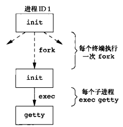

   *为允许终端登录，init调用的进程*

   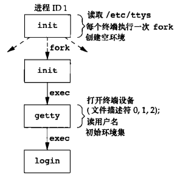

   *login调用后进程的状态*

   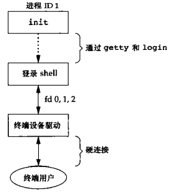

   *终端登录完成各种设置后的进程安排*

2. Mac OS X终端登录

3. Linux终端登录

4. Solaris终端登录


## 9.3 网络登录

1. BSD网络登录

   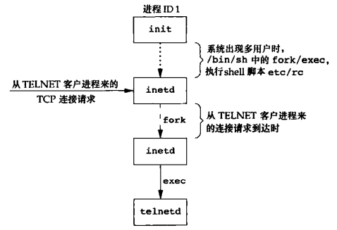

   *执行TELNET服务进程时调用的进程序列*

   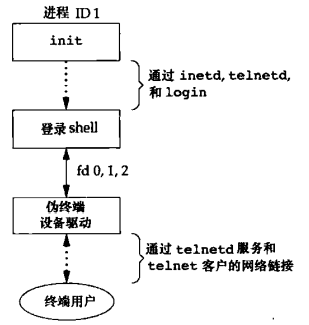

   *网络登录完成后各种设置后的进程安排*

2. Mac OS X网络登录

3. Linux网络登录

4. Solaris网络登录


## 9.4 进程组

```c++
#include <unistd.h>
pid_t getpgrp(void);
```

- `返回值` 调用进程的进程组ID

*返回调用进程的进程组ID*

```c++
#include <unistd.h>
pid_t getpgid(pid_t pid);
```

- `pid` 当前进程ID，为0时等价于`getpgrp()`

- `返回值`

  成功：进程组ID

  失败：-1

*返回调用进程的进程组ID*

```c++
#include <unistd.h>
int setpgid(pid_t pid, pid_t pgid);
```

- `pid` 当前进程ID

- `pgid` 进程组ID

- `返回值`

  成功：0

  失败：-1

*创建/加入一个进程组*


## 9.5 会话

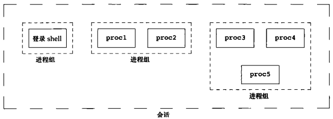

*进程组和会话中的进程安排*

```c++
#include <unistd.h>
pid_t setsid(void);
```

- `返回值`

  成功：进程组ID

  失败：-1

*建立一个新会话（如果调用此函数的进程已经是一个进程组的组长，则此函数返回错误）*

会话创建流程：

1. 该进程变成新会话的`会话首进程（session leader，会话首进程是创建该会话的进程）`；此时，该进程是新会话中的唯一进程；
2. 该进程成为一个新进程组的组长进程；新进程组ID是该调用进程的进程ID；
3. 该进程没有控制终端，如果在调用`setsid`之前该进程有一个控制终端，那么这种联系也被切断。

```c++
#include <unistd.h>
pid_t getsid(pid_t pid);
```

- `pid` 进程ID

- `返回值`

  成功：会话首进程的进程组ID

  失败：-1

*返回会话首进程的进程组ID（如果pid不属于调用者所在的会话，那么调用进程不能得到该会话首进程的进程组ID）*


## 9.6 控制终端

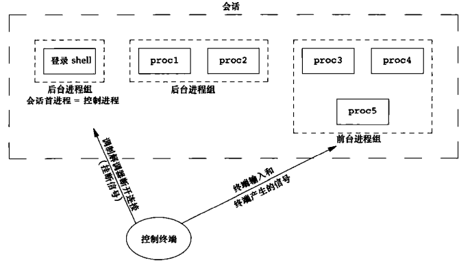

*进程组，会话和控制终端*

| 方法                   | FreeBSD 8.0 | Linux 3.2.0 | Mac OS X 10.6.8 | Solaris 10 |
| ---------------------- | ----------- | ----------- | --------------- | ---------- |
| 没有指定O_NOCTTY的open |             | *           | *               | *          |
| TIOCSCTTY ioctl命令    | *           | *           | *               | *          |

*不同的实现分配控制终端的方式*


## 9.7 函数tcgetpgrp,tcsetpgrp和tcgetsid

```c++
#include <unistd.h>
pid_t tcgetpgrp(int fd);
```

- `fd`文件描述符

- `返回值`

  成功：返回前台进程组ID

  失败：-1

*返回前台进程组ID（与fd上打开的终端相关联）*

```c++
#include <unistd.h>
int tcsetpgrp(int fd, pid_t pgrpid);
```

- `fd`文件描述符

- `pgrpid`前台进程组ID

- `返回值`

  成功：0

  失败：-1

*设置前台进程组ID*

```c++
#include <termios.h>
pid_t tcgetsid(int fd);
```

- `fd`文件描述符

- `返回值`

  成功：会话首进程的进程组ID

  失败：-1

*返回会话首进程的进程组ID*


## 9.8 作业控制

作业控制要求以下3种形式的支持：

1. 支持作业控制的shell；
2. 内核中的终端驱动程序必须支持作业控制；
3. 内核必须提供对某些作业控制信号的支持。

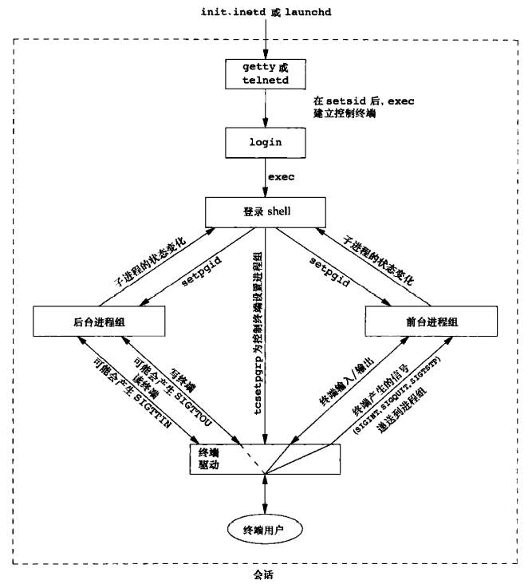

*对于前台，后台作业以及终端驱动程序的作业控制功能总结*


## 9.9 shell执行程序

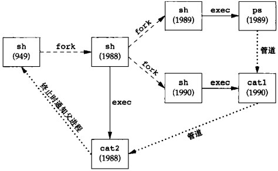

*Bourne shell执行管道 ps|cat1|cat2 时的进程*


## 9.10 孤儿进程组

`孤儿进程（orphan process）`父进程已终止并由init进程收养的进程。

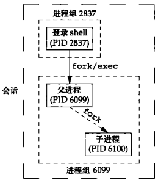

*将要成为孤儿的进程组实例*

例：

``` c++
#include "apue.h"
#include <errno.h>

static void 
sig_hup(int signo)
{
    printf("SIGHUP received, pid = %d\n", getpid());
}

static void 
pr_ids(char *name)
{
    printf("%s: pid=%d, ppid=%d, pgrp=%d, tpgrp=%d\n",
           name, getpid(), getppid(), getpgrp(), tcgetpgrp(STDIN_FILENO));
    fflush(stdout);
}

int 
main(void)
{
    char c;
    pid_t pid;
    pr_ids("parent");
    if ((pid = fork()) < 0) {
        err_sys("fork error");
    } else if (pid > 0) {
        sleep(5);
        exit(0);
    } else {
        pr_ids("child");
        signal(SIGHUP, sig_hup);
        kill(getpid(), SIGTSTP);
        pr_ids("child");
        if (read(STDIN_FILENO, &c, 1) != 1)
            printf("read error from controlling TTY, errno = %d\n", errno);
        exit(0);
    }
}
```

*创建一个孤儿进程组*


## 9.11 FreeBSD实现

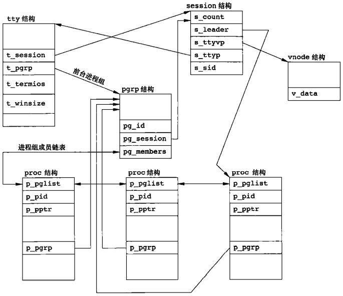

*会话和进程组的FreeBSD实现*

session结构：

- `s_count` 进程组数，当此计数器减至0时，可释放此结构；
- `s_leader` 指向会话首进程proc结构的指针；
- `s_ttyvp` 指向控制终端vnode结构的指针；
- `s_ttyp` 指向控制终端tty结构的指针；
- `s_sid` 会话ID。

tty结构：

- `t_session` 指向将此终端作为控制终端的session结构，终端在失去载波信号时使用此指针将挂起信号发送给会话首进程；
- `t_pgrp` 指向前台进程组的pgrp结构，终端驱动程序用此字段将信号（中断，退出和挂起）发送给前台进程组；
- `t_termios` 包含所有这些特殊字符和与该终端有关信息（波特率，回显开关）的结构；
- `t_winsize` 终端窗口当前大小。

pgrp结构：

- `pg_id` 进程组ID；
- `pg_session` 指向此进程组所属会话的session结构；
- `pg_members` 指向此进程组proc结构表的指针。

proc结构：

- `p_pid` 进程ID；
- `p_pptr` 指向父进程proc结构的指针；
- `p_pgrp` 指向本进程所属的进程组的pgrp结构的指针；
- `p_gplist` 包含指向进程组中上一个和下一个进程的指针。


## 9.12 小结

