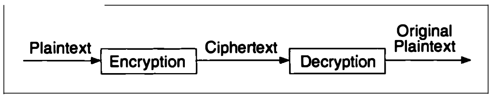
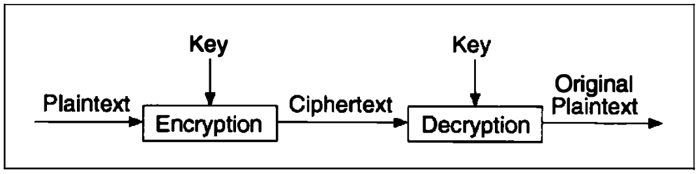
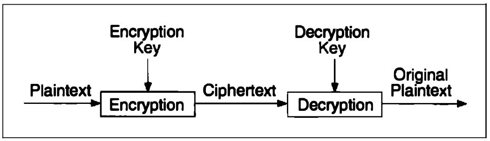

# Chapter 1 FOUNDATIONS

[TOC]

## TERMINOLOGY

A message is **plaintext** (sometimes called cleartext). The process of disguising a message in such a way as to hide its substance is **encryption**. An encrypted message is **ciphertext**. The process of turning ciphertext back into plaintext is **decryption**.

The art and science of keeping messages secure is **cryptography**, and it is practiced by **cryptographers**. **Cryptanalysts** are practitioners of **cryptanalysis**, the art and science of breaking ciphertext; that is, seeing through the disguise. The branch of mathematics encompassing both cryptography and cryptanalysis is **cryptology** and its practitioners are **cryptologists**.

*Encryption and Decryption*

Plaintext is denoted by $M$, Ciphertext is denoted by $C$. The encryption function $E$, operates on $M$ to produce $C$. Or, in mathematical notation:
$$
E(M) = C
$$
In the reverse process, the decryption function $D$ operates on $C$ to produce $M$:
$$
D(C) = M
$$
Since the whole point of encrypting and then decrypting a message is to recover the original plaintext, the following identity must hold true:
$$
D(E(M)) = M
$$

### Authentication, Integrity, and Nonrepudiation

- **Authentication**. It should be possible for the receiver of a message to ascertain its origin; an intruder should not be able to masquerade as someone else.
- **Integrity**. It should be possible for the receiver of a message to verify that it has not been modified in transit; an intruder should not be able to substitute a false message for a legitimate one.
- **Nonrepudiation**. A sender should not be able to falsely deny later that he sent a message.

### Algorithms and Keys

A **cryptographic algorithm**, also called a **cipher**, is the mathematical function used for encryption and decryption.

A **key** denoted by $K$, this key might be any one of a large number of values. The range of possible values of the key is called the **keyspace**. Both the encryption and decryption operations use this key, so the functions now become:
$$
E_{K}(M) = C\\
D_{K}(C) = M
$$
Those functions have the property that:
$$
E_{K}(E_{K}(M)) = M
$$
Some algorithms use a different encryption key and decryption key. That is, the encryption key $K_1$, is different from the correspondign decryption key $K_2$. In this case:
$$
E_{K_1}(M) = C \\
D_{K_2}(C) = M \\
D_{K_2}(E_{K_1}(M)) = M
$$
All of the security in these algorithms is based in the key (or keys); none is based in the details of the algorithm. This means that the algorithm can be published and analyzed. Products using the algorithm can be mass-produced. It doesn't matter if aneavesdropper knows your algorithm; if she doesn't know your particular key, she can't read your messges.

*Encryption and decryption with a key*

*Encryption and decryption with two different keys*

A **cryptosystem** is an algorithm, plus all possible plaintexts, ciphertexts, and keys.

### Symmetric Algorithms

**Symmetric algorithms**, sometimes called conventional algorithms, are algorithms where the encryption key can be calculated from the decryption key and vice versa.

Encryption and decryption with a symmetric algorithm are denoted by:
$$
E_{K}(M) = C \\
D_{K}(C) = M
$$
Symmetric algorithms can be divided into two categories. Some operate on the plaintext a single bit (or sometimes byte) at a time; these are called **stream algorithms** or **stream ciphers**. Others operate on the plaintext in groups of bits. The groups of bits are called **blocks**, and the algorithms are called **block algorithms** or **block ciphers**.

### Public-Key Algorithms

**Public-key algorithms** (also called asymmetric algorithms) are designed so that the key used for encryption is different from the key used fro decryption. 

In these systems, the encryption key is often called the **public key**, and the decryption key is often called the **private key**. The private key is sometimes also called the secret key, but to avoid confusing with symmetric algorithms, that tag won't be used here.

Encryption using public key $K$ is denoted by:
$$
E_K(M) = C
$$
Even though the public key and private key are different, decryption with the corresponding private key is denoted by:
$$
D_K(C) = M
$$
Sometimes, message will be encrypted with the private key and decrypted with the public key; this is used in digital signatures. Despite the possible confusion, these operations are denoted by, respectively:
$$
E_K(M) = C \\
D_K(C) = M
$$

### Cryptanalysis

There are four general types of cryptanalytic attacks. Of course, each of them assumes that the cryptanalyst has complete knowlege of the encryption algorithm used:

1. **Ciphertext-only attack**. The cryptanalyst has the ciphertext of several messages, all of which have been encrypted using the same encryption algorithm. The cryptanalyst's job is to recover the plaintext of as many messages as possible, or better yet to deduce the key (or keys) used to encrypt the messages, in order to decrypt other messages encrypted with the same keys:
   $$
   Given: C_1 = E_k(P_1), C_2 = E_k(P_2), ... C_i = E_k(P_i) \\
   Deduce:\text{ Either } P_1, P_2, ..., P_i; k;\text{ or an algorithm to infer } P_{i + 1} \text{ from } C_{i + 1} = E_k(P_{i + 1})
   $$

2. **Know-plaintext attac**. The cryptanalyst has access not only to the ciphertext of several messages, but also to the plaintext of those messags. His job is to deduce the key (or keys) used to encrypt the messages or an algorithm to decrypt any new messages encrypted with the same key (or keys):
   $$
   Given: P_1, C_1 = E_k(P_1), P_2, C_2 = E_k(P_2), ... P_i, C_i = E_k(P_i) \\
   Deduce:\text{ Either } k, \text{ or an algorithm to infer } P_{i + 1} \text{ from } C_{i + 1} = E_k(P_{i + 1})  
   $$

3. **Chosen-plaintxt attack**. The cryptanalyst not only has access to the ciphertext and associated plaintext for several messages, but he also chooses the plaintext that gets encrypted. This is more powerful than a known-plaintext attack, because the cryptanalyst can choose specific plaintext blocks to encrypt, ones that might yield more information about the key. His job is to deduce the key (or keys) used to encrypt the messages or an algorithm to decrypt any new messages encrypted with the same key(or keys):
   $$
   \text{Given: } P_1, C_1 = E_k(P_1), P_2, C_2 = E_k(P_2), ... P_i, C_i = E_k(P_i), \text{ where the cryptanalyst gets to choose } P_1, P_2, ... P_i \\
   \text{Deduce: Either } k, \text{or an algorithm to infer } P_{i + 1} \text{ from } C_{i + 1} = E_k(P_{i + 1})
   $$

4. **Adaptive-chosen-plaintext attack**. This is a special case of a chosen plaintext attack. Not only can the cryptanalyst choose the plaintext that is encrypted, but he can also modify his choice based on the results of previous encryption. In a chosen-plaintext attack, a cryptanalyst might just be able to choose one large block of plaintext to be encrypted; in an adaptive chosen-plaintext attack he can choose a smaller block of plaintext and then choose another based on the results of the first, and so forth.

5. **Chosen-ciphertext attack**. The cryptanalyst can choose different ciphertexts to be decrypted and has access to the decrypted plaintext. For example, the cryptanalyst has access to a tamperproof box that does automatic decryption. His job is to deduce the key:
   $$
   Given: C_1, P_1 = D_k(C_1), C_2, P_2 = D_k(C_2), ... C_i, P_i = D_k(C_i) \\
   Deduce: K
   $$
   This attack is primarily applicable to public-key algorithms. A chosen-ciphertext attack is sometimes effective against a symmetric algorithm as well. (Sometimes a chosen-plaintext attack and a chosen-ciphertext attack are together known as a **chosen-text attack**).

6. **Chosen-key attack**. This attack doesn't mean that the cryptanalyst can choose the key; it means that the has some knowledge about the relationship between different keys.

7. **Rubber-hose cryptanalysis**. The cryptanalyst threatens, blackmails, or tortures someone until they give him the key. Bribery is sometimes referred to as a **purchase-key attack**. These are all very powerful attacks and often the best way to break an algorithm.

### Security of Algorithms

Lars Knudsen classified these different categories of breaking an algorithm. In decreasing order of severity:

1. **Total break**. A cryptanalyst finds the key, $K$, such that $D_k(C) = P$.
2. **Global deduction**. A cryptanalyst finds an alternate algorithm, A, equivalent to $D_K(C)$, without knowing $K$.
3. **Instance (or local) deduction**. A cryptanalyst finds the plaintext of an intercepted ciphertex.
4. **Information deduction**. A cryptanalyst gains some information about the key or plaintext. This information could be a few bits of the key, some information about the form of the plaintext, and so forth.

An algorithm is **unconditinally secure** if, no matter how much ciphertex a cryptanalyst has, there is not enough information to recover the plaintext.

Simply by trying every possible key one by one and checking whether the resulting plaintext is meaningful. This is called a **brute-force** attack.

You can measure the complexity of an attack in different ways:

1. **Data complexity**. The amount of data needed as input to the attack.
2. **Processing complexity**. The time needed to perform the attack. This is often called the **work factor**.
3. **Storage requirement**. The amount of memory needed to do the attack.

## STEGANOGRAPHY

**Steganography** serves to hide secret messages in other messages, such that the secret's very existence is concealed.

## SUBSTITUTION CIPHERS AND TRANSPOSITION CIPHERS

### Substitution Ciphers

A **substitution cipher** is one in which each character in the plaintext is substituted for another character in the ciphertext. The receiver inverts the substitution on the ciphertext to recover the plaintext.

In classical cryptgraphy, there are four types of substitution ciphers:

- A **simple substitution cipher**, or **monoalphabetic cipher**, is one in which each character of the plaintext is replaced with a corresponding character of ciphertext. The cryptograms in newspapers are simple substitution ciphers.
- A **homophonic substitution cipher** is like a simple substitution cryptosystem, except a single character of plaintext can map to one of several characters of ciphertext.
- A **polygram substitution cipher** is one in which blocks of characters are encrypted in groups.
- A **polyalphabetic substitution cipher** is made up of multiple simple substitution ciphers.

### Transposition Ciphers

In a **transposition cipher** the plaintext remains the same, but the order of characters is shuffled around.

## XOR

XOR is exclusive-or operation: '^' in C or $\oplus$ in mathematical notation. It's a standard operation on bits:
$$
0 \oplus 0 = 0 \\
0 \oplus 1 = 1 \\
1 \oplus 0 = 1 \\
1 \oplus 1 = 0 \\
$$
, also note that:
$$
a \oplus a = 0 \\
a \oplus b \oplus b = a
$$
There is a symmetric algorithm: The plaintext is being XORed with a keyword to generate the ciphertext. Since XORing the same value twice restores the original, encryption and decryption use exactly the same program:
$$
P \oplus K = C \\
C \oplus K = P
$$
, above algorithm is no real security here. Assume the plaintext is English. Furthermore, assume the key length is any small number of bytes. Here's how to break it:

1. Discover the length of the key by a procedure known as **counting coincidences**. XOR the ciphertext against itself shifted various numbers of bytes, and count those bytes that are equal. If the displacement is a multiple of the key length, then something over 6 percent of the bytes will be equal. If it is not, then less than 0.4 percent will be equal (assuming a random key encrypting normal ASCII text; other plaintext will have different numbers). This is called the **index of coincidence**. The smallest displacement that indicates a multiple of the key length is the length of the key.
2. Shift the ciphertext by that length and XOR it with itself. This removes the key and leaves you with plaintext XORed with the plaintext shifted the length of the key. Since English has 1.3 bits of real information per byte, there is plenty of redundancy for determining a unique decryption.
