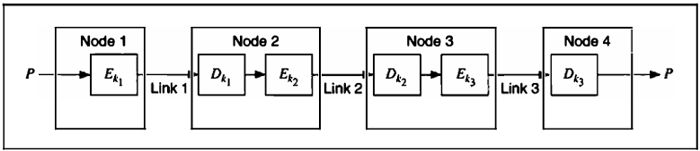
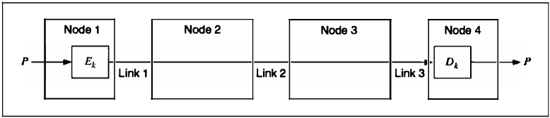
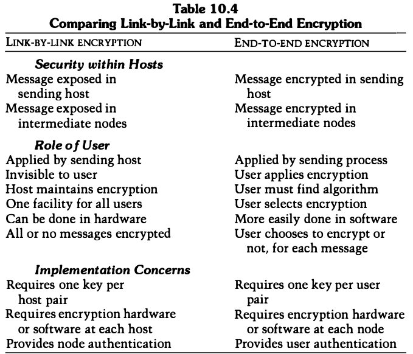
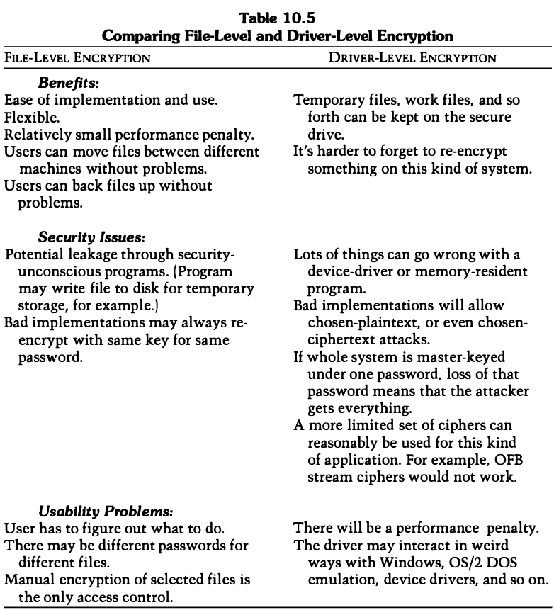
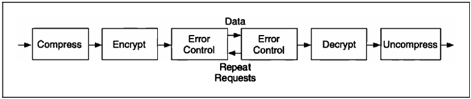

# 10 USING ALGORITHMS

[TOC]

## ENCRYPTING COMMUNICATIONS CHANNELS

In theory, this encryption can take place at any layer in the OSI(Open Systems Interconnect) communications model. In practice, it takes place either at the lowest layers (one and two) or at higher layers. If it takes place at the lowest layers, it is called **link-by-link encryption**; everything going through a particular data link is encrypted. If it takes place at higher layers, it is called **end-to-end encryption**; the data are encrypted selectively and stay encrypted until they are decrypted by the intended final recipient. Each approach has its own benefits and drawbacks.

### Link-by-Link Encryption

*Link encryption*

Link-by-Link Encryption: Advantages and Disadvantages:

- Advantages:
  1. Easier operation, since it can be made transparent to the user. That is, everything is encrypted before being sent over the link.
  2. Only one set of keys per link is required.
  3. Provides traffic-flow security, since any routing information is encrypted.
  4. Encryption is online.
- Disadvantages:
  1. Data is exposed in the intermediate nodes.

### End-to-End Encryption

*End-to-end encryption*

End-to-End Encryption: Advantages and Disadvantages:

- Advantages:
  1. Higher secrecy level.
- Disadvantages:
  1. Requires a more complex key-management system.
  2. Traffic analysis is possible, since routing information is not encrypted.
  3. Encryption is offline.

### Combining the Two

## ENCRYPTING DATA FOR STORAGE

### Dereferencing Keys

Encrypt each file with a separate key, and to encrypt the keys with another key known by the users. Each user only has to remember that one key. Different users can have different subsets of the file-encryption keys encrypted with their key. And there can even be a master key under which every file-encryption key is encrypted. This is even more secure because the file-encryption keys are random and less susceptible to a dictionary attack.

### Driver-Level vs File-Level Encryption

There are two ways to encrypt a hard drive:

- Encryption at the file level means that every file is encrypted separately. To use a file that's been encrypted, you must first decrypt the file, then use it, and then reencrypt it.
- Driver-level encryption maintains a logical drive on the user's machine that has all data on it encrypted.

## COMPRESSION, ENCODING, AND ENCRYPTION

Using a data compression algorithm together with an encryption algorithm makes sense for two reasons:

- Cryptanalysis relies on exploiting redundancies in the plaintext; compressing a file before encryption reduces these redundancies.
- Encryption is time-consuming; compressing a file before encryption speeds up the entire process.

*Encryption with compression and error control*