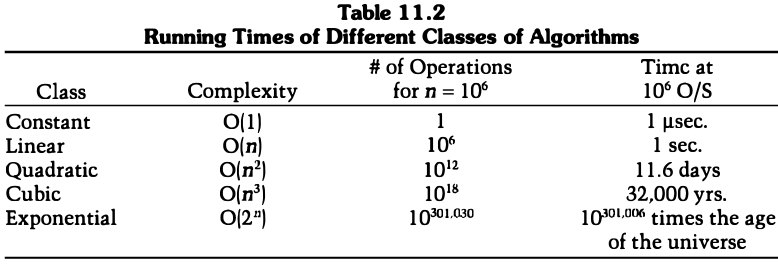

# CHAPTER 11 Mathematical Background

[TOC]

## INFORMATION THEORY

### Entropy and Uncertainty

Information theory defines the **amount of information** in a message as the minimum number of bits needed to encode all possible meanings of that message, assuming all messages are equally likely.

Formally, the amount of information in a message $M$ is measured by the **entropy** of a message, denoted by $H(M)$. In general, the entropy of a message measured in bits is $\log_2{n}$, in which $n$ is the number of possible meanings. This assumes that each meaning is equally likely.

The entropy of a message also measures its **uncertainty**. This is the number of plaintext bits needed to be recovered when the message is scrambled in ciphertext in order to learn the plaintext.

### Rate of a Language

For a given language, the **rate of the language** is:
$$
r = H(M)/N
$$

- $N$ is the length of the message.

The **absolute rate** of a language is the maximum number of bits that can be coded in each character, assuming each character sequence is equally likely. If there are $L$ characters in a language, the absolute rate is:
$$
R = \log_2{L}
$$
, this is the maximum entropy of the individual characters.

### Security of a Cryptosystem

Perfect secrecy aside, the ciphertext unavoidably yields some information about the corresponding plaintext. A good cryptographic algorithm keeps this information to a minimum; a good cryptanalyst exploits this information to reduce the plaintext.

Cryptanalysts use the natural redundancy of language to reduce the number of possible plaintexts. The more redundant the language, the easier it is to cryptanalyze. This is the reason that many real-world cryptographic implementations use a compression program to reduce the size of the text before encrypting it. Compression reduces the redundancy of a message as well as the work required to encrypt and decrypt.

The entropy of a cryptosystem is a measure of the size of the keyspace, $K$. It is approximated by the base two logarithm of the number of keys:
$$
H(K) = \log_2{K}
$$
A cryptosystem with a 64-bit key has an entropy of 64 bits; a cryptosystem with a 56-bit key has an entropy of 56 bits. In general, the greater the entropy, the harder it is to break a cryptosystem.

### Unicity Distance

For a message of length $n$, the number of different keys that will decipher a ciphertext message to some intelligible plaintext in the same language as the original plaintext (such as an English text string) is given by the following formula:
$$
2^{H(K) - nD} - 1
$$
For most symmetric cryptosystems, the unicity distance is defined as the entropy of the cryptosystem divided by the redundancy of the language:
$$
U = H(K)/D
$$
Unicity distance does not make deterministic predictions, but gives probabilistic results. Unicity distance estimates the minimum amount of ciphertext for which it is likely that there is only a single intelligible plaintext decryption when a brute-force attack is attempted. Generally, the longer the unicity distance, the better the cryptosystem.

Shannon defined a cryptosystem whose unicity distance is infinite as one that has **ideal secrecy**. Note that an ideal cryptosystem is not necessarily a perfect cryptosystem, although a perfect cryptosystem would necessarily be an ideal cryptosystem. If a cryptosystem has ideal secrecy, even successful cryptanalysis will leave some uncertainty about whether the recovered plaintext is the real plaintext.

### Confusion and Diffusion

**Confusion** obscures the relationship between the plaintext and the ciphertext. This frustrates attempts to study the ciphertext looking for redundancies and statistical patterns.

**Diffusion** dissipates the redundancy of the plaintext by spreading it out over the ciphertext. A cryptanalyst looking for those redundancies will have a harder time finding them.

## COMPLEXITY THEORY

Complexity theory provides a methodology for analyzing the **computational complexity** of different cryptographic techniques and algorithms.

### Complexity of Algorithms

An algorithm's complexity is determined by the computational power needed to execute it. The computational complexity of an algorithm is often measured by two variables: $T$(for **time complexity**) and $S$(for **space complexity**, or memory requirement). Both $T$ and $S$ are commonly expressed as functions of $n$, where $n$ is the size of the input. (There are other measures of complexity: the number of random bits, the communications bandwidth, the amount of data, and so on).

Generally, the computational complexity of an algorithm is expressed in what is called "big O" notation: the order of magnitude of the computational complexity. It's just the term of the complexity function which grows the fastest as $n$ gets larger; all lower-order terms are ignored.

Generally, algorithms are classified according to their time or space complexities. An algorithm is **constant** if its complexity is independent of $n: O(1)$. An algorithm is **linear**, if its time complexity is $O(n)$. Algorithms can also be **quadratic, cubic**, and so on. All these algorithms are **polynomial**; their complexity is $O(n^m)$, where $m$ is a constant. The class of algorithms that have a polynomial time complexity are called **polynomial-time** algorithms.

Algorithms whose complexities are $O(t^{f(n)})$, where $t$ is a constant greater than 1 and $f(n)$ is some polynomial function of $n$, are called **exponential**. The subset of exponential algorithms whose complexities are $O(c^{f(n)})$, where $c$ is a constant and $f(n)$ is more than constant but less than linear, is called **superpolynomial**.

### Complexity of Problems

Problems that can be solved with polynomial-time algorithms are called **tractable**, because they can usually be solved in a reasonable amount of time for reasonably sized inputs. (The exact definition of "reasonable" depends on the circumstance.) Problems that cannot be solved in polynomial time are called **intractable**, because calculating their solution quickly becomes infeasible. Intractble problems are sometimes just called **hard**. Problems that can only be solved with algorithms that are superpolynomial are computationally intractable, even for relatively small values of $n$.

## NUMBER THEORY

### Modular Arithmetic

Basically, $a \equiv b (\mod n)$ if $a = b + kn$ for some integer $k$. If $a$ is non-negative and $b$ is between $0$ and $n$, you can think of $b$ as the remainder of $a$ when divided by $n$. Sometimes, $b$ is called the **residue** of $a$, modulo $n$. Sometimes $a$ is called **congruent** to $b$, modulo $n$ (the triple equals sign, $\equiv$, denotes congruence). These are just different ways of saying the same thing.

The set of integers from $0$ to $n - 1$ form what is called a **complete set of residues** modulo $n$. This means that, for every integer $a$, its residue modulo $n$ is some number from $0$ to $n - 1$.

The operation $a \mod n$ denotes the residue of $a$, such that the residue is some integer from $0$ to $n - 1$. This operation is **modular reduction**.

### Prime Numbers

A **prime** number is an integer greater than 1 whose only factors are 1 and itself: No other number evenly divides it.

### Greatest Common Divisor

Two numbers are **relatively prime** when they share no factors in common other than 1. In other words, if the **greatest common divisor** of $a$ and $n$ is equal to 1. This is written:
$$
\gcd(a, n) = 1
$$

### Inverses Modulo a Number

The Inverses Modulo a Number problem is finding an $x$ such that:
$$
a = (a * x) \mod n
$$
, this is also written as:
$$
a^{-1} \equiv x(\mod n)
$$

### Solving for Coefficients

Euclid's algorithm can be used to solve this class of problems: Given an array of $m$ variables $x_1$, $x_2$, ..., $x_m$. find an array of $m$ coefficients, $u_1$, $u_2$, ..., $u_m$, such that:
$$
u_1 * x_1 + ... + u_m * x_m = 1
$$

### Fermat's Little Theorem

If $m$ is a prime, and $a$ is not a multiple of $m$, then **Fermat's little theorem** says:
$$
a^{m - 1} =equiv 1 (\mod m)
$$

### The Euler Totient Function

The **Euler totient function**, also called the Euler phi function and written as $\phi (n)$, is the number of elements in the reduced set of residues modulo $n$. In other words, $\phi(n)$ is the number of positive integers less than $n$ that are relatively prime to $n$ (for any $n$ greater than 1).

If $n$ is prime, then $\phi(n) = n - 1$. If $n = pq$, where $p$ and $q$ are prime, then $\phi(n) = (p - 1)(q - 1)$. These numbers appear in some public-key algorithms; this is why.

According to **Euler's generalization of Fermat's little theorem**, if $\gcd(a, n) = 1$, then:
$$
a^{\phi(n)} \mod n = 1
$$
Now it is easy to compute $a^{-1} \mod n$:
$$
x = a^{\phi(n) - 1} \mod n
$$
Both methods for calculating inverses can be extended to solve for $x$ in the general problem (if $\gcd(a, n) = 1$):
$$
(a * x) \mod n = b
$$
Using Euler's generalization, solve:
$$
x = (b * a^{\phi(n) - 1}) \mod n
$$
Using Euclid's algorithm, solve:
$$
x = (b * (a^{-1} \mod n)) \mod n
$$
In general, Euclid's algorithm is faster than Euler's generalization for calculating inverses, especially for numbers in the 500-bit range. If $\gcd(a, n) \neq 1$, all is not lost. In this general case, $(a * x) \mod n = b$, can have multiple solutions or no solution.

### Chinese Remainder Theorem

In general, if the prime factorization of $n$ is $p_1 * p_2 * ... * p_t$, then the system of equations:
$$
(x \mod p_i) = a_i,\text{ where } i = 1, 2, ..., t
$$
has a unique solution, $x$, where $x$ is less than $n$​. In other words, a number (less than the product of some primes) is uniquely identified by its residues mod those primes.

So, for an arbitrary $a < p$ and $b < q$ (where $p$ and $q$ are prime), there exists a unique $x$, where $x$ is less than $pq$, such that:
$$
x \equiv a(\mod p), \text{ and } x \equiv b(\mod q)
$$
To find this $x$, first use Euclid's algorithm to find $u$, such that:
$$
u * q \equiv 1(\mod p)
$$
Then compute:
$$
x = (((a - b) * u)\mod p) * q + b
$$
The converse of the Chinese remainder theorem can also be used to find the solution to the problem: if $p$ and $q$ are primes, and $p$ is less than $q$, then there exists a unique $x$ less than $pq$, such that:
$$
a \equiv x(\mod p), \text{ and } b \equiv x(\mod q)
$$
If $a \geq b \mod p$, then:
$$
x = (((a - (b \mod p)) * u) \mod p) * q + b
$$
If $a < b \mod p$, then:
$$
x = (((a + p - (b \mod p)) * u) \mod p) * q + b
$$

### Quadratic Residues

If $p$ is prime, and $a$ is greater than 0 and less than $p$, then $a$ is a **quadratic residue** $\mod p$ if:
$$
x^2 \equiv a(\mod p), \text{ for some } x
$$
Not all values of $a$ satisfy this property. For $a$ to be a quadratic residue modulo $n$, it must be a quadratic residue modulo all the prime factors of $n$.

### Legendre Symbol

The **Lengendre symbol**, written $L(a, p)$, is defined when $a$ ia any integer and $p$ is a prime greater than 2. It is equal to 0, 1, or -1:
$$
L(a, p) = 0 \text{ if } a \text{ is divisible by } p. \\
L(a, p) = 1 \text{ if } a \text{ is a quadratic residue mod } p. \\
L(a, p) = -1 \text{ if } a \text{ is a quadratic nonresidue mod } p.
$$
One way to calculate $L(a, p)$ is:
$$
L(a, p) = a^{(p - 1)/2} \mod p
$$
or you can use the following algorithm:

1. If $a = 1$, then $L(a, p) = 1$.
2. If $a$ is even, then $L(a, p) = L(a/2, p) * (-1)^{(p^2 - 1) / 8}$.
3. If $a$ is odd (and $\neq 1$), then $L(a, p) = L(p \mod a, a) * (-1)^{(a - 1) \times (p - 1) / 4}$

Note that this is also an efficient way to determine whether $a$ is a quadratic residue $\mod p$ (when $p$ is prime).

### Jacobi Symbol

The **Jacobi symbol**, written $J(a, n)$, is a generalization of the Legendre symbol to composite moduli; it is defined for any integer $a$ and any odd integer $n$. The function shows up in primality testing. 

### Blum Integers

If $p$ and $q$ are two primes, and both are congruent to 3 modulo 3, then $n = pq$ is sometimes called a **Blum integer**. If $n$ is a Blum integer, each quadratic residue has exactly four square roots, one of which is also a square; this is the principal square root.

### Generators

If $p$ is a prime, and $g$ is less than $p$, then $g$ is a **generator** mod $p$ if:
$$
\text{for each } b \text{ from } 1 \text{ to } p - 1, \text{ there exists some } a \text{ where } g^a \equiv b(\mod p).
$$
Another way of saying this is that $g$ is **primitive** with respect to $p$.

### Computing in a Galois Field

In a Galois field, addition, subtraction, multiplication, and division by nonzero elements are all well-defined. There ia an additive identity, 0, and a multiplicative identity, 1. Every nonzero number has a unique inverse (this would not be true if $p$ were not prime). The commutative, associative, and distributive laws are true.

## FACTORING

Currently, the best factoring algorithm is:

- Number field sieve (NFS)

Other factoring algorithms have been supplanted by the NFS:

- Quadratic sieve (QS).
- Elliptic curve method (ECM).
- Pollard's Monte Carlo algorithm.
- Continued fraction algorithm.
- Trial division.

### Square Roots Modulo n

If $n$ is the product of two primes, then the ability to calculate square roots mod $n$ is computationally equivalent to the ability to factor $n$. In other words, someone who knows the prime factors of $n$ can easily compute the square roots of a number mod $n$, but for everyone else the computation has been proven to be as hard as computing the prime factors of $n$.

## PRIME NUMBER GENERATION

### Solovay-Strassen

Robert Solovay and Volker Strassen developed a probabilistic primality testing algorithm. Their algorithm uses the Jacobi symbol to test if $p$ is prime:

1. Choose a random number, $a$, less than $p$.
2. If the $gcd(a, p) \neq 1$, then $p$ fails the test and is composite.
3. Calculate $j = a^{(p - 1) / 2} \mod p$.
4. Calculate the Jacobi symbol $J(a, p)$.
5. If $j \neq J(a, p)$, then $p$ is definitely not prime.
6. If $j = J(a, p)$, then the likelihood that $p$ is not prime is not more than 50 percent.

A number $a$ that does not indicate that $p$ is definitely not prime is called a **witness**. If $p$ is composite, the odds of a random $a$ being a witness is not less than 50 percent. Repeat this test $t$ times, with $t$ different random values for $a$. The odds of a composite number passing all $t$ tests is no more than one in $2^t$.

### Lehmann

Another, simpler, test was developed independently by Lehmann. Here it tests if $p$ is prime:

1. Choose a random number $a$ less than $p$.
2. Calculate $a^{p - 1}/2 \mod p$.
3. If $a^{(p - 1)/2} \not\equiv 1$ or $-1 (\mod p)$​, then $p$ is definitely not prime.
4. If $a^(p - 1)/2 \equiv 1$ or $-1(\mod p)$, then the likelihood that $p$ is not prime is no more than 50 percent.

Again, the odds of a random $a$ being a witness to $p$'s compositeness is no less than 50 percent. Repeat this test $t$ times. If the calculation equals 1 or -1, but does not always equal 1, then $p$ is probably prime with an error rate of 1 in $2^t$.

### Rabin-Miller

Choose a random number, $p$, to test. Calculate $b$, where $b$ is the number of times 2 divides $p - 1$ (i.e., $2^b$ is the largest power of 2 that divides $p - 1$). Then calculate $m$, such that $p = 1 + 2^b * m$​.

1. Choose a random number, $a$, such that $a$ is less than $p$.
2. Set $j = 0$ and set $z = a^m \mod p$.
3. If $z = 1$, or if $z = p - 1$, then $p$ passes the test and may be prime.
4. If $j > 0$ and $z = 1$, then $p$ is not prime.
5. Set $j = j + 1$. If $j < b$ and $z \neq p - 1$, set $z = z^2 \mod p$ and go back to step 4. If $z = p - 1$, then $p$ passes the test and may be prime.
6. If $j = b$ and $z \neq p - 1$, then $p$ is not prime.

### Practical Considerations

In real-world implementations, prime generation goes quickly:

1. Generate a random $n$-bit number, $p$.
2. Set the high-order and low-order bit to 1. (The high-order bit ensures that the prime is of the required length and the low-order bit ensures that it is odd.)
3. Check to make sure $p$ is not divisible by any small primes: 3, 5, 7, 11, and so on. Many implementations test $p$ for divisibility by all primes less than 256. The most efficient is to test for divisibility by all primes less than 2000. You can do this efficiently using a wheel.
4. Perform the Rabin-Miller test for some random $a$. If $p$ passes, generate another random $a$ and go through the test again. Choose a small value of $a$ to make the calculations go quicker. Do five tests. (One might seem like enough, but do five.) If $p$ fails one of the tests, generate another $p$ and try again.

(Another option is not to generate a random $p$ each time, but to incrementally search through numbers starting at a random point until you find a prime.)

### Strong Primes

If $n$ is the product of two primes, $p$ and $q$, it may be desirable to use **strong primes** for $p$ and $q$. These are prime numbers with certain properties that make the product $n$ difficult to factor by specific factoring methods. Among the properties suggested have been:
$$
\text{The greatest common divisor of } p - 1 \text{ and } q - 1 \text{ should be small.} \\
\text{Both } p - 1 \text{ and } q - 1 \text{ should have large prime factors, respectively } p' and q'. \\
\text{Both } p' - 1 \text{ and } q' - 1 \text{ should have large prime factors.} \\
\text{Both } p + 1 \text{ and } q + 1 \text{ should have large prime factors.} \\
\text{Both } (p - 1)/2 \text{ and } (q - 1)/2 \text{ should be prime. (Note that if this condition is true, then so are the first two.)}
$$

### DISCRETE LOGARITHMS IN A FINITE FIELD

Modular exponentiation is another one-way function used frequently in cryptography. Evaluating this expression is easy:
$$
a^x \mod n
$$
The inverse problem of modular exponentiation is that of finding the discrete logarithm of a number. This is a hard problem:
$$
\text{Find} x \text{ where } a^x \equiv b(\mod n).
$$

### Calculating Discrete Logarithms in a Finite Group

There are three main groups whose discrete logarithms are of interest to cryptographers:

- The multiplicative group of prime fields: $GF(p)$.
- The multiplicative group of finite fields of characteristic 2: $GF(2^n)$.
- Elliptic curve groups over finite fiels F: $EC(F)$.