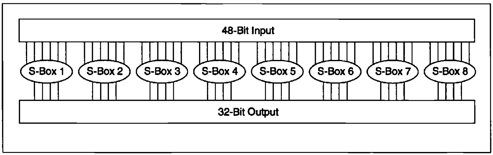
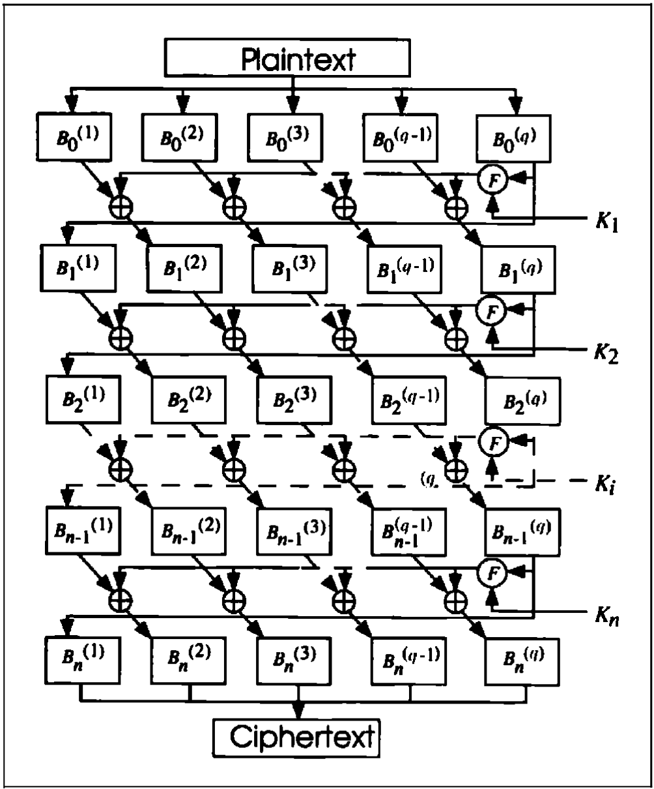

# 12 Data Encryption Standard (DES)

[TOC]

## DES

DES is a block cipher; it encrypts data in 64-bit blocks. A 64-bit block of plaintext goes in one end of the algorithm and a 64-bit block of ciphertext comes out the other end. DES is a symmetric algorithm: The same algorithm and key are used for both encryption and decryption (except for minor differences in the key schedule).

The key length is 56 bits. (The key is usually expressed as a 64-bit number, but every eighth bit is used for parity checking and is ignored. These parity bits are the least-significant bits of the key bytes.) The key can be any 56-bit number and can be changed at any time. A handful of numbers are considered weak keys, but they can easily be avoided. All security rests within the key.

*DES Example*

*One round of DES*

If $B_i$ is the result of the $i$th iteration, $L_i$ and $R_i$ are the left and right halves of $B_i$, $K_i$ is the 48-bit key for round $i$, and $f$ is the function that does all the substituting and permuting and XORing with the key, then a round looks like:
$$
L_i = R_{i - 1} \\
R_i = L_{i - 1} \oplus f(R_{i - 1}, K_i)
$$

### The Initial Permutation

The initial permutation occurs before round 1; its primary purpose is to make it easier to load plaintext and ciphertext data into a DES chip in byte-sized pieces.

The initial permutation and the corresponding final permutation do not affect DES's security.

### The Key Transformation

After the 56-bit key is extracted, a different 48-bit **subkey** is generated for each of the 16 rounds of DES. These subkeys, $K_i$, are determined in the following manner:

1. First, the 56-bit key is divided into two 28-bit halves. Then, the halves are circularly shifted by either one or two bits, depending on the round.
2. After being shifted, 48 out of the 56 bits are selected(because this operation permutes the order of the bits as well as selects a subset of bits, it is called a **compression permutation**).

### The Expansion Permutation

This operation expands the right half of the data, $R_i$ from 32 bits to 48 bits. Because this operation changes the order of the bits as well as repeating certain bits, it is known as an **expansion permutation**. By allowing one bit to affect two substicalled an **avalanche effect**. DES is designed to reach the conditon of having every bit of the ciphertext depend on every bit of the plaintext and every bit of the key as quickly as possible.

*Expansion permutation*

### The S-Box Substitution

After the compressed key is XORed with the expanded block, the 48-bit result moves to a substitution operation. The substitutions are performed by eight **substitution boxes**, or **S-boxes**. Each S-box has a 6-bit input and a 4-bit output, and there are eight different S-boxes. (The total memory requirement for the eight DES S-boxes is 256 bytes.) The 48 bits are divided into eight 6-bit sub-blocks. Each separate block is operated on by a separate S-box: The first block is operated on by S-box 1, the second block is operated on by S-box 2, and so on.

*S-box substitution*

The S-bo substitution is the critical step in DES. The algorithm's other operations are linear and easy to analyze. The S-boxes are nonlinear and, more than anything else, give DES its security.

### The P-Box Permutation

The 32-bit output of the S-box substitution is permuted according to a **P-box**. This permutation maps each input bit to an output position; no bits are used twice and no bits are ignored. This is called a **straight permutation** or just a permutation.

### The Final Permutation

The final permutation is the inverse of the initial permutation.

### Decrypting DES

The same algorithm works for both encryption and decryption. With DES it is possible to use the same function to encrypt or decrypt a block. The only difference is that the keys must be used in the reverse order.

## SECURITY OF DES

### Weak Keys

Because of the way the initial key is modified to get a subkey for each round of the algorithm, certain initial keys are **weak keys**.

Some pairs of keys encrypt paintext to the identical ciphertext. In other words, one key in the pair can decryt messages encrypted with the other key in the pair. This is due to the way in which DES generates subkeys; instead of generating 16 different subkeys, these keys generate only two different subkeys. Each of these subkeys is used eight times in the algorithm. These keys are called **semiweak keys**.

### Complement Keys

Take the bit-wise complement of a key; that is, replace all the 0s with 1s and the 1s with 0s. Now, if the original key encrypts a block of plaintext, then the complement of the key will encrypt the complement of the plain text block into the complement of the ciphertext block.

If $x'$ is the complement of $x$, then the identity is as follows:
$$
E_{K}(P) = C \\
E_{K}'(P') = C'
$$
, This isn't anything mysterious. The subkeys are XORed with the right half after the expansion permutation in every round. This **complementation property** is a direct result of that fact.

### Algebraic Structure

If DES were **closed **, then for any $K_1$ and $K_2$ there would always be a $K_3$ such that:
$$
E_{K_2}(E_{K_1}(P)) = E_{K_3}(P)
$$
, In other words, the DES encryption operation would form a group, and encrypting a set of plaintext blocks with $K_1$ followed by $K_2$ would be identical to encrypting the blocks with $K_3$. Even worse, DES would be vulnerable to a meet-in-the-middle known-plaintext attack that runs in only $2^{28}$ steps.

If DES were **pure**, then for any $K_1$, $K_2$, and $K_3$ there would always be a $K_4$ such that:
$$
E_{K_3}(E_{k_2}(E_{K_1}(P))) = E_{k_4}(P)
$$
, Triple encryption would be useless. (Note that a closed cipher is necessarily pure, but a pure cipher is not necessarily closed.)

## DIFFERENTIAL AND LINEAR CRYPTANALYSIS

Differential cryptanalysis looks specifically at **ciphertext pairs**: pairs of ciphertexts whose plaintexts have particular differences. It analyzes the evolution of these differences as the plaintexts propagate through the rounds of DES when they are encrypted with the same key.

*DES round function*

The basic differential attack on $n$-round DES will recover the 48-bit subkey used in round $n$, and the remaining 8 key bits are obtained by brute-force guessing.

### Related-Key Cryptanalysis

**Related-key cryptanalysis** is similar to differential cryptanalysis, but it examines the difference between keys. The attack is different from any previously discussed: The cryptanalyst chooses a relationship between a pair of keys, but does not known the keys themselves. Data is encrypted with both keys. In the known plaintext version, the cryptanalyst knows the plaintext and ciphertext of data encrypted with the two keys. In the chosen-plaintext version, the cryptanalyst gets to choose the plaintext encrypted with the two keys.

*A 1-round linear approximation for DES*

*A 3-round linear approximation for DES*

## THE REAL DESIGN CRITERIA

After differential cryptanalysis became public, IBM published the design criteria for the S-boxes and the P-box. The criteria for the S-boxes are:

- Each S-box has 6 input bits and 4 output bits.
- No output bit of an S-box should be too close to a linear function of the input bits.
- If you fix the left-most and right-most bits of an S-box and vary the 4 middle bits, each possible 4-bit output is a attained exactly once.
- If two inputs to an S-box differ in exactly 1 bit, the outputs must differ in at least 2 bits.
- If two inputs to an S-box differ in the 2 middle bits exactly, the outputs must differ in at least 2 bits.
- If two inputs to an S-box differ in their first 2 bits and are identical in their last 2 bits, the two outputs must not be the same.
- For any nonzero 6-bit difference between inputs, no more than 8 of the 32 pairs of inputs exhibiting that difference may result in the same output difference.
- A criterion similar to the previous one, but for the case of three active S-boxes.

The criteria for the P-box are:

- The 4 output bits from each S-box in round $i$ are distributed so that 2 of them affect the middle-bits of S-boxes at round $i + 1$ and the other 2 affect end bits.
- The 4 output bits from each S-box affect six different S-boxes; no 2 affect the same S-box.
- If the output bit from one S-box affects a middle bit of another S-box, then an output bit from that other S-box cannot affect a middle bit of the first S-box.

## DES VARIANTS

### Multiple DES

*Triple-DES*

### DES with Independent Subkeys

Another variation is to use a different subkey for each round, instead of generating them from a single 56-bit key. Since 48 key bits are used in each of 16 rounds, this means that the key length for this variant is 768 bits. This variant would drastically increase the difficulty of a brute-force attack against the algorithm; that attack would have a complexity of $2^{768}$.

### DESX

DESX is a DES variant from RSA Data Security, Inc.

### CRYPT(3)

CRYPT(3) is a DES variant found on UNIX systems. It is primarily used as a one way function for passwords, but sometimes can also be used for encryption.

### Generalized DES

*GDES*

### DES with Alternate S-Boxes

### RDES

RDES is a variant that replaces swapping the left and right halves at the end of each round with a key-dependent swap. The swappings are fixed, depending solely on the key. This means that the 15 key-dependent swaps occur with $2^{15}$ possible instances, and that the variant is not resistant to differential cryptanalysis.

### $s^n$DES

### DES with Key-Dependent S-Boxes

Linear and differential cryptanalysis work only if the analyst knows the composition of the the S-boxes. If the S-boxes are key-dependent and chosen by a cryptographically strong method, then linear and differential cryptanalysis are much more difficult. Remember though, that randomly generated S-boxes have very poor differential and linear characteristics; even if they are secrt.

Here is a method to use 48 additional key bits to generate S-boxes that are resistant to both linear and differential cryptanalysis:

1. Rearrange the DES S-boxes: 24673158.
2. Select 16 of the remaining key bits. If the first bit is 1, swap the first two rows of S-box 1 with the last two rows of S-box 1. If the second bit is a 1, swap the first eight columns of S-box 1 with the second eight columns of S-box 1. Do the same to S-box 2 with the third and fourth key bits. Do the same with S-boxes 3 through 8.
3. Take the remaining 32 key bits. XOR the first four with every entry of S-box 1, the second four with every entry of S-box 2, and so on.

The complexity of a differential cryptanalysis attack against this system is $2^{51}$; the complexity of a linear cryptanalysis attack is $2^{53}$. The complexity of exhaustive serch is $2^{102}$.

