# 13 Other Block Ciphers

[TOC]

## MADRYGA

### Description of Madryga

Madryga consists of two nested cycles. The outer cycle repeats eight times (although this could be increased if security warrants) and consists of an application of the inner cycle to the plaintext. The inner cycle transforms plaintext to ciphertext and repeats once for each 8-bit block (byte) of the plaintext. Thus, the algorithm passes through the entire plaintext eight successive times.

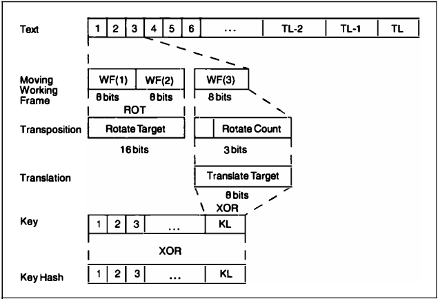

*One iteration of Madryga*

## NewDES

The plaintext block is diided into eight 1-byte sub-blocks: $B_0$, $B-1$, ..., $B_6$, $B_7$. Then the sub-blocks go through 17 rounds. Each round has eight steps. In each step, one of the sub-blocks is XORed with some key material (there is one exception), substituted with another byte via an $f$ function, and then XORed with another subblock to become that sub-block. The 120-bit key is divided into 15 key sub-blocks: $K_0$, $K_1$, ..., $K_{13}$, $K_{14}$.

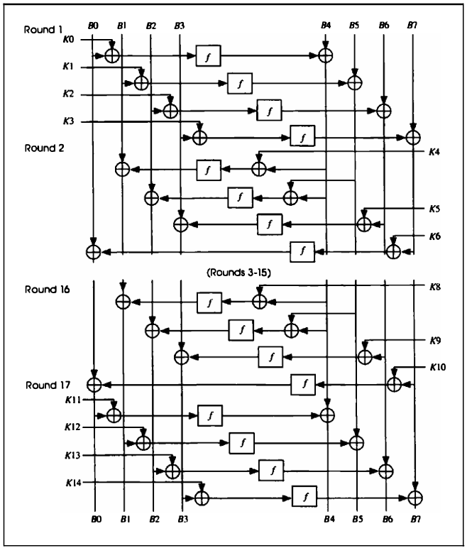

## FEAL

The encryption process starts with a 64-bit block of plaintext. First, the data block is XORed with 64 key bits. The data block is then split into a left half and a right half. The left half is XORed with the right half to form a new right half. The left and new right halves go through $n$ rounds (four, initially). In each round the right half is combined with 16 bits of key material (using function f) and XORed with the left half to form the new right half. The original right half (before the round) forms the new left half. After $n$ rounds (remember not to swithc the left and right halves after the $n$th round) the left half is again XORed with the right half to form a new right half, and then the left half is again XORed with the right half to form a new right half, and then the left and right halves are concatenated together to form a 64-bit whole. The data block is XORed with another 64 bits of key material, and the algorithm terminates.

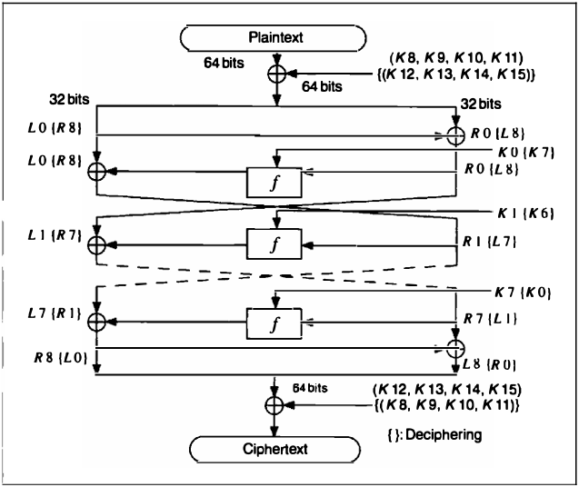

*One round of FEAL*

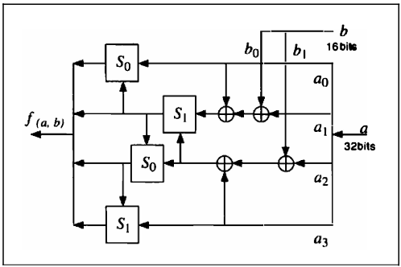

*Function f*

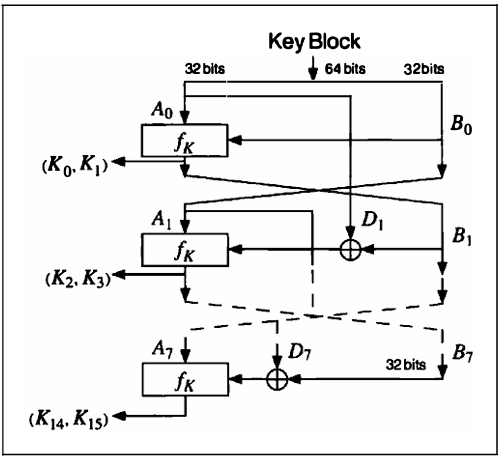

*Key processing part of FEAL*

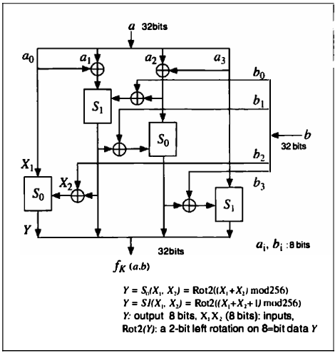

*Function $f_k$*

### Cryptanalysis of FEAL

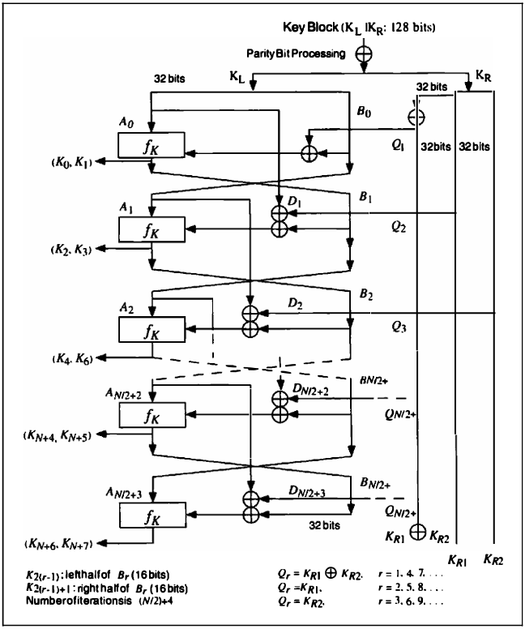

*FEAL-NX key schedule*

## REDOC

### REDOC III

The algorithm consists solely of XORing key bytes with message bytes; there are no permutations or substitutions:

1. Create a key table of 256 10-byte keys, using the secret key.
2. Create two 10-byte mask blocks, $M_1$ and $M_2$. $M_1$ is the XOR of the first 128 10-byte keys; $M_2$ is the XOR of the second 128 10-byte keys.
3. To encrypt a 10-byte block:
   - XOR the first byte of the data block with the first byte of $M_1$. Select a key from the key table computed in Step1. Use the computed XOR as the index into the table. XOR each byte in the data block with the corresponding byte in the chosen key, except for the first data byte.
   - XOR the second byte of the data block with the second byte of $M_1$. Select a key from the key table computed in Step1. Use the computed XOR as the index into the table. XOR each byte in the data block with the corresponding byte in the chosen key, except for the second data byte.
   - Continue with the entire block (bytes 3 through 10), until each byte has been used to select a key from the key table after XORing it with the corresponding $M_1$ value. Then XOR each byte with the key except for the byte used to select the key.
   - Repeat steps (a) through (c) with $M_2$.

## LOKI

### Description of LOKI91

The mechanics of LOKI91 are similar to DES (see below figure). The data block is then divided into a left half and a right half and goes through 16 rounds, much like DES. In each round, the right half is first XORed with a piece of the key, then sent through an expansion permutation (see talble 13.1).

The 48-bit output is divided into four 12-bit blocks, and each block is sent through an S-box substitution. The S-box substitution is as follows: Take each 12-bit input; use the 2 left-most bits and the 2 right-most bits to form the number $r$, and the 8 innermost bits and form the number $c$. The output of the S-box, O, is as follows:
$$
O(r, c) = (c + (c \times 17) \oplus 0xff \ \& \ 0xff)^{31} \mod Pr
$$
$P_r$ is given in Table 13.2.

Then, the four 8-bit outputs are recombined to form a single 32-bit number and sent through the permutation described in Table 13.3. Finally, the right half is XORed with the left half to become the new left half, and the left becomes the new right half. After 16 rounds, the block is again XORed with the key to produce the ciphertext.

The subkeys are generated from the key in straightforward manner. The 64-bit key is split into a left half and a right half. In each round, the subkey is the left half. This left half is then rotated 12 or 13 bits to the left, and then every two rounds the left and right halves are exchanged. As with DES, the same algorithm can be used for both encryption and decryption, with some modification in how the subkeys are used.

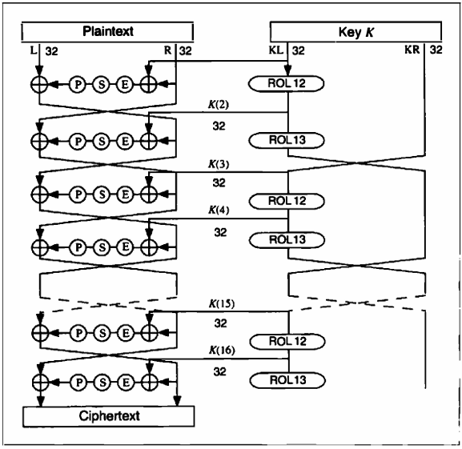

*LOKI91*

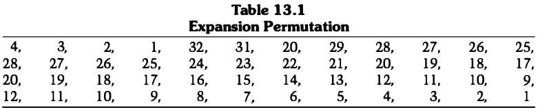

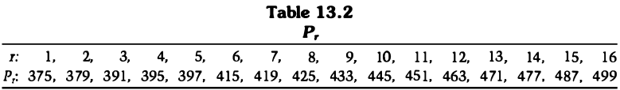

## IDEA

### Description of IDEA

The 64-bit data block is divided into four 16bits sub-blocks: $X_1$, $X_2$, $X_3$ and $X_4$. These four sub-blocks become the input to the first round of the algorithm. There are eight rounds total. In each round the four subblocks are XORed, added, and multiplied with one another and with six 16-bit subkeys. Between rounds, the secod and third sub-blocks are swapped. Finally, the four sub-blocks are combined with four subkeys in an output transformation.

In each round, the sequence of events is as follows:

1. Multiply $X_1$ and the first subkey.
2. Add $X_2$ and the second subkey.
3. Add $X_3$ and the third subkey.
4. Multiply $X_4$ and the fourth subkey.
5. XOR the results of Steps 1 and 3.
6. XOR the results of Steps 2 and 4.
7. Multiply the results of Steps 5 with the fifth subkey.
8. Add the results of Steps 6 and 7.
9. Multiply the results of Step 8 with the sixth subkey.
10. Add the results of Steps 7 and 9.
11. XOR the results of Steps 1 and 9.
12. XOR the results of Steps 3 and 9.
13. XOR the results of Steps 2 and 10.
14. XOR the results of Steps 4 and 10.

The output of the round is the four sub-blocks that are the results of Steps 11, 12, 13 and 14. Swap the two inner blocks (except for the last round) and that's the input to the next round.

After the eighth round, there is a final output transformation:

1. Multiply $X_1$ and the first subkey.
2. Add $X_2$ and the second subkey.
3. Add $X_3$ and the third subkey.
4. Multiply $X_4$ and the fourth subkey.

Finally, the four sub-blocks are reattached to produce the ciphertext.

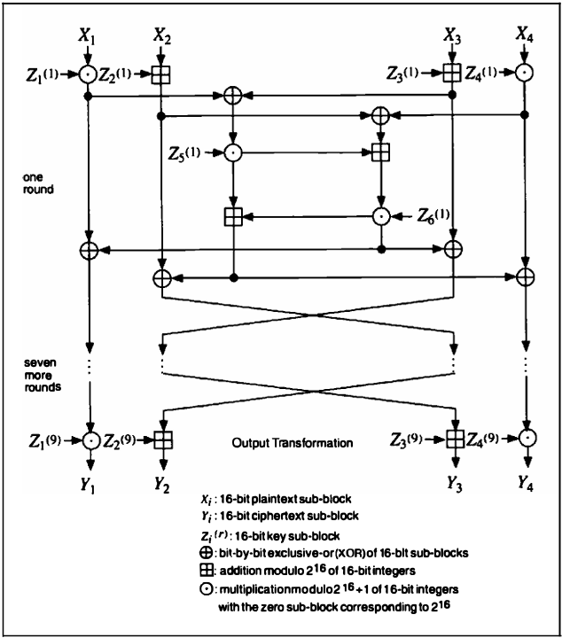

*IDEA*

