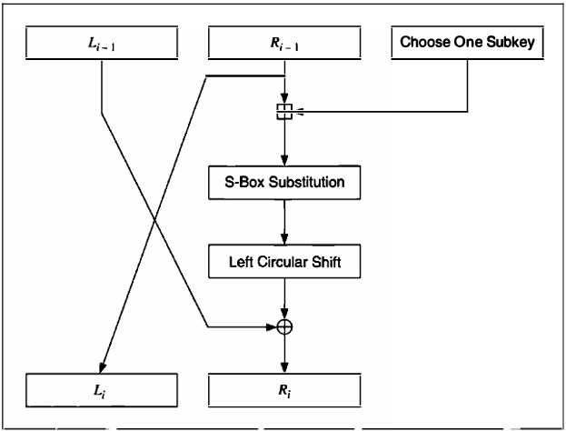
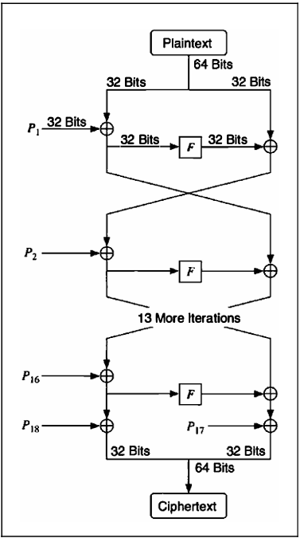
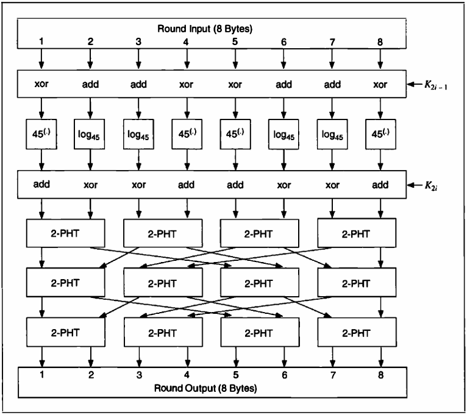
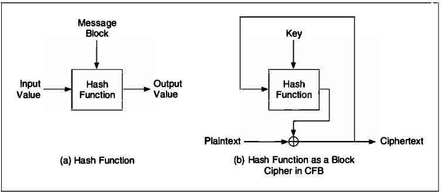

# 14 STILL OTHER BLOCK CIPHERS

[TOC]

## GOST

### Description of GOST

To encrypt, first break the text up into a left half, $L$ and a right half, $R$. The subkey for round $i$ is $K_i$. A round, $i$ of GOST is:
$$
L_i = R_{i - 1} \\
R_i = L_{i - 1} \oplus f(R_{i - 1}, K_i)
$$
Function $f$ is straightforward. First, the right half and the $i$th subkey are added modulo $2^{32}$. The result is broken into eight 4-bit chunks, and each chunk becomes the input to a different S-box. There are eight different S-boxes in GOST; the first 4 bits go into the first S-box, the second 4 bits go into the second S-box, and so on. Each S-box is a permutation of the numbers 0 through 15.

*One round of GOST*

### Cryptanalysis of GOST

These are the major differences between DES and GOST:

- DES has a complicated procedure for generating the subkeys from the keys. GOST has a very simple procedure.
- DES has a 56-bit key; GOST has a 256-bit key. If you add in the secret S-box permutations, GOST has a total of about 610 bits of secret information.
- The S-boxes in DES have 6-bit inputs and 4-bit outputs; the S-boxes in GOST have 4-bit inputs and outputs. Both algorithms have eight S-boxes, but an S-box in GOST is one-fourth the size of an S-box in DES.
- DES has an irregular permutation, called a P-box; GOST uses an 11-bit left circular shift.
- DES has 16 rounds; GOST has 32 rounds.

## CAST

The algorithm uses six S-boxes with an 8-bit input and a 32-bit output. Construction of these S-boxes is implementation-dependent and complicated; see the references for details.

To encrypt, first divide the plaintext block into a left half and a right half. The algorithm has 8 rounds. In each round the right half is combined with some key material using function $f$ and then XORed with the left half to form the new right half. The original right half (before the round) becomes the new left half. After 8 rounds (don't switch the left and right halves after the eighth round), the two halves are concatenated to form the ciphertext.

Function $f$ is simple:

1. Divided the 32-bit input into four 8-bit quarters: $a, b, c, d$.
2. Divided the  16-bit subkey into two 8-bit halves: $e, f$​.
3. Process $a$ through S-box $1, b$ through S-box 2, $c$ through S-box 3, $d$ through S-box 4, $e$ through S-box 5, and $f$ through S-box 6.
4. XOR the six S-box outputs together to get the final 32-bit output.

Alternatively, the 32-bit input can be XORed with 32 bits of key, divided into four 8-bit quarters, processed through the S-boxes, and then XORed together. $N$ rounds of this appears toa be as secure as $N + 2$​ rounds of the other option.

The 16-bit subkey for each round is easily calculated from the 64-bit key. If $k_1, k_2, ..., k_8$ are the 8 bytes of the key, then the subkeys for each round are:
$$
Round 1: k_1, k_2 \\
Round 2: k_3, k_4 \\
Round 3: k_5, k_6 \\
Round 4: k_7, k_8 \\
Round 5: k_4, k_3 \\
Round 6: k_2, k_1 \\
Round 7: k_8, k_7 \\
Round 8: k_6, k_5
$$
The strength of this algorithm lies in its S-boxes. CAST does not have fixed S-boxes; new ones are constructed for each application.

## BLOWFISH

### Description of Blowfish

Blowfish is a 64-bit block cipher with a variable-length key. The algorithm consists of two parts: key expansion and data encryption. Key expansion and data encryption. Key expansion converts a key of up to 448 bits into several subkey arrays totaling 4168bytes.

Data encryption consists of a simple function iterated 16 times. Each round consists of a key-dependent permutation, and a key- and data-dependent substitution. All operations are additions and XORs on 32-bit words. The only additional operations are four indexed array data lookups per round.

Blowfish uses a alrge number of subkeys. These keys must be precomputed before any data encryption or decryption.

The P-array consists of 18 32-bit subkeys:
$$
P_1, P_2, ..., P_18
$$
Four 32-bit S-boxes have 256 entries each:
$$
S_{1,0}, S_{1,1}, ..., S_{1,255} \\
S_{2,0}, S_{2,1}, ..., S_{2,255} \\
S_{3,0}, S_{3,1}, ..., S_{3,255} \\
S_{4,0}, S_{4,1}, ..., S_{4,255}
$$

*Blowfish*

The input is a 64-bit data element, $x$. To encrypt:
$$
\text{Divide } x \text{ into two 32-bit halves: } X_L, X_R \\
& \text{For } i = 1 \text{ to } 16: \\
& X_L = X_L \oplus P_i \\
& X_R = F(X_L) \oplus X_R \\
& \text{Swap } X_L \text{ and } X_R \\
\text{Swap } X_L \text{ and } X_R \text{(Undo the last swap)} \\
X_R = X_R \oplus P_{17} \\
X_L = X_L \oplus P_{18} \\
\text{Recombine } X_L \text{ and } X_R
$$
Function $F$ is as follows:
$$
\text{Divide } X_L \text{ into four eight-bit quarters:} \\
a, b, c \text{ and } dF(X_L) = ((S_{1, a} + S_{2, b} \mod 2^{32}) \oplus S_{3,c}) + S_{4,d} \mod 2^{32}
$$
The subkeys are calculated suing the Blowfish algorithm. The exact method follows:

1. Initialize first the P-array and then the four S-boxes, in order, with a fixed string. This string consists of the hexadecimal digits of $\pi$.
2. XOR $P_1$ with the first 32 bits of the key, XOR $P_2$ with the second 32-bits of the key, and so on for all bits of the key (up to $P_{18}$). Repeatedly cycle through the key bits until the entire $P-array$ has been XORed with key bits.
3. Encrypt the all-zero string with the Blowfish algorithm, using the subkeys described in steps 1 and 2.
4. Replace $P_1$ and $P_2$ with the output of step 3.
5. Encrypt the output of step 3 using the Blowfish algorithm with the modified subkeys.
6. Replace $P_3$ and $P_4$ with the output of step 5.
7. Continue the process, replacing all elements of the P-array, and then all four S-boxes in order, with the output of the continuously changing Blowfish algorithm.

## SAFER

### Description of SAFER K-64

*One round of SAFER*

The plaintext block is divided into eight byte-length sub-blocks: $B_1, B_2, ..., B_7, B_8$. Then the sub-blocks go through $r$ rounds. Finally, an output transformation is applied to the sub-blocks. Each round uses two subkeys: $K_{2i - 1}$ and $K_{2i}$.

First, sub-blocks are either XORed or added with bytes of subkey $K_{2i - 1}$. Then, the eight sub-blocks are subjected to one of two nonlinear transformations:
$$
y = 45^{x} \mod 257. (\text{If } x = 128, \text{then } y = 0.) \\
y = log_{45} x. (\text{If } x = 0, \text{then } y = 128.)
$$
Then, sub-blocks are either XORed or added with bytes of subkey $K_2$. The results of this operation are fed through three layers of linear operations designed to increase the avalanche effect. Each operation is called a Pseudo-Hadamard Transform (PHT). If the inputs to a PHT are $a_1$ and $a_2$, then the outputs are:
$$
b_1 = (2a_1 + a_2) \mod 256 \\
b_2 = (a_1 + a_2) \mod 256
$$
After $r$ rounds, there is a final output transformation. This is the same as the first step of each round. $B_1$, $B_4$, $B_5$ and $B_8$ are XORed with the corresponding bytes of the last subkey, and $B_2, B_3, B_6$ and $B_7$ are added to the corresponding bytes of the alst subkey. The result is the ciphertext.

Decryption is the reverse process: the output transformation (with subtraction instead of addition), then $r$ reverse rounds. The Inverse PHT (IPHT) is:
$$
a_1 = (b_1 - b_2) \mod 256 \\
a_2 = (-b_1 + 2b_2) \mod 256
$$
Massey recommends 6 rounds, but you can increase that if you want greater security.

Generating subkeys is easy. The first subkey $K_1$, is simply the user key. Subsequent subkeys are generated by the following procedure:
$$
K_{i + 1} = (K_1 <<< 3i) + c_i
$$
The symbol "<<<" is a left circular shift or a left rotation. The rotation is byte by byte, and $c_i$ is a round constant. If $c_{ij}$ is the $j$th byte of the $i$th round constant, then you can calculate all of the round constants by the formula:
$$
c_{ij} = 45^{45^((9i + i) \mod 256) \mod 257} \mod 257
$$
Generally, these values are stored in a table.

## 3-WAY

### Description of 3-Way

The algorithm is simple to describe. To encrypt a plaintext block, $x$:
$$
\text{For } i = 0 \text{ to } n - 1 \\
& x = x \text{ XOR } K_i \\
& x = \text{theta }(x) \\
& x = \text{pi} - 1(x) \\
& x = \text{gamma }(x) \\
& x = pi - 2(x) \\
x = x \oplus K_n \\
x = \text{theta}(x)
$$
The functions are:

- $theta(x)$ is a linear substitution function -- basically a bunch of circular shifts and XORs.
- $pi-1(x)$ and $pi - 2(x)$ are simple permutations.
- $gamma(x)$ is a nonlinear substitution function. This is the step that gives 3-Way its name; it is the parallel execution of the substitution step on 3-bit blocks of the input.

Decryption is similar to encryption, except that the bits of the input have to be reversed and the bits of the output have to be reversed. Code to implement 3-Way can be found in the back of this book.

## THEORY OF BLOCK CIPHER DESIGN

The trick is to repeatedly mix confusion (with much smaller tables) and diffusion in a single cipher in different combinations. This is called a **product cipher**. Sometimes a block cipher that incorporates layers of substitution and permutation is called a **substitution-permutation network**, or even an **SP network**.

### Feistel Networks

Take a block of length $n$ and divide it into two halves of length $n/2$: $L$ and $R$. Of course, $n$ must be even. You can define an iterated block cipher where the output of the $i$th round is determined from the output of the previous round:
$$
L_i = R_{i - 1} \\
R_i = L_{i - 1} \oplus f(R_{i - 1}, K_i)
$$
$K_i$ is the subkey sued in the $i$th round and $f$ is an arbitrary round function.

The function is guaranteed to be reversible. Because XOR is used to combine the left half with the output of the round function, it is necessarily true that:
$$
L_{i - 1} \oplus f(R_{i - 1}, K_i) \oplus f(R_{i - 1}, K_i) = L_{i - 1}
$$
A cipher that uses this construction is guaranteed to be invertible as long as the inputs to $f$ in each round can be reconstructed. It doesn't matter what $f$ is; $f$ need not be invertible.

### Simple Relations

A **simple relation** can be defined as:
$$
\text{If } E_K(P) = C, \text{then } E_{f(K)}(g(P, K)) = h(C, K)
$$
, where $f$, $g$, and $h$ are simple functions.

### Group Structure

The goal is to estimate the size of the keyspace for a theoretical brute-force attack, and the result is a greatest lower bound on the keyspace entropy.

### Weak Keys

In a good block cipher, all keys are equally strong. Algorithms with a small number of weak keys, like DES, are generally no problem. The odds of picking one at random are very small, and it's easy to test for and discard them. However, these weak keys can sometimes be exploited if the block cipher is used as a one-way hash function.

## USING ONE-WAY HASH FUNCTIONS

The simplest way to encrypt with a one-way function is to hash the previous ciphertext block concatenated with the key, then XOR the result with the current plaintext block:
$$
C_i = P_i \oplus H(K, C_{i - 1}) \\
P_i = C_i \oplus H(K, C_{i - 1})
$$
Set the block length equal to the output of the one-way hash function. This, in effect uses the one-way function as a block cipher in CFB mode. A similar construction can use the one-way function in OFB mode:
$$
C_i = P_i \oplus S_i; S_i = H(K, C_{i - 1}) \\
P_i = C_i \oplus S_i; S_i = H(K, C_{i - 1})
$$
The security of this scheme depends on the security of the one-way function.

### Karn

This method, invented by Phil Karn and placed in the public domain, makes an invertible encryption algorithm out of certain one-way hash functions.

The algorithm operates on plaintext and ciphertext in 32-byte blocks. The key can be any length, although certain key lengths will be more efficient for certain one-way hash functions. For the one-way hash functions MD4 and MD5, 96-byte keys work best.

To encrypt, first split the plaintext into two 16-byte halves: $P_1$ and $P_r$. Then, split the key into two 48-byte halves: $K_1$ and $K_r$:
$$
P = P_1, P_t \\
K = K_1, K_r
$$
Append $K_1$ to $P_1$ and hash it with a one-way hash function, then XOR the result of the hash with $P_r$ to produce $C_r$, the right half of the ciphertext. Then, append $K_r$ to $C_r$ and hash it with the one-way hash function. XOR the result with $P_1$ to produce $C_1$. Finally, append $C_t$ to $C_1$ to produce the ciphertext:
$$
C_r = P_r \oplus H(P_1, K_1) \\
C_1 = P_1 \oplus H(C_r, K_r) \\
C = C_1, C_r
$$
To decrypt, simply reverse the process. Append $K_r$ to $C_r$, hash and XOR with $C_1$ to produce $P_1$. Append $K-1$ to $P_1$, hash and XOR with $C_r$ to produce $P_r$:
$$
P_1 = C_1 \oplus H(C_r, K_r) \\
P_r = C_r \oplus H(P_1, K_1) \\
P = P_1, P_r
$$

### Luby-Rackoff

Michael Luby and Charles Rackoff showed that Karn is not secure. A three-round encryption algorithm aovids this prlbme. It uses three different hash functions: $H_1$, $H_2$ and $H_3$. Further work shows that $H_1$ can equal $H_2$, or that $H_2$ can equal $H_3$, but not both. Also, $H_1$, $H_2$ and $H_3$ cannot be based on iterating the same basic function. Anyway, assuming that $H(k, x)$ behaves like a pseudo-random function, here is a three-round version:

1. Divide the key into two halves: $K_1$ and $K_r$.

2. Divide the plaintext block into two halves: $L_0$ and $R_0$.

3. Append $K_1$ to $L_0$ and hash it. XOR the result of the hash with $R_0$ to produce $R_1$:
   $$
   R_1 = R_0 \oplus H(K_1, L_0)
   $$

4. Append $K_r$ to $R_1$ and hash it. XOR the result of the hash with $L_0$ to produce $L_1$:
   $$
   L_1 = L_0 \oplus H(K_r, R_1)
   $$

5. Append $K_1$ to $L_1$ and hash it. XOR the result of the hash with $R_1$ to produce $R_2$:
   $$
   R_2 = R_1 \oplus H(K_1, L_1)
   $$

6. Append $L_1$ to $R_2$ to generate the message.

### Message Digest Cipher (MDC)

*Messge DIgest Cipher (MDC)*

### Security of Ciphers Based on One-Way Hash Functions

While these constructions can be secure, they depend on the choice of the underlying one-way hash function. A good one-way hash function doesn't necessarily make a secure encryption algorithm. Cryptographic requirements are different.
