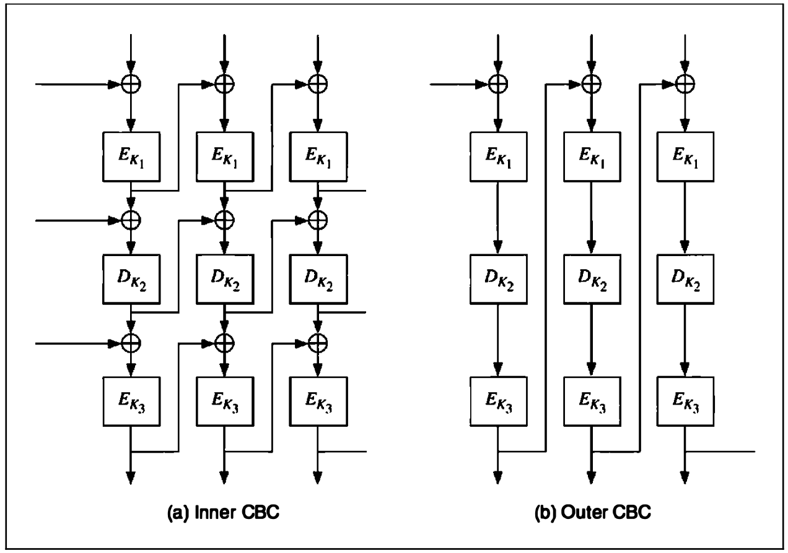
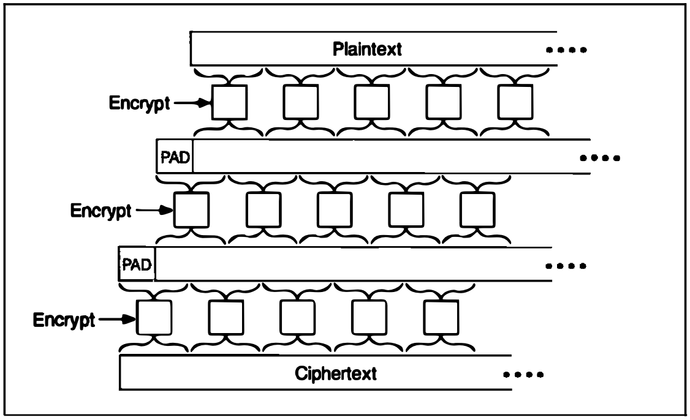
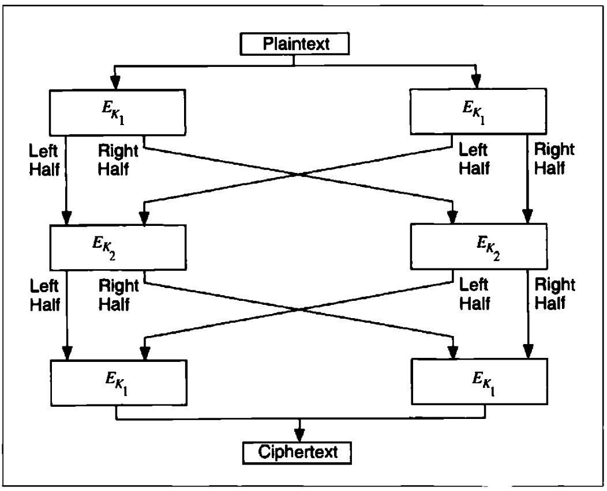
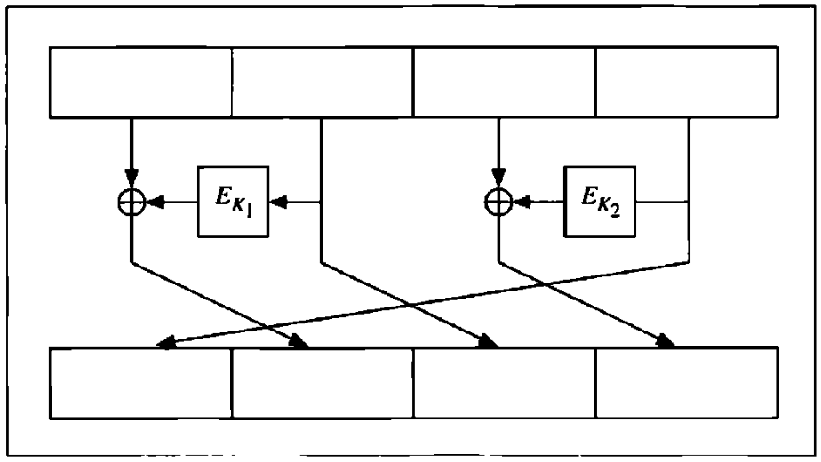

# CHAPTER 15 Combining Block Ciphers

[TOC]

**Multiple encryption** is one combination technique: using an algorithm to encrypt the same plaintext block multiple times with multiple keys.

## DOUBLE ENCRYPTION

First encrypt a block with the first key, then encrypt the resulting ciphertext with the second key. Decryption is the reverse process:
$$
C = D_{K_2}(E_{K_1}(P)) \\
P = D_{K_2}(E_{K_2}(C))
$$
, if the block algorithm is a group, then there is always a $K_3$ such that:
$$
C = E_{k_2}(E_{k_1}(P)) = E_{K_3}(P)
$$
**Meet-in-the-middle attack** works by encrypting from one end, decrypting from the other, and matching the results in the middle. In this attack, the cryptanalyst knows $P_1$, $C_1$, $P_2$ and $C_2$, such that:
$$
C_1 = E_{k_2}(E_{k_1}(P_1)) \\
C_2 = E_{k_2}(E_{k_1}(P_2))
$$
, for each possible $K$, he computes $E_k(P_1)$ and stores the result in memory. After collecting them all, he computes $D_k(C_1)$ for each $K$ and looks for the same result in memory. If he finds it, it is possible that the current key is $K_2$ and the key in memory is $K_1$. He tries encrypting $P_2$ with $K_1$ and $K_2$; if he gets $C_2$ he can be pretty sure(with a probability of success of 1 in $2^{2m - 2n}$, where $m$ is the block size) that he has both $K_1$ and $K_2$. If not, he keeps looking. The maximum number of encryption trials he will probably have to run is $2 * 2^n$, or $2^{n + 1}$. If the probability of error is too large, he can use a third ciphertext block to get a probability of success of 1 in $2^{3m - 2n}$.

## TRIPLE ENCRYPTION

### Triple Encryption with Two Keys

**Encrypt-Decrypt-Encrypt(EDE)** mode operates on a block three times with two keys: with the first key, then with the second key, and finally with the first key again:
$$
C = E_k(D_{k_2}(E_{k_1}(P))) \\
P = D_{k_1}(E_{k_2}(D_{k_1}(C)))
$$
Paul van Oorschot and Michael Wiener provide a known-plaintext attack, requiring $p$ known plaintext. This example assumes EDE mode:

1. Guess the first intermediate value $a$.

2. Tabulate, for each possible $K_1$, the second intermediate value, $b$, when the first intermediate value is $a$, using known plaintext:
   $$
   b = D_{k_1}(C)
   $$

   where $C$ is the resulting ciphertext from a known plaintext.

3. Look up in the table, for each possible $K_2$, elements with a matching second intermediate value, $b$:
   $$
   b = E_{k_2}(a)
   $$

4. The probability of success is $p/m$, where $p$ is the number of known plaintexts and $m$ is the block size. If there is no match, try another $a$ and start again.

### Triple Encryption with Three Keys

If you are going to use triple encryption, I recommend three different keys:
$$
C = E_{k_3}(D_{k_2}(E_{k_2}(P))) \\
P = D_{k_1}(E_{k_2}(D_{k_3}(C)))
$$

### Triple Encryption with Minimum Key (TEMK)

There is a secure way of using triple encryption with two keys that prevents the previous attack, called **Triple Encryption with Minimum Key(TEMK)**. The trick is to derive three keys from two: $X_1$ and $X_2$:
$$
K_1 = E_{X_1}(E_{X_2}(E_{X_1}(T_1))) \\
K_2 = E_{X_1}(E_{X_2}(E_{X_1}(T_2))) \\
K_3 = E_{X_1}(E_{X_2}(E_{X_1}(T_3))) \\
$$
$T_1$, $T_2$ and $T_3$ are constants, which do not have to be secret. This is a special construction that guarantees that for any particular pair of keys, the best attack is a known-plaintext attack.

### Triple-Encryption Modes

Here are two possible triple-encryption modes:

- **Inner-CBC**: Encrypt the entire file in CBC mode three different times. This requires three different IVs:
  $$
  C_i = E_{k_3}(S_i \oplus C_{i - 1}); S_i = D_{k_2}(T_i \oplus S_{i - 1}); T_i = E_{k_1}(P_i \oplus T_{i - 1}) \\
  P_i = T_{i - 1} \oplus D_{k_1}(T_i); T_i = S_{i - 1} \oplus E_{k_2}(S_i); S_i = C_{i - 1} \oplus D_{k_3}(C_i)
  $$
  $C_0$, $S_0$ and $T_0$ are IVs.

- **Outer-CBC**: Triple-encrypt the entire file in CBC mode. This requires one IV:
  $$
  C_i = E_{k_3}(D_{k_2}(E_{k_1}(P \oplus C_{i - 1}))) \\
  P_i = C_{i - 1} \oplus D_{k_1}(E_{k_2}(D_{k_3}(C_i)))
  $$

*Triple encryption in CBC mode.*

outer-CBC feedback is outside the three encryptions. This means that even with three chips, the throughput is only one-third that of single encryption. To get the same throughput with outer-CBC, you need to interleave IVs:
$$
C_i = E_{k_3}(D_{k_2}(E_{k_2}(P_i \oplus C_{i - 3})))
$$
, in this case $C_0$, $C_{-1}$, and $C_{-2}$ are IVs. This doesn't help software implementations any, unless you have a parallel machine.

### Variant on Triple Encryption

One way to guarantee that triple encryption doesn't reduce to single encryption is to change the effective block size. One simple method is to add a bit of padding. Pad the text with a string of random bits, half a block in length, between the first and second and between the second and third encryptions. If $p$ is the padding function, then:
$$
C = E_{k_3}(p(E_{k_2}(p(E_{k_1}(p)))))
$$
, this padding not only disrupts patterns, but also overlaps encrypted blocks like bricks. It only add one block to the length of the message.

*Triple encryption with padding*

Another technique, proposed by Carl Ellison, is to use some kind of keyless permutation function between the three encryptions. The permutation could work on large blocks --8 kilobytes or so--and would effectively give this variant a block size of 8 kilobytes. Assuming that the permutation is fast, this variant is not much slower than basic triple encryption:
$$
C = E_{k_3}(T(E_{k_2}(T(E_{k_1}(p)))))
$$
$T$ collects a block of input (up to 8 kilobytes in length) and uses a pseudo-random-number generator to transpose it. A 1-bit change in the input causes 8 changed output bytes after the first encryption, up to 64 changed output bytes after the second encryption, and up to 512 changed output bytes after the third encryption. If each block algorithm is in CBC mode, as original proposed, then the effect of a single changed input bit is likely to be the entire 8 kilobyte block, even in blocks other than the first.

## DOUBLING THE BLOCK LENGTH

Some propose doubling the block length of an algorithm using multiple encryptions. Before implementing any of these, look for the possibility of meet-in-the-middle attacks. Richard Outerbridge's scheme, illustrated in follow figure, is no more secure than single-block, two-key triple encryption.

*Doubling the block length*

## OTHER MULTIPLE ENCRYPTION SCHEMES

### Double OFB/Counter

This method uses a block algorithm to generate two keystreams, which are then used to encrypt the plaintext:
$$
S_1 = E_{k_1}(S_{i - 1} \oplus I_1), I_1 = I_1 + 1 \\
T_i = E_{K_2}(T_{i - 1} \oplus I_2), I_2 = I_2 + 1 \\
C_i = P_i \oplus S_i \oplus T_i
$$
$S_i$ and $T_i$ are internal variables, and $I_1$ and $I_2$ are counters. Two copies of the block algorithm run in a kind of hybrid OFB/counter mode, and the plaintext, $S_i$ and $T_i$ are XORed together. The two keys, $K_1$ and $K_2$, are independent.

### ECB + OFB

This method was designed for encrypting multiple messages of a fixed length, for example, disk blocks. Use two keys: $K_1$ and $K_2$. First, use the algorithm and $K_1$ to generate a mask of the required block length. This mask will be used repeatedly to encrypt messages with the same keys. Then, XOR the plaintext message with the mask. Finally, encrypt the XORed plaintext with the algorithm and $K_2$ in ECB mode.

### xDES

The first, xDES, is simply a Luby-Rackoff construction with the block cipher as the underlying function. The block size is twice the size of the underlying block cipher and the key size os three times the size of the underlying block cipher. In each of 3 rounds, encrypt the right half with the block algorithm and one of the keys, XOR the result with the left half, and swap the two halves.

For $i \geq 3$, $xDES^{i}$ is probably too big to be useful as a block algorithm.

*One round of $xDES^2$*

### Quintuple Encryption

Quintuple encryption is very strong against meet-in-the-middle attacks. (Similar arguments to the ones used with double encryption can show that quadruble encryption provides minimal security improvements over triple encryption.):
$$
C = E_{k_1}(D_{k_2}(E_{k_3}(E_{k_2}(E_{k_1}(P))))) \\
P = D_{k_1}(E_{k_2}(D_{k_3}(E_{k_2}(D_{k_1}(C)))))
$$
This construction is backwards compatible with triple encryption if $K_2 = K_3$, and is backwards compatible with single encryption if $K_1 = K_2 = K_3$. Of course, it would be even stronger if all five keys were independent.

## CDMF KEY SHORTENING

This method was designed by IBM for their Commercial Data Masking Facility or CDMF to shrink a 56-bit DES key to a 40-bit key suitable for export. It assumes that the original DES key includes the parity bits:

1. Zero the parity bits: bits 8, 16, 24, 32, 40, 48, 56, 64.
2. Encrypt the output of step1 with DES and the key 0xc408b0540bale0ae, and XOR the result with the output of step1.
3. Take the output of step2 and zero the following bits: 1, 2, 3, 4, 8, 16, 17, 18, 19, 20, 24, 32, 33, 34, 35, 36, 40, 48, 49, 50, 51, 52, 56, 64.
4. Encrypt the output of step3 with DES and the following key: 0xef2c041ce6382fe6. This key is then used for message encryption.

Remember that this method shortens the key length, and thereby weakens the algorithm.

## WHITENING

Whitening is the name given to the technique of XORing some key material with the input to a block algorithm, and XORing some other key material with the output.

The idea is to prevent a cryptanalyst from obtaining a plaintext/ciphertext pair for the underlying algorithm. The technique forces a cryptanalyst to guess not only the algorithm key, but also one of the whitening values. Since there is an XOR both before and after the block algorithm, this technique is not susceptible to a meet-in-the-middle attack:
$$
C = K_3 \oplus E_{k_2}(P \oplus K_1) \\
P = K_3 \oplus D_{k_2}(C \oplus K_3)
$$

## COMBINING MULTIPLE BLOCK ALGORITHMS

Here's another way to combine multiple block algorithms, one that is guaranteed to be at least as secure as both algorithms. With two algorithms (and two independent keys):

1. Generate a random-bit string, $R$, the same size as the message $M$.
2. Encrypt $R$ with the first algorithm.
3. Encrypt $M \oplus R$ with the second algorithm.
4. The ciphertext message is the results of step2 and step3.

Assuming the random-bit string is indeed random, this method encrypts $M$ with a one-time pad and then encrypts both the pad and the encrypted message with each of the two algorithms. Since both are required to reconstruct $M$, a cryptanalyst must break both algorithms. The drawback is that the ciphertext is twice the size of the plaintext.