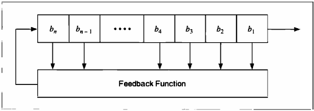
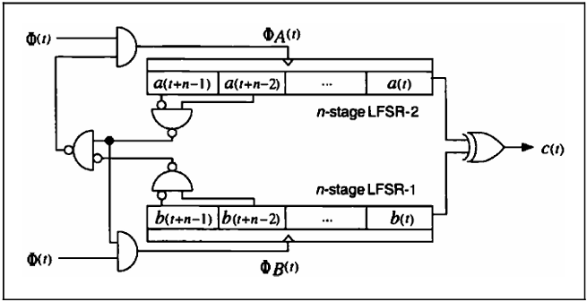

# Pseudo-Random-Sequence Generators and Stream Ciphers

[TOC]

## LINEAR CONGRUENTIAL GENERATORS

**Linear congruential generators** are pseudo-random-sequence generators of the form:
$$
X_n = (aX_{n - 1} + b) \mod m
$$
, in which $X_n$ is the $n$th number of the sequence, and $X_{n - 1}$ is the previous number of the sequence. The variables $a, b$ and $m$ are constants: $a$ is the **multiplier**, $b$ is the **increment**, and $m$ is the modulus. The key, or seed, is the value of $X_0$.

This generator has a period no greater than $m$. If $a$, $b$ and $m$ are properly chosen, then the generator will be a **maximal period generator** (sometimes called maximal length) and have period of $m$.

The advantage of linear congruential generators is that they are fast, requiring few operations per bit.

Unfortunately, linear congruential generators cannot be used for cryptography; they are predictable. Linear congruential generators were first broken by Jim Reeds and then by Joan Boyar. She also broke quadratic generators:
$$
X_n = (aX_{n - 1}^2 + bX_{n - 1} + c) \mod m
$$
, and cubic generators:
$$
X_n = (aX_{n - 1}^3 + bX_{n - 1}^2 + cX_{n - 1} + d) \mod m
$$

## LINEAR FEEDBACK SHIFT REGISTERS

A **feedback shift register** is made up of two parts: a shift register and a **feedback function**. The shift register is a sequence of bits. (The **length** of a shift register is figured in bits; if it is $n$ bits long, it is called an $n$-bit shift register.) Each time a bit is needed, all of the bits in the shift register are shifted 1 bit to the right. The new left-most bit is computed as a function of the other bits in the register. The output of the shift register is 1 bit, often the least significant bit. The **period** of a shift register is the length of the output sequence before it start repeating.

*Feedback shift register*

*Linear feedback shift register*

The simplest kind of feedback shift register is a **linear feedback shift register**, or LFSR. The feedback function is simply the XOR of certain bits in the register; the list of these bits is called a **tap sequence**. Sometimes this is called a **Fibonacci configureation**.

An $n$-bit LFSR can be in one of $2^n - 1$ internal states. This means that it can, in theory, generate a $2^n - 1$-bit-long pseudo-random sequence before repeating. (It's $2^n - 1$ and not $2^n$ because a shift register filled with zeros will cause the LFSR to output a neverending stream of zeros--this is not particulrly useful.) Only LFSRs with certain tap sequences will cycle through all $2^n - 1$ internal states; these are the maximal-period LFSRs. The resulting output sequence is called an **m-sequence**.

In order for a particular LFSR to be a maximal-period LFSR, the polynomial formed from a tap sequence plus the constant 1 must be a primitive polynomial mod 2. The **degree** of the polynomial is the length of the shift register. A primitive polynomial of degree $n$ is an irreducible polynomial that divides $x^{2^{n - 1}} + 1$, but not $x^d + 1$ for any $d$ that divides $2^n - 1$.

### LFSRs in Software

*Galois LFSR*

## DESIGN AND ANALYSIS OF STREAM CIPHERS

### Linear Complexity

**Linear complexity** is defined as the length, $n$, of the shortest LFSR that can mimic the generator output. Any sequence generated by a finite-state machine over a finite field has a finite linear complexity. Linear complexity is important because a simple algorithm, called the **Berlekamp-Massey algorithm**, can generate this LFSR after examining only $2n$ bits of the keystream. Once you've generated this LFSR, you've broken the stream cipher.

**Linear complexity profile**, which measures the linear complexity of the sequence as it gets longer and longer. Another algorithm for computing linear complexity is useful only in very specialized circumstances.

### Correlation Imunity

Cryptographers try to get a high linear complexity by combining the output of several output sequences in some nonlinear manner. The danger here is that one or more of the internal output sequences--often just outputs of individual LFSRs--can be correlated with the combined keystream and attacked using linear algebra. Often this is called a **correlation attack** or a divide-and-conquer attack. Thomas Siegenthaler has shown that **correlation immunity** can be precisely defined, and that there is a trade-off between correlation immunity and linear complexity.

### Other Attacks

There are other general attacks against keystream generators. The **linear consistency test** attempts to identify some subset of the encryption key using matrix techniques. There is also the **meet-in-the-middle consistency attack**. The **linear syndrome algorithm** relies on being able to write a fragment of the output sequence as a linear equation. There is the **best affine approximation attack** and the **derived sequence attack**.

## STREAM CIPHER USING LFSRs

The basic approach to designing a keystream generator using LFSRs is simple. First you take one or more LFSRs, generally of different lengths and with different feedback polynomials. (If the lengths are all relatively prime and the feedback polynomials are all primitive, the whole generator is maximal length.) The key is the initial state of the LFSRs. Every time you want a bit, shift the LFSRs once (this is sometimes called **clocking**). The output bit is a function, preferably a nonlinear function, of some of the bits of the LFSRs. This function is called the **combining function**, and the whole generator is called a **combination generator**. (If the output bit is a function of a single LFSR, the generator is called a **filter generator**.)

### Geffe Generator

This keystream generator uses three LFSRs, combined in a nonlinear manner. Two of the LFSRs are inputs into a multiplexer, and the third LFSR controls the output of the multiplexer. If $a_1$, $a_2$ and $a_3$ are the outputs of the three LFSRs, the output of the Geffe generator can be described by:
$$
b = (a_1 \and a_2) \oplus ((\neg a_1) \and a_3)
$$
If the LFSRs have lengths $n_1$, $n_2$ and $n_3$, respectively, then the linear complexity of the generator is:
$$
(n_1 + 1)n_2 + n_1 n_3
$$
The period of the generator is the least common multiple of the periods of the three generators. Assuming the degrees of the three primitive feedback polynomials are relatively prime, the period of this generator is the product of the periods of the three LFSRs.

*Geffe generator*

### Generalized Geffe Generator

*Generalized Geffe generator*

### Jennings Generator

*Jennings generator*

### Beth-Piper Stop-and-Go Generator

*Beth-Piper stop-and-go generator*

### Alternating Stop-and-Go Generator

*Alternating stop-and-go generator*

### Bilateral Stop-and-Go Generator

*Bilateral stop-and-go generator*

### Threshold Generator

*Threshold generator*

### Self-Decimated Generators

*Rueppel's self-decimated generator*

*Chambers's and Gollmann's self-decimated generator*

### Multispeed Inner-Product Generator

*Multispeed inner-product generator*

### Summation Generator

### DNRSG

### Gollmann Cascade

*Gollmann cascade*

### Shrinking Generator

### Self-Shrinking Generator

## ADDITIVE GENERATORS

**Additive generators** (sometimes called lagged Fibonacci generators) are extremely efficient because they produce random words instead of random bits. They are not secure on their own, but can be used as building blocks for secure generators.

The initial state of the generator is an array of $n$-bit words: 8-bit words, 16-bit words, 32-bit words, whatever: $X_1, X_2, X_3, ..., X_m$. This initial state is the key. The $i$th word of the generator is:
$$
X_i = (X_{i - a} + X_{i - b} + X_{i - c} + ... + X_{i - m}) \mod 2^n
$$
If the coefficients $a, b, c, ..., m$ are chosen right, the period of this generator is at least $2^n - 1$. One of the requirements on the coefficients is that the least significant bit forms a maximal-length LFSR.

### Fish

Fish is an additive generator based on techniques used in the shrinking generator. It produces a stream of 32-bit words which can be XORed with a plaintext stream to produce ciphertext, or XORed with a ciphertext stream to produce plaintext. The algorithm is named as it is because it is a Fibonacci shrinking generator.

First, use these two additive generators. The key is the initial values of these generators:
$$
A_1 = (A_{i - 55} + A_{i - 24}) \mod 2^{32} \\
B_i = (B_{i - 52} + B_{i - 19}) \mod 2^{32}
$$
These sequences are shrunk, as a pair, depending on the least significant bit of $B_i$; if it is 1, use the pair; if it is 0, ignore the pair. $C_i$ is the sequence of used words from $A_i$ and $D_i$ is the sequence of used words from $B_i$. These words are used in pairs--$C_{2i}$, $C_{2i + 1}$, $D_{2i}$ and $D_{2i + 1}$ --to generate two 32-bit output words: $K_{2j}$ and $K_{2j + 1}$:
$$
E_{2i} = C_{2i} \oplus (D_{2i} \and D_{2i + 1}) \\
F_{2i} = D_{2i + 1} \and (E_{2i} \and C_{2i + 1}) \\
K_{2i} = E_{2i} \oplus F_{2i} \\
K_{2i + 1} = C_{2i + 1} \oplus F_{2i}
$$

## GIfford

The algorithm has a single 8-byte register: $b_0, b_1, ..., b_7$. The key is the initial state of the register. The algorithm works in OFB; the plaintext does not affect the algorithm at all.

To generate a key byte $K_i$, concatenate $b_0$ and $b_2$ and concatenate $b_4$ and $b_7$. Multiply the two together to get a 32-bit number. The third byte from the left is $k_i$.

To update the register, take $b_1$ and sticky right shift it 1 bit. This means the left-most bit is both shifted and also remains in place. Take $b_7$ and shift it 1 bit to the left; there should be a 0 in the rifht-most bit position. Take the XOR of the modified $b_1$, the modified $b_7$ and $b_0$. Shift the original register 1 byte to the right and put this byte in the left-most position.

*Gifford*