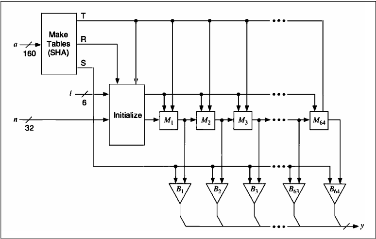
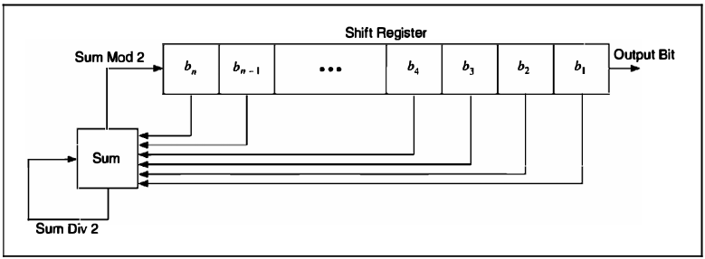
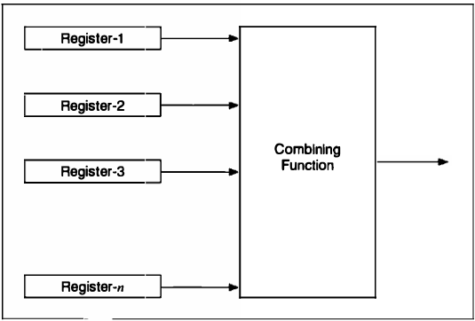
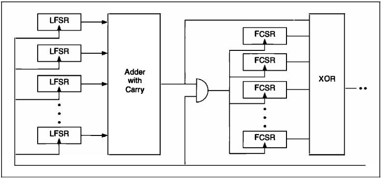
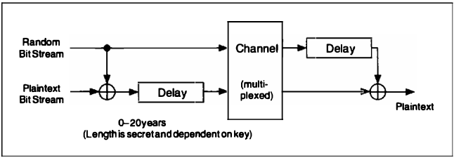
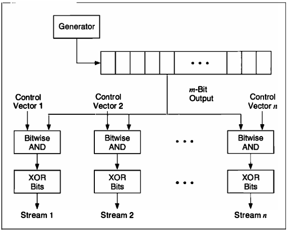

# Chapter 17 Other Stream Ciphers and Real Random-Sequence Generators

[TOC]

## RC4

The algorithm works in OFB: The keystream is independent of the plaintext. It has a 8 * 8 S-box: $S_0, S_1, ..., S_{255}$. The entries are a permutation of the numbers 0 through 255, and the permutation is a function of the variable-length key. It has two counters, $i$ and $j$, initialized to zero.

To generate a random byte, do the following:
$$
i = (i + 1) \mod 256 \\
j = (j + S_i) \mod 256 \\
swap\ S_i\ and\ S_j \\
t = (S_i + S_j) \mod 256 \\
K = S_i
$$
The byte $K$ is XORed with the plaintext to produce ciphertext or XORed with the ciphertext to produce plaintext. Encryption is fast--about 10 times faster than DES.

Initializing the S-box also easy. First, fill it linearly: $S_0 = 0, S_1 = 1, ..., S_{255} = 255$. Then fill another 256-byte array with the key, repeating the key as necessary to fill the entire array: $K_0, K_1, ..., K_{255}$. Set the index $j$ to zero. Then:
$$
for\ i = 0\ to\ 255: \\
	j = (j + S_i + K_i)\mod 256 \\
	swap\ S_i\ and\ S_j
$$

## SEAL

### Pseudo-random Function Family

One novel feature of SEAL is that is isn't really a traditional stream cipher: it is a **pseudo-random function family**. Given a 160-bit key $k$, and a 32-bit $n$,m SEAL stretches $n$ into an $L$-bit string $k(n)$. $L$ can take any value less than 64 kilobytes. SEAL is supposed to enjoy the property that if $k$ is selected at random, then $k(n)$ should be computationally indistinguishable from a random $L$-bit function of $n$.

### Description of SEAL

*The inner loop of SEAL*

Three key-derived tables, called $R$, $S$ and $T$, drive the algorithm. The preprocessing step maps the key $k$, to these tables using a procedure base on SHA. The 2-kilobyte table, $T$ is a 9 * 32 bit S-box.

SEAL also uses four 32-bit registers, $A$, $B$, $C$ and $D$, whose initial values are determined by $n$ and the $k$-derived tables $R$ and $T$. These registers get modified over several iterations, each one involving 8 rounds. In each round 9 bits of a first register (either A, B, C or D) are used to index into table $T$. The value retrieved from $T$ is then added to or XORed with the contents of a second register: again one of A, B, C or D. The first register is then circularly shifted by nine positions. In some rounds the second register is further modified by adding or XORing it with the (now shifted) first register. After 8 rounds of this, A,B, C and D are added to the keystream, each masked first by adding or XORing it with a certain word from $S$. The iteration is completed by adding to A and C additional values dependent on $n$, $n_1$, $n_2$, $n_3$, $n_4$; exactly which one depends on the parity of the iteration number.

The imporatnt ideas in this design seem to be:

1. Use a large, secret, key-derived S-box (T).
2. Alternate arithmetic operations which don't commute (addition and XOR).
3. Use a internal state maintained by the cipher which is not directly manifest in the data stream (the $n_i$ values which modify $A$ and $C$ at the end of each iteration).
4. Vary the round function according to the round number, and vary the iteration function according to the iteration number.

## WAKE

WAKE algorithm produces a stream of 32-bit words which can be XORed with a plaintext stream to produce ciphertext, or XORed with a ciphertext stream to produce plaintext. And it's fast.

WAKE works in CFB; the previous ciphertext word is used to generate the next key word. It also uses an S-box of 256 32-bit values. This S-box has a special property: The high-order byte of all the entries is a permutation of all possible bytes, and the low-order 3 bytes are random.

First, generate the S-box entries, $S_i$ from the key. Then initialize four registers with the key (or with another key): $a_0$, $b_0$, $c_0$ and $d_0$. To generate a 32-bit keystream word, $K_i$:
$$
K_i = d_i
$$
The ciphertext word $C_i$, is the plaintext word, $P_i$ XORed with $K_i$.

Then, update the four registers:
$$
a_{i + 1} = M(a_i, d_i) \\
b_{i + 1} = M(b_i, a_{i + 1}) \\
c_{i + 1} = M(c_i, b_{i + 1}) \\
d_{i + 1} = M(d_i, c_{i + 1})
$$
Function $M$ is:
$$
M(x, y) = (x + y) >> 8 \oplus S_{(x + y)^{255}}
$$
This is shown in below figure. The operation >> is a right shift, not a rotation. The low-order 8 bits of $x + y$ are the input into the S-box. Wheeler gives a procedure for generating the S-box, but it isn't really complete. Any algorithm to generate random bytes and a random permutation will work.

## FEEDBACK WITH CARRY SHIFT REGISTERS

A feedback with carry shift register, or FCSR, is similar to a LFSR. Both have a shift register and a feedback function; the difference is that a FCSR also has a carry register (see below figure). Instead of XORing all the bits in the tap sequence, add the bits together and add in the contents of the carry register. The result mod 2 becomes the new bit. The result divided by 2 becomes the new content of the carry register.

*Feedback with carry shift register*

There are a few things to note here:

- First, the carry register is not a single bit; it is a number. The size of the carry register must be at least $\log_2{t}$, where $t$ is the number of taps. 

- Second, there is an initial transient before the FCSR settles down into its repeating period. 

- Third, the maximum period of a FCSR is not $2^{n} - 1$, where $n$ is the lenght of the shift register. The maximum period is $q - 1$, where $q$ is the **connection integer**. This number gives the taps and is defined by:
  $$
  q = 2q_1 + 2^2 q_2 + 2^4 q_4 + ... + 2^n q_{n} - 1
  $$
  (Yes, the $q_i$s are numbered from left to right.) And even worse, $q$ has to be a prime for which 2 is a primitive root. The rest of this discussion assumes $q$ is of this form.

## STREAM CIPHERS USING FCSRs

### Cascade Gemerators

There are two ways to use FCSRs in a cascade generator:

- FCSR Cascade. The Gollmann cascade with FCSRs instead of LFSRs.
- LFSR/FCSR Cascade. The Gollman cascade with the generators alternating between LFSRs and FCSRs.

### FCSR Combining Generators

*Combining Generators.*

These generators use a variable number of LFSRs and/or FCSRs, and a variety of functions to combine them. The XOR operation destroys the algebraic properties of FCSRs, so it makes sense to use it to combine them.

Other generators along similar lines are:

- FCSR Parity Generator. All registers are FCSRs and the combining function is XOR.
- LFSR/FCSR Parity Generator. Registers are a mix of LFSRs and FCSRs and the combining function is XOR.
- FCSR Threshold Generator. All registers are FCSRs and the combining function is the majority function.
- LFSR/FCSR Threshold Generator. Registers are a mix of LFSRs and FCSRs and the combining function is the majority function.
- FCSR Summation Generator. All registers are FCSRs and the combining function is addition with carry.
- LFSR/FCSR Summation Generator. Registers are a mix of LFSRs and FCSRs and the combining function is addition with carry.

### LFSR/FCSR Summation/Parity Cascade

*Concoction Generator*

The theory is that addition with carry destroys the algebraic properties of LFSRs, and that XOR destroys the algebraic properties of FCSRs.

The generator is a series of arrays of registers, with the clock of each array controlled by the output of the previous array.

This generator uses a lot of registers: n * m, where $n$ is the number of stages and $m$​ is the number of registers per stage.

### Alternating Stop-and-Go Generators

*Alternating stop-and-go generators.*

These generators are stop-and-go generators with FCSRs instead of some LFSRs. Additionally, the XOR operation can be replaced with an addition with carry:

- FCSR Stop-and-Go Generator. Register-1, Register-2, and Register-3 are FCSRs. The combining operation is XOR.
- FCSR/LFSR Stop-and-Go Generator. Register-1 is a FCSR, and Registers-2 and -3 are LFSRs. The combining operation is addition with carry.
- LFSR/FCSR Stop-and-Go Generator. Register-1 is a LFSR, and Registers-2 and -3 are FCSRs. The combining operation is XOR.

### Shrinking Generators

There are four basic generator types using FCSRs:

- FCSR Shrinking Generator. A shrinking generator with FCSRs instead of LFSRs.
- FCSR/LFSR Shrinking Generator. A shrinking generator with a LFSR shrinking a FCSR.
- LFSR/FCSR Shrinking Generator. A shrinking generator with a FCSR shrinking a LFSR.
- FCSR Self-Shrinking Generator. A self-shrinking generator with a FCSR instead of a LFSR.

## SYSTEM-THEORETIC APPROACH TO STREAM-CIPHER DESIGN

According to Rainer Rueppel, there are four different approaches to the construction of stream ciphers:

- System-theoretic approach. Try to make sure that each design creates a difficult and unknown problem for the cryptanalyst, using a set of fundamental design principles and criteria.
- Information-theoretic approach. Try to keep the cryptanalyst in the dark about the plaintext. Nomatter how much work the cryptanalyst invests, he will never get a unique solutio.
- Complexity-theoretic approach. Try to base the cryptosystem on, or make it equivalent to, some known and difficult problem such as factoring ro taking discrete logarithms.
- Randomized approach. Try to generate an unmanageably large problem by forcing the cryptanalyst to examine lots of useless data in his attempts at cryptanalysis.

Over the years, the approach has resulted in a set of design criteria for stream cipher:

- Long period, no repetitions.
- Linear complexity criteria--large linear complexity, linear complexity profile, local linear complexity, and so forth.
- Statistical criteria such as ideal $k$-tuple distributions.
- Confusion--every keystream bit must be a complex transformation of all or most of the key bits.
- Diffusion--redundancies in substructures must be dissipated into long-range statistics.
- Nonlinearity criteria for Boolean functions like $m$th-order correlation immunity, distance to linear functions, avalanche criterion, and so on.

## COMPLEXITY-THEORETIC APPROACH TO STREAM-CIP

### Shamir's Pseudo-Random-Number Generator

Adi SHamir used the RSA algorithm as a pseudo-random-number generator. While Shamir showed that predicting the output of the pseudo-random-number generator is equivalent to breaking RSA.

### Blum-Micali Generator

This generator gets its security from the difficulty of computing discrete logarithms. Let $g$ be a prime and $p$ be an odd prime. A key $x_0$, starts off the process:
$$
X_{i + 1} = g^{x_i} \mod p
$$
The output of the generator is 1 if $x_i < (p - 1) / 2$, and 0 otherwise.

If $p$ is large enough so that computing discrete logarithms $\mod p$ is infeasible, then this generator is secure.

### RSA

The initial parameters are a modulus $N$ which is the product of two large primes $p$ and $q$, an integer $e$ which is relatively prime to $(p - 1)(q - 1)$, and a random seed $x_0$, where $x_0$ is less than $N$:
$$
X_{i + 1} = X_{i}^{e} \mod N
$$
The output of the generator is the least significant bit of $x_i$. The security of this generator is based on the difficulty of breaking RSA. If $N$ is large enough, then the generator is secure.

### Blum, Blum, and Shub

The simplest and most efficient complexity-theoretic generator is called the Blum, Blum, and Shub generator, after its inventors. Mereifully, we shall abbreviate it to BBS, although it is sometimes called the quadratic residue generator.

Now you can start computing bits. The $i$th pseudo-random bit is the least significant bit of $x_i$, where:
$$
x_i = x_{i - 1}^2 \mod n
$$
The most intriguing property of this generator is that you don't have to iterate through all $i - 1$ bits to get the $i$th bit. If you know $p$ and $q$, you can compute the $i$th bit directly:
$$
b_i \text{ is the least significant bit of } x_i, \text{ where } x_i = x_{0}^{(2^i) \mod ((p - 1)(q - 1))}
$$
This property measn you can use this cryptographically strong pseudo-random-bit generator as a stream cryptosystem for a random-access file.

The security of this scheme rests on the difficult of factoring $n$. You can make $n$ public, so anyone can generate bits using the generator. However, unless a cryptanalyst can factor $n$, he can never predict the output of the generator.

More strongly, the BBS generator is **unpredictable to the left** and **unpredictable to the right**. This means that given a sequence generated by the generator, a cryptanlyst cannot predict the next bit in the sequence nor the previous bit in the sequence. This is not security based on some complicated bit generator that no one understands, but the mathematics behind factoring $n$.

## OTHER APPROACHES TO STREAM-CIPHER DESIGN

In a information-theoretic approach to stream ciphers, the cryptanalyst is assumed to have unlimited time and computing power. The only practical stream cipher that is secure against an adversary like this is a one-time pad.

### Rip van Winkle Cipher

James Massey and Ingemar Ingemarsson proposed the Rip van Winkle cipher, so named because the receiver has to receive $2^n$ bits of ciphertext before attempting decryption.

*Rip van Winkle cipher*

## GENERATING MULTIPLE STREAMS FROM A SINGLE PSEUDO-RANDOM-SEQUENCE GENERATOR

*Multiple-bit generator*

## REAL RANDOM-SEQUENCE GENERATORS

### Biases and Correlations

A way to eliminate **bias**, or skew, is to XOR several bits together. If a random bit is biased toward 0 by a factor $e$, then the probability of 0 can be written as:
$$
P(0) = .5 + e
$$
XORing two of these bits together yields:
$$
P(0) = (.t + e)^2 + (.5 - e)^2 = .5 + 2e^2
$$
By the same calculation, XORing 4 bits together yields:
$$
P(0) = .5 + 8e^4
$$
XORing $m$ bits will exponentially converge to an equal probability of 0 and 1. If you know the maximum bias you are willing to accept for your application, you can calculate how many bits you need to XOR together to get random bits below that bias.