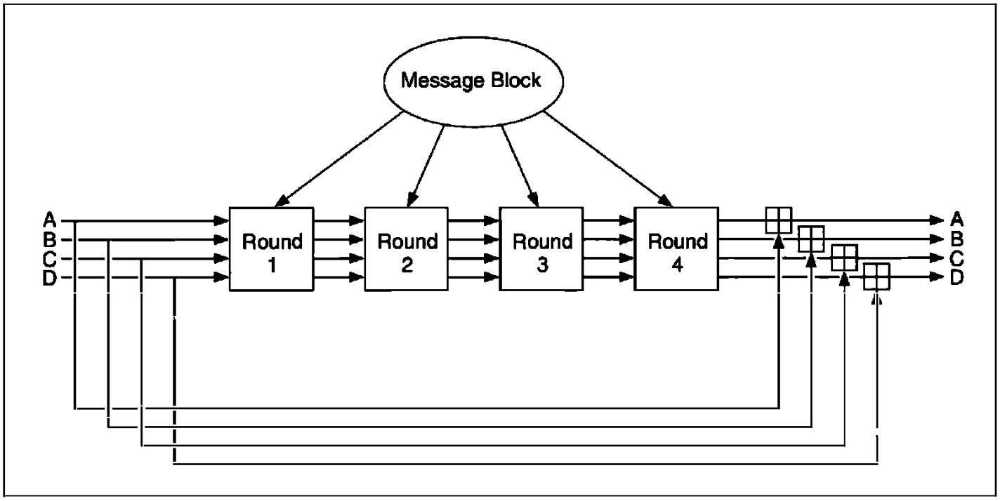
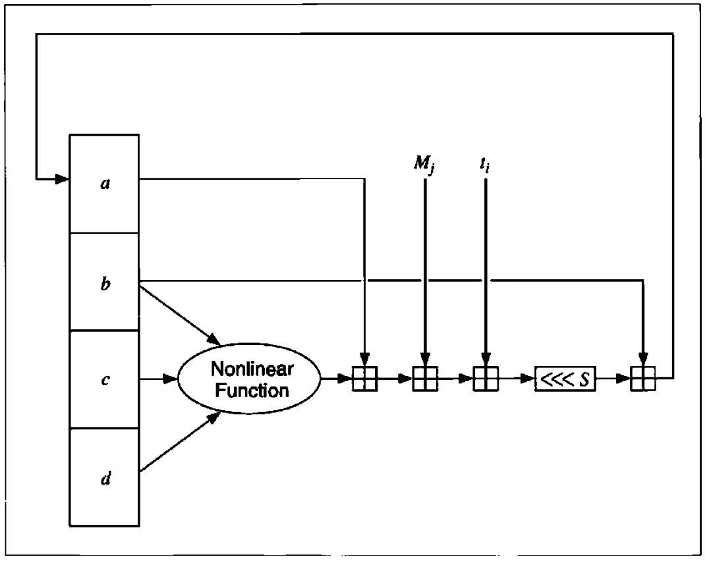
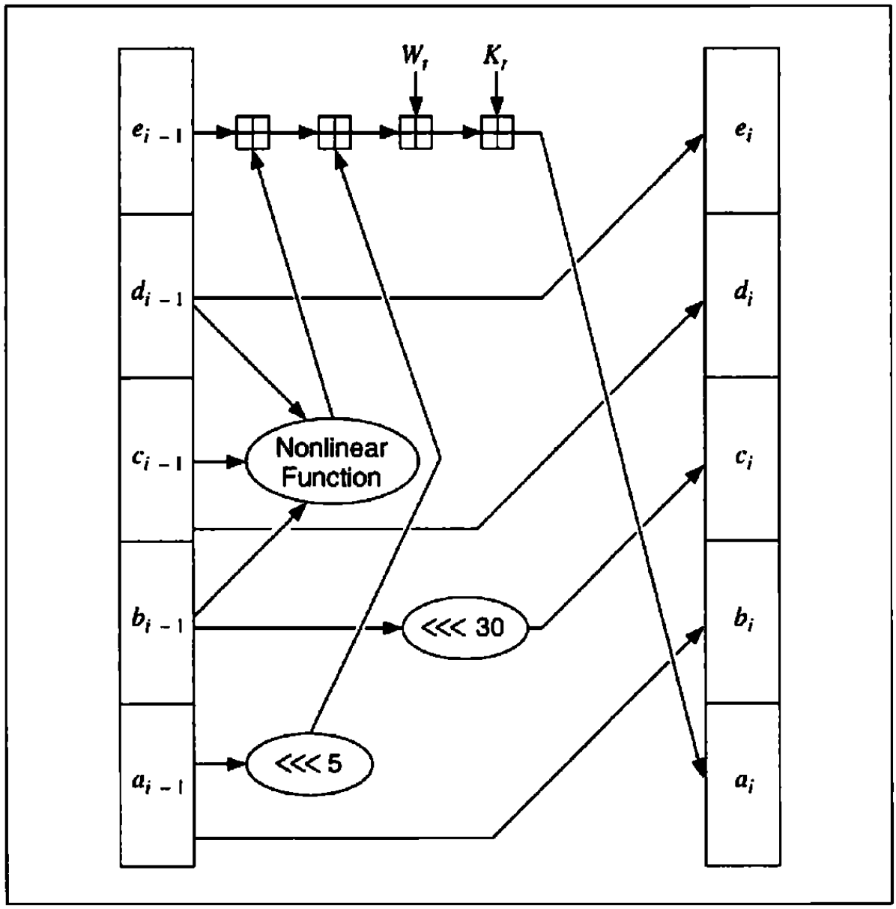
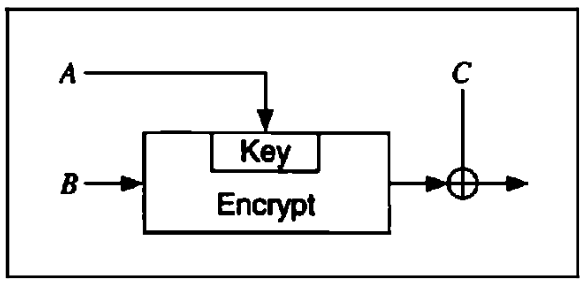
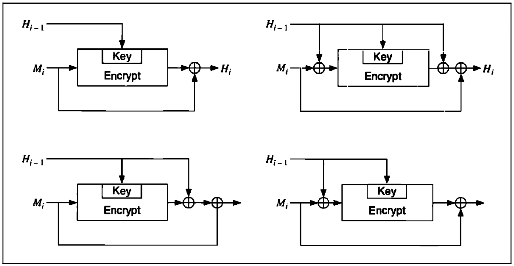
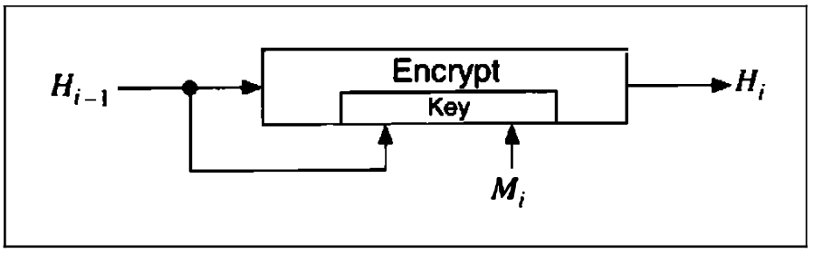

# One-Way Hash Functions

[TOC]

## BACKGROUND

A one-way hash function, $H(M)$, operates on an arbitrary-length pre-image message, $M$. It returns a fixed-length hash value, $h$:
$$
h = H(M), \text{ where } h \text{ is of length } m
$$
, Many functions can take an arbitrary-length input and return an output of fixed length, but one-way hash functions have additional characteristics that make them one-way:

- Given $M$, it is easy to compute $h$.
- Given $h$, it is hard to compute $M$ such that $H(M) = h$.
- Given $M$, it is hard to find another message, $M'$, such that $H(M) = H(M')$.

### Overview of One-Way Hash Functions

It's not easy to design a function that accepts an arbitrary-length input, let alone make it one-way. In the real world, one-way hash functions are built on the idea of a **compression function**. This one-way function outputs a hash value of length $n$ given an input of some larger length $m$. The inputs to the compression function are a message block and the output of the previous blocks of text. The output is the hash of all blocks up to that point. That is, the hash of block $M_i$ is:
$$
h_i = f(M_i, h_{i - 1})
$$
, this hash value, along with the next message block,  becomes the next input to the compression function. The hash of the entire message is the hash of the last block.

## SNEFRU

Snefru is a one-way hash function designed by Ralph Merkle. Snefru hashes arbitrary-length messages into either 128-bit or 256-bit values.

## N-HASH

N-Hash uses 128-bit message blocks, a complicated randomizing function similar to FEAL's, and produces a 128-bit hash value.

The hash of each 128-bit block is a function of the block and the hash of the previous block:
$$
H_) = I, \text{ where } I \text{ is a random initial value} \\
H_i = g(M_i, H_{i - 1}) \oplus M_i \oplus H_{i - 1}
$$
The hash of the entire message is the hash of the last message block. The random initial value, $I$, can be any value determined by the user (even all zeros).

## MD4

MD stands for **Message Digest**, the algorithm produces a 128-bit hash, or message digest, of the input message. Rivest outlined his design goals for the algorithm:

- `Security`. It is computationally infeasible to find two messages that hashed to the same value. No attack is more efficient than brute force.
- `Direct Security`. MD4's security is not based on any assumption, like the difficulty of factoring.
- `Speed`. MD$ is suitable for high-speed software implementations. It is based on a simple set of bit manipulations on 32-bit operands.
- `Simplicity and Compactness`. MD4 is as simple as possible, without large data structures or a complicated program.
- `Favor Little-Endian Architectures`. MD4 is optimized for microprocessor architectures (specifically Intel microprocessors); larger and faster computers make any necessary translations.

## MD5

After some initial processing, MD5 processes the input text in 521-bit blocks, divided into 16 32-bit sub-blocks. The output of the algorithm is a set of four 32-bit blocks, which concatenate to form a single 128-bit hash value.

*MD5 main loop.*

*One MD5 operation*

### Security of MD5

Ron Rivest outlined the improvements of MD5 over MD4:

1. A fourth round has been added.
2. Each step now has a unique additive constant.
3. The function $G$ in round 2 was changed from $((X \wedge Y) \vee (X \wedge Z) \vee (Y \wedge Z))$ to $((X \wedge Z) \vee (Y \wedge \urcorner Z))$ to make $G$ less symmetric.
4. Each step now adds in the result of the previous step. This promotes a faster avalancher effect.
5. The order in which message sub-blocks are accessed in rounds 2 and 3 is changed, to make these patterns less alike.
6. The left circular shift amounts in each round have been approximately optimized, to yield a faster avalanche effect. The four shifts used in each round are different from the ones used in other rounds.

## MD2

MD2 is another 128-bit one-way hash function designed by Ron Rivest. It, along with MD5, is used in the PEM protocols. The security of MD2 is dependent on a random permutation of bytes. This permutation is fixed, and depends on the digits of $\pi$. $S_0, S_1, S_2, ..., S_{255}$ is the permutation. To hash a message $M$:

1. Pad the message with $i$ bytes of value $i$ so that the resulting message is a multiple of 16 bytes long.

2. Append a 16-byte checksum to the message.

3. Initialize a 48-byte block: $X_0, X_1, X_2, ..., X_{47}$. Set the first 16 bytes of $X$ to be 0, the second 16 bytes of $X$ to the first 16 bytes of the message, and the third 16 bytes of $X$ to be the XOR of the first 16 bytes of $X$ and the second 16 bytes of $X$.

4. This is the compression function:

   TODO

5. Set the second 16 bytes of $X$ to be the second 16 bytes of the message, and the third 16 bytes of $X$ to be the XOR of the first 16 bytes of $X$ and the second 16 bytes of $X$. Do step 4. Repeat steps 5 and 4 with every 16 bytes of the message, in turn.

6. The output is the first 16 bytes of $X$.

## SECURE HASH ALGORITHM (SHA)

*One SHA operation*

## HAVAL

HAVAL is a variable-length one-way hash function. It is a modification of MD5. HAVAL processes messages in blocks of 1024 bits, twice those of MD5. It has eight 32-bit chaining variables, twice those of MD5. It has a variable number of rounds, from three to five (each of which has 16 steps), and it can produce a hash length of 128, 160, 192, 224, or 256 bits.

## ONE-WAY HASH FUNCTIONS USING SYMMETRIC BLOCK ALGORITHMS

### Schemes Where the Hash Length Equals the Block Size

The general scheme is as follows:
$$
H_0 = I_H, \text{ where } I_H \text{ is a random initial value} \\
H_i = E_A(B) \oplus C
$$
, where $A$, $B$, and $C$ can be either $M_i$, $H_{i - 1}$, $(M_i \oplus H_{i - 1})$, or a constant (assumed to be 0). $H_0$ is some random initial value: $I_H$. The message is divided up into block-size chunks, $M_i$, and processed individually. And there is some kind of MD-strengthening, perhaps the same padding procedure used in MD5 and SHA.

*General hash function where the hash length equals the block size.*

*The four secure hash functions where the block length equals the hash size.*

### Modified Davies-Meyer

Lai and Massey modified the Davies-Meyer technique to work with the IDEA cipher. IDEA has a 64-bit block size and 128-bit key size. Their scheme is:
$$
H_0 = I_H, \text{ where } I_H \text{ is a random initial value} \\
H_i = E_{H_{i - 1}, M_i}(H_{i - 1})
$$
, this function hashes the message in blocks of 64 bits and produces a 64-bit hash value.

No known attack on this scheme is easier than brute force.

*Modified Davies-Meyer*

