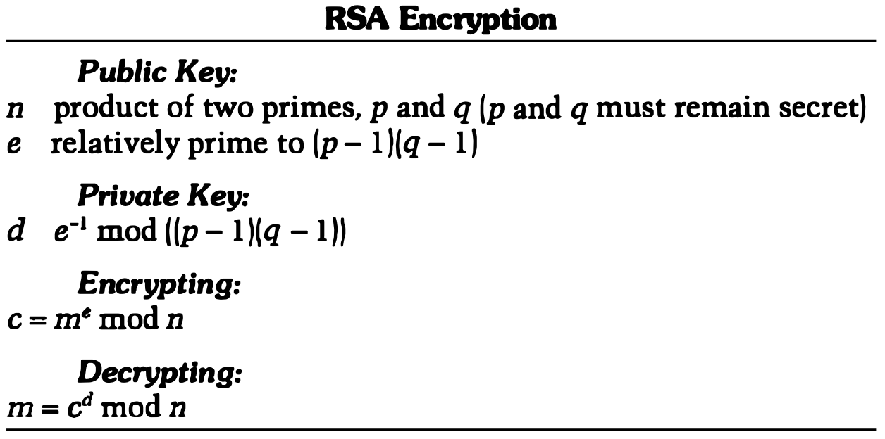
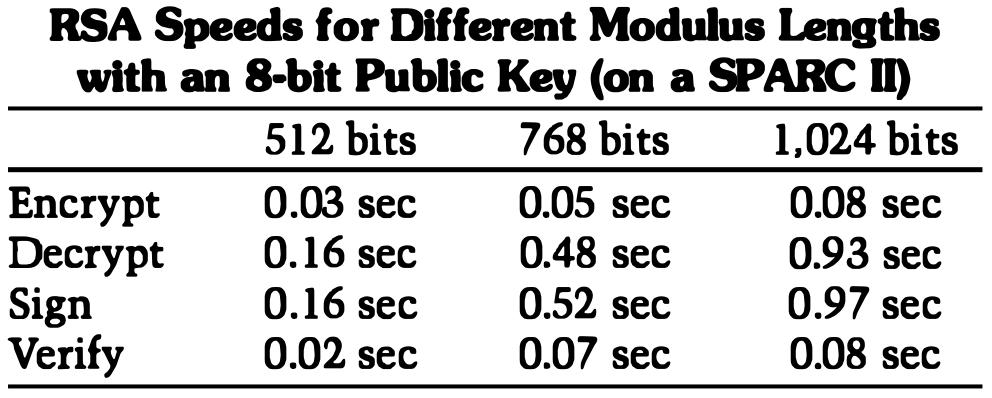
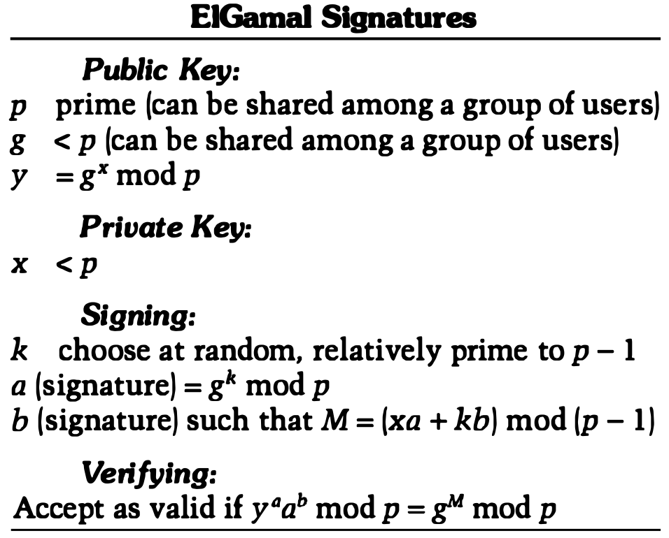
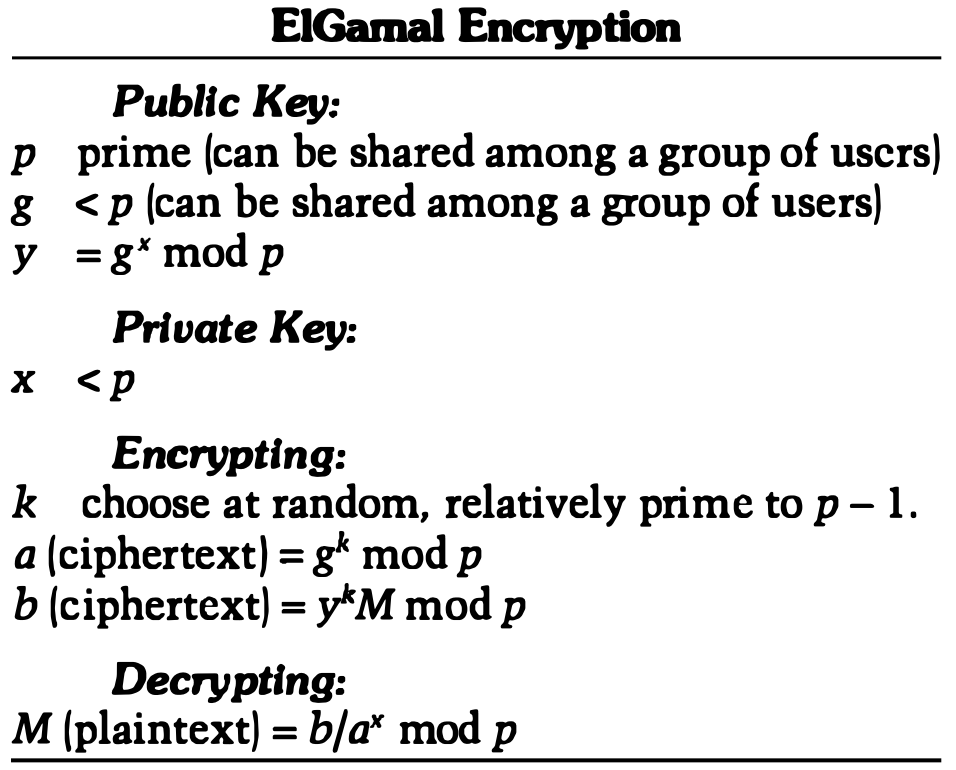

# CHAPTER 19 Public-Key Algorithms

[TOC]

## KNAPSACK ALGORITHMS

Given a set of values $M_1, M_2, ..., M_n$, and a sum $S$, compute the value of $b_i$ such that:
$$
S = b_1 M_1 + b_2 M_2 + ... + b_n M_n
$$
, The values of $b_i$ can be either zero or one. A one indicates that the item is in the knapsack; a zero indicates that it isn't.

### Superincreasing Knapsacks

The solution to a **superincreasing knapsack** is easy to find. Take the total weight and compare it with the largest number in the sequence. If the total weight is less than the number, then it is not in the knapsack. If the total weight is greater than or equal to the number, then it is in the knapsack. Reduce the weight of the knapsack by the value and move to the next largest number in the sequence. Repeat until finished. If the total weight has been brought to zero, then there is a solution. If the total weight has not, there isn't.

### Creating the Public Key from the Private Key

To get a normal knapsack sequence, take a superincreasing knapsack sequence, for example, `{2, 3, 6, 13, 27, 52}`, and multiply all of the values by a number $n$, mod `m`. The modulus should be a number greater than the sum of all the numbers in the sequence: for example, 105. The multiplier should have no factors in common with the modulus: for example, 31. The normal knapsack sequence would then be:
$$
2 * 31 \mod 105 = 62 \\
3 * 31 \mod 105 = 93 \\
6 * 31 \mod 105 = 81 \\
13 * 31 \mod 105 = 88 \\
27 * 31 \mod 105 = 102 \\
52 * 31 \mod 105 = 37
$$
, The knapsack would then be `{62, 93, 81, 88, 102, 37}`.

### Encryption

To encrypt a binary message, first break it up into blocks equal to the number of items in the knapsack sequence. Then, allowing a one to indicate the item is present and a zero to indicate that the item is absent, compute the total weights of the knapsacks--one for every message block.

### Decryption

A legitimate recipient of this message knows the private key: the original super-increasing knapsack, as well as the values of $n$ and $m$ used to transform it into a normal knapsack. To decrypt the message, the recipient must first determine $n^{-1}$ such that $n(n^{-1}) = 1 (mod\ m)$. Multiply each of the ciphertext values by $n^{-1} \mod m$, and then partition with the private knapsack to get the plaintext values.

### Practical Implementations

With a knapsack sequence of only six items, it's not hard to solve the problem even if it isn't superincreasing. Real knapsacks should contain at least 250 items. The value for each term in the superincreasing knapsack should be somewhere between 200 and 400 bits long, and the modulus should be somewhere between 100 to 200 bits long. Real implementations of the algorithm use random-sequence generators to produce these values.

## RSA

RSA gets its security from the difficulty of factoring large numbers. The public and private keys are functions of a pair of large (100 to 200 digits or even larger) prime numbers. Recovering the plaintext from the public key and the ciphertext is conjectured to be equivalent to factoring the product of the two primes.

To generate the two keys, choose two random large prime numbers, $p$ and $q$. For maximum security, choose $p$ and $q$ of equal length. Compute the product:
$$
n = pq
$$
Then randomly choose the encryption key, $e$, such that $e$ and $(p - 1)(q - 1)$ are relatively prime. FInally, use the extended Euclidean algorithm to compute the decryption key, $d$, such that:
$$
ed \equiv 1 \mod (p - 1)(q - 1)
$$
In other words,
$$
d = e^{-1} \mod((p - 1)(q - 1))
$$
Note that $d$ and $n$ are also relatively prime. The numbers $e$ and $n$ are the public key; the number $d$ is the private key. The two primes, $p$ and $q$, are no longer needed. They should be discarded, but never revealed.

To encrypt a message $m$, first divide it into numerical blocks smaller than $n$ (with binary data, choose the largest power of 2 less than $n$). That is, if both $p$ and $q$ are 100-digit primes, then $n$ will have just under 200 digits and each message block, $m_i$, should be just under 200 digits long. (If you need to encrypt a fixed number of blocks, you can pad them with a few zeros on the left to ensure that they will always be less than $n$.) The encrypted message, $c$, will be made up of similarly sized message blocks, $c_i$, of about the same length. The encryption formula is simply:
$$
c_i = m_i^{e} \mod n
$$
To decrypt a message, take each encrypted block $c_i$ and compute:
$$
m_i = c_I^{d} \mod n
$$
Since:
$$
c_i^{d} = (m_i^{e})^{d} = m_i^{ed} = m_i^{k(p - 1)(q - 1) + 1} = m_i \times m_i^{k(p - 1)(q - 1)} = m_i \times 1 = m_i
$$
, all the formula recovers the message.

### Speed of RSA

### Common Modulus Attack on RSA

A possible RSA implementation gives everyone the same $n$, but different values for the exponents $e$ and $d$. Unfortunately, this doesn't work. The most obvious problem is that if the same message is ever encrypted with two different exponents(both having the same modulus), and those two exponents are relatively prime(which they generally would be), then the plaintext can be recovered without either of the decryption exponents.

Let $m$ be the plaintext message. The two encryption keys are $e_1$ and $e_2$. The common modulus is $n$. The two ciphertext messages are:
$$
c_1 = m^{e_1} \mod n \\
c_2 = m^{e_2} \mod n
$$
The cryptanalyst knows $n$, $e_1$, $e_2$, $c_1$, and $c_2$. Here's how he recovers $m$.

Since $e_1$ and $e_2$ are relatively prime, the extended Euclidean algorithm can find $r$ and $s$, such that:
$$
re_1 + se_2 = 1
$$
Assuming $r$ is negative (either $r$ or $s$ has to be, so just call the negative one $r$), then the extended Cuclidean algorithm can be used again to calculate $c_1^{-1}$. Then:
$$
(c_1^{-1})^{-r} \times c_{2}^{s} = m \mod n
$$
There are two other, more subtle, attacks against this type of system. One attack uses a probabilistic method for factoring $n$. The other uses a deterministic algorithm for calculating comeone's secret key without factoring the modulus.

### Low Encryption Exponent Attack against RSA

RSA encryption and signature verification are faster if you use a low value for $e$, but that can also be insecure. If you encrypt $e(e + 1)/2$ linearly dependent messages with different public keys having the same value of $e$, there is an attack against the system. If there are fewer than that many messages, or if the messages are unrelated, there is no problem. If the messages are identical, then $e$ messages are enough. The easiest solution is to pad messages with independent random values. This also ensures that $m^e \mod n \neq m^e$. Most real-world RSA implementations--PEM and PGP.

Moral: Pad messages with random values before encrypting them; make sure $m$ is about the same size as $n$.

### Low Decryption Exponent Attack against RSA

Another attack, this one by Michael Wiener, will recover $d$, when $d$ is up to one quarter the size of $n$ and $e$ is less than $n$. This rarely occurs if $e$ and $d$ are chosen at random, and cannot occur if $e$ has a small value.

Moral: Choose a large value for $d$.

### Lessons Learned

Judith Moore lists several restrictions on the use of RSA, based on the success of these attacks:

- Knowledge of one encryption/decryption pair of exponents for a given modulus enables an attacker to factor the modulus.
- Knowledge of one encryption/decryption pair of exponents for a given modulus enables an attacker to calculate other encryption/decryption pairs without having to factor $n$.
- A common modulus should not be used in a protocol using RSA in a communications network. (This should be obvious from the previous two points.)
- Messages should be padded with random values to prevent attacks on low encryption exponents.
- The decryption exponents should be large.

## POHLIG-HELLMAN

The Pohlig-Hellman encryption scheme is similar to RSA. It is not a symmetic algorithm, because different keys are used for encryption and decryption. It is not a public-key scheme, because the keys are easily derivable from each other; both the encryption and decryption keys must be kept secret.

Like RSA,
$$
C = P^e \mod n\\
P = C^d \mod n
$$
, where:
$$
ed \equiv 1(\text{mod some compilcated number})
$$
Unlike RSA, $n$ is not defined in terms of two large primes, it must remain part of the secret key. If someone had $e$ and $n$, they could calculate $d$. Without knowledge of $e$ or $d$, an adversary would be forced to calculate:
$$
e = \log_p C \mod n
$$
We have already seen that this is a hard problem.

## RABIN

Rabin's scheme gets its security from the difficult of finding square roots modulo a composite number. This problem is equivalent to factoring. Here is one implementation of this scheme.

First choose two primes, $p$ and $q$, both congruent to 3 mod 4. These primes are the private key; the product $n = pq$ is the public key.

To encrypt a message, $M$($M$ must be less than $n$), simply compute:
$$
C = M^2 \mod n
$$
Decrypting the message is just as easy, but slightly more annoying. Since the receiver knows $p$ and $q$, he can solve the two congruences using the Chinese remainder theorem. Compute:
$$
m_1 = C^{(p + 1)/4} \mod p \\
m_2 = (p - C^{(p + 1)/4}) \mod p \\
m_3 = c^{(q + 1)/4} \mod p \\
m_4 = (q - C^{(q + 1)/4}) \mod q
$$
Then choose an integer $q = q(q^{-1} \mod p)$ and a integer $b = p(p^{-1} \mod q)$. The four possible solutions are:
$$
M_1 = (am_1 + bm_3) \mod n \\
M_2 = (am_1 + bm_4) \mod n \\
M_3 = (am_2 + bm_3) \mod n \\
M_4 = (am_2 + bm_4) \mod n
$$
One of those four results, $M_1, M_2, M_3$, or $M_4$, equals $M$. If the message is English text, it should be easy to choose the correct $M_i$. On the other hand, if the message is a random-bit stream(say, for key generation or a digital signature), there is no way to determine which $M_i$ is correct. One way to solve this problem is to add a known header to the message before encrypting.

### Williams

Hugh Williams redefined Rabin's schemes to eliminate these shortcomings. In his scheme, $p$ and $q$ are selected such that:

$$
p \equiv 3 \mod 8 \\
q \equiv 7 \mod 8
$$

and 

$$
N = pq
$$

Also, there is a small integer, $S$, such that $J(S, N) = -1$($J$ is the Jacobi symbol). $N$ and $S$ are public. The secret key is $k$, such that:

$$
k = 1/2 * (1/4 * (p - 1) * (q - 1) + 1)
$$

To encrypt a message $M$, compute $c_1$ such that $J(M, N) = (-1)^{c_1}$. Then, compute $M' = (S^{e_1} * M) \mod N$. Like Rabin's scheme, $C = M^2 \mod N$. And $c_2 = M' \mod 2$. The final ciphertext message is the triple:

$$
(C, c_1, c_2)
$$

To decrypt $C$, teh receiver computes $M''$ using:

$$
C^k = \equiv \pm M''(\mod N)
$$

The proper sign of $M''$ is given by $c_2$. Finally,

$$
M = (S^{c_1} * (-1)^{c_1} * M'') \mod N
$$

## ELGAMAL

The ElGamal scheme cna be used for both digital signatures and encryption; it gets its security from the difficulty of calculating discrete logarithms in a finite field.

To generate a key pair, first choose a prime, $p$, and two random numbers, $g$ and $x$, such that both $g$ and $x$ are less than $p$. Then calculate:

$$
y = g^x \mod p
$$

The public key is $y$, $g$, and $p$. Both $g$ and $p$ can be shared among a group of users. The private key is $x$.

### ElGamal Signatures

To sign a message, $M$, first choose a random number, $k$, such that $k$ is relatively prime to $p - 1$. Then compute:

$$
a = g^k \mod p
$$

and use the extended Euclidean algorithm to solve for $b$ in the following equation:

$$
M = (xa + kb) \mod (p - 1)
$$

The signature is the pair: $a$ and $b$. The random value, $k$, must be kept secret. To verify a signature, confirm that:

$$
y^a a^b \mod p = g^M \mod p
$$

Each ElGamal signature or encryption requires a new value of $k$, and that value must be chosen randomly.

### ElGamal Encryption

A modification of ElGamal can encrypt messages. To encrypt message $M$, first choosea random $k$, such that $k$ is relatively prime to $p - 1$. Then compute:

$$
a = g^k \mod p \\
b = y^k M \mod p
$$

The pair, $a$ and $b$, is the ciphertext. Note that the ciphertext is twice the size of the plaintext.

To decrypt $a$ and $b$, compute

$$
M = b/a^x \mod p
$$

Since $a^x \equiv g^{kx} (\mod p)$, and $b/a^x \equiv y^k M/a^x \equiv g^{xk}M/g^{xk} \equiv M(\mod p)$, this all works. This is really the same as Diffie-Hellman key exchange, except that $y$ is part of the key, and the encryption is multiplied by $y^k$.

## MCELIECE

Let $d_H(x, y)$ denote the Hamming distance between $x$ and $y$. The numbers $n$, $k$, and $t$ are system parameters.

The private key has three parts: $G'$ is a $k * n$ generator matrix for a Goppa code that can correct $t$ errors. $P$ is an $n * n$ permutation matrix. $S$ is a $k * k$ nonsingular matrix.

The public key is a $k * n$ matrix $G: G = SG'P$.

Plaintext messages are strings of $k$ bits, in the form of $k$-element vectors over $GF(2)$. 

To encrypt a message, choose a random $n$-element vector over $GF(2)$, $z$, with Hamming distance less than or equal to $t$.

$$
c = mG + z
$$

To decrypt the ciphertext, first compute $c' = cP^{-1}$. Then, using the decoding algorithm for the Goppa code, fidn $m'$ such that $d_H(m'G, c')$ is less than or equal to $t$. Finally, compute $m = m' S^{-1}$.

## LUC

The $n$th Lucas number, $V_n(P, 1)$, is defined as:

$$
V_n(P, 1) = PV_{n - 1}(P, 1) - V_{n - 2}(P, 1)
$$

In any case, to generate a public-key/private-key key pair, first choose two large primes, $p$ and $q$. Calculate $n$, the product of $p$ and $q$. The encryption key, $e$, is a random number that is relatively prime to $p - 1$, $q - 1$, $p + 1$, and $q + 1$.

There are four possible decryption keys,

$$
d = e^{-1} \mod (lcm((p + 1), (q + 1))) \\
d = e^{-1} \mod (lcm((p + 1), (q - 1))) \\
d = e^{-1} \mod (lcm((p - 1), (q + 1))) \\
d = e^{-1} \mod (lcm((p - 1), (q - 1)))
$$

, whre lcm is the least common multiple.

The public key is $d$ and $n$; the private key is $e$ and $n$. Discard $p$ and $q$.

To encrypt a message, $P$ ($P$ must be less than $n$), calculate:

$$
C = V_e(P, 1)(\mod n)
$$

And to decrypt:

$$
P = V_d(P, 1)(\mod n), \text{ with the proper } d
$$

