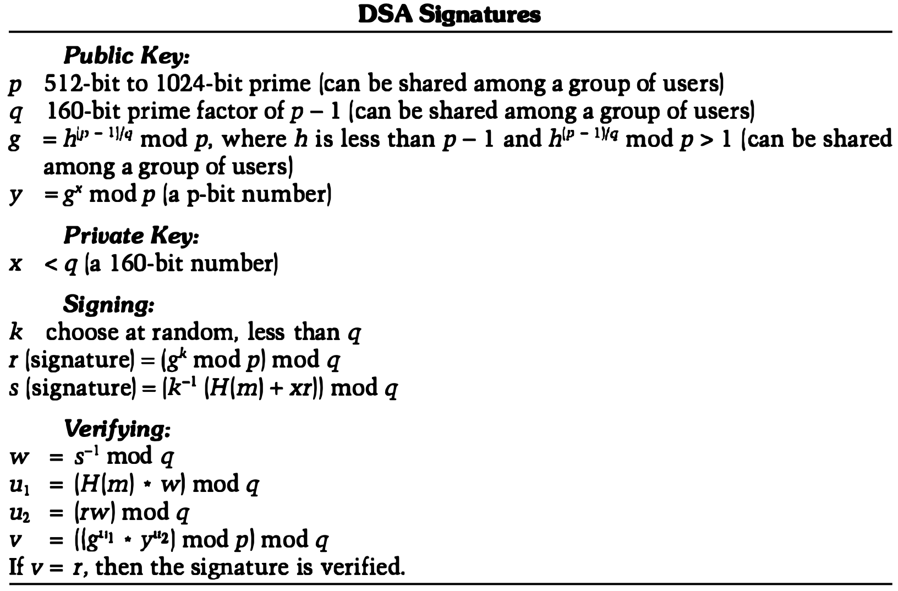
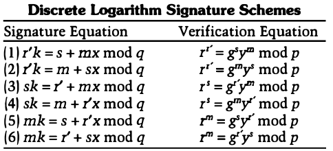

# CHAPTER 20 Public-Key Digital Signature Algorithms

[TOC]

## DIGITAL SIGNATURE ALGORITHM (DSA)

### Description of DSA

DSA is a variant of the Schnorr and ElGamal signature algorithms. The algorithm uses the following parameters:

- $p$. a prime number $L$ bits long, when $L$ ranges from 512 to 1024 and is a multiple of 64.
- $q$. a 160-bit prime factor of $p - 1$.
- $g = h^{(p - 1)/q} \mod p$, where $h$ is any number less than $p - 1$ such that $h^{(p - 1)/q} \mod p$ is greater than 1.
- $x$. a number less than $q$.
- $y = g^x \mod p$.

The algorithm also makes use of a one-way hash function: $H(m)$.

### DSA Prime Generation

NIST recommended a specific method for generating the two primes, $p$ and $q$, where $q$ divides $p - 1$. The prime $p$ is $L$ bits long, between 512 and 1024 bits long, in some multiple of 64 bits. The prime $q$ is 160 bits long. Let $L - 1 = 160n + b$, where $L$ is the length of $p$, and $n$ and $b$ are two numbers and $b$ is less than 160:

1. Choose an arbitrary sequence of at least 160 bits and call it $S$. Let $g$ be the length of $S$ in bits.

2. Compute $U = SHA(S) \oplus SHA((S + 1) \mod 2^g)$, where SHA is the Secure Hash Algorithm.

3. Form $q$ by setting the most significant bit and the least significant bit of $U$ to 1.

4. Check whether $q$ is prime.

5. If $q$ is not prime, go back to setp 1.

6. Let $C = 0$ and $N = 2$.

7. For $k = 0, 1, ..., n$, let $V_k = SHA((S + N + k) \mod 2^g)$

8. Let $W$ be the integer
   $$
   W = V_0 + 2^{160}V_1 + ... + 2^{160(n - 1)}V_{n - 1} + 2^{160n}(V_n \mod 2^b)
   $$
   and let
   $$
   X = W + 2^{L - 1}
   $$
   Note that $X$ is an $L$-bit number.

9. Let $p = X - ((X \mod 2q) - 1)$. Note that $p$ is congruent to $1 \mod 2q$.

10. If $p < 2^{L - 1}$, then go to setp 13.

11. Check whether $p$ is prime.

12. If $p$ is prime, go to step 15.

13. Let $C = C + 1$ and $N = N + n + 1$.

14. If $C = 4096$, then go to step 1. Otherwise, go to step 7.

15. Save the value of $S$ and the value of $C$ used to generate $p$ and $q$.

### ElGammal Encryption with DSA

Assume that the DSA algorithm is implemented with a single function call:
$$
DSAsign(p, q, g, k, x, h, r, s)
$$
You supply the numbers $P, q, g, k, x$ and $h$, and the function returns the signature parameters: $r$ and $s$.

To do ElGammal encryption of message $m$ with public key $y$, choose a random number, $k$, and call:
$$
DSAsign(p, p, g, k, 0, 0, r, s)
$$
The value of $r$ returned is $a$ in the ElGamal scheme. Throw $s$ away. Then, call:
$$
DSAsign(p, p, y, k, 0, 0, r, s)
$$
Rename the value of $r$ to be $u$; throw $s$ away. Call:
$$
DSAsign(p, p, m, l, u, 0, r, s)
$$
Throw $r$ away. The value of $s$ returned is $b$ in the ElGamal scheme. You now have the ciphertext, $a$ and $b$.

Descryption is just as easy. Using secret key $x$, and ciphertext messages $a$ and $b$, call:
$$
DSAsign(p, p, a, x, 0, 0, r, s)
$$
The value $r$ is $a^x \mod p$. Call that $e$. Then call:
$$
DSAsign(p, p, l, e, b, 0, r, s)
$$
The value $s$ is the plaintext message, $m$.

### RSA Encryption with DSA

RSA encryption is even easier. With a modulus $n$, message $m$, and public key $e$, call:
$$
DSAsign(n, n, m, e, 0, 0, r, s)
$$
The value of $r$ returned is the ciphertext.

RSA decrytpion is the smae thing. If $d$ is the private key, then:
$$
DSAsign(n, n, m, d, 0, 0, r, s)
$$
returns the plaintext as the value of $r$.

## DSA VARIANTS

This variant makes computation easier on the signer by not forcing him to compute $k^{-1}$. All the parameters are as in DSA. To sign a message, $m$, Alice generates two random numbers, $k$ and $d$, both less than $q$. The signature is:
$$
r = (g^k \mod p) \mod q \\
s = (H(m) + xr) \times d \mod q \\
t = kd \mod q
$$
Bob verifies the signature by computing:
$$
w = t/s \mod q \\
u_1 = (H(m) \times w) \mod q \\
u_2 = (rw) \mod q
$$
if $r = ((g^{u_1} \times y^{u_2}) \mod p) \mod q$, then the signature is verified.

This next variant makes computation easier on the verifier. All the parameters are as in DSA. To sign a message, $m$, Alice generates a random number, $k$, less than $q$. The signature is:
$$
r = (g^k \mod p) \mod q \\
s = k \times (H(m) + xr)^{-1} \mod q
$$
Bob verifies the signature by computing:
$$
u_1 = (H(m) \times s) \mod q \\
u_2 = (sr) \mod q
$$
If $r = ((g^{u_1 * y^{u_2}}) \mod p) \mod q$, then the signature is varified.

There is also a variant for DSA prime generation, one that embeds $q$ and the parameters used to generate the primes within $p$. Whether this scheme reduces the security of DSA is still unknown:

1. Choose an arbitrary sequence of at least 160 bits and call it $S$. Let $g$ be teh length of $S$ in bits.
2. Compute $U = SHA(S) \oplus SHA((S + 1) \mod 2^g)$, whre SHA is the Secure Hash Algorithm.
3. Form $q$ by setting the most significant bit and the least significant bit of $U$ to 1.
4. Check whether $q$ is prime.
5. Let $p$ be the concatenation of $q, S, C$, and $SHA(S)$. $C$ is set to 32 zero bits.
6. $p = p - (p \mod q) + 1.$
7. $p = p + q.$
8. If the $C$ in $p$ is $0x7fffffff$, go to step 1.
9. Check whether $p$ is prime.
10. If $p$ is composite, go to step 7.

## GOST DIGITAL SIGNATURE ALGORITHM

The algorithm is very similar to DSA, and uses the following parameters:

- $p$. a prime number, either between 509 and 512 bits long, or between 1020 and 1024 bits long.
- $q$. a 254- to 256-bit prime factor of $p - 1$.
- $a$. any number less than $p - 1$ such that $a^q \mod p = 1$.
- $x$. a number less than $q$.
- $y = a^x \mod p.$

The algorithm also makes use of a one-way hash function: $H(x)$. The standard sepcifies GOST R 34.11-94, a function based on the GOST symmetric algorithm.

The first three parameters, $p$, $q$, and $a$, are public and can be common across a network of users. The private key is $x$; the public key is $y$.

To sign a message, $m$

1. Alice generates a random number, $k$, less than $q$
2. Alice generates
	$$
	r = (a^k \mod p) \mod q \\
	s = (xr + k(H(m))) \mod q
	$$
	
	If $H(m) \mod q = 0$, then set it equal to 1. If $r = 0$, then choose another $k$ and start again. The signature is two numbers: $r \mod 2^{256}$ and $s \mod 2^{256}$. She sends these to Bob.
	
3. Bob verifies the signature by computing:
	$$
	v = H(m)^{q - 2} \mod q \\
	z_1 = (sv) \mod q \\
	z_2 = ((q - r) * v) \mod q \\
	u = ((z^{z_1} \cdot y^{z_2}) \mod p) \mod q
	$$
	
	If $u = r$, then the signature is verified.

## DISCRETE LOGARITHM SIGNATURE SCHEMES

Choose $p$, a large prime number, and $q$, either $p - 1$ or a large prime factor of $p - 1$. Then choose $g$, a number between 1 and $p$ such that $g^q \equiv 1 (\mod p)$. All these numbers are public, and can be common to a group of users. The privte key is $x$, less than $q$. The public key is $y = g^x \mod p$.

To sign a message, $m$, first choose a random $k$ less than and relatively prime to $q$. If $q$ is also prime, any $k$ less than $q$ works. First compute:
$$
r = g^k \mod p
$$

The generalized **signature equation** now becomes:
$$
ak = b + cx \mod q
$$

The coefficients $a$, $b$ and $c$ can be any of a variety of things. Each line in above table gives sixe possibilities:

To verify the signature, the receiver must confirm that:
$$
r^a = g^b y^c \mod p
$$

this is called the **verification equation**.

One of the nice things about using RSA for digital signatures is a feature called **message recovery**. When you verify an RSA signature, you compute $m$. Then you compare the computed $m$ with the message and see if the signature is valid for that message. With the previous schemes, you can't recover $m$ when you compute the signature; you need a candidate $m$ that you use in a verification equation. Well, as it turns out it is possible to construct a message recovery variant for all the above signature schemes.

To sign, first compute:
$$
r = mg^k \mod p
$$
and replace $m$ by 1 in the signature equation. Then you can reconstruct the verification equation such that $m$ can be computed directly.

You can do the same with the DSA-like schemes:
$$
r = (mg^k \mod p) \mod q
$$
All the variants are equally secure, so it makes sense to choose a scheme that is easy to compute with. The requirement to compute inverses slows most of these schemes. As it turns out, a scheme in this pile allows comuting both the signature equation and the verification equation without inverses and also gives message recovery. It is called the **p-NEW** scheme:
$$
r = mg^{-k} \mod p \\
s = k - r'x \mod q
$$
And $m$ is recovered (and the signature verified) by:
$$
m = g^s y^{r'}r \mod p
$$

## ONG-SCHNORR-SHAMIR

This signature scheme uses polynomials modulo $n$. Choose a large intreger $n$(you need not know the factorization of $n$). Then choose a random integer, $k$, such that $k$ and $n$ are relatively prime. Calculate $h$ such that:
$$
h = -k^{-2} \mod n = -(k^{-1})^2 \mod n
$$
The public key is $h$ and $n$; $k$ is the private key.

To sign a message, $M$, first generate a random number, $r$, such that $r$ and $n$ are relatively prime. Then calculate:
$$
S_1 = 1/2 * (M/r + r) \mod n \\
S_2 = k/2 * (M/r - r) \mod n
$$
The pair, $S_1$ and $S_2$, is the signature.

To verify a signature, confirm that:
$$
S_1^{2} + h * S_2^{2} \equiv M (\mod n)
$$

## ESIGN

ESIGN is a digital signature scheme from NTT Japan. It is touted as being at least as secure and considerably faster than either RSA or DSA, with similar key and signature lengths.

The private key is a pair of large prime numbers, $p$ and $q$. The public key is $n$, when:
$$
n = p^2q
$$
$H$ is a hash function that operates on a message, $m$, such that $H(m)$ is between $0$ and $n - 1$. There is also a security parameter, $k$, which will be discussed shortly:

1. Alice picks a random number $x$, where $x$ is less than $pq$.

2. Alice computes:

   $w$, the least integer that is larger than or equal to:
   $$
   (H(m) - x^k \mod n)/pq \\
   s = x + ((w/kx^{k - 1}) \mod p) pq
   $$

3. Alice sends $s$ to Bob.

4. To verify the signature, Bob computes $s^k \mod n$. He also computes $a$, which is the least integer larger than or equal to two times the number of bits of $n$ divided by 3. If $H(m)$ is less than or equal to $s^k \mod n$, and if $s^k \mod n$ is less than $H(m) + 2^a$, then the signature is considered valid.

   