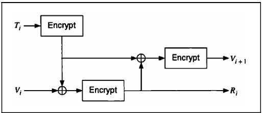
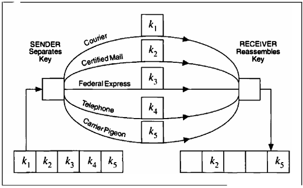

# 8 KEY MANAGEMENT

[TOC]

## GENERATING KEYS

The security of an algorithm rests in the key. If you're using a cryptographically weak process to generate keys, then your whole system is weak.

### Pass Phrases

A technique called **key crunching** converts the easy-to-remember phrase into random keys. Use a one-way hash function to transform an arbitrary-length text string into a pseudo-random-bit string.

### X9.17 Key Generation

The ANSI X9.17 standard specifies a method of key generation (see the following figure). This does not generate easy-to-remember keys; it is more suitable for generating session keys or pseudo-random numbers within a system. The cryptographic algorithm used to generate keys is triple-DES, but it could just as easily by any algorithm.

Let $E_{K}(X)$ be triple-DES encryption of $X$ with key $K$. This is a special key reserved for secret key generation. $V_0$ is a secret 64-bit seed. $T$ is a timestamp. To generate the random key $R_i$, calculate:
$$
R_i = E_{K}(E_{K}(T_i) \oplus V_i)
$$
, To generate $V_{i + 1}$, calculate:
$$
V_{i + 1} = E_{K}(E_{K}(T_i) \oplus R_i)
$$
, To turn $R_i$​ into a DES key, simply adjust every eighth bit for parity. If you need a 64-bit key, use it as is. If you need a 128-bit key, generate a pair of keys and concatenate them together.

*ANSI X9.17 key generation.*

## NONLINEAR KEYSPACES

This is a called a **nonlinear keyspace**, because all the keys are not equally strong. (The opposite is a linear, or **flat**, keyspace.) An easy way to do this is to create the key as two parts: the key itself and some fixed string encrypted with that key. The module decrypts the string with the keys; if it gets the fixed string it uses the key normally, if not it uses a different, weak algorithm.

## TRANSFERRING KEYS

The X9.17 standard specifies two types of keys: key-encryption keys and data keys. **Key-Encryption Keys** encrypt other keys for distribution. **Data Keys** encrypt message traffic.

*Figure 8.2 Key distribution via parallel channels.*

## VERIFYING KEYS

### Error Detection during Key Transmission

Sometimes keys get garbled in transmission. Since a garbled key can mean megabytes of undecryptable ciphertext, this is a problem. All keys should be transmitted with some kind of error detection and correction bits. This way errors in transmission can be easily detected and, if required, the key can be resent.

### Key-error Detection during Decryption

verification block:

1. Generate an IV (not the one used for the message).
2. Use that IV to generate a large block of bits: say, 512.
3. Hash the result.
4. Use the same fixed bits of the hash, say 32, for the key checksum.

## USING KEYS

### Controlling Key Usage

In some applications, it may be desirable to control how a session key is used. Some users may need session keys only for encryption or only for decryption. Session keys might only be authorized for use on a certain machine or at a certain time. One scheme to handle these sorts of restrictions attaches a **Control Vector** (CV) to the key; the control vector specifies the uses and restrictions for that key. This CV is hashed and XORed with a master key; the result is used as an encryption key to encrypt the session key. The resultant encrypted session key is then stored with the CV. To recover the session key, hash the CV and XOR it with the master key, and use the result to decrypt the encrypted session key.

## UPDATING KEYS

All it takes is a one-way function. If Alice and Bob share the same key and they both operate on it using the same one-way function, they will get the same result. Then they can take the bits they need from the results to create the new key.

## LIFETIME OF KEYS

No encryption key should be used for an indefinite period. It should expire automatically like passports and licenses. There are several reasons for this:

- The longer a key is used, the greater the chance that it will be compromised.
- The longer a key is used, the greater the loss if the key is compromised.
- The longer a key is used, the greater the temptation for someone to spend the effort necessary to break it -- even if that effort is a brute-force attack.
- It is generally easier to do cryptanalysis with more ciphertext encrypted with the same key.