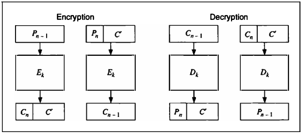
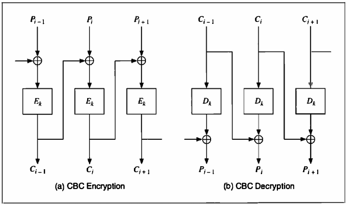
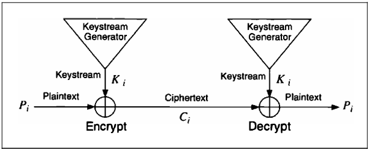
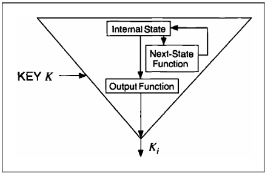
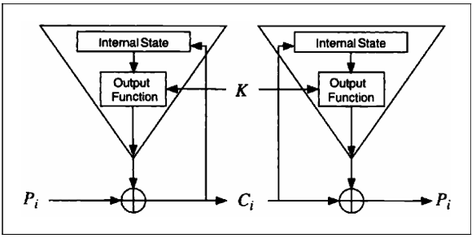
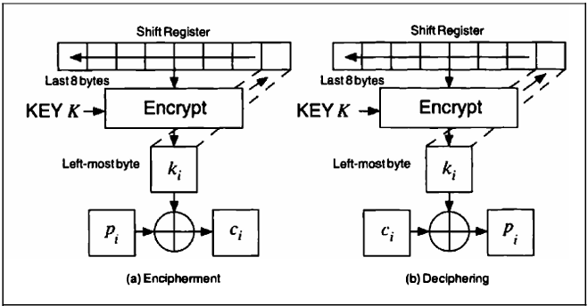
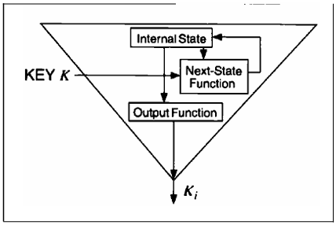
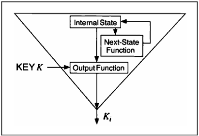
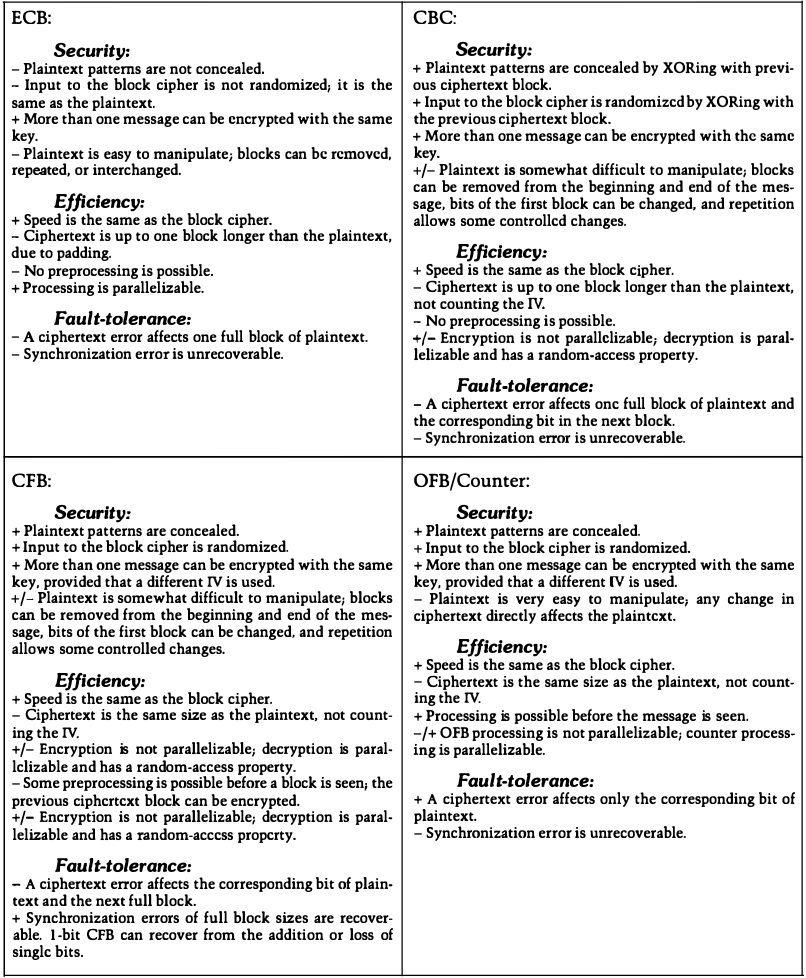
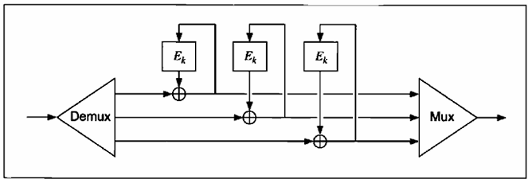

# CHAPTER 9 Algorithm Types and Modes

[TOC]

There are two basic types of symmetric algorithms:

- **Block ciphers** operate on blocks of plaintext and ciphertext--usually of 64 bits but sometimes longer.
- **Stream ciphers** operate on a stream of plaintext and ciphertext, one bit or byte (sometimes even one 32-bit word) at a time.

A cryptographic **mode** usually combines the basic cipher, some sort of feedback, and some simple operations. The operations are simple because the security is a function of the underlying cipher and not the mode. Even more strongly, the cipher mode should not compromise the security of the underlying algorithm.

## ELECTRONIC CODEBOOK MODE

**Electronic codebook (ECB)** mode is the most obvious way to use a block cipher: A block of plaintext encrypts into a block of ciphertext. Since the same block of plain text always encrypts to the same block of ciphertext, it is theoretically possible to create a code book of plaintexts and corresponding ciphertexts.

### Padding

Most messages don't divide neatly into 64-bit (or whatever size) encryption blocks; there is usually a short block at the end. ECB requires 64-bit blocks. **Padding** is the way to deal with this problem.

*Ciphertext stealing in ECB mode*

The above figure is an alternative, called **ciphertext stealing**. $P_{n - 1}$ is the last full plaintext block and $P_n$ is the final, short plaintext block. $C_{n - 1}$ is the last full ciphertext block and $C_n$ is the final, short, ciphertext block. $C'$ is just an intermediate result and is not part of the transmitted ciphertext.

## BLOCK REPLAY

A more serious problem with ECB mode is that an adversary could modify encrypted messages without knowing the key, or even the algorithm, in such a way as to fool the intended recipient.

## CIPHER BLOCK CHAINING MODE

Chaining adds a **feedback** mechanism to a block cipher: The results of the encryption of previous blocks are fed back into the encryption of the current block.

In **cipher block chaining (CBC)** mode, the plaintext is XORed with the previous ciphertext block before it is encrypted. Decryption is just as straightforward. A ciphertext block is decrypted normally and also saved in a feedback register. After the next block is decrypted, it is XORed with the results of the feedback register. Then the next ciphertext block is stored in the feeback register, and so on, until the end of the message.

Mathematically, this looks like:
$$
C_i = E_k (P_i \oplus C_{i - 1}) \\
P_i = C_{i - 1} \oplus D_k(C_i)
$$

*Cipher block chaining mode*

### Initialization Vector

CBC mode forces identical plaintext blocks to encrypt to different ciphertext blocks only when some previous plaintext block is different. Two identical messages will still encrypt to the same ciphertext. Even worse, two messages that begin the same will encrypt in the same way up to the first difference.

Prevent this by encrypting random data as the first block. This block of random data is called the **initialization vector (IV)**, initializing variable, or initial chaining value. The IV has no meaning; it's just there to make each message unique. When the receiver decrypts this block, he just uses it to fill the feedback register and otherwise ignores it. A timestamp often makes a good IV. Otherwise, use some random bits from somewhere.

With the addition of IVs, identical plaintext messages encrypt to different ciphertext messages. Thus, it is impossible for an eavesdropper to attempt block replay, and more difficult for him to build a code book. While the IV should be unique for each message encrypted with the same key, it is not an absolute requirement.

### Padding

Padding works just like ECB mode, but in some applications the ciphertext has to be eaxctly the same size as the plaintext. Perhaps a plaintext file has to be encrypted and then replaced in the exact same memory location. In this case, you have to encrypt the last short block differently. Assume the last block has $i$ bits. After encrypting the last full block, encrypt the ciphertext again, select the left-most $i$ bits of the encrypted ciphertext, and XOR that with the short block to generate the ciphertext.

Ciphertext stealing is a better way. $P_{n - 1}$ is the last full plaintext block, and $P_n$ is the final, short, plaintext block. $C_{n - 1}$ is the last full ciphertext block, and $C_n$ is the final, short, ciphertext block. $C'$ is just an intermediate result and is not part of the transmitted ciphertext. The benefit of this method is that all the bits of the plaintext message go through the encryption algorithm.

### Error Propagation

CBC mode can be characterized as **feedback** of the ciphertext at the encryption end and **feedforward** of the ciphertext at the decryption end. This has implications having to do with errors. A single bit error in a plaintext block will affect that ciphertext block and all subsequent ciphertext blocks. This isn't significant because decryption will reverse that effect, and the recovered plaintext will have the same single error.

This property of taking a small ciphertext error and converting it into a large plaintext error is called **error extension**. It is a major annoyance. Blocks after the second are not affected by the error so CBC mode is **self-recovering**. Two blocks are affected by an error, but the system recovers and continues to work correctly for all subsquent blocks. CBC is an example of a block cipher being used in a self-synchronizing manner, but only at the block level.

## STREAM CIPHERS

Stream ciphers convert plaintext to ciphertext 1 bit at a time. A **keystream generator**(sometimes called a running-key generator) outputs a stream of bits: $k_1, k_2, k_3, ..., k_i$. This keystream(sometimes called a running key) is XORed with a stream of plaintext bits, $p_1, p_2, p_3, ..., p_i$, to produce the stream of ciphertext bits:
$$
c_i = p_i \oplus k_i \\
$$
At the decryption end, the ciphertext bits are XORed with an identical keystream to recover the plain text bits:
$$
p_i = c_i \oplus k_i
$$
Since:
$$
p_i \oplus k_i \oplus k_i = p_i
$$
this works nicely.

*Stream cipher*

*Inside a keystream generator*

## SELF-SYNCHRONIZING STREAM CIPHERS

For a **self-synchronizing stream cipher**, each keystream bit is a function of a fixed number of previous ciphertext bits. The military calls this **ciphertext auto key(CTAK)**. The basic idea was patented in 1946.

*A self-synchronizing keystream generator*

The above figure shows a self-synchronizing stream cipher. The internal state is a function of the previous $n$ ciphertext bits. The cryptographic complexity is in the output function, which takes the internal state and generates a keystream bit.

Since the internal state depends wholly on the previous $n$ ciphertext bits, the decryption keystream generator will automatically synchronize with the encryption keystream generator after receiving $n$ ciphertext bits.

In smart implementations of this mode, each message begins with a random header $n$ bits long. That header is encrypted, transmitted, and then decrypted. The decryption will be incorrect, but after those $n$ bits both keystream generators will be synchronized.

The downside of a self-synchronizing stream cipher is error propagation. For each ciphertext bit garbled in transmission, the decryption keystream generator will incorrectly produce $n$ keystream bits. Therefore, for each ciphertext error, there will be $n$ corresponding plaintext errors, until the garbled bit works it wasy out of the internal state.

## CIPHER-FEEDBACK MODE

Block ciphers can also be implemented as a self-synchronizing stream cipher; this is called **cipher-feedback (CFB)** mode. In CFB mode, data can be encrypted in units smaller than the block size.

If the block size of the algorithm is $n$, then $n$-bit CFB looks like:
$$
C_i = P_i \oplus E_K(C_{i - 1}) \\
P_i = C_i \oplus E_k(C_{i - 1})
$$
like CBC mode, CFB mode links the plaintext characters together so that the ciphertext depends on all the preceding plaintext.

### Initialization Vector

To initialize the CFB process, the input to the block algorithm must be initialized with an IV. Like the IV used in CBC mode, it need not be secret.

NOTE: The IV must be unique.

### Error Propagation

With CFB mode, an error in the plaintext affects all subsequent ciphertext and reverses itself at decryption. An error in the ciphertext is more interesting. The first effect of a single-bit error in the ciphertext is to cause a single error in the plaintext. After that, the error enters the shift register, where it causes the ciphertext to be garbled until it falls off the other end of the register. In 8-bit CFB mode, 9 bytes of decrypted plaintext are garbled by a single-bit error in the ciphertext. After that, the system recovers and all subsequent ciphertext is decrypted correctly. In general, in $n$-bit CFB a single ciphertext error will affect the decryption of the current and following $m/n-1$ blocks, where $m$ is the block size.

## SYNCHRONOUS STREAM CIPHERS

In a **synchronous stream cipher,** the keystream is generated independently of the message stream. The military calls this **Key Auto-Key(KAK)**. On the encryption side, a keystream generator spits out keystream bits, one after the other. On the decryption side, another keystream generator spits out the identical keystream bits, one after the other. This works, as long as the two keystream generators are synchronized. If one of them skips a cycle or if a ciphertext bit gets lost during transmission, then every ciphertext character after the error will decrypt incorrectly.

## OUTPUT-FEEDBACK MODE

**Output-feedback(OFB)** mode is a method of running a block cipher as a sychronous stream cipher. It is similar to CFB mode, except that $n$ bits of the previous output block are moved into the right-most positions of the queue. Decryption is the reverse of this process. This is called $n$-bit OFB. On both the encryption and the decryption sides, the block algorithm is used in its encryption mode. This is sometimes called **internal feedback**, because the feedback mechanism is independent of both the plaintext and the ciphertext streams.

If $n$ is the block size of the algorithm, then $n$-bit OFB looks like:
$$
C_i = P_i \oplus S_i; S_i = E_K(S_{i - 1}) \\
P_i = C_i \oplus S_i; S_i = E_K(S_{i - 1})
$$
$S_i$ is the state, which is independent of either the plaintext or the ciphertext.

*8-bit output-feedback mode*

### Initialization Vector

The OFB shift register must also be initially loaded with an IV. It should be unique but does not have to be secret.

### Error Propagation

OFB mode has no error extension. A single-bit error in the ciphertext causes a single-bit error in the recovered plaintext.

On the other hand, a loss of synchronization is fatal. If the shift registers on the encryption end and the decryption end are not identical, then the recovered plaintext will be gibberish. Any system that uses OFB mode must have a mechanism for detecting a synchronization loss and a mechanism to fill both shift registers with a new (or the same) IV to regain synchronization.

### Security Problems with OFB

An analysis of OFB mode demonstrates that OFB should be used only when the feedback size is the same as the block size.

### Stream Ciphers in OFB

A stream cipher can also run in OFB mode. In this case, the key affects the next-state function. The output function does not depend on the key; very often it is something simple like a single bit of the internal state or the XOR of multiple bits of the internal state. The cryptographic complexity is in the next state function; this function is key-dependent. This method is also called internal feedback, because the feedback mechanism is internal to the key generation algorithm.

In a variant of this mode, the key determines just the initial state of the keystream generator. After the key sets the internal state of the generator, the generator runs undisturbed from then on.

*A keystream generator in output-feedback mode*

## COUNTER MODE

Block ciphers in **counter mode** use sequence numbers as the input to the algorithm. Instead of using the output of the encryption algorithm to fill the register, the input to the register is a counter. After each block encryption, the counter increments by some constant, typically one. The synchronization and error propagation characteristics of this mode are identical to those of OFB. Counter mode solves the OFB mode problem of $n$-bit output where $n$ is less than the block length.

### Stream Ciphers in Counter Mode

With a counter mode stream cipher, it is possible to generate the $i$th key bit, $k_i$ without first generating all the previous key bits. Simply set the counter manually to the $i$th internal state and generate the bit. This is useful to secure random-access data files; you can decrypt a specific block of data without decrypting the entire file.

*A keystream generator in counter mode.*

## OTHER BLOCK-CIPHER MODES

### Block Chaining Mode

To use a block algorithm in **block chaining(BC)** mode, simply XOR the input to the block cipher with the XOR of all the previous ciphertext blocks. As with CBC, an IV starts the process.

Mathematically, this looks like:
$$
C_i = E_k(P_i \oplus F_i); F_{i + 1} = F_i \oplus C_i \\
P_i = F_i \oplus D_k(C_i); F_{i + 1} = F_i \oplus C_i
$$
Like CBC, BC's feedback process extends errors in the plaintext. The primary problem with BC is that because the decryption of a ciphertext block depends on all the previous ciphertext blocks, a single error in the ciphertext will result in the incorrect decryption of all subsequent ciphertext blocks.

### Propagating Cipher Block Chaining Mode

**Propagating cipher block chaining (PCBC)** mode is similar to CBC mode, except that both the previous plaintext block and the previous ciphertext block are XORed with the current plaintext block before encryption (or after decryption):
$$
C_i = C_K(P_i \oplus C_{i - 1} \oplus P_{i - 1}) \\
P_i = C_{i - 1} \oplus P_{i - 1} \oplus D_k(C_i)
$$

### Cipher Block Chaining with Checksum

**Cipher block chaining with checksum(CBCC)** is a CBC variant. Keep a running XOR of all the plaintext blocks, and XOR that with the last plaintext block before encryption. CBCC ensures that any change made to any ciphertext block changes the decrypted output of the last block. If the last block contains any sort of integrity check or a constant, then the integrity of the decrypted plaintext can be checked with very little additional overhead.

### Output Feedback with a Nonlinear Function

**Output feedback with a nonlinear function(OFBNLF)** is a variant of both OFB and ECB where the key changes with every block:
$$
C_i = E_{K_i}(P_i), K_i = E_K(K_{i - 1}) \\
P_i = D_{K_i}(C_i), K_i = E_K(K_{i - 1})
$$
A single bit error in the ciphertext propagates to only plaintext block. However, if a single bit is lost or added, then there is infinite error extension. With a block algorithm that has a complicated key scheduling algorithm, like DES, this mode is slow. I know of no cryptanalysis of this mode.

## CHOOSING A CIPHER MODE

*Summary of Block Cipher Modes*

## INTERLEAVING

With most modes, encryption of a bit (or block) depends on the encryption of the previous bits (or blocks). This can often make it impossible to parallelize encryption.

**Interleave** multiple encryption streams. Instead of a single CBC chain, use four. The first, fifth, and every fourth block thereafter are encrypted in CBC mode with one IV. The second, sixth, and every fourth block thereafter are encrypted in CBC mode with another IV, and so on. The total IV is much longer than it would have been without interleaving.

*Interleaving three CFB encryptions*

