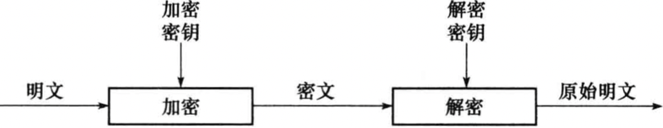
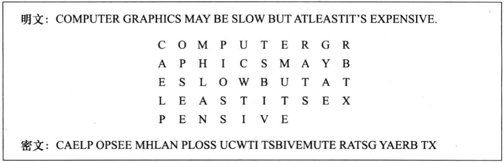

# 第一章 基础知识
[TOC]

## 专业术语

### 发送者和接收者

- `sender` 发送者
- `receiver` 接收者

### 消息和加密

- `plaintext` 明文
- `ciphertext` 密文（被加密后的消息）
- `encryption` 加密（用某种方法伪装消息以隐藏他的内容）
- `decryption` 解密（把密文转变成明文的过程）
- `cryptography` 密码编码学（使消息保密的技术和科学）
- `cryptanalyst` 密码分析者（从事密码分析的专业人员）
- `cryptanalysis` 密码分析学（破译密文的科学和技术）
- `cryptology` 密码学（属于数学的一个分支，包括密码编码学和密码分析学）
- `cryptologist` 密码学家
- `unconditionally secure` 无条件保密（不论密码分析者有多少密文，都没有足够的信息恢复出明文）
- `brute_force attack` 蛮力攻击（只要简单地一个接一个地去尝试每种可能的秘钥，并且检查所的明文是否有意义）
- `steganography` 隐写术（将秘密消息隐藏在其他消息中，这样真正存在的秘密被隐藏）

加密函数$E$作用于明文$M$得到密文$C$，可用数学公式表示：$E(M) = C$

解密函数$D$作用于密文$C$产生明文$M$，可用数学公式表示：$D(C) = M$

先加密后解密，原始的明文将恢复，故下面的等式必须成立：$D(E(M)) = M$

### 鉴别，完整性和抗抵赖

- `authentication` 鉴别（消息的接收者应该能够确认消息的来源，入侵者不可能伪装成他人）。
- `integrity` 完整性（消息的接收者应该能够验证在传送过程中消息没有被修改，入侵者不可能用假消息代替合法消息）。
- `nonrepudiation` 抗抵赖（发送者事后不可能虚假的否认他发送的消息）。

#### 算法和密钥

`密码算法(cryptoraphic algorithm)` 也叫做密码(cipher)，是用于加密和解密的数学函数。

`受限制的(restricted)算法` 算法的保密性基于保持算法的秘密。

加/解密函数：

$K_{k_1}(M) = C$

$D_{k_2}(C) = M$

$D_{k_2}(E_{k_1}(M)) = M$

### 对称算法
`对称算法(symmetric algo-rithm)` 有时又叫做传统密码算法，就是加密秘钥能从解密秘钥中推算出来，反过来也成立。

对称算法的加密和解密表示为：

$E_k(M) = C$

$D_k(C) = M$

对称算法可以分为以下几类：

* `序列算法(stream algorithm)`或`序列密码(stream cipher)` 一次只对明文中的单个位（有时对字节）运算的算法；

* `分组算法(block algorithm)`或`分组密码(biock cipher)` 对明文的一组位进行运算；

### 公开密钥算法
`公开密钥算法(public-key algorithm，也叫做非对称算法)` 用作加密的秘钥不同于用作解密的秘钥，而且解密秘钥不能根据加密秘钥计算出来；在这些系统中，加密秘钥叫做`公开密钥(public-key, 简称公钥)`，解密秘钥叫做`私人密钥(private key, 简称私钥)`

用公开密钥$K$加密可表示为：$E_k(M) = C$

用私人密钥解密可表示为：$D_k(C) = M$

### 密码分析

密码分析攻击分类：

1. `唯密文攻击(ciphertext-only attack)` 密码分析者有一些消息的密文，这些消息都用相同加密算法加密。密码分析者的任务是恢复尽可能多的明文，或者最好能推算出加密消息的密钥，以便可采用相同的密钥破解其他被加密的消息。

   已知：$C_1 = E_k(P_1)$, $C_2 = E_k(P_2)$, $...$, $C_i = E_k(P_i)$。

   推导出：$P_1$，$P_2$，...，$P_i$；$K$或者找出一个算法从$C_{i+1} = E_k(P_{i+1})$推导出$P_{i+1}$。

2. `已知明文攻击(known-plaintext attack)` 密码分析者不仅可得到一些消息的密文，而且也知道这些消息的明文。分析者的任务就是用加密信息推出用来加密的密钥或导出一个算法，此算法可以对用相同密钥加密的任何新消息进行解密。

   已知：$P_1$，$C_1 = E_k(P_1)$，$P_2$，$C_2 = E_k(P_2)$，$...$，$P_i$，$C_i = E_k(P_i)$。

   推导出：密钥$K$，或从$C_{i+1} = E_k(P_{i+1})$推导出$P_{i+1}$的算法。

3. `选择明文攻击(chosen-plaintext acctack)` 分析者不仅可得到一些消息的密文和相应的明文，而且他们也可以选择被加密的明文。这比已知明文攻击更有效，因为密码分析者能选择特定的明文块进行加密，那些块可能产生更多关于密钥的信息。分析者的任务是推出用来加密消息的密钥或导出一个算法，此算法可以对用相同密钥加密的任何新消息进行解密。

   已知：$P_1$, $C_1 = E_k(P_1)$, $P_2$, $C_2 = E_k(P_2)$, $...$, $P_i$, $C_i = E_k(P_i)$, 其中$P_1$, $P_2$, ..., $P_i$可由密码分析者选择。

   推导出：密钥$K$，或从$C_{i+1} = E_k(P_{i+1})$推导出$P_{i+1}$的算法。

4. `自适应选择明文攻击(adaptive-chosen-plaintext attack)` 这是选择明文攻击的特殊情况。分析者不仅能选择被加密的明文，而且也能基于以前加密的结果修正这个选择。在选择明文攻击中，密码分析者还可以选择一大块被加密的明文。而在自适应选择密文攻击中，可选取较小的明文块，然后再给予第一块的结果选择另一个明文块，以此类推。

5. `选择密文攻击(chosen-ciphertext attack)` 密码分析者能选择不同的被加密的密文，并可得到对应的解密的明文。例如，密码分析者访问一个防窜改的自动解密盒，密码分析者的任务是推出密钥。

   已知：$C_1$, $P_1 = D_k(C_1)$, $C_2$, $P_2 = D_k(C_2)$, ..., $C_i$, $P_i = D_k(C_i)$。

   推导出：$K$。

6. `选择秘钥攻击(chosen-key attack)` 这种攻击并不表示密码分析者能够选择秘钥，它只表示密码分析者具有不同秘钥之间关系的有关知识。

5. `软磨硬泡攻击(rubber-hose cryptanalysis)` 密码分析者威胁，勒索，或者折磨某人，直到他给出秘钥为止。

### 算法的安全性

破译算法分类（按安全性递减）：

1. `全部破译(total break)` 密码分析者找出密钥$K$，这样$D_k(C) = P$。
2. `全盘推导(global deduction)` 密码分析者找到一个代替算法$A$，在不知道密钥$K$的情况下，等价于$D_k(C) = P$。
3. `实例（或局部）推导(instance (or local) deduction)` 密码分析者从截获的密文中找出明文。
4. `信息推导(information deduction)` 密码分析者获得一些有关密钥或明文的信息，这些信息可能是密钥的几位，有关明文格式的信息等。

衡量攻击方法的复杂性：

1. `数据复杂性(data complexity)` 用于攻击输入所需要的数据量。
2. `处理复杂性(processing complexity)` 完成攻击所需要的时间，也经常称作**工作因素(work factor)**。
3. `存储需求(storage requirement)` 进行攻击所需要的存储量。

## 隐写术

`隐写术(steganography)` 将秘密消息隐藏在其它消息中，这样真正存在的秘密被隐藏了。

## 代替密码和换位密码

### 代替密码

`代替密码(substitution cipher)` 就是明文中每一个字符被替换成密文中的另一个字符，接收者对秘闻进行逆替换就可以恢复明文。

经典密码学中，代替密码类型：

1. `简单代替密码(simple substitution cipher)或单字母密码(monoalphabetic cipher)` 明文中的一个字符用相应的一个密文字符代替。
2. `多名码代替密码(homophonic substitution cipher)` 它与简单代替密码系统相似，唯一的不同是单字符明文可以映射成密文的多个字符之一。例如，A可能对应于5, 13, 25或56，B可能对应于7, 19, 31或42等。
3. `多字母代替密码(polygram substitution cipher)` 字符块被成组加密。例如，ABA可能对应于RTQ，ABB可能对应于SLL等。
4. `多表代替密码(polyalphabetic substitution cipher)` 由多个简单的代替密码构成。例如，可能使用5个不同的简单代替密码，单独的一个字符用来改变明文每个字符的位置。

### 换位密码

例：

## 简单异或

异或算法的破译方法：

1. 用`重合码计数法(counting coincidence)` 找出密钥长度。用密文异或相对其本身的各种字节的位移，统计那些相等的字节数。
2. 按此长度移动密文，并且与自身进行异或。这样就消除了秘钥，留下明文和移动了秘钥长度的明文的异或。

## 计算机算法

通用的计算机密码算法：

1. `DES(Data Encryption Standard) 数据加密标准` 对称算法，加密和解密的密钥是相同的。
2. `RSA(Rivest Shamir Adleman)公开密钥算法` 用作加密和数字签名。
3. `DSA(Digital Signature Algorithm)数字签名算法` 用做数字签名标准的一部分，是另一种公开密钥算法，他不能用做加密，只用做数字签名