# 第12章 数据加密标准

[TOC]

## 12.1 背景

数据加密标准（Data Encryption Standard, DES）

数据加密算法（Data Encryption Algorithm, DEA）

### 12.1.1 标准的开发

### 12.1.2 标准的采用

### 12.1.3 DES设备的鉴定和认证

### 12.1.4 1987年的标准

### 12.1.5 1993年的标准

## 12.2 DES的描述

DES是一个分组加密算法，以64位为分组对数据加密，DES密钥长度为任意的56位数。DES是一个对称算法：加密和解密用的是同一算法（除密钥编排不同以外）。

### 12.2.1 算法概要

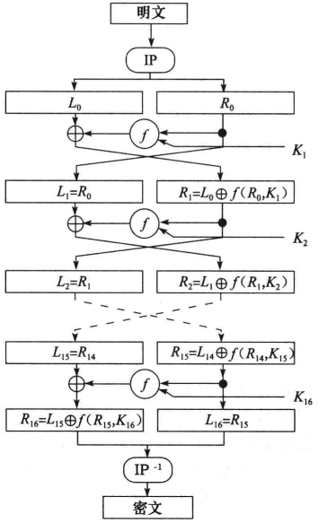

*DES经过16轮加密后得到密文*

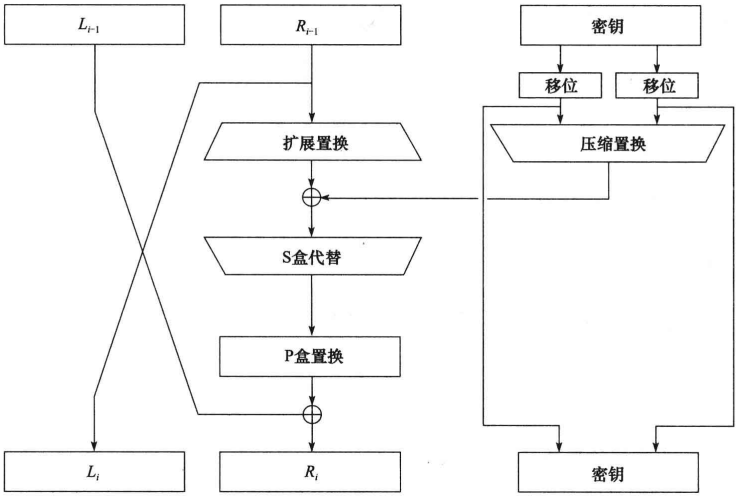

*一轮DES*

每一轮DES的数学描述：

$L_i = R_{i-1}$

$R_i = L_{i-1} \oplus f(R_{i-1}, K_i)$

- $L_i$ 第$i$次迭代结果的左半部分。
- $R_i$ 第$i$次迭代结果的右半部分。
- $K_i$ 第$i$轮的48位密钥。
- $f$ 实现代替，置换以及密钥异或等运算的函数。

### 12.2.2 初始置换

初始置换在第一轮运算之前执行，对输入分组实施变换；初始置换和对应的末置换并不影响DES的安全性。

例：

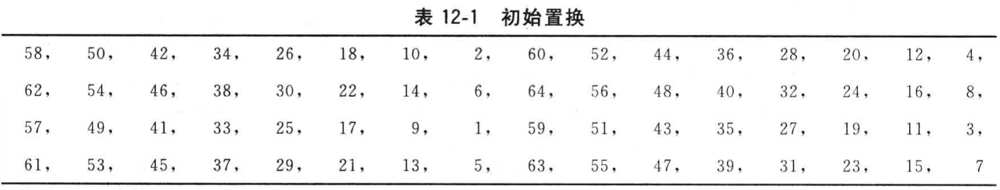

### 12.2.3 密钥置换

每个字节的第8位可作为奇偶校验以确保密钥不发生错误，从56位密钥产生出不同的48位`子密钥(subkey)`，这些子密钥$K_i$由下面的方式确定。

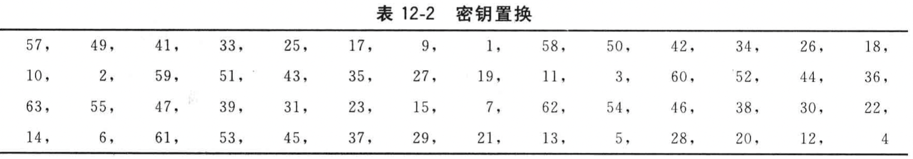

首先，56位密钥被分成两部分，每部分28位。然后，根据轮数，这两部分分别循环左移1位或2位。表12-3给出了每轮移动的位数。

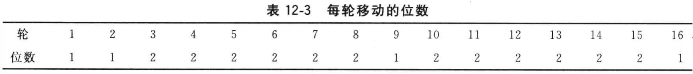

移动后，就从56位中选出48位。因为这个运算不仅置换了每位的顺序，同时也选择了子密钥，因而称为`压缩置换(compression permutation)`。这运算提供了一组48位的集。

表12-4定义了压缩置换（也称为置换选择）。例如，处在第33位的那一位在输出时移到了第35位的位置，而处在第18位的那一位被略去了。

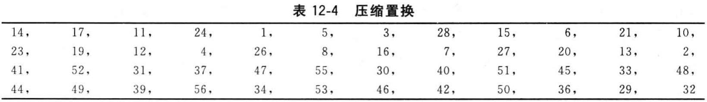

### 12.2.4 扩展置换

`扩展置换(expansion permutation)` 将数据的右半部分$R_i$从32位扩展到了48位，这个运算改变了位的次数，重复了某些位。

`雪崩效应(avalanche effect)` 输出对输入的依赖性将传播得更快。

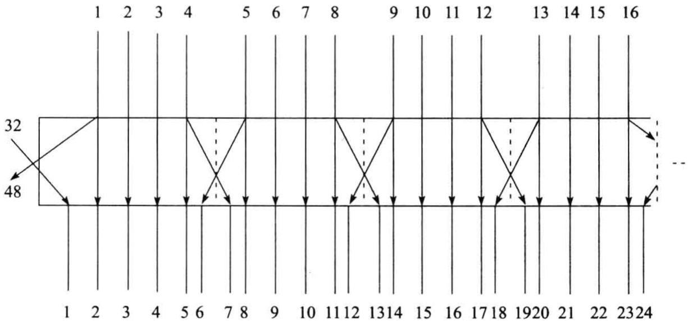

*扩展置换*

`扩展置换`又叫做`E盒(E-box)`：对每个4位输入分组，第1位和第4位分别表示输出分组中的两位，而第2位和第3位分别表示输出分组中的一位。

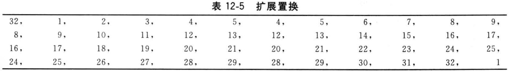

### 12.2.5 S盒代替

压缩后的密钥与扩展分组异或以后，将48位的结果送入进行代替运算；代替由8个`代替盒(substitution box)`或`S盒(S-box)`完成。

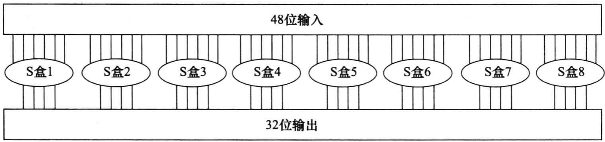

*S盒代替*

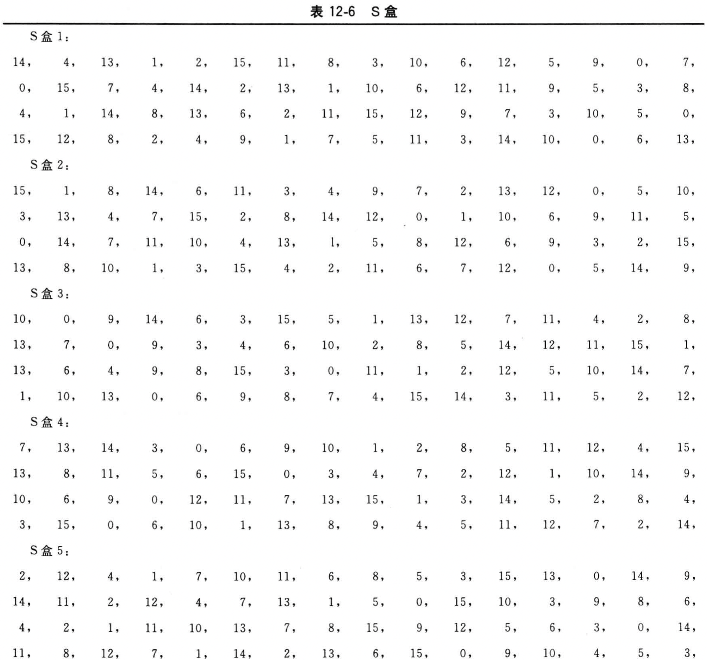

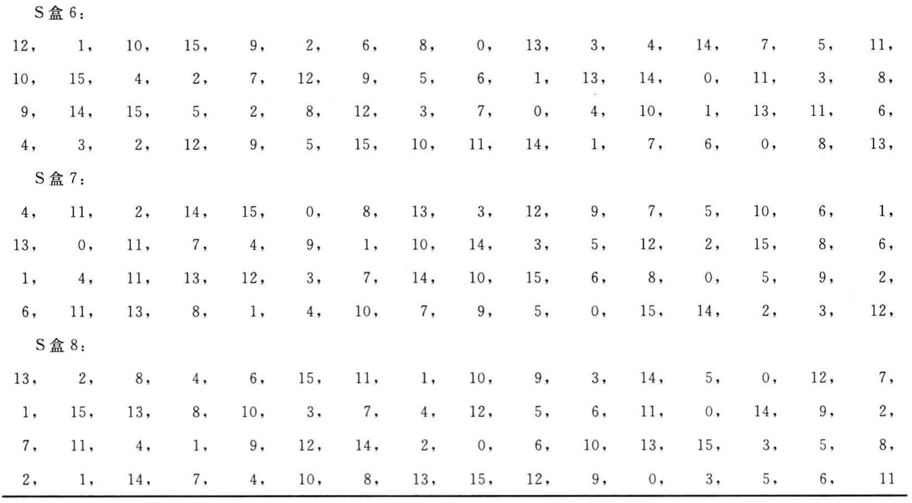

### 12.2.6 P盒置换

S盒代替运算后的32位输出依照`P盒(P-box)`进行置换。该置换把每输入位映射到输出位，任一位不能映射两次，也不能被略去，这个置换叫做`直接置换(straight permutation)`。

表12-7给出了每位移至的位置。

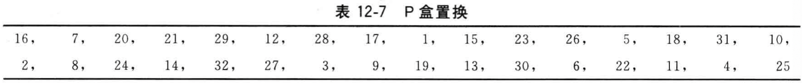

### 12.2.7 末置换

末置换是初始置换的逆过程。

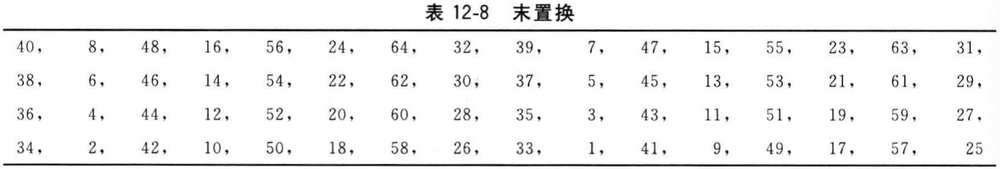

### 12.2.8 DES解密

加密和解密可使用相同的算法。

DES使得用相同的函数来加密或解密每个分组成为可能。两者的唯一不同是密钥的次序相反。这就是说，如果各轮的加密密钥分别是$K_1, K_2, K_3, ..., K_16$，那么解密密钥就是$K_{16}, K_{15}, K_{14}, ..., K_1$。为各轮产生密钥的算法也是循环的。密钥向右移动，每次移动的个数为$0, 1, 2, 2, 2, 2, 2, 2, 1, 2, 2, 2, 2, 2, 2, 1$。

### 12.2.9 DES的工作模式

FIPS PUB 81定义了四种工作方式：

- 电子密本（ECB）
- 密码分组链接（CBC）
- 输出反馈（OFB）
- 密文反馈（CFB）

ANSI银行标准中规定加密用ECB和CBC方式，鉴别用CBC和n位的CFB方式。

### 12.2.10 DES的硬件和软件实现

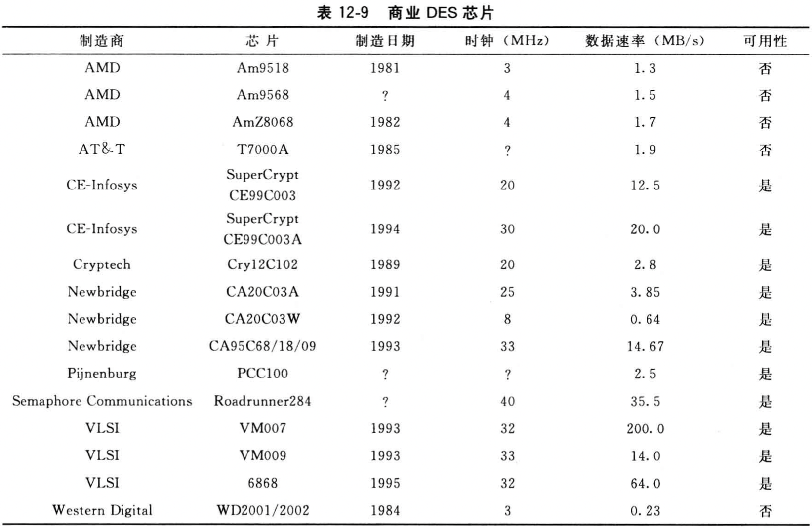

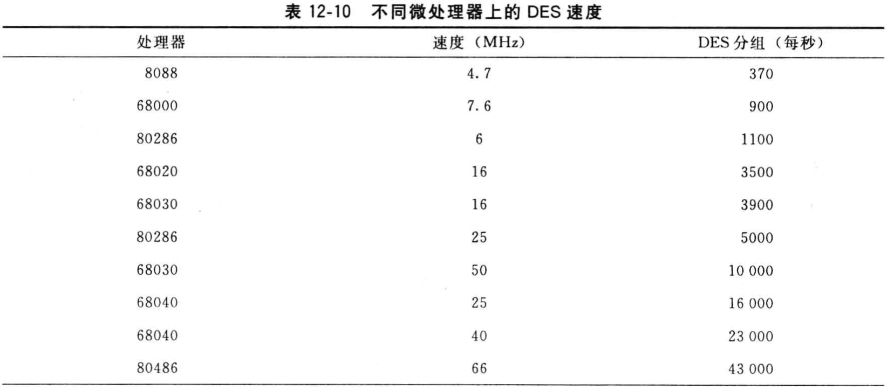

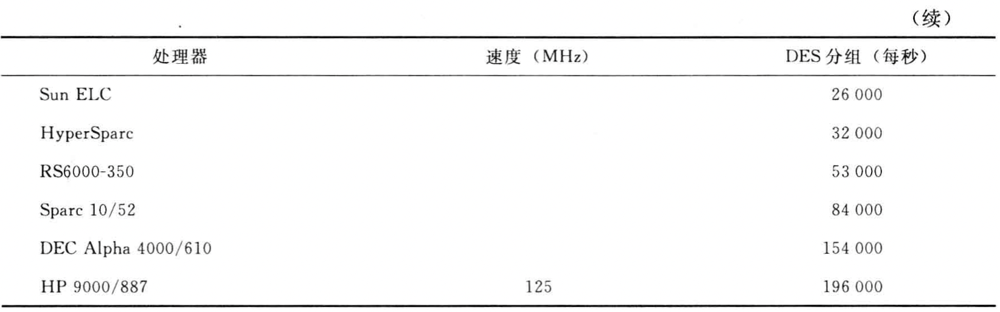

## 12.3 DES的安全性

### 12.3.1 弱密钥

由于算法各轮的子密钥是通过改变初始密钥这种方式得到的，所以有些初始密钥成了`弱密钥(weak key)`。

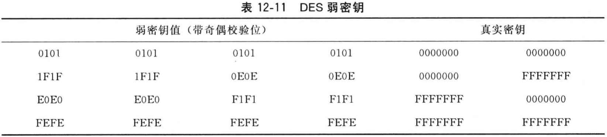

密钥对里的一个密钥能解密另一个密钥加密的信息，这也是由于DES产生子密钥这种方式所决定的。这些密钥只产生2个不同的子密钥，而不是16个不同的子密钥。算法中每个这样的子密钥都使用了8次。这些子密钥叫做`半弱密钥(semiweak key)`。

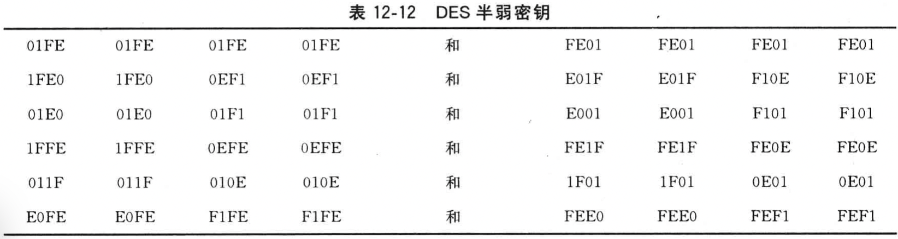

也有只产生4个子密钥的密钥，每个这样的子密钥在算法中使用了4次。这些可能的弱密钥在表12-13中列出。

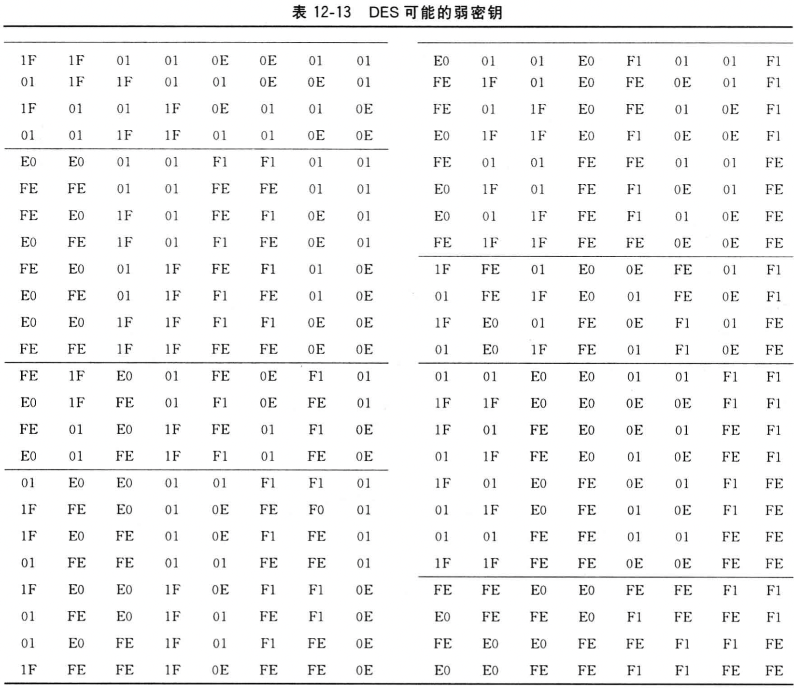

### 12.3.2 补密钥

将密钥的每一位取反，用原来的密钥加密一个明文分组得到一个密文分组；那么，只用该密钥的补密钥加密将该明文分组的补便得到该密文分组的补。

如果$x'$是$x$的补，则有如下的等式：

$E_k(P) = C$

$E'_k(P') = C'$

子密钥与每一轮经扩展置换输出的右半部分异或运算使其具有互补特性的直接结果。这表明，对DES的**选择明文攻击**仅需要测试其可能的$2^{56}$个密钥的一半，$2^{55}$个即可。Eli Biham和Adi Sh amir已经证明对相同复杂度的已知明文攻击，至少要有$2^{33}$个已知明文。

### 12.3.3 代数结构

如果DES是`闭合的(closed)`，那么对任意的$K_1$和$K_2$，必将存在$K_3$使得：

$E_{k_2}(E_{k_1}(P)) = E_{k_3}(P)$

换言之，DES对一组明文用用$K_1$加密后再用$K_2$加密，这等同于用$K_3$对该明文进行加密。更糟糕的是，DES将很容易受到中间相遇明文攻击，这种攻击只需要搜索$2^{28}$步。

如果DES是`纯洁的(pure)`，那么对任意的$K_1$, $K_2$和$K_3$，必将存在$K_4$使得：

$E_{k_3}(E_{k_2}(E_{k_1}(P))) = E_{k_4}(P)$

三重的加密将是无用的（注意，一个闭合的密码必定是纯洁的，但纯洁的密码不一定是闭合的）。

### 12.3.4 密钥的长度

