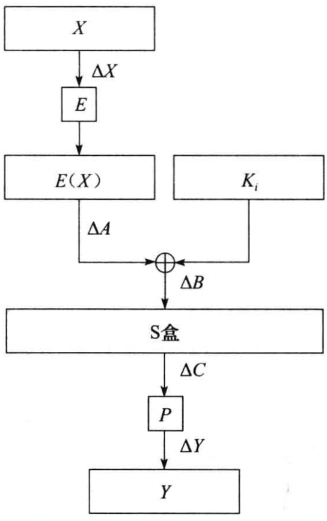
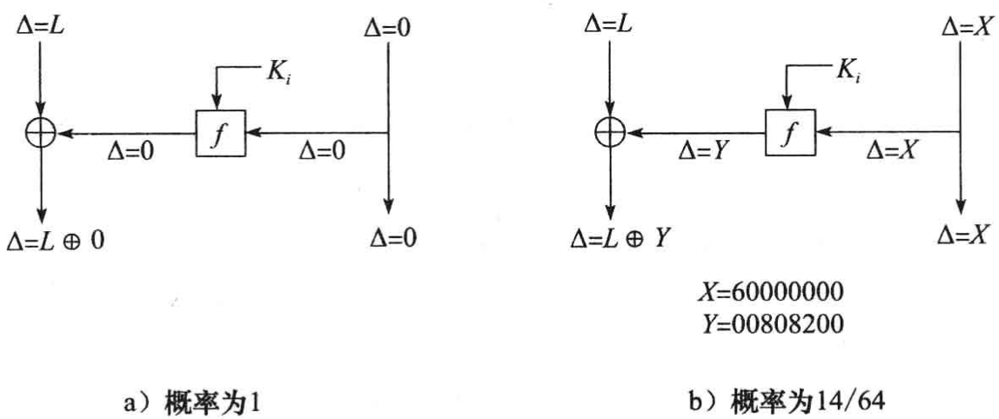
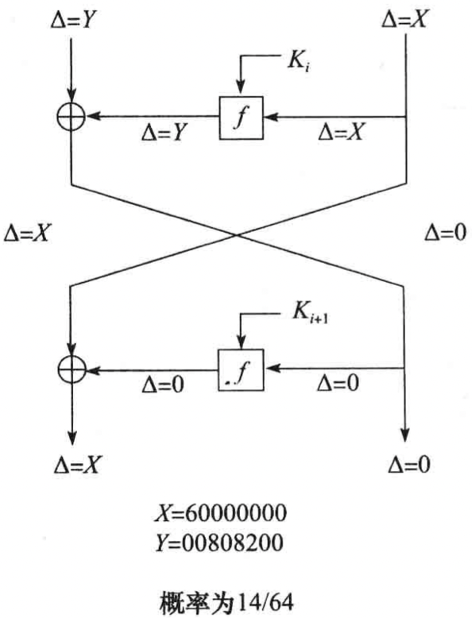
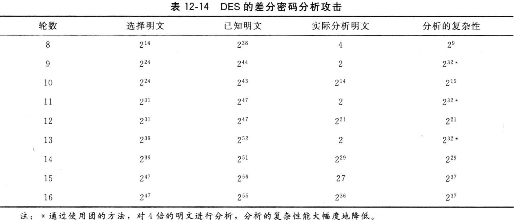
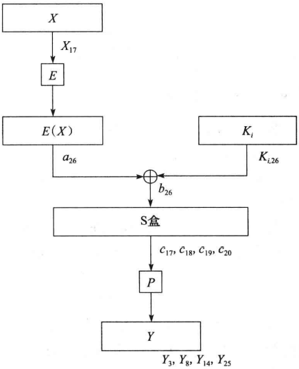
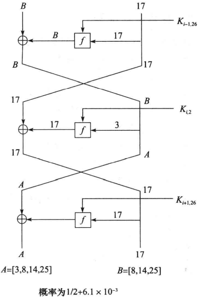
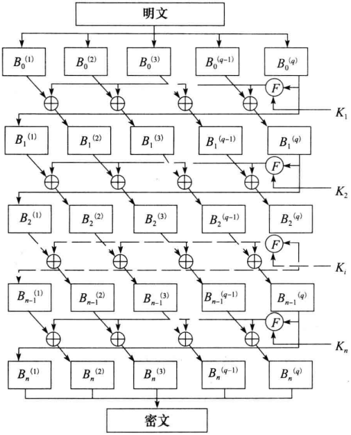
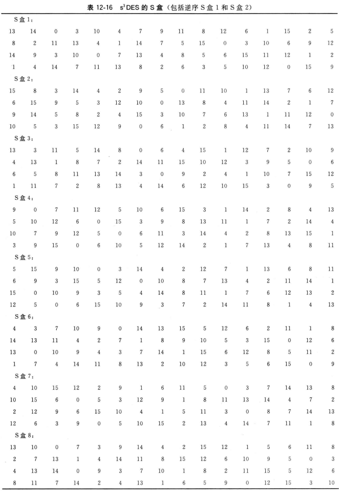

# 第12章 数据加密标准

[TOC]

## 12.1 背景

数据加密标准（Data Encryption Standard, DES）

数据加密算法（Data Encryption Algorithm, DEA）

### 12.1.1 标准的开发

### 12.1.2 标准的采用

### 12.1.3 DES设备的鉴定和认证

### 12.1.4 1987年的标准

### 12.1.5 1993年的标准

## 12.2 DES的描述

DES是一个分组加密算法，以64位为分组对数据加密，DES密钥长度为任意的56位数。DES是一个对称算法：加密和解密用的是同一算法（除密钥编排不同以外）。

### 12.2.1 算法概要

*DES经过16轮加密后得到密文*

*一轮DES*

每一轮DES的数学描述：

$L_i = R_{i-1}$

$R_i = L_{i-1} \oplus f(R_{i-1}, K_i)$

- $L_i$ 第$i$次迭代结果的左半部分。
- $R_i$ 第$i$次迭代结果的右半部分。
- $K_i$ 第$i$轮的48位密钥。
- $f$ 实现代替，置换以及密钥异或等运算的函数。

### 12.2.2 初始置换

初始置换在第一轮运算之前执行，对输入分组实施变换；初始置换和对应的末置换并不影响DES的安全性。

例：

### 12.2.3 密钥置换

每个字节的第8位可作为奇偶校验以确保密钥不发生错误，从56位密钥产生出不同的48位`子密钥(subkey)`，这些子密钥$K_i$由下面的方式确定。

首先，56位密钥被分成两部分，每部分28位。然后，根据轮数，这两部分分别循环左移1位或2位。表12-3给出了每轮移动的位数。

移动后，就从56位中选出48位。因为这个运算不仅置换了每位的顺序，同时也选择了子密钥，因而称为`压缩置换(compression permutation)`。这运算提供了一组48位的集。

表12-4定义了压缩置换（也称为置换选择）。例如，处在第33位的那一位在输出时移到了第35位的位置，而处在第18位的那一位被略去了。

### 12.2.4 扩展置换

`扩展置换(expansion permutation)` 将数据的右半部分$R_i$从32位扩展到了48位，这个运算改变了位的次数，重复了某些位。

`雪崩效应(avalanche effect)` 输出对输入的依赖性将传播得更快。

*扩展置换*

`扩展置换`又叫做`E盒(E-box)`：对每个4位输入分组，第1位和第4位分别表示输出分组中的两位，而第2位和第3位分别表示输出分组中的一位。

### 12.2.5 S盒代替

压缩后的密钥与扩展分组异或以后，将48位的结果送入进行代替运算；代替由8个`代替盒(substitution box)`或`S盒(S-box)`完成。

*S盒代替*

### 12.2.6 P盒置换

S盒代替运算后的32位输出依照`P盒(P-box)`进行置换。该置换把每输入位映射到输出位，任一位不能映射两次，也不能被略去，这个置换叫做`直接置换(straight permutation)`。

表12-7给出了每位移至的位置。

### 12.2.7 末置换

末置换是初始置换的逆过程。

### 12.2.8 DES解密

加密和解密可使用相同的算法。

DES使得用相同的函数来加密或解密每个分组成为可能。两者的唯一不同是密钥的次序相反。这就是说，如果各轮的加密密钥分别是$K_1, K_2, K_3, ..., K_16$，那么解密密钥就是$K_{16}, K_{15}, K_{14}, ..., K_1$。为各轮产生密钥的算法也是循环的。密钥向右移动，每次移动的个数为$0, 1, 2, 2, 2, 2, 2, 2, 1, 2, 2, 2, 2, 2, 2, 1$。

### 12.2.9 DES的工作模式

FIPS PUB 81定义了四种工作方式：

- 电子密本（ECB）
- 密码分组链接（CBC）
- 输出反馈（OFB）
- 密文反馈（CFB）

ANSI银行标准中规定加密用ECB和CBC方式，鉴别用CBC和n位的CFB方式。

### 12.2.10 DES的硬件和软件实现

## 12.3 DES的安全性

### 12.3.1 弱密钥

由于算法各轮的子密钥是通过改变初始密钥这种方式得到的，所以有些初始密钥成了`弱密钥(weak key)`。

密钥对里的一个密钥能解密另一个密钥加密的信息，这也是由于DES产生子密钥这种方式所决定的。这些密钥只产生2个不同的子密钥，而不是16个不同的子密钥。算法中每个这样的子密钥都使用了8次。这些子密钥叫做`半弱密钥(semiweak key)`。

也有只产生4个子密钥的密钥，每个这样的子密钥在算法中使用了4次。这些可能的弱密钥在表12-13中列出。

### 12.3.2 补密钥

将密钥的每一位取反，用原来的密钥加密一个明文分组得到一个密文分组；那么，只用该密钥的补密钥加密将该明文分组的补便得到该密文分组的补。

如果$x'$是$x$的补，则有如下的等式：

$E_k(P) = C$

$E'_k(P') = C'$

子密钥与每一轮经扩展置换输出的右半部分异或运算使其具有互补特性的直接结果。这表明，对DES的**选择明文攻击**仅需要测试其可能的$2^{56}$个密钥的一半，$2^{55}$个即可。Eli Biham和Adi Sh amir已经证明对相同复杂度的已知明文攻击，至少要有$2^{33}$个已知明文。

### 12.3.3 代数结构

如果DES是`闭合的(closed)`，那么对任意的$K_1$和$K_2$，必将存在$K_3$使得：

$E_{k_2}(E_{k_1}(P)) = E_{k_3}(P)$

换言之，DES对一组明文用用$K_1$加密后再用$K_2$加密，这等同于用$K_3$对该明文进行加密。更糟糕的是，DES将很容易受到中间相遇明文攻击，这种攻击只需要搜索$2^{28}$步。

如果DES是`纯洁的(pure)`，那么对任意的$K_1$, $K_2$和$K_3$，必将存在$K_4$使得：

$E_{k_3}(E_{k_2}(E_{k_1}(P))) = E_{k_4}(P)$

三重的加密将是无用的（注意，一个闭合的密码必定是纯洁的，但纯洁的密码不一定是闭合的）。

### 12.3.4 密钥的长度

`差分密码分析技术(differential cryptanalysis)`

### 12.3.5 迭代的次数

### 12.3.6 S盒的设计

### 12.3.7 其它结论

## 12.4 差分及线性分析

### 12.4.1 差分密码分析

`差分密码分析(differential cryptanalysis)`考查那些明文有特定差分的密文对。当明文使用相同的密钥加密时，分析其在通过DES的轮扩散时差分的演变。

*DES轮函数*

明文对中的一些差分在得到的密文对中有很高的重现率，这些差分就叫做`特征（characteristic）`。特征在轮数上得以扩充，并定义了一条轮间路径。对某一输入差分，每一轮的差分及最终的输出差分之间都有一个特定的概率。

*DES特征*

*2轮DES特征*

满足特征的明文对称为`正确对(right pair)`，不满足的称为`错误对(wrong pair)`。

**对一个n轮DES，经过n轮的基本差分攻击，将可以恢复48位子密钥，剩余的8位可通过穷举攻击猜测得到。**

通过增加迭代的次数可改善DES抗差分分析的性能。

### 12.4.2 相关密钥密码分析

`相关密钥密码分析(related-key cryptanalysis)`类似于差分分析：密码分析者选择的是密钥对间的关系，而不是密钥本身。数据由两个密钥加密。在已知明文的相关密钥攻击中，密码分析者知道明文和用这种密钥加密的密文；在选择明文的相关密钥攻击中，密码分析者选择明文，并用这两个密钥加密。

相关密钥攻击的意义：

- 它是第一个攻击DES子密钥产生算法的密码分析方法；
- 此攻击方法与密码算法轮数无关，它对16轮，32轮或1000轮DES同样有效；
- 此攻击方法对DES无影响，DES密钥的环移变化组织了相关米要分析的影响。

### 12.4.3 线性密码分析

`线性密码分析(linear cryptanalysis)`是Mitsuru Matsui提出的另一种密码分析攻击方法。这种攻击使用线性近似值来描述分组密码的操作。

*DES的1轮线性逼近*

*DES的3轮线性逼近*

### 12.4.4 未来的方向

`差分-线性分析(differential-linear cryptanalysis)`将差分分析和线性分析结合起来。

## 12.5 实际设计准则

S盒设计准则：

- 每个S盒均为6位输入，4位输出（这是在1974年的技术条件下，单个芯片所能容纳的最大尺寸）。
- 没有一个S盒的输出位是接近输入位的线性函数。
- 如果将输入位的最左及最右端的位固定，变化中间的4位，那么每个可能的4位输出只能得到一次。
- 如果S盒的两个输入仅有1位的差异，则其输出至少必须有2位不同。
- 如果S盒的两个输入仅有中间2位不同，则输出至少必须有2位不同。
- 如果S盒的两个输入前2位不同，后2位已知，则其输出必不同。
- 对于输入之间的任何非零的6位差分，32对中至多有8对显示出的差分导致了相同的输出差分。
- 类似于前一个准则，但是针对三个有效的S盒。

P盒的设计准则：

- 在第i轮S盒的4位输出中，2位将影响S盒第i+1轮的中间位，其余2位将影响最后位。
- 每个S盒的4位输出影响6个不同的S盒，但没有两个影响同一个S盒。
- 如果一个S盒的4位输出影响另一个S盒的中间1位，那么后一个输出位不会影响前一个S盒的中间1位。

## 12.6 DES的各种变型

### 12.6.1 多重DES

*三重DES*

### 12.6.2 使用独立子密钥的DES

### 12.6.3 DESX

DESX采用一种称为随机化的技术来掩盖DES的输入和输出。

### 12.6.4 CRYPT(3)

CRYPT(3)是应用在UNIX系统上的DES变型，主要用作对口令的单向函数。

### 12.6.5 GDES

GDES（通用DES）是为了提高DES的速度及算法的强度而设计的；总的分组长度增加了，但总的计算量保持不变。

*GDES*

### 12.6.6 更换S盒的DES

DES的S盒抗线性分析不是最优的；可能存在比DES的S盒抗线性分析性能更好的S盒，但盲目地选择新的S盒并不是一个好主意。

对DES变型地差分攻击：

### 12.6.7 RDES

RDES是在每一轮结束时用相关密钥交换取代左，右两部分交换地一种变型。这种交换是固定的，只依赖于密钥。

RDES-1，在每一轮的开始，对16位地字进行相关数据交换；

RDES-2，在每一轮开始，经过类似RDES-1中16位地字相关数据交换后，在进行字节交换；

...

RDES-4。

### 12.6.8 $s^nDES$

### 12.6.9 使用相关密钥S盒的DES

无论线性分析或差分分析都仅在已知S盒结构的情况下有效。如果S盒与密钥相关，且是通过强密码方法选择构成的，那么线性分析或差分分析将更困难。随机产生的S盒的差分及线性特征都很弱，即使S盒是保密的。

下面介绍用48位的附加密钥产生S盒的方法，该方法产生的S盒既抗线性分析，又抗差分分析：

1. 重排DES的S盒的次序：24673158；
2. 从48密钥位中选出16位。在这16位中，如第一位为1，将DES的第一个S盒的前两行与后两行交换。如第二位为1，将DES的第一个S盒的前8列与后8列交换。根据第3位，第4位的取值，按上述方法处理DES的第二个S盒。并以此类推处理DES的第3~8个S盒。
3. 取出剩余的32位。前4位异或DES的第一个S盒的每一项，第二个4位异或DES的第二个S盒的每一项，以此类推处理所有DES的S盒。

攻击这种系统的复杂性，差分分析是$2^{51}$，线性分析是$2^{53}$，穷举搜索法是$2^{102}$。

## 12.7 DES现今的安全性

