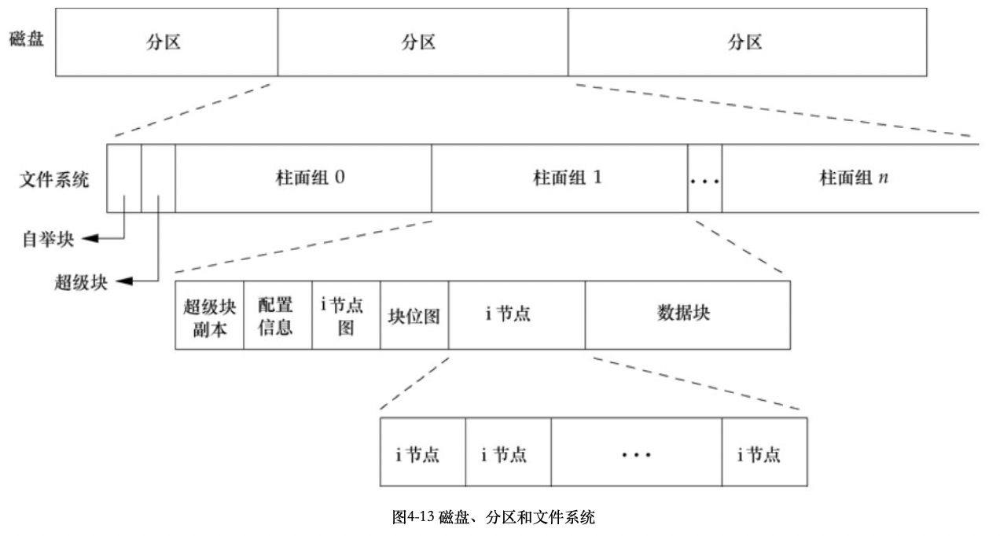
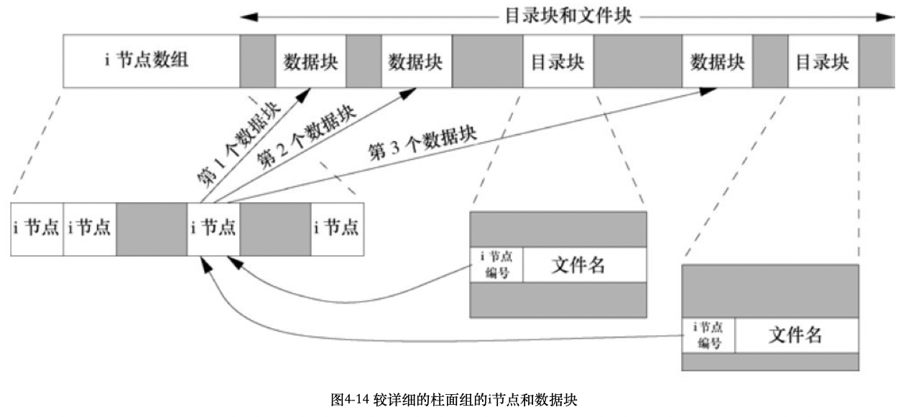
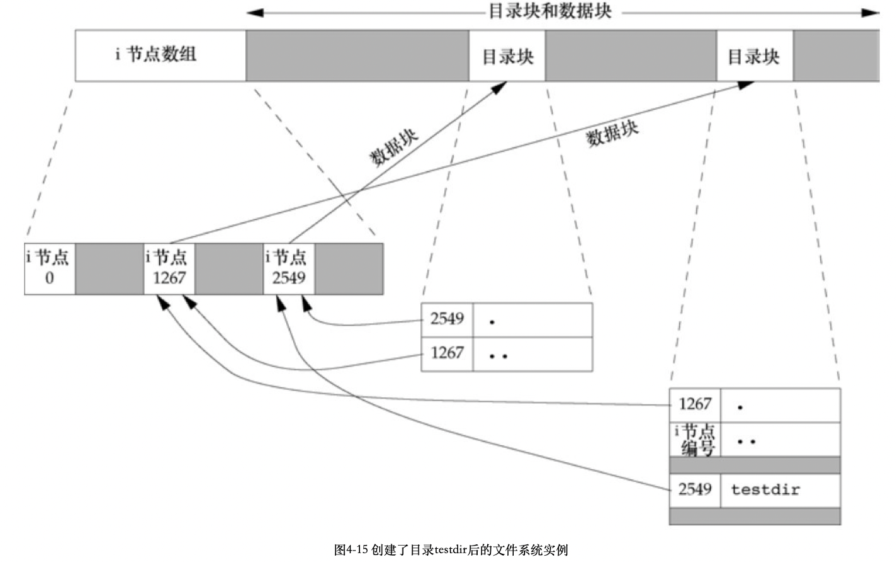

# 第四章 文件和目录

[TOC]


## 函数stat, fstat, fstatat和lstat

```c
#include <sys/stat.h>
int stat(const char *restrict pathname, struct stat *restrict buf);
int fstat(int fd, struct stat *buf);
int lstat(const char *restrict pathname, struct stat *restrict buf);
int fstatat(int fd, const char *restrict pathname, struct stat *restrict buf, int flag);
```

- `fd` 文件描述符
- `pathname` 文件路径
- `buf` 
- `flag`

获取文件信息


## 文件系统

### 磁盘，分区和文件系统



### 柱面组



- 每个i节点都有一个链接计数，用来表示指向该i节点的目录数；当链接计数为0时才可以删除该文件。
- 符号类型（symbolic link），它的实际内容（在数据块中）包含了该符号链接所指向的文件的名字。
- i节点包含了文件有关的所有信息：
  - 文件类型
  - 文件访问权限位
  - 文件长度
  - 指向文件数据块的指针
  - ...
- 目录项中的i节点编号指向同一文件系统中相应i节点，一个目录项不能指向另一个文件系统的i节点。
- 当在不更换文件系统的情况下为一个文件重命名时，该文件的实际内容并未移动，只需构造一个指向现有i节点的新目录项，并删除老的目录项，链接计数不会改变。

例，创建目录testdir后的文件系统实例：



