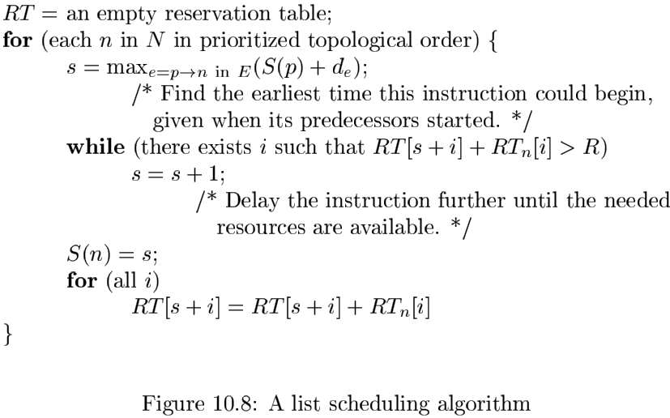
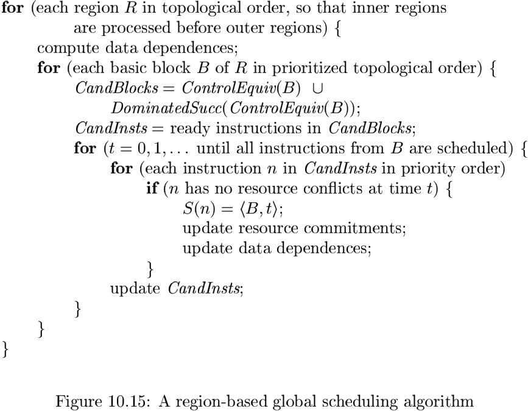

# Chapter 10 Instruction-Level Parallelism

[TOC]

## Processor Architectures

### Instruction Pipelines and Branch Delays

### Pipelined Execution

We say that the execution of an instruction is `pipelined` if succeeding instructions not dependent on the result are allowed to proceed.

### Multiple Instruction Issue

By issuing several operations per clock, processors can keep even more operations in flight. The largest number of operations that can be executed simultaneously can be computed by multiplying the instruction issue width by the average number of stages in the execution pipeline.

## Code-Scheduling Constraints

Code scheduling is a form of program optimization that applies to the machine code that is produced by the code generator. Code scheduling is subject to three kinds of constraints:

1. `Control-dependence constraints.` All the operations executed in the original program must be executed in the optimized one.
2. `Data-dependence constraints.` The operations in the optimized program must produce the same results as the corresponding ones in the original program.
3. `Resource constraints.` The schedule must not oversubscribe the resources on the machine.

### Data Dependence

There are three flavors of data dependence:

1. `True dependence:` read after write.
2. `Antidependence:` write after read.
3. `Output dependence:` write after write.

### Control Dependence

An instruction $i_1$ is said to be `control-dependent` on instruction $i_2$ if the outcome of $i_2$ determines whether $i_1$ is to be executed.

### Speculative Execution Support

The `prefetch` instruction was invented to bring data from memory to the cache before it is used.

The `Posion Bits` was invented to allow speculative load of data from meory into the register file.

The `predicated instructions` were invented to reduce the number of branches in a program.

### A Basic Machine Model

A machine $M = <R, T>$, consists of:

1. A set of operation types $T$, such as loads, stores, arithmetic operations, and so on.
2. A vector $R=[r_1, r_2, \cdots]$ representing hardware resources, where $r_i$ is the number of units available of the $i$th kind of resource.

## Basic-Block Scheduling

### Data-Dependence Graphs

We represent each basic block of machine instructions by a `data-dependence graph`, $G = (N, E)$, having a set of nodes $N$ representing the operations in the machine instructions in the block and a set of directed edges $E$ representing the data-dependence constraints among the operations. The nodes and edges of $G$ are constructed as follows:

1. Each operation $n$ in $N$ has a resource-reservation table $RT_n$, whose value is simply the resource-reservation table associated with the operation type of $n$.
2. Each edge $e$ in $E$ is labeled with delay $d_e$ indicating that the destination node must be issued no earlier than $d_e$ clocks after the source node is issued.

### List Scheduling of Basic Blocks

**Algorithm 10.7:** List scheduling a basic block.

INPUT: A machine-resource vector $R=[r_1, r_2, \cdots]$, where $r_i$ is the number of units available of the $i$th kind of resource, and a data-dependence graph $G = (N, E)$. Each operation $n$ in $N$ is labeled with its resource-reservation table $RT_n$; each edge $e = n_1 \rightarrow n_2$ in $E$ is labeled with $d_e$ indicating that $n_2$ must execute no earlier than $d_e$ clocks after $n_1$.

OUTPUT: A schedule $S$ that maps the operations in $N$​ into time slots in which the operations can be initiated satisfying all the data and resources constraints.

METHOD:

### Prioritized Topological Orders

Here are some observations about possible prioritized orderings of the nodes:

- Without resource constraints, the shortest schedule is given by the `cirtical path`, the longest path through the data-dependence graph.
- On the other hand, if all operations are independent, then the length of the schedule is constrained by the resources available.
- Finally, we can use the source ordering to break ties between operations; the operation that shows up earlier in the source program should be scheduled first.

## Global Code Scheduling

### Primitive Code Motion

A block $B$ `postdominates` block $B'$ if every path from $B'$ to the exit of the graph goes through $B$. When $B$ dominates $B'$ and $B'$ postdominates $B$, we say that $B$ and $B'$ are `control equivalent`, meaning that one is executed when and only when the other is.

### Downward Code Motion

1. Moving instructions between control-equivalent blocks is simplest and most cost effective. No extra operations are ever executed and no compensation code is needed.
2. Extra operations may be executed if the source does not postdominate(dominate) the destination in upward (downward) code motion. This code motion is beneficial if the extra operations can be executed for free, and the path passing through th e source block is executed.
3. Compensation code is needed if the destination does not dominte (post-dominate) the source in upward (downward) code motion. The paths with the compensation code may be slowed down, so it is important that the optimized paths are more frequently executed.
4. The last case combines the disavantages of the second and third case: extra operations may be executed and compensation code is needed.

### Global Scheduling Algorithms

**Algorithm 10.11:** Region-based scheduling.

INPUT: A control-flow graph and a machine-resource description.

OUTPUT: A schedule $S$​ mapping each instruction to a basic block and a time slot.

METHOD: 

## Software Pipelining

### Do-Across Loops

### Goals and Constraints of software Pipelining

A software-pipeline schedule for a data-dependence graph $G = (N, E)$ can be specified by:

1. An initiation interval $T$ and
2. A relative schedule $S$ that specifies, for each operation, when that operation is executed relative to the start of the iteration to which it belongs.

The resources committed in the $i$th row in the steady state are given by:
$$
RT_S[i] = \sum_{|t|(t\ mod\ 2) = i|} RT[t]
$$
, We refer to the resource-reservation table representing the steady state as the `modular resource-reservation table` of the pipelined loop.

Let $S$, a function from the nodes of the data-dependence graph to integers, be the software pipeline schedule, and let $T$ be the initiation interval target. Then:
$$
(\delta \times T) + S(n_2) - S(n_1) \geqslant d
$$
, The iteration difference, $\delta$, must be nonnegative.

The initiation interval of a pipelined loop is no smaller than:
$$
\overset{max}{\text{c a cycle in G}} \lceil \frac{\sum_{e \text{ in } c}d_e}{\sum_{e \text{ in } e}\delta_{e}} \rceil
$$
, clocks.

### Scheduling Acyclic Data-Dependence Graphs

**Algorithm 10.19:** Software pipelining an acyclic dependence graph.

INPUT: A machine-resource vector $R = [r_1, r_2, ...]$, where $r_i$ is the number of units available of the $i$th kind of resource, and a data-dependence graph $G = (N, E)$. Each operation $n$ in $N$ is labeled with its resource-reservation table $RT_n$; each edge $e = n_1 \rightarrow n_2$ in $E$ is labeled with $<\delta_{e}, d_{e}>$ indicating that $n_2$ must execute no earlier than $d_e$ clocks after node $n_1$ from the $\delta_{e}$th preceding iteration.

OUTPUT: A sfotware-pipelined schedule $S$ and an initiation interval $T$.

### Scheduling Cyclic Dependence Graphs

Let $n_1$ and $n_2$ be two operations in a dependence cycle, $S$ be a software pipeline schedule, and $T$ be the initiation interval for the schedule. A dependence edge $n_1 \rightarrow n_2$ with label $<\delta_{1}, d_1>$ imposes the following constraint on $S(n_1)$ and $S(n_2)$:
$$
(\delta_{1} \times T) + S(n_2) - S(n_1) \geq d_1
$$
, Similarly, a dependence edge $n_2 \rightarrow n_1$ with label $<\delta_2, d_2>$ imposes constraint:
$$
(\delta_2 \times T) + S(n_1) - S(n_2) \geqslant d_2
$$
, Thus,
$$
S(n_1) + d_1 - (\delta_{1} \times T) \leqslant S(n_2) \leqslant S(n_1) - d_2 + (\delta_2 \times T)
$$
A `strongly connected component (SCC)` in a graph is a set of nodes where every node in the component can be reached by every other node in the component. Scheduling one node in an SCC will bound the time of every other node in the component both from above and from below. Transitively, if there exists a path $p$ leading from $n_1$ to $n_2$, then:
$$
S(n_2) - S(n_1) \geq \underset{e \text{ in } p}{\Sigma}(d_e - (\delta_{e} \times T)) \qquad (10.1)
$$
**Algorithm 10.21:** Software pipelining.

INPUT: A machine-resource vector $R = [r_1, r_2, \cdots]$, where $r_i$ is the number of units available of the $i$th kind of resource, and a data-dependence graph $G = (N, E)$. Each operation $n$ in $N$ is labeled with its resource-reservation table $RT_{n}$; each edge $e = n_1 \rightarrow n_2$ in $E$ is labeled with $<\delta_e, d_e>$ indicating that $n_2$ must execute no earlier than $d_e$ clocks after node $n_1$ from the $\delta_{e}$th preceding iteration.

OUTPUT: A sfotware-pipelined schedule $S$ and an initiation interval $T$.

### Modular Variable Expansion

A scalar variable is said to be `privatizable` in a loop if its live range falls within an iteration of the loop.

`Variable expansion` refers to the transformation of converting a privatizable scalar variable into an array and having the $i$th iteration of the loop read and write the $i$th element.

**Algorithm 10.23:** Software pipelining with modular variable expansion.

INPUT: A data-dependence graph and a machine-resource description.

OUTPUT: Two loops, one software pipelined and one unpipelined.

METHOD:

1. Remove the loop-carried antidependences and output dependences associated with privatizable variables from the data-dependence graph.

2. Software-pipeline the resulting dependence graph using Algorithm 10.21. Let $T$ be the initiation interval for which a schedule is found, and $L$ be the length of the schedule for one iteration.

3. From the resulting schedule, compute $q_v$, the minimum number of registers needed by each privatizable variable $v. Let Q = max_{v} q_{v}$.

4. Generate two loops: a software-pipelined loop and an unpipelined loop.

   The software-pipelined loop has:
   $$
   \lceil \frac{L}{T} \rceil + Q - 1
   $$
   copies of the iterations, placed $T$ clocks apart. It has a prolog with
   $$
   (\lceil \frac{L}{T} \rceil - 1)^T
   $$
   instructions, a steady state with $QT$ instructions, and an epilog of $L - T$ instructions. Insert a loop-back instruction that branches from the bottom of the steady state to the top of the steady state.

   The number of registers assigned to privatizable variable $v$ is:
   $$
   q_v ' 
   \begin{cases}
   q_v &if\ Q\ mod\ q_v = 0 \\
   Q &otherwise
   \end{cases}
   $$
   The variable $v$ in iteration $i$ uses the $(i\ mod\ q_i')$th register assigned.

   Let $n$ be the variable representing the number of iterations in the source loop. The software-pipelined loop is executed if:
   $$
   n \geq \lceil \frac{L}{T} \rceil + Q - 1
   $$
   The number of times the loop-back branch is taken is:
   $$
   n_1 = \lfloor \frac{n - \lceil \frac{L}{T} \rceil  + 1}{Q} \rfloor
   $$
   Thus, the number of soruce iterations executed by the software-pipelined loop is:
   $$
   n_1 = 
   \begin{cases}
   \lceil \frac{L}{T} \rceil - 1 + Qn_1 &if\ n \geqslant \lceil \frac{L}{T} \rceil + Q - 1 \\
   0 &otherwise
   \end{cases}
   $$
   The number of iterations executed by the unpipelined loop is $n_3 = n - n_2$.

### Conditional Statements

If a machine does not have predicated instructions, we can use the concept of `hierarchical reduction`, described below, to handle a small amount of datadependent control flow.

