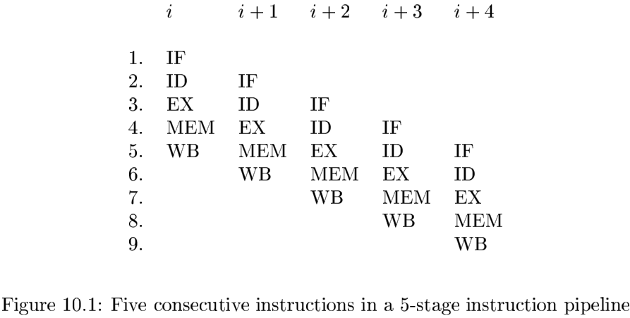
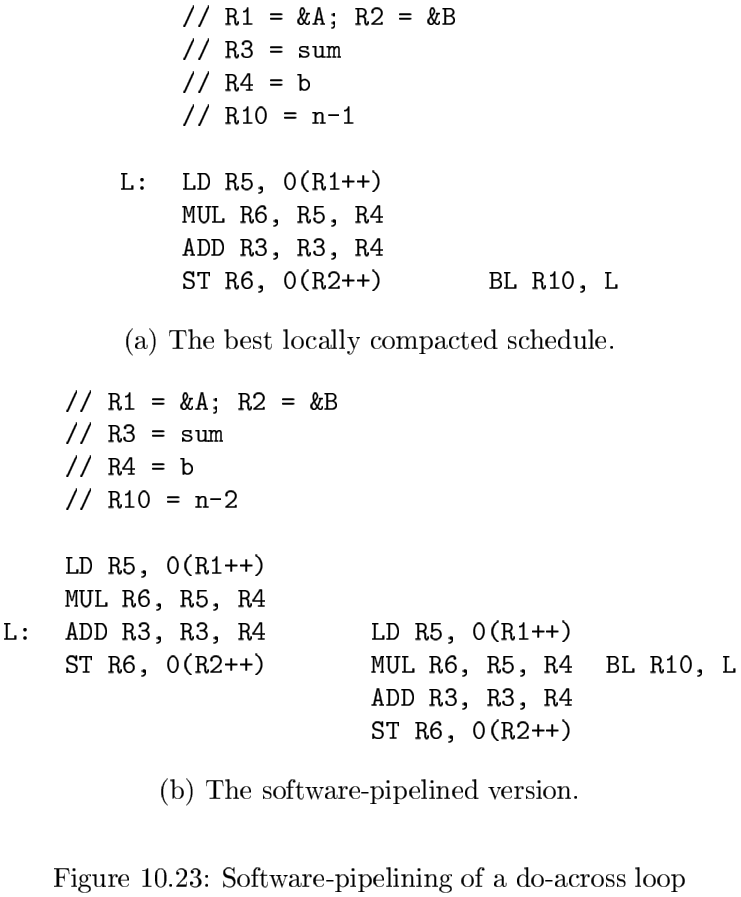
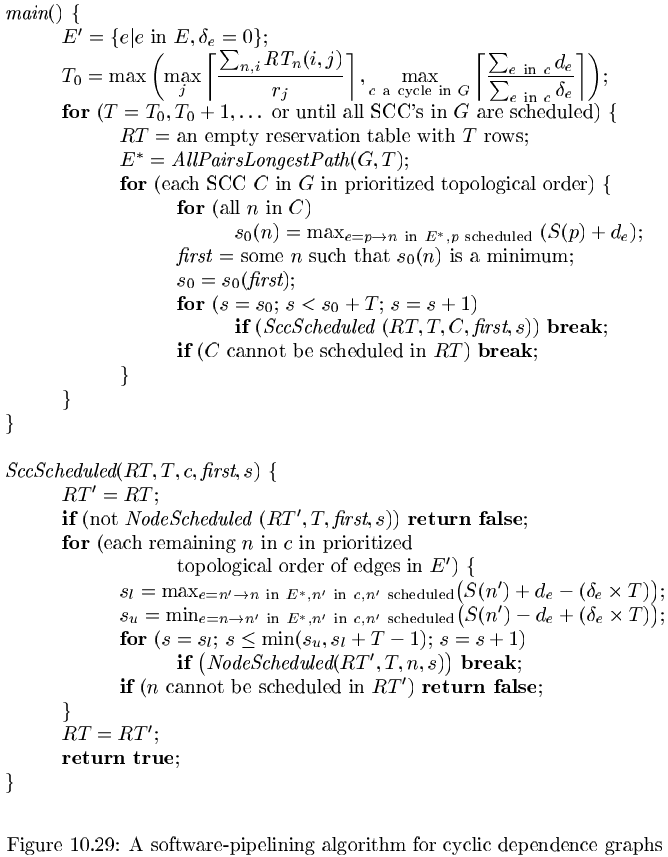

# 第10章 指令级并行性

[TOC]

## 10.1 处理器体系结构

`流水线（pipelining）`

### 10.1.1 指令流水线和分支延时

### 10.1.2 流水线执行

如果一条指令的后继指令在不需要该指令的运算结果时可以立刻往下执行，我们就说该指令的执行被`流水线化(pipeline)`了。

### 10.1.3 多指令发送

通过在每个始终周期发送多条指令，处理器可以在同一时刻运行更多指令。可同时执行的指令数目是指令发送宽度和指令执行流水线中平均阶段数目的乘积。

## 10.2 代码调度约束

代码调度是程序优化的一种形式，它应用于由代码生成器生成的机器代码。代码调度要遵守下面三种约束：

1. 控制依赖约束：所有在源程序中执行的运算都必须在优化后的程序中执行。
2. 数据依赖约束：优化后的程序中的运算必须和原程序中的相应运算生成相同的结果。
3. 资源约束：调度不能超额使用机器上的资源。

### 10.2.1 数据依赖

有三种类型的数据依赖关系：

1. 真依赖：写之后再读。
2. 反依赖：读之后再写。
3. 输出依赖：写之后再写。

### 10.2.2 寻找内存访问之间的依赖关系

### 10.2.3 寄存器使用和并行性之间的折衷

### 10.2.4 寄存器分配阶段和代码调度阶段之间的顺序

### 10.2.5 控制依赖

如果指令$i_2$的结果决定了指令$i_1$是否执行，那么就说指令$I_1$是`控制依赖（control-dependent）`于指令$i_2$的。

### 10.2.6 对投机执行的支持

`预取（prefetch）指令`

`毒药位（poison bit）`

`带断言的指令（predicated instruction）`

### 10.2.7 一个基本的机器模型

一个机器$M = <R, T>$由下列元素组成：

1. 一个运算类型的集合$T$。这些运算类型包括加载，保存，算术运算等。
2. 一个代表硬件资源的向量$R=[r_1, r_2, \cdots]$，其中$r_i$表示第$i$种资源的可用单元的数目。

### 10.2.8 10.2节的练习

## 10.3 基本块调度

### 10.3.1 数据依赖图

我们把每个由机器指令组成的基本块表示成为一个`数据依赖图（data-dependence graph）`，$G = (N, E)$，其中节点集合$N$表示基本块中机器指令的运算，而有向边集合$E$表示运算之间的数据依赖约束。$G$的节点集合和边集按照如下方式构造：

1. 在$N$中的每个运算$n$有一个资源预约表$RT_n$，其值就是$n$的运算类型所对应的资源预约表。
2. $E$中的每条边$e$有一个表示延时的标号$d_e$。

### 10.3.2 基本块的列表调度方法

**算法 10.7** 对一个基本块进行列表调度。

输入：一个机器-资源向量$R=[r_1, r_2, \cdots]$，其中$r_i$是第$i$种资源的可用单元的数目；一个数据依赖图$G = (N, E)$。$N$中的每个运算$n$的标号是它的资源预约表$RT_n$；$E$中的每个边$e = n_1 \rightarrow n_2$都有标号$d_e$，表明了$n_2$不能在$n_1$执行之后的$d_e$个时钟周期之内执行。

输出：一个调度方案$S$。它把$N$中的每个运算映射到时间位置中。各个运算在方案所确定的时间位置开始执行，就可以保证所有的数据依赖关系和资源约束都得到满足。

方法：

### 10.3.3 带优先级的拓扑排序

下面是一些关于节点的所有可能的带优先级的拓扑排序的性质：

- 如果不考虑资源约束，最短的调度方案可以根据`关键路径(cirtical path)`给出。
- 如果所有的运算都是独立的，那么调度方案的长度收到可用资源的约束。
- 最后，我们可以使用源代码中的顺序来解决运算之间难分先后的问题，在源程序中先出现的运算应该首先被安排。

### 10.3.4 10.3节的练习

## 10.4 全局代码调度

### 10.4.1 基本的代码移动

如果从$B'$到达流图出口处的路径都经过$B$，我们说$B$`反向支配（postdominate）`$B'$。

当$B$支配$B'$并且$B'$反向支配$B$的时候，我们就说$B$和$B'$是`控制等价的（control equivalent）`，其含义是一个基本块会被执行当且仅当另一个基本块也会被执行。

### 10.4.2 向上的代码移动

### 10.4.3 向下的代码移动

1. 在控制等价的基本块之间移动指令最简单且性价比最高。不需要执行额外的运算，也不需要补偿代码。
2. 在向上（向下）代码移动中，如果源基本块不反向支配（支配）目标基本块，那么就可能需要执行额外的运算。当该额外运算能够免费执行并且通过源基本块的路径被执行时，这个代码移动就是有益的。
3. 在向上（向下）代码移动中，如果慕白哦基本块不知配（反向支配）源基本块，就需要补偿代码。带有补偿代码的路径的运行可能会变慢，因此保证被优化的路径具有较高的执行效率是很重要的。
4. 最后一种情况把第二和第三种情况的不利之处合并起来：可能既需要执行额外运算，有需要补偿代码。

### 10.4.4 更新数据依赖关系

### 10.4.5 全局调度算法

**算法 10.11** 基于区域的调度。

输入：一个控制流图和一个机器-资源描述。

输出：一个调度方案$S$。它把每条指令映射到一个基本块和一个时间位置。

方法：

### 10.4.6 高级代码移动技术

### 10.4.7 和动态调度器的交互

### 10.4.8 10.4节的练习

## 10.5 软件流水线化

### 10.5.1 引言

### 10.5.2 循环的软件流水线化

### 10.5.3 寄存器分配和代码生成

### 10.5.4 Do-Across循环

### 10.5.5 软件流水线化的目标和约束

一个数据依赖图$G = (N, E)$的软件流水线调度方案可以描述为：

1. 一个启动间隔$T$。
2. 一个相对调度方案$S$。对每个运算，它给定了该运算相对于它所处迭代的开始时刻的执行时间。

稳定状态下第$i$行所需资源可以由下面的公式给出：
$$
RT_S[i] = \sum_{|t|(t\ mod\ 2) = i|} RT[t]
$$
我们把表示稳定状态的资源预约表称为这条流水线化的循环的`模数资源预约表（modular resource-reservation）`。

令$S$是软件流水线化的调度方案，它是一个从数据依赖图中的节点到整数的函数，并令$T$为启动时间间隔的目标，那么：
$$
(\delta \times T) + S(n_2) - S(n_1) \geqslant d
$$
其中的迭代距离$\delta$必须是非负的。

一个被流水线化的循环的启动间隔不小于$\overset{max}{c是一个G中的圈} \lceil \frac{\sum_{e在e中}d_e}{\sum_{e在e中}\delta_{e}} \rceil$个时钟周期。

### 10.5.6 一个软件流水线化算法

### 10.5.7 对无环数据依赖图进行调度

**算法 10.19** 对一个无环依赖图进行软件流水线化处理。

输入：一个机器资源向量$R = [r-1, r_2, \cdots]$，其中$r_i$表示第$i$种资源的可用单元数量；一个数据依赖图$G = (N, E)$。$N$中的每个运算$n$用它的资源预约表$RT_n$作为标号；$E$中的每条边$e = n_1 \rightarrow n_2$上有标号$<\delta_{e}, \delta_{e}>$。这个标号表示$n_2$只能在往前第$\delta_{e}$个迭代中的节点$n_1$执行$d_e$个时钟周期之后才可以执行。

输出：一个经过软件流水线化的调度方案$S$和一个启动间隔$T$。

方法：

### 10.5.8 对有环数据依赖图进行调度

令$n_1$和$n_2$是一个依赖环中的两个运算，$S$是一个软件流水线调度方案，而$T$是这个调度方案的启动间隔。一个带有标号$<\delta_{1}, d_1>$的依赖边$n_1 \rightarrow n_2$对$S(n_1)$和$S(n_2)$加上了如下约束：
$$
(\delta_{1} \times T) + S(n_2) - S(n_1) \geqslant d_1
$$
类似地，一个带有标号$<\delta_2, d_2>$的依赖边$n_2 \rightarrow n_1$增加了如下约束：
$$
(\delta_2 \times T) + S(n_1) - S(n_2) \geqslant d_2
$$
因此
$$
S(n_1) + d_1 - (\delta_{1} \times T) \leqslant S(n_2) \leqslant S(n_1) - d_2 + (\delta_2 \times T)
$$
一个图的强连通分量（Strongly Connected Component, SCC）是满足如下条件的一个节点集合，其中的每个节点都可以从集合中的所有其他节点到达。对SCC中的一个节点进行调度将会从上下两个方向限制其他各个节点的可行时间。如果存在一个从$n_1$到$n_2$的路径$p$，那么有
$$
S(n_2) - S(n_1) \geqslant \overset{\Sigma}{e在p中}(d_e - (\delta_{e} \times T)) \qquad (10.1)
$$
**算法 10.21** 软件流水线化。

输入：一个机器资源向量$R = [r_1, r_2, \cdots]$，其中$r_i$表示第$i$种资源的可用单元的数量；一个数据依赖图$G = (N, E)$。$N$中的每个运算$n$的标号为它的资源预约表$RT_n$；$E$中的每条边$e = n_1 \rightarrow n_2$上有标号$<\delta_e, d_e>$，这个标号表示$n_2$的执行时刻不能早于向前第$\delta_e$个迭代中的节点$n_1$之后的$d_e$个时钟周期。

输出：一个软件流水线化的调度方案$S$和一个启动间隔$T$。

方法：

### 10.5.9 对流水线化算法的改进

### 10.5.10 模数变量扩展

如果一个标量变量的活跃范围处于循环的一个迭代之内，那么该标量变量被称为`可私有化的（privatizable）`。

`变量扩展（variable expansion）`指的是这样一种变换技术：它把一个可私有化的标量变量转换成为一个数组，并让循环的第$i$个迭代读写第$i$个元素。

**算法 10.23** 使用模数变量扩展技术的软件流水线化。

输入：一个数据依赖图和一个机器资源描述。

输出：两个循环，一个经过软件流水线化处理，另一个没有。

方法：

1. 从输入的数据依赖图种删除和可私有化变量相关的穿越循环的反依赖关系和输出依赖关系。

2. 使用算法10.21对第一步得到的数据依赖图进行软件流水线化。令$T$是已经找到相应调度方案的启动间隔，$L$是要给迭代的调度方案的长度。

3. 对于每个可私有化变量$v$，依据得到的调度方案计算$q_v$，即$v$所需要的最小寄存器数目。令$Q = max_{v}q_{v}$。

4. 生成两个循环：

   - 经过软件流水线化的循环

     此循环有
     $$
     \lceil \frac{L}{T} \rceil + Q - 1
     $$
     个迭代的拷贝，各个拷贝之间相距$T$个时钟。它有一个带有
     $$
     (\lceil \frac{L}{T} \rceil - 1)^T
     $$
     条指令的序言部分，一个带有$QT$条指令的稳定状态和一个具有$L-T$条指令的尾声部分。插入一个从稳定状态的尾部到稳定状态顶端的循环回归指令。

     分配给可私有化变量$v$的寄存器数目是
     $$
     q_v ' 
     \begin{cases}
     q_v &如果Q\ mod\ q_v = 0 \\
     Q &否则
     \end{cases}
     $$
     在第$i$个迭代中的变量$v$使用的是被分配给$v$的第$(i\ mod\ q_i')个$寄存器。

     令$n$为源代码循环中表示迭代数目的变量。这个软件流水线化的循环被执行的前提是
     $$
     n \geqslant \lceil \frac{L}{T} \rceil + Q - 1
     $$
     循环回归分支的执行次数是
     $$
     n_1 = \lfloor \frac{n - \lceil \frac{L}{T} \rceil  + 1}{Q} \rfloor
     $$
     因此，软件流水线化的循环所执行的源代码中迭代的次数是
     $$
     n_1 = 
     \begin{cases}
     \lceil \frac{L}{T} \rceil - 1 + Qn_1 &如果n \geqslant \lceil \frac{L}{T} \rceil + Q - 1 \\
     0 &否则
     \end{cases}
     $$
     
- 没有被流水线化的循环
   
  执行的迭代数目是$n_3 = n - n_2$。

### 10.5.11 条件语句

如果一个机器没有带断言的指令，那么可以使用下面描述的`层次结构归约（hierarchical reduction）`技术来处理少量的依赖于数据的控制流。

### 10.5.12 软件流水线化的硬件支持

### 10.5.13 10.5节的练习

## 10.6 第10章总结

## 10.7 第10章参考文献

