# 第11章 并行性和局部性优化

## 11.1 基本概念

### 11.1.1 多处理器

`对称多处理器（Symmetric MultiProcessor, SMP）`

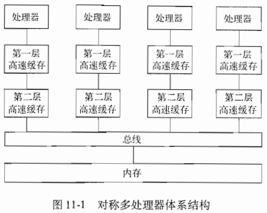

对称多处理器使用`一致缓存协议（coherent cache protocol）`来对程序员隐藏高速缓存的存在。

一个处理器和另一个处理器通信所花的时间大约是内存访问时间的两倍。以缓存线为单位的数据必须首先从源处理器的高速缓存写到内存中，然后再从内存取出放到第二个处理器的高速缓存中。

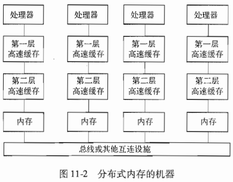

有两种不同的带有分布式内存的并行机：

- NUMA（NonUniform Memory Access， 不一致内存访问）机器。
- 消息传递机器。

### 11.1.2 应用中的并行性

使用两种高层次的度量来估计一个并行应用性能：

- 并行性覆盖：指明了并行执行的计算过程所占的百分比。
- 并行性粒度：指出了各个处理器在不和其他处理器通信或者同步的情况下能够运行的计算量。

**Amdahl 定律**

并行性覆盖率可以用Amdahl定律来表示：如果$f$是被并行化代码的比率，并且如果并行化版本在一个有$p$个处理器的机器上运行，且没有任何通信或者并行化开销，那么此时的加速比是：
$$
\frac{1}{(1 - f) + (f / p)}
$$

### 11.1.3 循环层次上的并行性

### 11.1.4 数据局部性

当同一个数据在短时间内被多次使用时就产生了`时间局部性（temporal locality）`。

当位置相近的不同数据元素在短时间内被使用的时候就产生了`空间局部性（spatial locality）`。

操作数组的数值应用相关的几个重要性质：

- 数组代码经常有很多可并行化的循环。
- 当循环具有并行性的时候，它们的迭代可以按照任意的顺序执行。它们可以通过重新排序大幅提高数据局部性。
- 当我们创建出大的相互独立的并行计算单元时，以串行方式执行它们往往会得到良好的数据局部性。

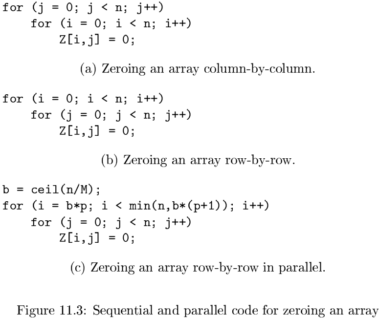

### 11.1.5 仿射变换理论概述

对于带有数组访问的循环的优化问题，我们使用三种类型的空间。每个空间可以看成是一维或多维栅格中的点集：

- `迭代空间（iteration space）`是在一次计算过程中动态执行实例的集合，也就是各个循环下标的取值的组合。
- `数据空间（data space）`是被访问的数组元素的集合。
- `处理器空间（processor space）`是系统中的处理器的集合。

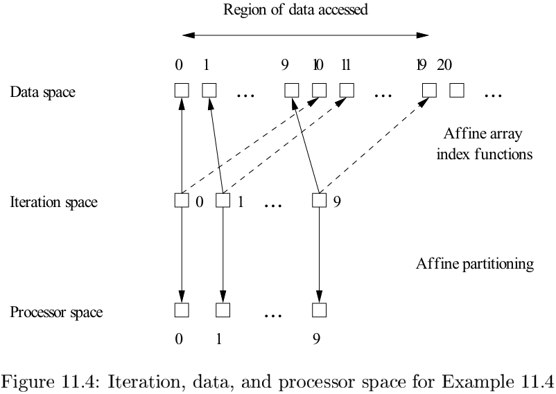

## 11.2 矩阵乘法：一个深入的例子

### 11.2.1 矩阵相乘算法

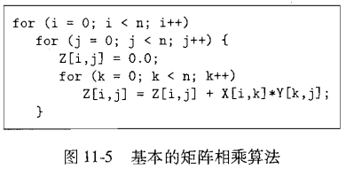

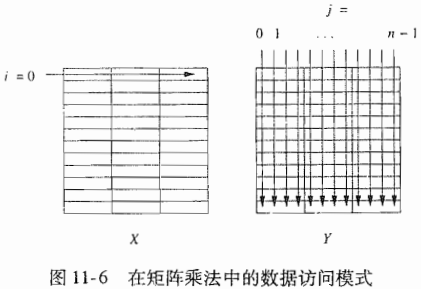

### 11.2.2 优化

**改变数据布局**

改善一个程序的局部性的方法之一是改变它的数据结构的布局。

**分块**

`分块（blocking）`是另一种对循环中的迭代重新排序的方法，它可以大大提高一个程序的局部性。

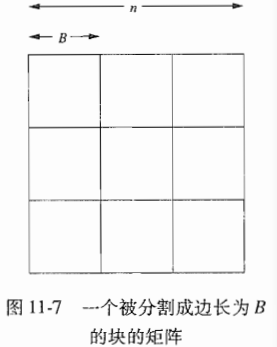

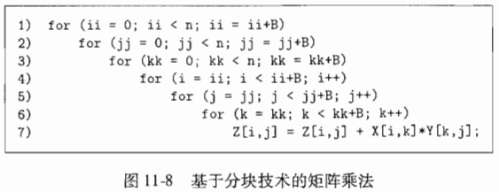

### 11.2.3 高速缓存干扰

`高速缓存干扰（cache interference）`。

### 11.2.4 11.2节的练习

## 11.3 迭代空间

### 11.3.1 从循环嵌套结构中构建迭代空间

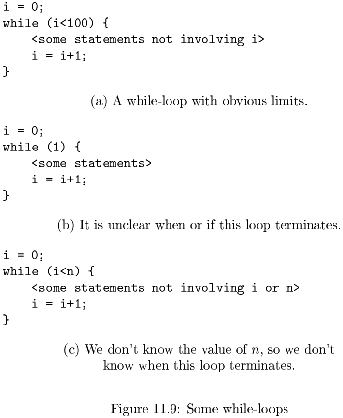

一个凸多面体具有以下性质：如果两个点在该多面体内，那么它们之间的连线上的所有点都在该多面体内。多面体使用循环界限不等式描述。循环的每个迭代器都可以由该多面体中的具有整数坐标的点表示。反过来，在多面体内的每个整数点都代表了该循环嵌套结构在某个时候执行的一个迭代。

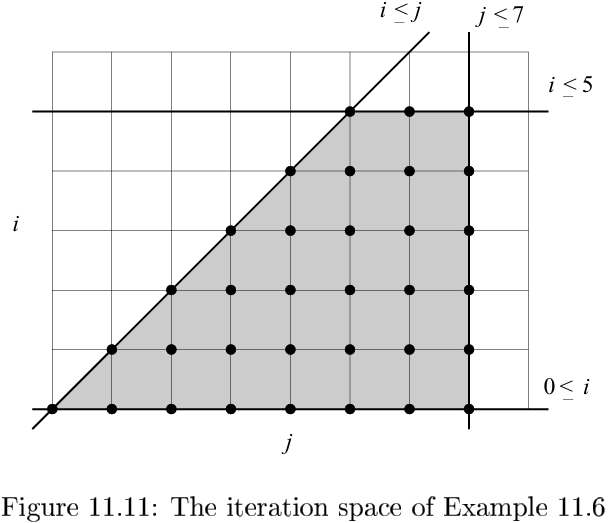

### 11.3.2 循环嵌套结构的执行顺序

### 11.3.3 不等式组的矩阵表示方法

在一个深度为$d$的循环嵌套中的迭代可用数学方式表示为：
$$
\{i在Z^d中|Bi + b \geqslant 0\} \qquad (11.1)
$$
其中：

1. $Z$（按照数学惯例）表示整数的集合--包含正整数，负整数和零。
2. $B$是一个$d \times d$的整数矩阵。
3. $b$是一个长度为$d$的整数向量。
4. $0$是一个由$d$个零组成的向量。

### 11.3.4 混合使用符号常量

`符号常量（symbolic constant）`变量对于嵌套结构中的所有循环都是循环不变的。

### 11.3.5 控制执行的顺序

投影的正式定义如下：令$S$为一个$n$维多面体。$S$到它的前$m$个维度的投影是满足如下条件的点$(x_1, x_2, \cdots, x_m)$：存在$x_{m+1}, x_{m+2}, \cdots, x_n$使得向量$[x_1, x_2, \cdots, x_n]$在$S$中。

**算法 11.11** Fourier-Motzkin消除算法。

输入：一个带有变量$x_1, x_2, \cdots, x_n$的多面体$S$。也就是说，$S$是关于变量$x_i$的一组线性约束。一个给定的变量$x_m$是被指定需要消除的变量。

输出：一个关于变量$x_1, x_2, \cdots, x_{m-1}, x_{m+1}, \cdots, x_n$（即除$x_m$之外的所有$S$的变量）的多面体$S'$。$S'$是$S$到除第$m$个维度之外的所有维度的投影。

方法：令$C$是$S$中所有涉及$x_m$的约束的集合。执行下列步骤：

1. 对于$C$中关于$x_m$的每一对上界和下界，比如：
   $$
   L \leqslant c_1 x_m \\
   c_2 x_m \leqslant U
   $$
   建立一个新的约束：
   $$
   c_2 L \leqslant c_1 U
   $$
   请注意，$c_1$和$c_2$是整数，但$L$和$U$可能是关于除$x_m$之外的其他变量的表达式。

2. 如果整数$c_1$和$c_2$有公因子，讲上面约束的两边都除以这个因子。

3. 如果新的约束是不可满足的，那么$S$无解，即多面体$S$和$S'$都是空的空间。

4. $S'$是约束集合$S - C$加上在第2步中生成的所有约束。

**算法 11.13** 给定一组变量的顺序，计算这些变量的界限。

输入：一个在变量$v_1, v_2, \cdots, v_n$之上的凸多面体$S$。

输出：每个变量$v_i$的下界$L_i$和上界$U_i$，这些界限只使用排在$v_i$之前的变量$v_j(j < i)$来表示。

方法：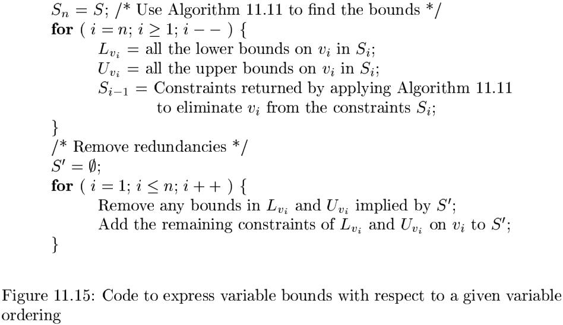

### 11.3.6 坐标轴的变换

### 11.3.7 11.3节的练习

## 11.4 仿射的数组下标

### 11.4.1 仿射访问

如果下列条件成立，我们就说一个循环中的一个数组访问是`仿射`的。

1. 该循环的上下界被表示为外围循环变量和符号常量的仿射表达式。
2. 该数组的每个维度的下标也是外围循环变量和符号常量的仿射表达式。

### 11.4.2 实践中的仿射访问和非仿射访问

### 11.4.3 11.4节的练习

## 11.5 数据复用

从数组访问函数中我们得到了两种可用于局部性优化和并行化的有用信息：

1. 数据复用：对于局部性优化，我们希望识别除访问相同数据或相同高速缓存线的迭代集合。
2. 数据依赖：为了并行化和局部性循环转换的正确性，我们希望找出代码中的所有数据依赖关系。

### 11.5.1 数据复用的类型

我们将把访问指令本身称为`静态访问（static access）`，而当我们执行该循环嵌套结构时该语句的多次迭代称为`动态访问（dynamic access）`。

### 11.5.2 自复用

矩阵$F$的秩是$F$的线性无关列（或者等价地，行）的最大数目。一个向量集合被称为`线性无关（linearly independent）`的条件是没有向量可以被写成该集合中有限多个其他向量的线性组合。

### 11.5.3 自空间复用

### 11.5.4 组复用

我们只在同一个循环中的具有相同系数矩阵的数组访问之间计算组复用。给定两个动态访问$Fi_1 + f_1$和$Fi_2 + f_2$，它们复用相同的数据的条件是
$$
Fi_1 + f_1 = Fi_2 + f_2
$$
或者说
$$
F(i_1 - i_2) = (f_2 - f_1)
$$
假设$v$是这个等式的一个解，如果$w$是$F$的零空间中的任意向量，那么$w + v$也是一个解。实际上，这样的向量就是该方程的全部解。

### 11.5.5 11.5节的练习

## 11.6 数组数据依赖关系分析

### 11.6.1 数组访问的数据依赖关系的定义

### 11.6.2 整数线性规划

`整数线性规划（integer linear programming）`。

数据依赖关系分析算法由三个部分组成：

1. 使用丢番图方程的理论，应用GCD（Greatest Common Divisor，最大公约数）测试来检验是否存在满足问题中所有等式的整数解。
2. 使用一组简单的启发规则来处理大量的典型不等式。
3. 使用线性整数规划求解程序来解决问题。

### 11.6.3 GCD测试

**定理 11.32** 线性丢番图方程（Diophantine equation）：
$$
a_1 x_1 + a_2 x_2 + \cdots + a_n x_n = c
$$
有$x_1, x_2, \cdots, x_n$的一个整数解，当且仅当$gcd(a_1, a_2, \cdots, a_n)$能够整除$c$。

### 11.6.4 解决整数线性规划的启发式规则

### 11.6.5 解决一般性的整数线性规划问题

**算法 11.39** 整数线性规划问题的分支界定解法。

输入：一个变量$v_0, \cdots, v_n$上的多面体$S_n$.

输出：如果$S_n$有一个整数解，输出“yes”，否则输出"no"。

方法：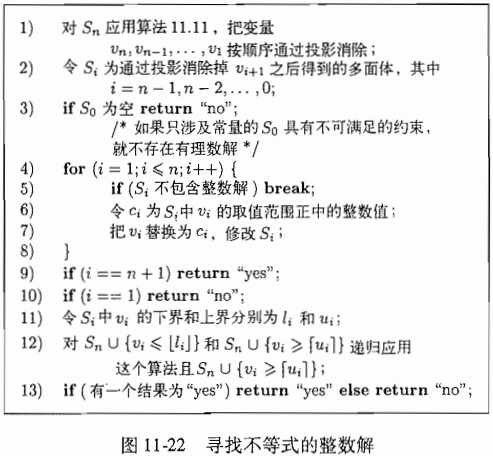

### 11.6.6 小结

### 11.6.7 11.6节的练习

## 11.7 寻找无同步的并行性

### 11.7.1 一个介绍性的例子

### 11.7.2 仿射空间分划

`仿射空间分划（affine space partition）`。

### 11.7.3 空间分划约束

### 11.7.4 求解空间分划约束

**算法 11.43** 找出一个程序的具有最高秩的无同步仿射分划。

输入：一个带有仿射数组访问的程序。

输出：一个分划。

方法：执行下列步骤：

1. 找出程序中所有的具有数据依赖关系的访问对。
2. 对于每一对相互依赖的访问，我们减少其下标向量中的未知量的数目。
3. 舍弃和分划无关的变量。
4. 找出这个仿射分划的秩并求解系数矩阵。
5. 找出常量项。

### 11.7.5 一个简单的代码生成算法

**算法 11.45** 创建顺序执行一个程序的各个分划单元的代码。

输入：一个具有仿射数组访问的程序$P$。程序中的每个语句$s$具有形如$B_s i + b_s \geqslant 0$的界限，其中$i$是$s$所在循环嵌套结构的循环下标变量的向量。每个语句$s$还附有一个分划$C_s i + c_s = p$，其中$p$是一个由表示处理器ID的变量组成的$m$维向量。$m$是程序$P$中的各个语句的分划的秩的最大值。

输出：一个等价于$P$的程序，但是它在处理器空间上（而不是原来的循环下标上）进行迭代遍历。

方法：执行下列步骤：

1. 对于每个语句，使用Fourier-Motzkin消除法从界限中通过投影消除所有的循环下标变量。
2. 使用算法11.13来决定分划单元ID的界限。
3. 为处理器空间的$m$个维度中的每一维生成一个循环。令$p = [p_1, p_2, \cdots, p_m]$为这些循环的变量的向量。

### 11.7.6 消除空迭代

### 11.7.7 从最内层循环中消除条件测试

### 11.7.8 源代码转换

七个基本仿射转换：

1. 融合（fusion）：融合转换的特点是把原程序中的多个循环下标映射到同一个循环下标上。新的循环融合了来自不同循环的语句。
2. 裂变（fission）：裂变转换是融合的逆向转换。它把不同语句的同一个循环下标映射到转换得到的代码中的不同循环下标。这个转换把原来的一个循环分解为多个循环。
3. 重新索引（re-indexing）：重新索引技术把一个语句的动态执行偏移固定多个迭代。这个仿射变换有一个常量项。
4. 比例变换（scaling）：源程序中的连续迭代被一个常量因子隔开。这个仿射变换具有一个正的非单元系数。
5. 反置（reversal）：按相关顺序执行循环中的迭代。反置转换的特点是有一个系数为-1.
6. 交换（permutation）：交换内层循环和外层循环。这个仿射变换由单位矩阵中的经过交换的各行组成。
7. 倾斜（skewing）：沿着一个角度来遍历循环的迭代空间。这个仿射变换是一个幺模矩阵，其对角线上都是1。

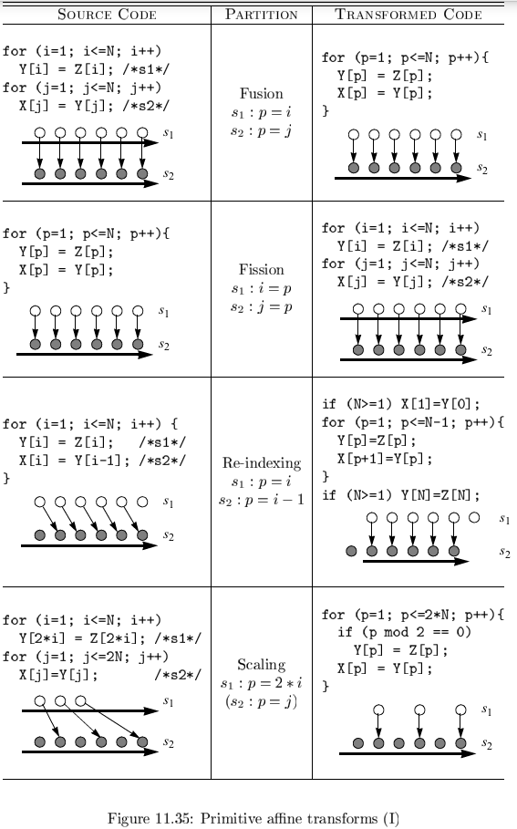

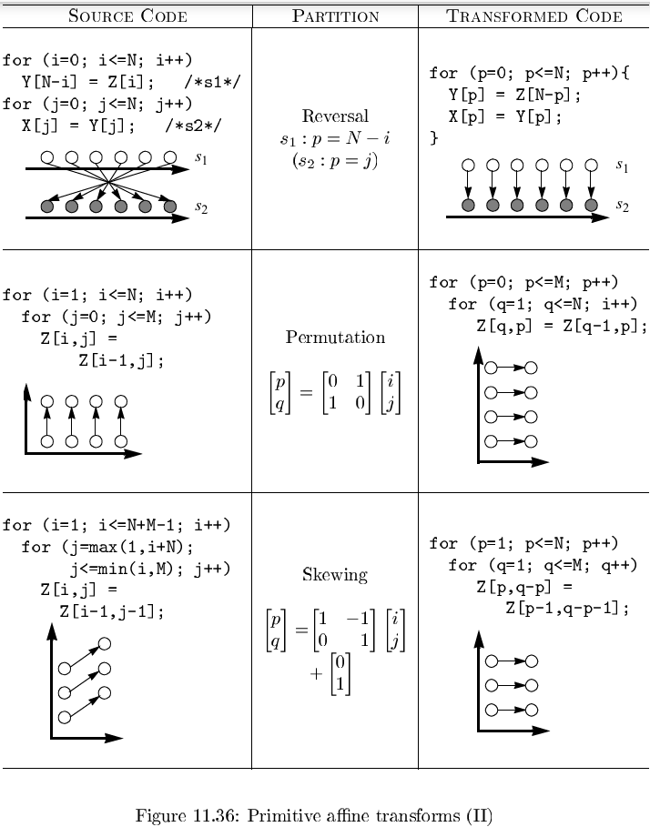

### 11.7.9 11.7 节的练习

## 11.8 并行循环之间的同步

### 11.8.1 固定多个同步运算

### 11.8.2 程序依赖图

`程序依赖图（Program Dependence Graph, PDG）`。

### 11.8.3 层次结构化的时间

### 11.8.4 并行化算法

**算法 11.54** 在允许$O(1)$次同步的情况下最大化并行性的度数。

输入：一个带有数组访问的程序。

输出：带有固定多个同步栅障的SPMD代码。

方法：

1. 构造程序的程序依赖图，并把语句分划为强连通分量（SCC）。
2. 转换代码，使之按照拓扑顺序执行各个SCC。必要时可以应用裂变转换。
3. 对每个SCC应用算法11.43，寻找出所有的无同步并行性。在每个被并行化的SCC的前后都插入同步栅障。

### 11.8.5 11.8节的练习

## 11.9 流水线化技术

`完全可交换循环（fully permutable loop）`。

### 11.9.1 什么是流水线化

流水线技术和不同处理器处理不同任务的简单并行性比较：

- 流水线化技术只能应用于深度至少为2的循环嵌套结构。
- 在一个流水线中运行的任务可以具有数据依赖关系。
- 如果任务是独立的，那么简单的并行化方案具有较好的处理器利用率，原因是各个处理器可以一起开始执行，而不会产生填满和排空流水线的开销。

### 11.9.2 连续过松弛方法：一个例子

`连续过松弛法（Successive Over Relaxation, SOR）`是一个在使用松弛方法求解联立线性方程式时加快收敛速度的技术。

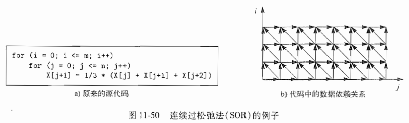

我们把一个斜线上的全部迭代称为`波阵面（wave front）`，而这样的并行化方案被称为`波阵面推进（wavefronting）`。

### 11.9.3 完全可交换循环

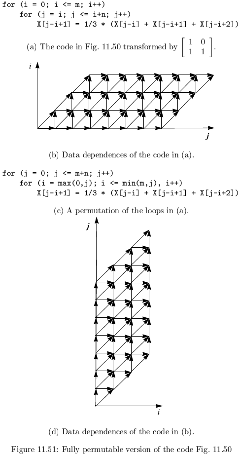

### 11.9.4 把完全可交换循环流水线化

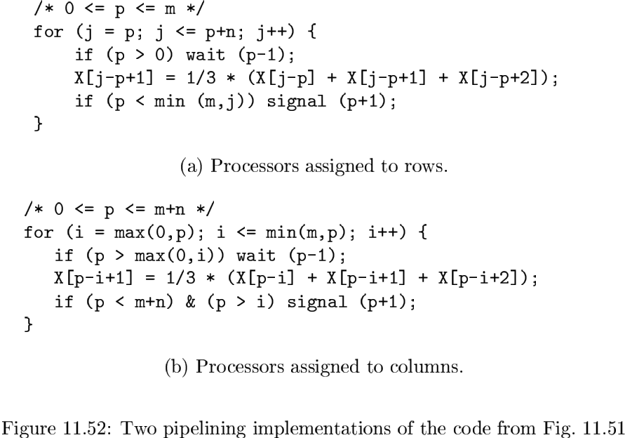

### 11.9.5 一般性的理论

流水线化的一般性理论：如果我们能够在一个循环嵌套结构中找到至少两个不同的最外层循环，并满足所有的依赖关系，那么就可以把这个计算过程流水线化。一个具有$k$个最外层完全可交换循环的循环嵌套结构具有$k - 1$度的流水线化并行度。

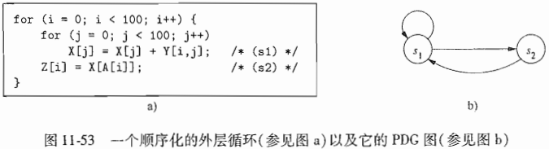

### 11.9.6 时间分划约束

### 11.9.7 用Farkas引理求解时间分划约束

**算法 11.59** 为一个外层的顺序循环找到一个合法的最大线性独立的仿射时间分划映射。

输入：一个带有数组访问的循环嵌套结构。

输出：线性独立时间分划映射的最大集。

方法：

### 11.9.8 代码转换

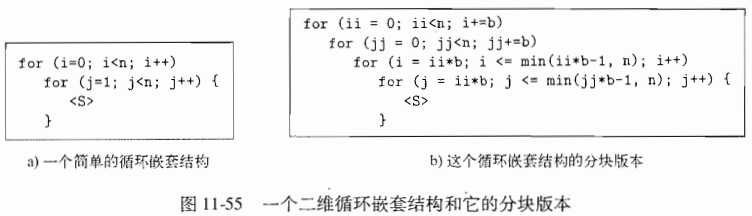

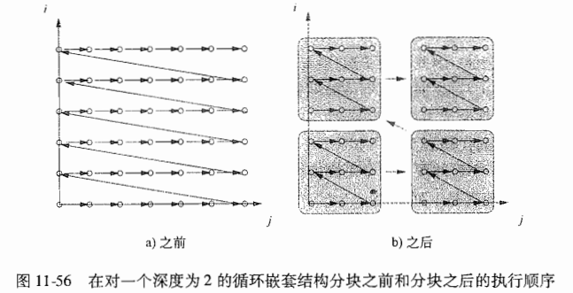

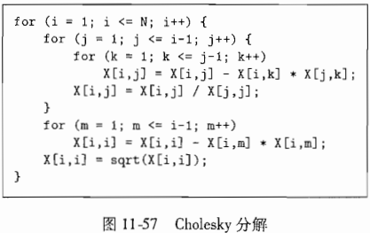

### 11.9.9 具有最小同步量的并行性

**算法 11.64** 找出一个程序中存在的所有并行度，同时所有并行性的粒度都尽可能地粗糙。

输入：一个要进行并行化的程序。

输出：同一个程序的并行化版本。

方法：完成下列步骤：

1. 找出不需要同步运算的并行性的最大度数。
2. 找出需要$O(1)$次同步运算的并行性的最大度数。
3. 找出需要$O(n)$次同步运算的最大并行性度数。
4. 在逐步增加同步度数的情况下寻找最大的并行性度数。

### 11.9.10 11.9 节的练习

## 11.10 局部性优化

### 11.10.1 计算结果数据的时间局部性

### 11.10.2 数组收缩

**算法 11.68** 数组收缩。

输入：一个由算法11.64转换得到的程序。

输出：一个等价的程序，但降低了数组的维度。

方法：一个数组的维度可以被收缩为一个元素的条件如下：

1. 每个独立的分划单元只使用这个数组的一个元素。
2. 这个元素在分划单元入口处的值没有被这个分划单元使用。
3. 这个元素的值在这个单元的出口处不活跃。

### 11.10.3 分划单元的交织

`最内层分块（innermost block）`。

`条状挖掘（stripmining）`。

### 11.10.4 合成

**算法 11.71** 在一个单处理器系统上优化数据局部性。

输入：一个带有仿射数组访问的程序。

输出：一个最大化数据局部性的等价程序。

方法：执行下列步骤：

1. 应用算法11.64来优化计算结果的时间局部性。
2. 应用算法11.68在可能的时候收缩数组。
3. 利用11.5节中描述的技术，确定可能共享相同数据或高速缓存线的迭代子空间。对于每个语句，找出具有数据复用的外层并行循环的维度。
4. 对每个带有数据复用的外层并行循环，重复使用基本的交织方法，把一个迭代分块移动到最内层块中。
5. 对位于那些带有复用的最内层的完全可交换循环中的维度的子集应用分块技术。
6. 对外层完全可交换循环嵌套结构进行分块，其目的是利用内存层次结构中的更高层存储设备，比如第三层高速缓存或物理内存。
7. 在必要的地方按照块的边长扩展标量或者数组。

**算法 11.72** 针对多处理器系统优化并行性和数据局部性。

输入：一个带有仿射数组访问的程序。

输出：一个最大化并行性和数据局部性的等价程序。

方法：执行下列步骤：

1. 使用算法11.64对这个程序进行并行化，并创建一个SPMD程序。
2. 对步骤1中生成的SPMD程序应用算法11.71，以优化它的局部性。

### 11.10.5 11.10节的练习

## 11.11 仿射转换的其他用途

### 11.11.1 分布式内存计算机

### 11.11.2 多指令发送处理器

### 11.11.3 向量和SIMD指令

### 11.11.4 数据预取

## 11.12 第11章总结

## 11.13 第11章参考文献

