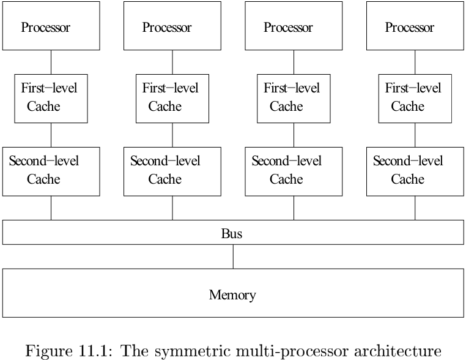
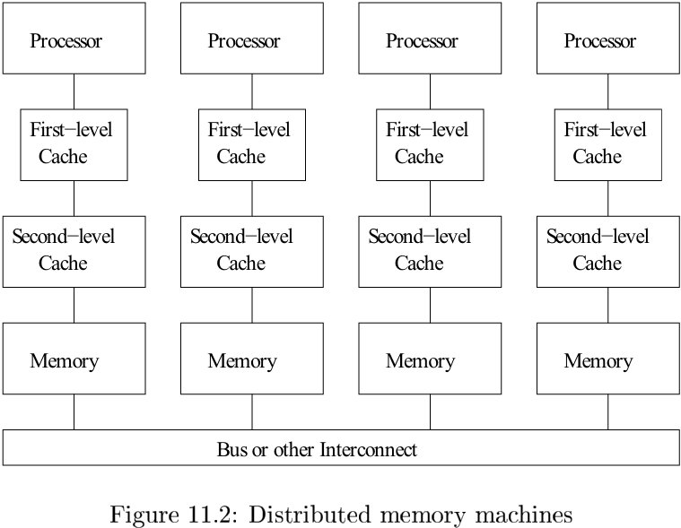
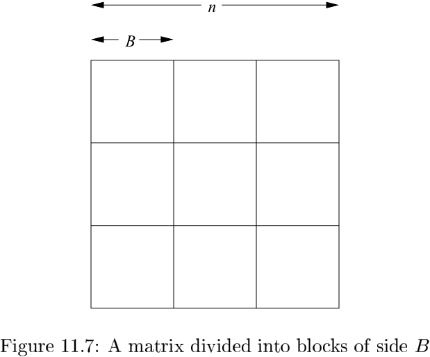
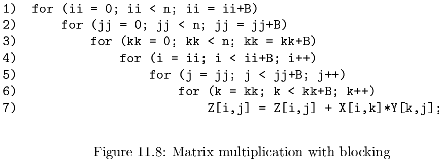
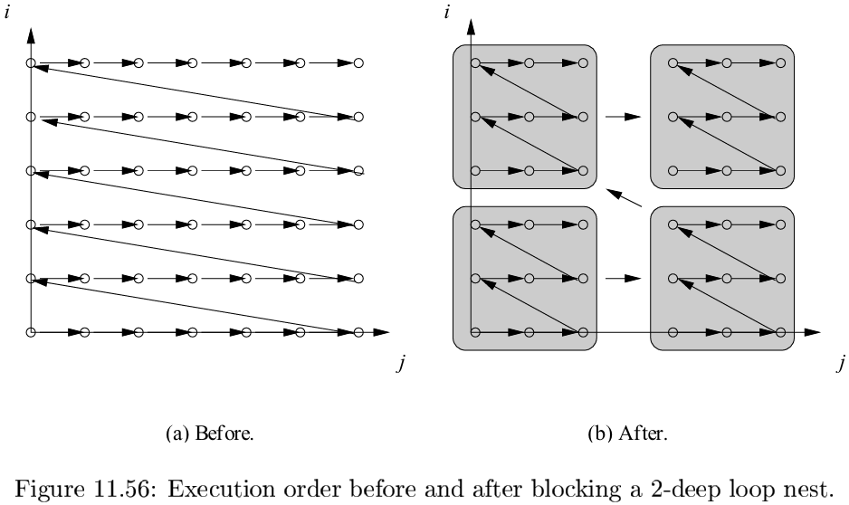
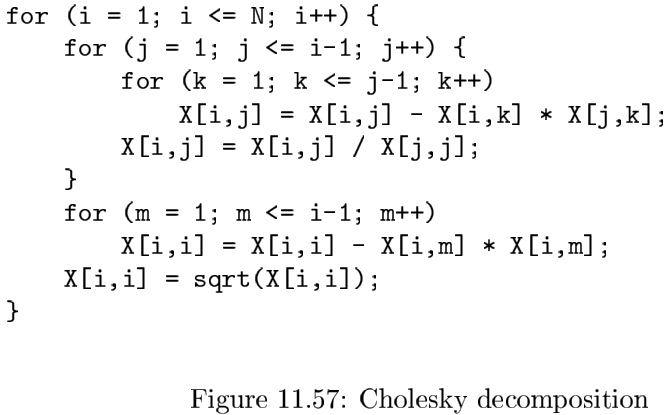

# Chapter 11 Optimizing for Parallelism and Locality

[TOC]

## Basic Concepts

### Multiprocessors

Symmetric multiprocessors use a `coherent cache protocol` to hide the presence of caches from the programmer.

The time taken for one processor to communicate with another is about twice the cost of a memory access. The data, in units of cache lines, must first be written from the first processor's cache to memory, and then fetched from the memory to the cache of the second processor.

There are two variants of a parallel machine with distributed memories:

- NUMA (nonuniform memory access) machines
- message-passing machines.

### Parallelism in Applications

We use two high-level metrics to estimate how well a parallel application will perform:

- `parallelism coverage`, which is the percentage of the computation that runs in parallel.
- `granularity of parallelism`, which is the amount of computation that each processor can execute without synchronizing or communicating with others.

**Amdahl's Law**

`Amdahl's Law` states that, if $f$ is the fraction of the code parallelized, and if the parallelized version runs on a $p$-processor machine with no communication or parallelization overhead, the speedup is:
$$
\frac{1}{(1 - f) + (f / p)}
$$

### Data Locality

`Temporal locality` occurs when the same data is used several times within a short time period.

`Spatial locality` occurs when different data elements that are located near to each other are used within a short period of time.

There are several important characteristics associated with numeric applications operating on arrays:

- Array code often has many parallelizable loops.
- When loops have parallelism, their iterations can be executed in arbitrary order; they can be reordered to improve data locality drastically.
- As we create large units of parallel computation that are independent of each other, executing these serially tends to produce good data locality.

### Introduction to Affine Transform Theory

For the problem of optimizing loops with array accesses, we use three kinds of spaces. Each space can be thought of as points on a grid of one or more dimensions:

1. The `iteration space` is the set of the dynamic execution instances in a computation, that is, the set of combinations of values taken on by the loop indexes.
2. The `data space` is the set of array elements accessed.
3. The `processor space` is the set of processors in the system. Normally, these processors are assigned integer numbers or vectors of integers to distinguish among them.

## Matrix Multiply: An In-Depth Example

### The Matrix-Multiplication Algorithm

### Optimizations

One way to improve the locality of a program is to change the layout of its data structures.

`Blocking` is a another way of reordering iterations in a loop that can greatly improve the locality of a program.

### Cache Interference

In a direct-mapped cache, if $n$ is a multiple of the cache size, then all the elements in the same row of an $n \times n$ array will be competing for the same cache location. In that case, bringing in the second element of a column will throw away the cache line of the first, even though the cache has the capacity to keep both of these lines at the same time. This situation is referred to as `cache interference`.

## Iteration Spaces

### Constructing Iteration Spaces from Loop Nests

A `convex polyhedron` has the property that if two points are in the polyhedron, all points on the line between them are also in the polyhedron. All the iterations in the loop are represented by the points with integer coordinates found within the polyhedron described by the loop-bound inequalities. And conversely, all integer points within the polyhedron represent iterations of the loop nest at some time.

### Matrix Formulation of Inequalities

The iterations in a $d$-deep loop can be represented mathematically as:
$$
\{i \text{ in } Z^d | Bi + b \geq 0\} \qquad (11.1)
$$
Here,

1. $Z$, as is conventional in mathematics, represents the set of integers positive, negative, and zero,
2. $B$ is a $d \times d$ integer matrix,
3. $b$ is an integer vector of length $d$, and
4. $0$ is a vector of $d$ 0's.

### Incorporating Symbolic Constants

Sometimes, we need to optimize a loop nest that involves certain variables that are loop-invariant for all the loops in the nest. We call such variables `symbolic constants`.

### Controlling the Order of Execution

Projection can be defined formally as follows: Let $S$ be an $n$-dimensional polyhedron. The projection of $S$ onto the first $m$ of its dimensions is the set of points $(x_1, x_2, \cdots, x_m)$ such that for some $x_{m+1}, x_{m+2}, \cdots, x_n$, vector $[x_1, x_2, \cdots, x_n]$ is in $S$.

**Algorithm 11.11:** Fourier-Motzkin elimination.

INPUT: A polyhedron $S$ with variables $x_1, x_2, \cdots, x_n$. That is, $S$ is a set of linear constraints involving the variables $x_i$. One given variable $x_m$ is specified to be the variable to the eliminated.

OUTPUT: A polyhedron $S'$ with variables $x_1, x_2, \cdots, x_{m-1}, x_{m+1}, \cdots, x_n$ (i.e., all the variables of $S$ except for $x_m$) that is the projection of $S$ onto dimensions other than the $m$th.

METHOD: Let $C$ be all the constraints in $S$ involving $x_m$. Do the following:

1. For every pair of a lower bound and an upper bound on $x_m$ in $C$, such as
   $$
   \begin{equation}\begin{split} 
   L \leqslant &c_1 x_m \\
   &c_2 x_m \leqslant U
   \end{split}\end{equation}
   $$
   create the new constraint
   $$
   c_2 L \leq c_1 U
   $$
   Note taht $c_1$ and $c_2$ are integers, but $L$ and $U$ may be expressions with variables other than $x_m$.

2. If integers $c_1$ and $c_2$ have a common factor, divide both sides by that factor.

3. If the new constraint is not satisfiable, then there is no solution to $S$; i.e., the polyhedra $S$ and $S'$ are both empty spaces.

4. $S'$ is the set of constraints $S - C$, plus all the constraints generated in step 2.

**Algorithm 11.13:** Computing bounds for a given order of variables.

INPUT: A convex polyhedron $S$ over variables $v_1, v_2, \cdots, v_n$.

OUTPUT: A set of lower bounds $L_i$ and upper bounds $U_i$ for each $v_i$, expressed only in terms of the $v_j$'s, for $j < i$.

METHOD:

## Affine Array Indexes

### Affine Accesses

We say that an array access in a loop is `affine` if:

1. The bounds of the loop are expressed as affine expressions of the surrounding loop variables and symbolic constants, and
2. The index for each dimension of the array is also an affine expression of surrounding loop variables and symbolic constants.

## Data Reuse

From array access functions we derive two kinds of information useful for locality optimization and parallelization:

1. `Data reuse:` for locality optimization, we wish to identify sets of iterations that access the same data or the same cache line.
2. `Data dependence:` for correctness of parallelization and locality loop transformations, we wish to identify all the data dependences in the code.

### Types of Reuse

For emphasis, we may refer to the statement itself as a `static access`, while the various iterations of the statement as we execute its loop nest are called `dynamic accesses`.

### Self Reuse

The rank of a matrix $F$ is the largest number of columns (or equivalently, rows) of $F$ that are linearly independent. A set of vectors is `linearly independent` if none of the vectors can be written as a linear combination of finitely many other vectors in the set.

### Group Reuse

We compute group reuse only among accesses in a loop sharing the same coefficient matrix. Given two dynamic accesses $Fi_1 + f_1$ and $Fi_2 + f_2$, reuse of the same data requires that:
$$
Fi_1 + f_1 = Fi_2 + f_2
$$
or,
$$
F(i_1 - i_2) = (f_2 - f_1)
$$
, Suppose $v$ is one solution to this equation. Then if $w$ is any vector in the null space of $F, w + v$ is also a solution, and in fact those are all the solutions to the euqation.

## Array Data-Dependence Analysis

### Integer Linear Programming

The data dependence analysis algorithm consists of three parts:

1. Apply the GCD (Greatest Common Divisor) test, which checks if there is an integer solution to the equalities, using the theory of linear Diophantine equations.
2. Use a set of simple heuristics to handle the large numbers of typical inequal;ities.
3. In the rare case where the heuristics do not work, we use a linear integer programming solver that uses a branch-and-bound approach based on Fourier-Motzkin elimination.

### The GCD Test

**Theorem 11.32:** The linear Diophantine equation:
$$
a_1 x_1 + a_2 x_2 + \cdots + a_n x_n = c
$$
, has an integer solution for $x_1, x_2, \cdots, x_n$ if and only of $gcd(a_1, a_2, \cdots, a_n)$ divides $c$.

### Solving General Integer Linear Programs

**Algorithm 11.39:** Branch-and-bound solution to integer linear programming problems.

INPUT: A convex polyhedron $S_n$ over variables $v_0, \cdots, v_n$.

OUTPUT: "yes" if $S_n$ has an integer solution, "no" otherwise.

METHOD:

## Finding Synchronization-Free Parallelism

### Solving Space-Partition Constraints

**Algorithm 11.43:** Finding a highest-ranked synchronization-free affine partition for a program.

INPUT: A program with affine array accesses.

OUTPUT: A partition.

METHOD: Do the following:

1. Find all data-dependent pairs of accesses in a program for each pair of data-dependent accesses.
2. For each pair of dependent accesses, we reduce the number of unknowns in the index vectors.
3. Drop the nonpartition variables.
4. Find the rank of the affine partition and solve for the coefficient matrices.
5. Find the constant terms.

### A Simple Code-Generation Algorithm

**Algorithm 11.45:** Generating code that executes partitions of a program sequentially.

INPUT: A program $P$ with affine array accesses. Each statement $s$ in the program has associated bounds of the form $B_s i + b_s \geq 0$, where $i$ is the vector of loop indexes for the loop nest in which statement $s$ appears. Also associated with statement $s$ is a partition $C_s i + c_s = p$ where $p$ is an $m$-dimensional vector of variables representing a processor $ID$; $m$ is the maximum, over all statements in program $P$, of the rank of the partition for that statement.

OUTPUT: A program equivalent to $P$ but iterating over the processor space rather than over loop indexes.

METHOD: Do the following:

1. For each statement, use Fourier-Motzkin elimination to project out all the loop index variables from the bounds.
2. Use Algorithm 11.13 to determine bounds on the partition ID's.
3. Generate loops, one for each of the $m$ dimensions of processor space. Let $p = [p_1, p_2, \cdots, p_m]$ be the vector of variables for these loops; that is, there is one variable for each dimension of the processor space. Each loop variable $p_i$ ranges over the union of the partition spaces for all statements in the program $P$.

### Source-Code Transforms

Seven Primitive Affine Transforms:

1. `Fusion.` The fusion transform is characterized by mapping multiple loop indexes in the original program to the same loop index. The new loop fuses statements from different loops.
2. `Fission.` Fission is the inverse of fusion. It maps the same loop index for different statements to different loop indexes in the transformed code. This splits the original loop into multiple loops.
3. `Re-indexing.` Re-indexing shifts the dynamic executions of a statement by a constant number of iterations. The affine transform has a constant term.
4. `Scaling.` Consective iterations in the source program are spaced apart by a constant factor. The affine transform has a positive nonunit coefficient.
5. `Reversal.` Execute iterations in a loop in reverse order. Reversal is characterized by having -1 as a coefficient.
6. `Permutation.` Permute the inner and outer loops. The affine transform consists of permuted rows of the indentity matrix.
7. `Skewing.` Iterate through the iteration space in the loops at an angle. The affine transform is a unimodular matrix with 1's on the diagonal.

## Synchronization Between Parallel Loops

### The Parallelization Algorithm

**Algorithm 11.54:** Maximize the degree of parallelism allowed by $O(1)$ synchronizations.

INPUT: A program with array accesses.

OUTPUT: SPMD code with a constant number of synchronization barriers.

METHOD:

1. Construct the program-dependence graph and partition the statements into strongly connected components (SCC's).
2. Transform the code to execute SCC's in a topological order by applying fission if necessary.
3. Apply Algorithm 11.43 to each SCC to find all of its synchronization-free parallelism. Barriers are inserted before and after each parallelized SCC.

## Pipelining

### What is Pipelining?

It is interesting to contrast pipelining with simple parallelism, where different processors execute different tasks:

- Pipelining can only be applied to netst of depth at least two.
- Tasks executed on a pipeline may share dependences.
- If the tasks are independent, then simple parallelization has better processor utilization because processors can execute all at once without having to pay for the overhead of filling and draining the pipeline.

### Successive Over-Relaxation (SOR): An Example

`Successive over-relaxation (SOR)` is a technique for accelerating the convergence of relaxation methods for solving sets of simultaneous linear equations.

We refer to the iterations along each diagonal as a `wavefront`, and such a parallelization scheme as `wavefronting`.

### Fully Permutable Loops

### Pipelining Fully Permutable Loops

### General Theory

The general theory underlying pipelining: if we can come up with at least two different outermost loops for a loop nest and satisfy all the dependences, then we can pipeline the computation. A loop with $k$ outermost fully permutable loops has $k - 1$ degrees of pipelined parallelism.

### Solving Time-Partition Constraints by Frakas' Lemma

**Algorithm 11.59:** Finding a set of legal, maximally independent affine time-partition mappings for an outer sequential loop.

INPUT: A loop nest with array accesses.

OUTPUT: A maximal set of linearly independent time-partition mappings.

### Code Transformations

### Parallelism With Minimum Synchronization

**Algorithm 11.64:** Find all the degrees of parallelism in a program, with all the parallelism being as coarse-grained as possible.

INPUT: A program to be parallelized.

OUTPUT: A parallelized version of the same program.

METHOD: Do the following:

1. Find the maximum degree of parallelism requiring no synchronization: Apply Algorithm 11.43 to the program.
2. Find the maximum degree of parallelism that requires $O(1)$ synchronizations: Apply Algorithm 11.54 to each of the space partitions found in step 1. (If no synchronization-free parallelism is found, the whole computation is left in one partition).
3. Find the maximum degree of parallelism that requires $O(n)$ synchronizations.
4. Find the maximum degree of parallelism with successively greater degrees of synchronizations: Recursively apply Step 3 to computation belonging to each of the space partitions generated by the previous step.

## Locality Optimizations

### Array Contraction

**Algorithm 11.68:** Array contraction.

INPUT: A program transformed by Algorithm 11.64.

OUTPUT: An equivalent program with reduced array dimensions.

METHOD: A dimension of an array can be contracted to a single element if:

1. Each independent partition uses only one element of the array.
2. The value of the element upon entry to the partition is not used by the partition, and
3. The value of the element is not live on exit from the partition.

### Putting it All Together

**Algorithm 11.71:** Optimize data locality on a uniprocessor.

INPUT: A program with affine array accesses.

OUTPUT: An equivalent program that maximizes data locality.

METHOD: Do the following steps:

1. Apply Algorithm 11.64 to optimize the temporal locality of computed results.
2. Apply Algorithm 11.68 to contract arrays where possible.
3. Determine the iteration subspace that may share the same data or cache lines using the technique described in Section 11.5. For each statement, identify those outer parallel loop dimensions that have data reuse.
4. For each outer parallel loop carrying reuse, move a block of the iterations into the innermost block by applying the iterleaving primitives repeatedly.
5. Apply blocking to the subset of dimensions in the innermost fully permutable loop nest that carries reuse.
6. Block outer fully permutable loop nest for higher levels of memory hierarchies, such as the third-level cache or the physical memory.
7. Expand scalars and arrays where necessary by the lenghts of the blocks.

**Algorithm 11.72:** Optimize parallelism and data locality for multiprocessors.

INPUT: A program with affine array accesses.

OUTPUT: An equivalent program that maximizes parallelism and data locality.

METHOD: Do the following:

1. Use the Algorithm 11.64 to parallelize the program and create an SPMD program.
2. Apply Algorithm 11.71 to the SPMD program produced in Step 1 to optimize its locality.

