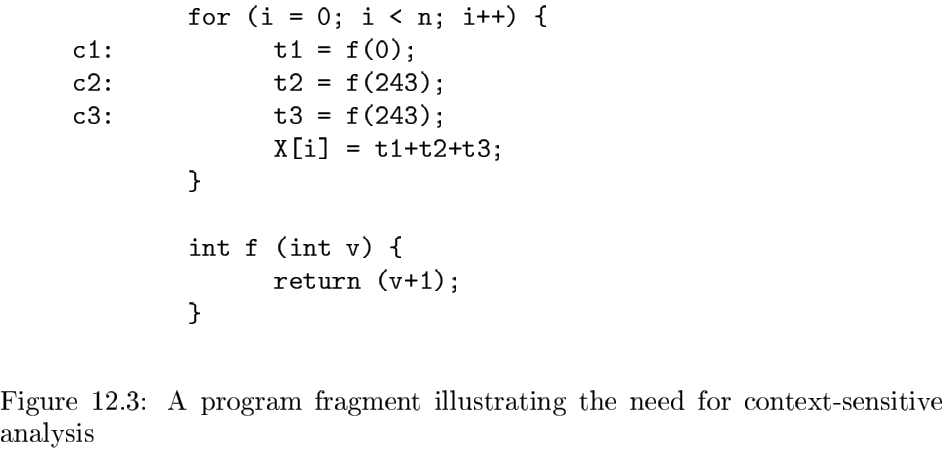

# Chapter 12 Interporcedural Analysis

[TOC]

## Basic Concepts

### Call Graphs

A `call graph` for a program is a set of nodes and edges such that:

1. There is one node for each procedure in the program.
2. There is one node for each `call site`, that is, a place in the program where a procedure is invoked.
3. If call site `c` may call procedure $p$, then there is an edge from the node for $c$ to the node for $p$.

### Context Sensitivity

## A Logical Representation of Data Flow

### Introduction to Datalog

Datalog is a language that uses a Prolog-like notation, but whose semantics is far simpler than that of Prolog. To begin, the elements of Datalog are `atoms` of the form $p(X_1, X_2, \cdots, X_n)$. Here:

1. $p$ is a predicate -- a symbol that represents a type of statement such as "a definition reaches the beginning of a block."
2. $X_1, X_2, \cdots, X_n$ are terms such as variables or constants.

### Datalog Rules

Rules are a way of expressing logical inferences. In Datalog, rules also serve to suggest how a computation of the true facts should be carried out. The form of a rule is:
$$
H: - B_1 \& B_2 \& \cdots \& B_n
$$
, The components are as follows:

- $H$ is an atom, and $B_1, B_2, \cdots, B_n$ are literals (atoms, possibly negated).
- $H$ is the `head` and $B_1, B_2, \cdots, B_n$ form the `body` of the rule.
- Each of the $B_i$'s sometimes called a `subgoal` of the rule.

### Intensional and Extensional Predicates

It is conventional in Datalog programs to distinguish predicates as follows:

1. EDB, or `extensional database`, predicates are those that are defined a priori.
2. IDB, or `intensional database`, predicates are defined only by the rules.

### Execution of Datalog Programs

**Algorithm 12.15:** Simple evaluation of Datalog programs.

INPUT: A Datalog program and sets of facts for each EDB predicate.

OUTPUT: Sets of facts for each IDB predicate.

METHOD: For each predicate $p$ in the program, let $R_p$ be the relation of facts that are true for that predicate. If $p$ is an EDB predicate, then $R_p$ is the set of facts given for that predicate. If $p$ is an IDB predicate, we shall compute $R_p$.

### Incremental Evaluation of Datalog Programs

**Algorithm 12.18:** Incremental evaluation of Datalog programs.

INPUT: A Datalog program and sets of facts for each EDB predicate.

OUTPUT: Sets of facts for each IDB predicate.

### Problematic Datalog Rules

The two most important risks are:

1. `Unsafe rules:` those that have a variable in the head that does not appear in the body in a way that constrains that variable to take on only values that appear in the EDB.
2. `Unstratified programs:` sets of rules that have a recursion involving a negation.

## Datalog Implementation by BDD's

`Binary Decision Diagrams (BDD's)` are a method for representing boolean functions by graphs.

### Binary Decision Diagrams

### Transformations on BDD's

Two simplifications on BDD's that help make them more succinct:

1. `Short-Circuiting:` If a node $N$ has both its high and low edges go to the same node $M$, then we may eliminate $N$. Edges entering $N$ go to $M$ instead.
2. `Node-Merging:` If two nodes $N$ and $M$ have low edges that go to the same node and also have high edges that go to the same node, then we may merge $N$ with $M$. Edges entering either $N$ or $M$ go to the merged node.

### Relational Operations as BDD Operations

**Algorithm 12.29:** Union of BDD's.

INPUT: Two ordered BDD's with the same set of variables, in the same order.

OUTPUT: A BDD representing the function that is the logical OR of the two boolean functions represented by the input BDD's.

