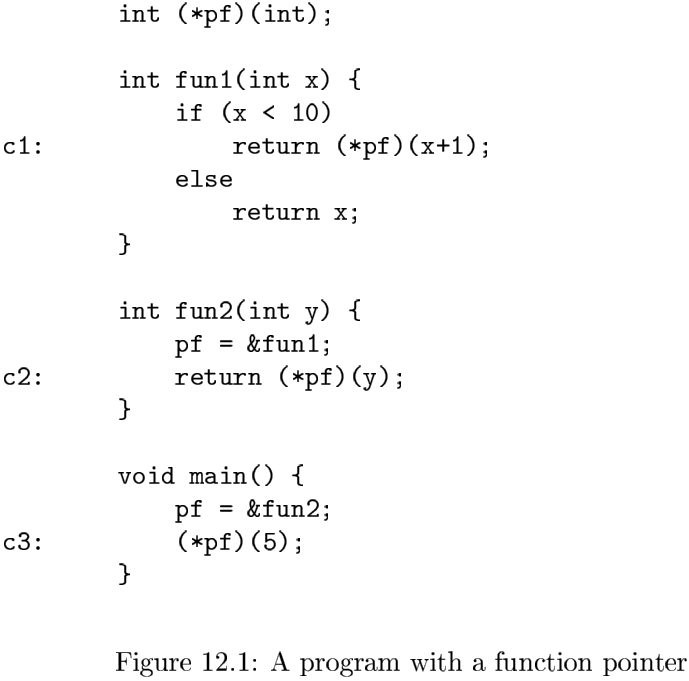
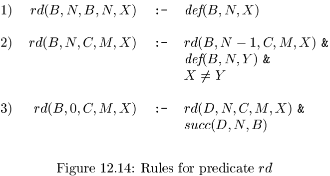

# 第12章 过程间分析

## 12.1 基本概念

### 12.1.1 调用图

一个程序的`调用图（call graph）`是一个节点和边的集合，并满足：

1. 对程序中的每个过程都有一个节点。
2. 对于每个`调用点（call site）`都有一个节点。所谓调用点就是程序中调用某个过程的一个位置。
3. 如果调用点$c$调用了过程$p$，就存在一条从$c$的节点到$p$的节点的边。

### 12.1.2 上下文相关

`上下文无关分析（context-insensitive analysis）`

### 12.1.3 调用串

### 12.1.4 基于克隆的上下文相关分析

### 12.1.5 基于摘要的上下文相关分析

### 12.1.6 12.1节的练习

## 12.2 为什么需要过程间分析

### 12.2.1 虚方法调用

### 12.2.2 指针别名分析

### 12.2.3 并行化

### 12.2.4 软件错误和漏洞的检测

### 12.2.5 SQL注入

### 12.2.6 缓冲区溢出

`缓冲区溢出供给（buffer overflow attack）`。

## 12.3 数据流的一种逻辑表示方式

### 12.3.1 Datalog简介

Datalog是一个使用类Prolog表示方法的语言，但是它的语义要比Prolog简单得多。首先Datalog的元素是形如$p(X_1, X_2, \cdots, X_n)$的原子（atom），其中：

1. $p$是一个断言：一个表示了一类语句的符号，比如“一个定值到达了一个基本块的开始处”。
2. $X_1, X_2, \cdots, X_n$是变量或常量的项。

### 12.3.2 Datalog规则

规则是表示逻辑推理关系的一种方法，一个规则的形式为：
$$
H: - B_1 \& B_2 \& \cdots \& B_n
$$
其中的组成部分如下：

- $H$和$B_1, B_2, \cdots, B_n$是字面值，即原子或原子的否定形式。但$H$不能是否定形式。
- $H$是规则的头，$B_1, B_2, \cdots, B_n$组成了规则的体。
- 每个$B_i$有时被称为规则的`子目标（subgoal）`。

### 12.3.3 内涵断言和外延断言

按照Datalog程序的惯例，我们把断言分成两类：

1. EDB断言，或者说`外延数据库（extensional database）断言`，是事先定义的断言。
2. IDB断言，或者说`内涵数据库（intensional database）`断言，只能通过规则定义。

### 12.3.4 Datalog程序的执行

**算法 12.15** Datalog程序的简单求值。

输入：一个Datalog程序和各个EDB断言的事实集合。

输出：每个IDB断言的事实集合。

方法：对于程序中的每个断言$p$，令$R_p$为使该断言为真的事实关系。如果$p$是一个EDB断言，那么$R_p$就是该断言给出的所有事实。如果$p$是一个IDB断言，我们将计算$R_p$。

### 12.3.5 Datalog程序的增量计算

**算法 12.18** Datalog程序的增量求值。

输入：一个Datalog程序和各个EDB断言的事实集合。

输出：各个IDB断言的事实集合。

方法：

### 12.3.6 有问题的Datalog规则

两种最严重的风险是：

1. 不安全规则：这些规则的头中有一个变量没有以适当的方法出现在规则体中。正确的方法必须限定这个变量只能取那些出现在EDB中的值。
2. 不可分层的程序：一组规则之间存在涉及否定形式的循环定义。

### 12.3.7 12.3 节的练习

## 12.4 一个简单的指针分析算法

### 12.4.1 为什么指针分析有难度

### 12.4.2 一个指针和引用的模型

### 12.4.3 控制流无关性

### 12.4.4 在Datalog中表示方法

### 12.4.5 使用类型信息

### 12.4.6 12.4节的练习

## 12.5 上下文无关的过程间分析

### 12.5.1 一个方法调用的效果

### 12.5.2 在Datalog中发现调用图

### 12.5.3 动态加载和反射

### 12.5.4 12.5节的练习

## 12.6 上下文相关指针分析

### 12.6.1 上下文和调用串

### 12.6.2 在Datalog规则中加入上下文信息

### 12.6.3 关于相关性的更多讨论

### 12.6.4 12.6节的练习

## 12.7 使用BDD的Datalog的实现

`二分决策图（Binary Decision Diagram, BDD）`是一个用图来表示布尔函数的方法。

### 12.7.1 二分决策图

### 12.7.2 对BDD的转换

有两个简化BDD的方法：

1. 短路：如果一个节点$N$的低边和高边都到达同一个节点$M$，那么我们可以消除$N$。原来进入$N$的边直接进入$M$。
2. 节点合并：如果两个节点$N$和$M$的两条低边都到达同一个节点，并且两条高边也到达同一个节点，那么我们可以把$N$和$M$合并。原来进入$N$或者$M$的边都进入合并后的节点。

### 12.7.3 用BDD表示关系

### 12.7.4 用BDD操作实现关系运算

**算法 12.29** BDD的合并。

输入：两个排序的BDD，它们的变量集合相同，且排序也相同。

输出：一个BDD，它表示的函数是两个输入BDD所表示的布尔函数的逻辑OR。

方法：

归纳基础：

归纳步骤：

### 12.7.5 在指针指向分析中使用BDD

### 12.7.6 12.7节的练习

## 12.8 第12章总结

## 12.9 第12章参考文献

