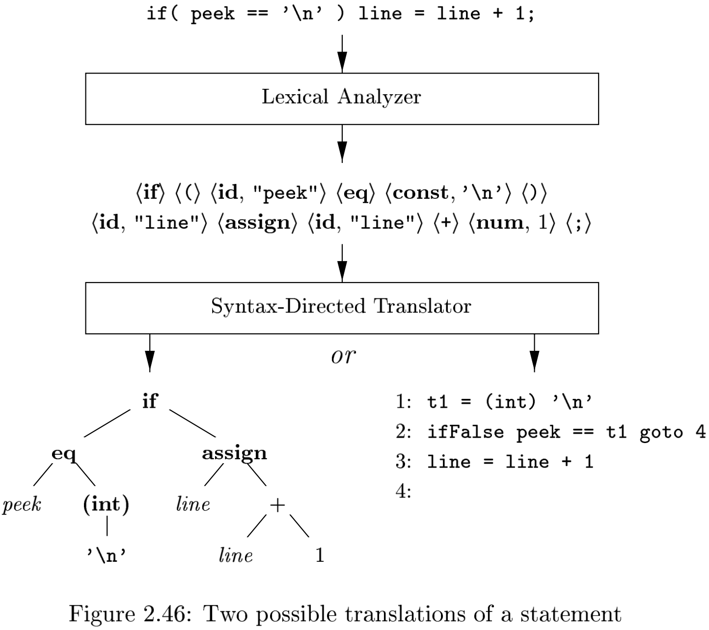

# Chapter 2 A Simple Syntax-Directed Translator

[TOC]

## Introduction

`abstract syntax trees` or simply `syntax trees`, represent the hierarchical syntactic structure of the source program.

## Syntax Definition

### Definition of Grammars

A `context-free grammar` has four components:

1. A set of `terminal` symbols, sometimes referred to as "tokens". The terminals are the elementary symbols of the language defined by the grammar.
2. A set of `nonterminals`, sometimes called "syntactic variables". Each nonterminal represents a set of strings of terminals, in a manner we shall describe.
3. A set of `productions`, where each production consists of a nonterminal, called the `head` or `left side` of the production, an arrow, and a sequence of terminals and/or nonterminals, called the `body` or `right side` of teh production. The intuitive intent of a production is to specify one of the written forms of a construct; if the head nonterminal represents a construct, then the body represents a written form of the construct.
4. A designation of one of the nonterminals as the `start` symbol.

### Derivations

A grammar derives strings by beginning with the start symbol and repeatedly replacing a nonterminal by the body of a production for that nonterminal. The terminal strings that can be derived from the start symbol form the `language` defined by the grammar.

### Parse Trees

Formally, given a context-free grammar, a `parse tree` according to the grammar is a tree with the following properties:

1. The root is labeled by the start symbol.
2. Each leaf is labeled by a terminal or by $\epsilon$.
3. Each interior node is labeled by a nonterminal.
4. If $A$ is the nonterminal labeling some interior node and $X_1, X_2, ..., X_n$ are the labels of the children of that node from left to right, then there must be a production $A \rightarrow X_1X_2...X_n$. Here, $X_1, X_2, ..., X_n$ each stand for a symbol that is either a terminal or a nonterminal. As a special case, if $A \rightarrow \epsilon$ is a production, then a node labeled $A$ may have a single child labeled $\epsilon$.

### Ambiguity

A grammar can have more than one parse tree generating a given string of terminals. Such a grammar is said to be `ambiguous`.

## Syntax-Directed Translation

Syntax-directed translation is done by attaching rules or program fragments to productions in a grammar:

- `Attributes`. An `attribute` is any quantity associated with a programming construct.
- `(Syntax-directed) translation schemes`. A `translation scheme` is a notation for attaching program fragments to the productions of a grammar.`

### Postfix Notation

The `postfix notation` for an expression $E$ can be defined inductively as follows:

1. If $E$ is a variable or constant, then the postfix notation for $E$ is $E$ itself.
2. If $E$ is an expression of the form $E_1$ op $E_2$, where op is any binary operator, then the postfix notation for $E$ is $E_1'$ $E_2'$ op, where $E_1'$ and $E_2'$ are the postfix notations for $E_1$ and $E_2$, respectively.
3. If $E$ is a parenthesized expression of the form $(E_1)$, then the postfix notation for $E$ is the same as the postfix notation for $E_1$.

### Synthesized Attributes

An attribute is said to be `synthesized` if its value at a parse-tree node $N$ is determined from attribute values at the child of $N$ and at $N$ itself. Synthesized attributes have the desirable property that they can be evaluated during a single bottom-up traversal of a parse tree.

### Simple Syntax-Directed Definitions

The syntax-directed definition has the following important property: the string representing the translation of the nonterminal at the head of each production is the concatenation of the translations of the nonterminals in the production body, in the same order as in the production, with some optional additional strings interleaved.

## Parsing

Most parsing methods fall into one of two classes, called the `top-down` and `bottom-up` methods. These terms refer to the order in which nodes in the parse tree are constructed:

- In top-down parsers, construction starts at the root and proceeds towards the leaves.
- In bottom-up parsers, construction starts at the leaves and proceeds towards the root.

### Top-Down Parsing

The top-down construction of a parse tree is done by starting with the root, labeled with the starting nonterminal `stmt`, and repeatedly performing the following two steps:

1. At node $N$, labeled with nonterminal $A$, select one of the productions for $A$ and construct children at $N$ for the symbols in the production body.
2. Find the next node at which a subtree is to be constructed, typically the leftmost unexpanded nonterminal of the tree.

### Predictive Parsing

`Recursive-descent parsing` is a top-down method of syntax analysis in which a set of recursive procedures is used to process the input. One procedure is associated with each nonterminal of a grammar.

Here, we consider a simple form of recursive-descent parsing, called `predictive parsing`, in which the lookahead symbol unambiguously determines the flow of control through the procedure body for each nonterminal.

### Left Recursion

It is possible for a recursive-descent parser to loop forever. A problem arises with "left-recursive" productions like:
$$
expr \rightarrow expr + term
$$
, where the leftmost symbol of the body is the same as the nonterminal at the head of the production.

## A Translator for Simple Expressions

### Abstract and Concrete Syntax

In an `abstract syntax tree` for an expression, each interior node represents and operator; the children of the node represent the operands of the operator.

### Simplifying the Translator

First, certain recursive calls can be replaced by iterations. When the last statement executed in a procedure body is a recursive call to the same procedure, the call is said to be `tail recursive`.

## Symbol Tables

`Symbol tables` are data structures that are used by compilers to hold information about source-program constructs. The information is collected incrementally by the analysis phases of a compiler and used by the synthesis phases to generate the target code.

## Intermediate Code Generation

### Two Kinds of Intermediate Representations

The two most important intermediate representations are:

- Trees, including parse trees and (abstract) syntax trees.
- Linear representations, especially "three-address code".

In addition to creating an intermediate representation, a compiler front end checks that the soruce program follows the syntactic and semantic rules of the source language. This checking is called `static checking`; in general "static" means "done by the compiler".

### Construction of Syntax Trees

A sequence of statements is represented by using a left **null** for an empty statement and a operator **seq** for a sequence of statements, as in:
$$
stmts \rightarrow stmts_1 \ stmt \{stmts.n = new\ Seq(stmts_1.n, stmt.n);\}
$$

### Static Checking

Static checks are consistency checks that are done during compilation. Not only do they assure that a program can be compiled successfully, but they also have the potential for catching programming errors early, before a program is run. Static checking includes:

- `Syntactic Checking`. There is more to syntax than grammars.
- `Type Checking`. The type rules of a language ensure that an operator or function is applied to the right number and type of operands.

## Summary

- The starting point for a syntax-directed translator is a grammar for the source language.
- In specifying a translator, it is helpful to attach attributes to a programming construct, where an `attribute` is any quantity associated with a construct.
- A `lexical analyzer` reads the input one character at a time and produces as output a stream of `tokens`, where a token consists of a terminal symbol along with additional information in the form of attribute values.
- Parsing is the problem of figuring out how a string of terminals can be derived from the start symbol of the grammar by repeatedly replacing a nonterminal with the body of one of its productions.
- Efficient parsers can be built by hand, using a top-down (from the root to the leaves of a parse tree) method called predictive parsing.
- Syntax-directed translation is done by attaching either rules or program fragments to productions in a grammar.
- The result of syntax analysis is a representation of the source program, called `intermediate code`.
- `Symbol tables` are data structures that hold information about identifiers.

