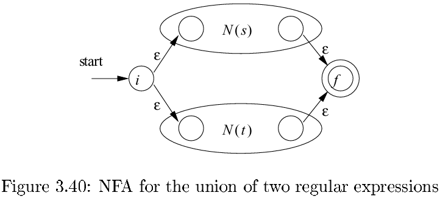
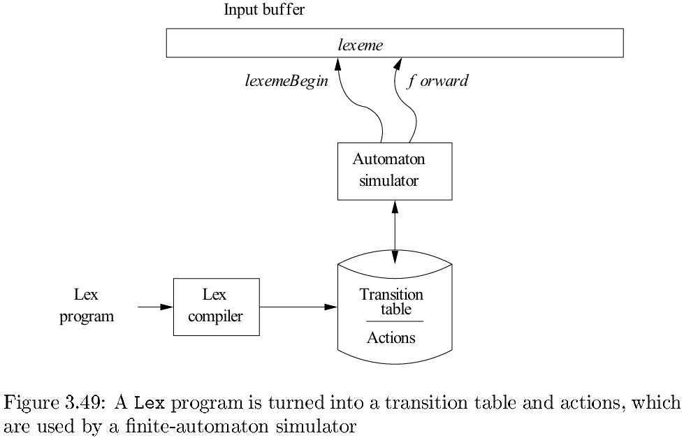
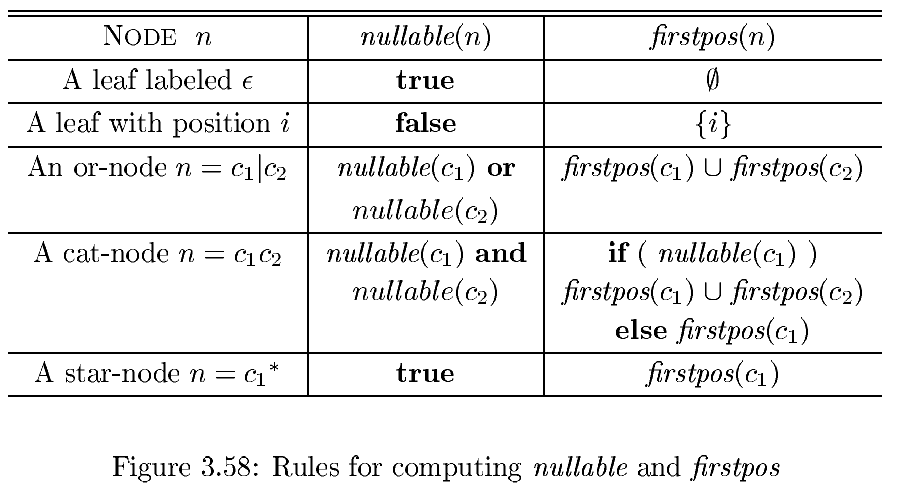

# Chapter 3 Lexical Analysis

[TOC]

## The Role of the Lexical Analyzer

The main task of the lexical analyzer is to read the input characters of the source program, group them into lexemes, and produce as output a sequence of tokens for each lexeme in the source program.

Since the lexical analyzer is the part of the compiler that reads the source text, it may perform certain other tasks besides identification of lexemes:

- tripping out comments and `whitespace`.
- correlating error messages generated by the compiler with the source program.

Sometimes, lexical analyzers are divided into a cascade of two processes:

1. `Scanning` consists of simple processes that do not require tokenization of the input, such as deletion of comments and compaction of consecutive whitespace characters into one.
2. `Lexical analysis` proper is the more complex portion, which produces tokens from the output of the scanner.

### Tokens, Patterns, and Lexemes

When discussing lexical analysis, we use three related but distinct terms:

- A `token` is a pair consisting of a token name and an optional attribute value.
- A `pattern` is a description of the form that the lexemes of a token may take.
- A `lexeme` is a sequence of characters in the source program that matches the pattern for a token and is identified by the lexical analyzer as an instance of that token.

## Input Buffering

### Buffer Pairs

## Specification of Tokens

### Strings and Languages

The following string-related terms are commonly used:

1. A `prefix` of string $s$ is any string obtained by removing zero or more symbols from the end of $s$.
2. A `suffix` of string $s$ is any string obtained by removing zero or more symbols from the beginning of $s$.
3. A `substring` of $s$ is obtained by deleting any prefix and any suffix from $s$.
4. The `proper` prefixes, suffixes, and substrings of a string $s$ are those, prefixes, suffixes, and substrings, respectively, of $s$ that are not $\epsilon$ or not equal to $s$ itself.
5. A `subsequence` of $s$ is any string formed by deleting zero or more not necessarily consecutive positions of $s$.

### Operations on Languages

### Regular Expressions

**BASIS**: There are two rules that form the basis:

1. $\epsilon$ is a regular expression, and $L(\epsilon)$ is $\{\epsilon\}$, that is, the language whose sole member is the empty string.
2. If $a$ is a symbol in $\sum$, then $a$ is a regular expression, and $L(a) = \{a\}$, that is, the language with one string, of length one, with $a$ in its one position.

**INDUCTION:** There are four parts to the induction whereby larger regular expressions are built from smaller ones. Suppose $r$ and $s$ are regular expressions denoting languages $L(r)$ and $L(s)$, respectively:

1. $(r)|(s)$ is a regular expression denoting the language $L(r) \cup L(s)$.
2. $(r)(s)$ is a regular expression denoting the language $L(r)L(s)$.
3. $(r)^{*}$ is a regular expression denoting $(L(r))^{*}$.
4. $(r)$ is a regular expression denoting $L(r)$.

As defined, regular expressions often contain unnecessary pairs of parentheses. We may drop certain pairs of parentheses if we adopt the conventions that:

1. The unary operator $*$ has highest precedence and is left associative.
2. Concatenation has second highest precedence and is left associative.
3. $|$ has lowest precedence and is left associative.

### Regular Definitions

If $\sum$ is an alphabet of basic symbols, then a `regular definition` is a sequence of definitions of the form:
$$
d_1 \rightarrow r_1 \\
d_2 \rightarrow r_2 \\
\cdots \\
d_n \rightarrow r_n
$$

, where:

- Each $d_i$ is a new symbol, not in $\sum$ and not the same as any other of the $d$'s, and
- Each $r_i$ is a regular expression over the alphabet $\sum \cup \{d_1, d_2, \cdots, d_{i-1}\}$.

## Recognition of Tokens

### Transition Diagrams

Some important conventions about transition diagrams are:

1. Certain states are said to be `accepting`, or `final`. These states indicate that a lexeme has been found, although the actual lexeme may not consist of all positions between the `lexemeBegin` and `forward` pointers.
2. In addition, if it is necessary to retract the `forward` pointer one position (i.e., the lexeme does not include the symbol that got us to the accepting state), then we shall additionally place $a^{*}$ near that accepting state.
3. One state is designated the `start state`, or `initial state`; it is indicated by an edge, labeled "start", entering from nowhere. The transition diagram always begins in the start state before any input symbols have been read.

### Recognition of Reserved Words and Identifiers

There are two ways that we can handle reserved words that look like identifiers:

1. Install the reserved words in the symbol table initially.
2. Create separate transition diagrams for each keyword;

## Finite Automata

`finite automata.` These are essentially graphs, like transition diagrams, with a few differences:

1. Finite automata are `recognizers`; they simply say "yes" or "no" about each possible input string.
2. Finite automata come in two flavors:
   - `Nondeterministic finite automata(NFA)` have no restrictions on the labels of their edges. A symbol can label several edges out of the same state, and $\epsilon$, the empty string, is a possible label.
   - `Deterministic finite automata(DFA)` have, for each state, and for each symbol of its input alphabet exactly one edge with that symbol leaving that state.

### Nondeterministic Finite Automata

A `nondeterministic finite automaton(NFA)` consists of:

1. A finite set of states $S$.
2. A set of input symbols $\sum$, the `input alphabet`. We assume that $\epsilon$, which stands for the empty string, is never a member of $\sum$.
3. A `transition function` that gives, for each state, and for each symbol in $\sum \cup \{\epsilon\}$ a set of `next states`.
4. A state $s_0$ from $S$ that is distinguished as the `start state`(or `initial state`).
5. A set of states $F$, a subset of $S$, that is distinguished as the `accepting states`(or `final states`).

### Transition Tables

We can also represent an NFA by a `transition table`, whose rows correspond to states, and whose columns correspond to the input symbols and $\epsilon$. The entry for a given state and input is the value of the transition function applied to those arguments. If the transition function has no information about that state-input pair, we put $\emptyset$ in the table for the pair.

### Acceptance of Input Strings by Automata

An NFA `accepts` input string $x$ if and only if there is some path in the transition graph from the start state to one of the accepting states, such that the symbols along the path spell out $x$.

The `language defined` (or `accepted`) by an NFA is the set of strings labeling some path from the start to an accepting state.

### Deterministic Finite Automata

A `deterministic finite automaton(DFA)` is a special case of an NFA where:

1. There are no moves on input $\epsilon$, and 
2. For each state $s$ and input symbol $a$, there is exactly one edge out of $s$ labeled $a$.

**Algorithm 3.18:** Simulating a DFA.

INPUT: An input string $x$ terminated by an end-of-file character **eof**. A DFA $D$ with start state $s_0$, accepting states $F$, and transition function `move`.

OUTPUT: Answer "yes" if $D$ accepts $x$; "no" otherwise.

METHOD: Apply the algorithm in Fig. 3.27 to the input string $x$. The function $move(s, c)$ gives the state to which there is an edge from state $s$ on input $c$. The function $nextChar$ returns the next character of the input string $x$.

## From Regular Expressions to Automata

### Conversion of an NFA to a DFA

The general idea behind the subset constructions is that each state of the constructed DFA corresponds to a set of NFA states.

**Algorithm 3.20:** The `subset construction` of a DFA from an NFA.

INPUT: An NFA $N$.

OUTPUT: A DFA $D$ accepting the same language as $N$.

METHOD: Our algorithm constructs a transition table `Dtran` for $D$. Each state of $D$ is a set of NFA states, and we construct Dtran so $D$ will simulate "in parallel" all possible moves $N$ can make on a given input string.

### Simulation of an NFA

**Algorithm 3.22:** Simulating an NFA.

INPUT: An input string $x$ terminated by an end-of-file character **eof**. An NFA $N$ with start state $s_0$, accepting states $F$, and transition function $move$.

OUTPUT: Answer "yes" if $N$ accepts $x$; "no" otherwise.

METHOD: The algorithm keeps a set of current states $S$, those that are reached from $s_0$ following a path labeled by the inputs read so far.

### Construction of an NFA from a Regular Expression

**Algorithm 3.23:** The McNaughton-Yamada-Thompson algorithm to convert a regular expression to an NFA.

INPUT: A regular expression $r$ over alphabet $\sum$.

OUTPUT: An NFA $N$ accepting $L(r)$.

METHOD: Begin by parsing $r$ into its constituent subexpressions. The rules for constructing an NFA consist of basis rules for handling subexpressions with no operators, and inductive rules for constructing larger NFA's from the NFA's for the immediate subexpressions of a given expression.

BASIS: For expression $\epsilon$ construct the NFA:

, Here, $i$ is a new state, the start state of this NFA, and $f$ is another new state, the accepting state for the NFA.

, For any subexpression $a$ in $\sum$, construct the NFA

, where again $i$ and $f$ are new states, the start and accepting states, respectively. Note that in both of the basis constructions, we construct a distinct NFA, with new states, for every occurrence of $\epsilon$ or some $a$ as a subexpression of $r$.

INDUCTION: Suppose $N(s)$ and $N(t)$ are NFA's for regular expressions $s$ and $t$, respectively:

1. Suppose $r = s | t$. Then $N(r)$, the NFA for $r$, is constructed as in Fig. 3.40.

   

2. Suppose $r = st$. Then construct $N(r)$ as in Fig. 3.41.

   

3. Suppose $r = s^{*}$. Then for $r$ we construct the NFA $N(r)$ shown in Fig. 3.42.

   

These properties are interesting in their own right, and helpful in making a formal proof:

1. $N(r)$ has at most twice as many states there are operators and operands in $r$. This bound follows from the fact that each step of the algorithm creates at most two new states.
2. $N(r)$ has one start state and one accepting state. The accepting state has no outgoing transitions, and the start state has no incoming transitions.
3. Each state of $N(r)$ other than the accepting state has either one outgoing transition on a symbol in $\sum$ or two outgoing transitions, both on $\epsilon$.

### Efficiency of String-Processing Algorithms

One issue that may favor an NFA is that the subset construction can, in the worst case, exponentiate the number of states. While in principle, the number of DFA states does not influence the running time of Algorithm 3.18, should the number of states become so large that the transition table does not fit in main memory, then the true running time would have to include disk I/O and therefore rise noticeably.

## Design of a Lexical-Analyzer Generator

### The Structure of the Generated Analyzer

These components are:

1. A transition table for the automaton.
2. Those functions that are passed directly through $Lex$ to the output.
3. The actions from the input program, which appear as fragments of code to be invoked at the appropriate time by the automaton simulator.

### Implementing the Lookahead Operator

If the NFA recognizes a prefix $xy$ of the input buffer as matching this regular expression, the end of the lexeme is not where the NFA entered its accepting state. Rather the end occurs when the NFA enters a state $s$ such that:

1. $s$ has an $\epsilon$-transition on the (imaginary) $/$.
2. There is a path from the start state of the NFA to state $s$ that spells out $x$.
3. There is a path from state $s$ to the accepting state that spells out $y$.
4. $x$ is as long as possible for any $xy$ satisfying conditions 1-3.

## Optimization of DFA-Based Pattern Matchers

### Important States of an NFA

We call a state of an NFA `important` if it has a non-$\epsilon$ out-transition.

During the subset construction, two sets of NFA states can be identified (treated as if they were the same set) if they:

1. Have the same important states, and
2. Either both have accepting states or neither does.

### Functions Computed From the Syntax Tree

Each definition refers to the syntax tree for a particular augmented regular expression (r)#:

1. $nullable(n)$ is true for a syntax-tree node $n$ if and only if the subexpression represented by $n$ has $\epsilon$ in its language. That is, the subexpression can be "made null" or the empty string, even though there may be other strings it can represent as well.
2. $firstpos(n)$ is the set of positions in the subtree rooted at $n$ that correspond to the first symbol of at least one string in the language of the subexpression rooted at $n$.
3. $lastpos(n)$ is the set of positions in the subtree rooted at $n$ that correspond to the last symbol of at least one string in the language of the subexpression rooted at $n$.
4. $followpos(p)$ for a position $p$, is the set of positions $q$ in the entire syntax tree such that there is some string $x = a_1 a_2 \cdots a_n$ in `L((r)#)` such that for some $i$, there is a way to explain the membership of $x$ in `L((r)#)` by matching $a_i$ to position $p$ of the syntax tree and $a_{i+1}$ to position $q$.

### Computing nullable, firstpos, and lastpos

### Computing followpos

There are only two ways that a position of a regular expression can be made to follow another:

1. If $n$ is a cat-node with left child $c_1$ and right child $c_2$, then for every position $i$ in $lastpos(c_1)$, all positions in $firstpos(c_2)$ are in $followpos(i)$.
2. If $n$ is a star-node, and $i$ is a position in $lastpos(n)$, then all positions in $firstpos(n)$ are in $followpos(i)$.

### Converting a Regular Expression Directly to a DFA

**Algorithm 3.36:** Construction of a DFA from a regular expression $r$.

INPUT: A regular expression $r$.

OUTPUT: A DFA $D$ that recognizes $L(r)$.

METHOD: 

1. Construct a syntax tree $T$ from the augmented regular expression `(r)#`.

2. Compute `nullable, firstpos, lastpos, and followpos` for $T$, using the methods of Sections 3.9.3 and 3.9.4.

3. Construct `Dstates`, the set of states of DFA $D$, and `Dtran`, the transition function for $D$, by the procedure of Fig.3.6.2

   

### Minimizing the Number of States of a DFA

**Algorithm 3.39:** Minimizing the number of states of a DFA.

INPUT: A DFA $D$ with set of states $S$, input alphabet $\sum$, start state $s_0$, and set of accepting states $F$.

OUTPUT: A DFA $D'$ accepting the same language as $D$ and having as few states as possible.

METHOD: TODO

