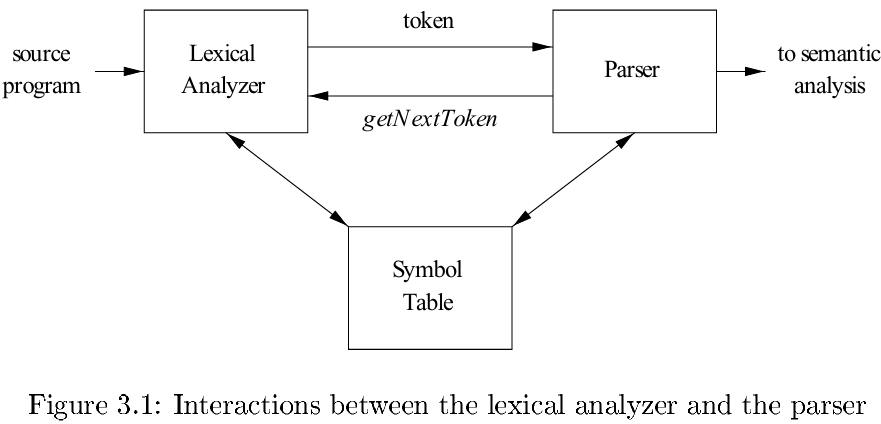
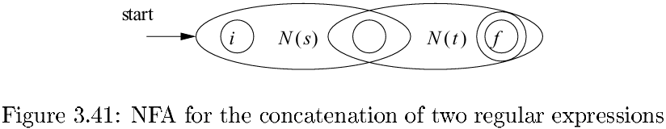
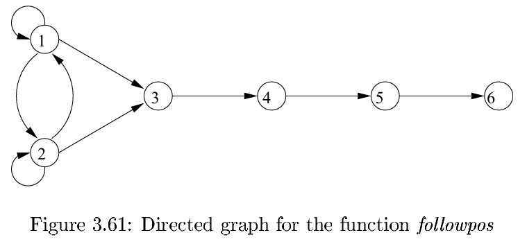
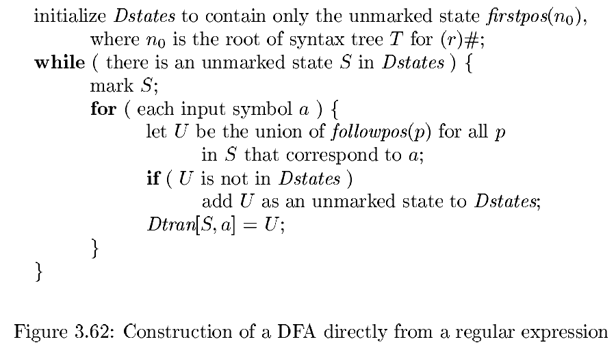
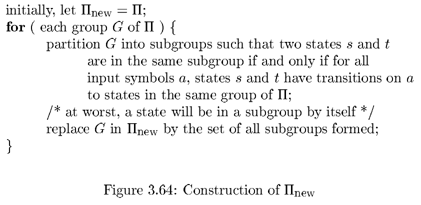

# 第三章 词法分析

[TOC]

## 3.1 词法分析器的作用

词法分析器的主要任务是读入源程序的输入字符，将他们组成词素，生成并输出一个词法单元序列，每个词法单元对应于一个词素。

词法分析器除了在编译器中负责读取源程序，还完成以下其他任务：

- 过滤掉源程序中的注释和空白；
- 将编译器生成的错误消息与源程序的位置联系起来。

词法分析器可以分为两个级联的处理阶段：

1. 扫描阶段：主要负责完成一些不需要生成词法单元的简单处理，比如删除注释和将多个连续的空白字符压缩成一个字符。
2. 词法分析阶段：处理扫描阶段的输出并生成词法单元。

### 3.1.1 词法分析及语法分析

### 3.1.2 词法单元，模式和词素

术语：

- 词法单元：由一个词法单元名和一个可选的属性值组成。
- 模式：描述了一个词法单元的词素可能具有的形式。
- 词素：源程序中的一个字符序列，它和某个词法单元的模式匹配，并被词法分析器识别为该词法单元的一个实例。

### 3.1.3 词法单元的属性

### 3.1.4 词法错误

### 3.1.5 3.1节的练习

## 3.2 输入缓冲

### 3.2.1 缓冲区对

利用两个交替读入的缓冲区来处理单个输入字符的时间开销。

### 3.2.2 哨兵标记

## 3.3 词法单元的规约

### 3.3.1 串和语言

串的各部分术语：

- 串s的前缀（prefix）：从s的尾部删除0个或多个符号后得到的串。
- 串s的后缀（suffix）：从s的开始处删除0个或多个符号后得到的串。
- 串s的子串（substring）：删除s的某个前缀和某个后缀之后得到的串。
- 串s的真（true）前缀，真后缀，真子串：分别是s的既不等于$\epsilon$，也不等于s本身的前缀，后缀和子串。
- 串s的子序列（subsequence）：从s中删除0个或多个符号后得到的串，这些被删除的符号可能不相邻。

### 3.3.2 语言上的运算

语言上的运算的定义：

| 运算            | 定义和表示                          |
| --------------- | ----------------------------------- |
| $L$和$M$的并    | $L \cup M = \{s|s术语L或者s属于M\}$ |
| $L$和$M$的连接  | $LM = \{st|s属于L且t属于M\}$        |
| $L$的Kleene闭包 | $L^{*}=\cup_{i=0}^{\infty}L^i$      |
| $L$的正闭包     | $L^{*} = \cup_{i=1}^{\infty}L^{i}$  |

### 3.3.3 正则表达式

正则表达式可以描述所有通过对某个字母表上的符号应用这些运算符而得到的语言。

**归纳基础**：如下两个规则构成了归纳基础：

1. $\epsilon$是一个正则表达式，$L(\epsilon) = |\epsilon|$，即该语言只包含空串。
2. 如果$a$是$\sum$上的一个符号，那么$a$是一个正则表达式，并且$L(a) = \{a\}$。也就是说，这个语言仅包含要给长度为1的符号串$a$。

**归纳步骤**：由小的正则表达式构造较大的正则表达的步骤有四个部分。假定$r$和$s$都是正则表达式，分别表示语言$L(r)$和$L(s)$，那么：

1. $(r)|(s)$是一个正则表达式，表示语言$L(r) \cup L(s)$。
2. $(r)(s)$是一个正则表达式，表示语言$L(r)L(s)$。
3. $(r)^{*}$是一个正则表达式，表示语言$(L(r))^{*}$。
4. $(r)$是一个正则表达式，表示语言$L(r)$。

进一步，如果我们采用如下的约定，就可以丢掉一些括号：

1. 一元运算符$*$具有最高的优先级，并且是左结合的。
2. 链接具有次高的优先级，它也是左结合的。
3. $|$的优先级最低，并且也是左结合的。

正则表达式的代数定律：

| 定律                             | 描述                     |
| -------------------------------- | ------------------------ |
| $r|s = s|r$                      | $|$是可交换的            |
| $r|(s|t) = (r|s)|t$              | $|$是可结合的            |
| $r(st) = (rs)t$                  | 连接是可结合的           |
| $r(s|t) = rs|rt; (s|t)r = sr|tr$ | 连接对$|$是可分配的      |
| $\epsilon r = r \epsilon = r$    | $\epsilon$是连接的单位元 |
| $r^{*} = (r|\epsilon)^{*}$       | 闭包中一定包含$\epsilon$ |
| $r^{**} = r^{*}$                 | $*$具有幂等性            |

### 3.3.4 正则定义

如果$\sum$是基本符号的集合，那么一个正则定义（regular definition）是具有如下形式的定义序列：
$$
d_1 \rightarrow r_1 \\
d_2 \rightarrow r_2 \\
\cdots \\
d_n \rightarrow r_n
$$

- 每个$d_i$都是一个新符号，他们都不在$\sum$中，并且各不相同。
- 每个$r_i$是字母表$\sum \cup \{d_1, d_2, \cdots, d_{i-1}\}$上的正则表达式。

### 3.3.5 正则表达式的扩展

### 3.3.6 3.3节的练习

## 3.4 词法单元的识别

词法单元，它们的模式以及属性值：

| 词素       | 词法单元名字 | 属性值               |
| ---------- | ------------ | -------------------- |
| Any ws     | -            | -                    |
| if         | if           | -                    |
| then       | then         | -                    |
| else       | else         | -                    |
| Any id     | id           | 指向符号表条目的指针 |
| Any number | number       | 指向符号表条目的指针 |
| <          | relop        | LT                   |
| <=         | relop        | LE                   |
| =          | relop        | EQ                   |
| <>         | relop        | NE                   |
| >          | relop        | GT                   |
| >=         | relop        | GE                   |

### 3.4.1 状态转换图

状态转换图的约定：

1. 某些状态称为**接受状态**或**最终状态**。这些状态表明已经找到了一个词素，虽然实际的词素可能并不包括lexemeBegin指针和forward指针之间的所有字符。
2. 如果需要将forward回退一个位置（即相应的词素并不包含那个在最后一步使我们的到达接收状态的符号），那么我们将在该接收状态附近加上一个$*$。
3. 有个状态被指定为**开始状态**，也称为**初始状态**，该状态由一条没有出发结点的，标号为"start"的边指明。在读入任何输入符号之前，状态转换图总是位于它的开始状态。

### 3.4.2 保留字和标识符的识别

使用两种方法来处理那些看起来很像标识符的保留字：

1. 初始化时就将各个保留字填入符号表中。
2. 为每个关键字建立单独的状态转换图。

### 3.4.3 完成我们的例子

### 3.4.4 基于状态转换图的词法分析器的体系结构

### 3.4.5 3.4节的练习

## 3.5 词法分析器生成工具Lex

### 3.5.1 Lex的使用

### 3.5.2 Lex程序的结构

### 3.5.3 Lex中的冲突解决

### 3.5.4 向前看运算符

### 3.5.5 3.5节的练习

## 3.6 有穷自动机

有穷自动机（finite automata）：在本质上与状态转换图类似，有以下几点不同：

1. 有穷自动机是识别器（recognizer），它们只能对每个可能的输入串简单地回答“是”或“否”。
2. 有穷自动机分为两类：
   - 不确定的有穷自动机（Nondeterministic Finite Automata, NFA）：对其边上的标号没有任何现值。一个符号标记离开同一状态的多条边，并且空串$\epsilon$也可以作为标号。
   - 确定的有穷自动机（Deterministic Finite Automata, DFA）：对于每个状态及自动机输入字母表中的每个符号，有且只有一条离开该状态，以该符号为标号的边。

### 3.6.1 不确定的有穷自动机

一个不确定的有穷自动机（NFA）由以下几个部分组成：

1. 一个有穷的状态集合$S$。
2. 一个输入符号集合$\sum$，即输入字母表（input alphabet）。我们假设代表空串的$\epsilon$不是$\sum$中的元素。
3. 一个状态转换函数（transition function），它为每个状态和$\sum \cup \{\epsilon\}$中的每个符号都给出了相应的猴急状态（next state）的集合。
4. $S$中的一个状态$s_0$被指定为`开始状态`，或者说`初始状态`。
5. $S$的一个子集$F$被指定为接受状态（或者说终止状态的）集合。

### 3.6.2 转换表

将一个NFA表示为一张`转换表（transition table）`，表的各行对应于状态，各列对应于输入符号和$\epsilon$。对应于一个给定状态和给定输入的条目是将NFA的转换函数应用于这些参数后得到的值。如果转换函数没有给出对应于某个状态-输入对的信息，我们就把$\emptyset$放入相应的表项中。

### 3.6.3 自动机中输入字符串的接受

一个NFA接受（accept）输入字符串$x$，当且仅当对应的转换图中存在一条从开始状态到某个接受状态的路径，使得该路径中各条边上的标号组成字符串$x$。

由一个NFA定义（或接受）的语言是从开始状态到某个接受状态的所有路径上的标号串的集合。

### 3.6.4 确定的有穷自动机

确定的有穷自动机（DFA）是不确定有穷自动机的一个特例，其中：

1. 没有输入$\epsilon$之上的转换动作。
2. 对每个状态$s$和每个输入符号$a$，有且只有一条标号为$a$的边离开$s$。

### 3.6.5 3.6节的练习

## 3.7 从正则表达式到自动机

### 3.7.1 从NFA到DFA的转换

子集构造法的基本思想是让构造得到的DFA的每个状态对应于NFA的一个状态集合。

**算法 3.20** 由NFA构造DFA的子集构造（subset construction）算法。

  输入：一个NFA $N$。

  输出：一个接受同样语言的DFA$D$。

  方法：我们的算法为$D$构造一个转换表$Dtran$。D的每个状态是一个NFA状态集合，我们将构造Dtran，使得D“并行地”模拟$N$在遇到一个给定输入串时可能执行的所有动作。

NFA状态集上的操作：

| 操作                  | 描述                                                         |
| --------------------- | ------------------------------------------------------------ |
| $\epsilon-closure(s)$ | 能够从NFA的状态$s$开始只通过$\epsilon$转换到达的NFA状态集合。 |
| $\epsilon-closure(T)$ | 能够从$T中某个NFA状态$$s$开始只通过$\epsilon$转换到达的NFA状态集合，即$\cup_{s \epsilon T}\ \epsilon-closure(s)$。 |
| $move(T, a)$          | 能够从$T中某个状态$s$出发通过标号为$a$的转换到达的NFA状态的集合。 |

### 3.7.3 NFA的模拟

**算法 3.22** 模拟一个NFA的执行。

  输入：一个以文件结束符eof结尾的输入串$x$。一个NFA$N$，其开始状态为$s_0$，接受状态集为$F$，转换函数为move。

  输出：如果$N$接受$x$则返回“yes”，否则返回“no”。

  方法：这个算法保存了一个当前状态的集合$S$，即那些可以从$S_0$开始沿着标号为当前已读入输入部分的路径到达的状态的集合。

### 3.7.3 NFA模拟的效率

### 3.7.4 从正则表达式构造NFA

**算法 3.23** 将正则表达式转换为一个NFA的McMaughton-Yamada-Thompson算法。

  输入：字母表$\sum$上的一个正则表达式$r$。

  输出：一个接受$L(r)$的NFA$N$。

  方法：首先对$r$进行语法分析，分解出组成它的子表达式。构造要给NFA的规则分为基本规则和归纳规则两组。基本规则处理不包含运算符的子表达式，而归纳规则根据一个给定表达式的直接子表达式的NFA构造出这个表达式的NFA。

  基本规则：对于表达式$\epsilon$，构造下面的NFA。

​    

​    这里，$i$是一个新状态，也是这个NFA的开始状态：$f$是另一个新状态，也是这个NFA的接受状态。

​    对于字母表$\sum$中的子表达式$a$，构造下面的NFA：

​    

​    同样，$i$和$f$都是新状态，分别是这个NFA的开始状态和接受状态。

  归纳规则：假设正则表达式$s$和$t$的NFA分别为$N(s)$和$N(t)$。

   1. 假设$r = s | t$，$r$的NFA，即$N(r)$，可以按照下图中的方式构造得到：

      

   2. 假设$r = st$，按照下图中的方式构造$N(r)$：

      

   3. 假设$r = s^{*}$，然后为$r$构造出下图所示的$NFA\ N(r)$：

      

   4. 假设$r=(s)$，那么$L(r) = L(s)$，我们可以直接把$N(s)$当作$N(r)$。

由上述算法构造得到的NFA所具有的性质：

1. $N(r)$的状态数最多为$r$中出现的运算符和运算分量的总数的2被。得出这个上界的原因是算法的每个构造步骤最多只引入两个新状态。
2. $N(r)$有且只有一个开始状态和一个接受状态。接受状态没有出边，开始状态没有入边。
3. $N(r)$中除接受状态之外的每个状态要么有一条其标号为$\sum$中符号的出边，要么有两条标号为$\epsilon$的出边。

### 3.7.5 字符串处理算法的效率

支持使用NFA模拟的论据之一是子集构造法在最坏的情况下可能会使状态个数呈指数增长。虽然原则上DFA的状态数不会影响`算法3.8`的运行时间，但是加入状态数大到一定程度，以至于转换表超过了主存容量时，那么真正的运行时间就必须加上磁盘读写时间，从而使运行时间显著增加。

### 3.7.6 3.7 节的练习

## 3.8 词法分析器生成工具的设计

### 3.8.1 生成的词法分析器的结构

这些组件包括：

1. 表示自动机的一个转换表。
2. 由Lex编译器从Lex程序中直接拷贝到输出文件的函数。
3. 输入程序定义的动作。这些动作是一些代码片段，将在适当的时候由自动机模拟器调用。

### 3.8.2 基于NFA的模式匹配

### 3.8.3 词法分析器使用的DFA

### 3.8.4 实现向前看运算符

如果NFA发现输入缓冲区的一个前缀xy和这个正则表达式匹配时，这个词素的末尾并不在这个NFA进入接受状态的地方。实际上，这个末尾是在此NFA进入满足如下条件的状态$s$的地方：

1. $s$在（假象的）$/$上有一个$\epsilon$转换。
2. 有一条从NFA的开始状态到状态$s$（相应标号序列为x）的路径。
3. 有一条从状态$s$到NFA的接受状态（相应标号序列为y）的路径。
4. 在所有满足条件1~3的xy中，x尽可能长。

### 3.8.5 3.8 节的练习

## 3.9 基于DFA的模式匹配器的优化

### 3.9.1 NFA的重要状态

如果一个NFA状态有一个标号非$\epsilon$的离开转换，那么我们称这个状态是`重要状态（inportant state）`。

在子集构造法的应用过程中，两个NFA状态集合可以被认为是一致的（即把他们当作同一个集合来处理）条件是它们：

1. 具有相同的重要状态。
2. 要么都包含接受状态，要么都不包含接受状态。

### 3.9.2 根据抽象语法树计算得到的函数

要从一个正则表达式直接构造出DFA，我们要首先构造它的抽象语法树，然后计算如下四个函数：

- `nullable(n)` 对于一个抽象语法树节点$n$为真当且仅当此节点代表的子表达式的语言中包含空串$\epsilon$。也就是说，这个子表达式可以“生成空串”或者本身就是空串，即使它也可能表示一些其他的串。
- `firstpos(n)` 定义了以节点$n$为根的子树中的位置集合。这些位置对应于以$n$为根的子表达式的语言中某个串的第一个符号。
- `lastpos(n)` 定义了以节点$n$为根的子树中的位置集合。这些位置对应于以$n$为根的子表达式的语言中某个串的最后一个符号。
- `followpos(p)` 定义了一个和位置$p$相关的，抽象语法树中的某些位置的集合。一个位置$q$在`followpos(p)`中当且仅当存在`L((r)#)`中的某个串$x = a_1 a_2 \cdots a_n$，使得我们在解释为什么$x$属于`L((r)#)`时，可以将x中的某个$a_i$和抽象语法树中的位置$p$匹配，且将位置$a_{i+1}$和位置$q$匹配。

### 3.9.3 计算nullable, firstpos及lastpos

计算nullable和firstpos的规则：

| 节点$n$                        | $nullable(n)$                       | $firstpos(n)$                                                |
| ------------------------------ | ----------------------------------- | ------------------------------------------------------------ |
| 一个标号为$\epsilon$的叶子节点 | $true$                              | $\empty$                                                     |
| 一个位置为$i$的叶子节点        | $false$                             | $\{i\}$                                                      |
| 一个or-节点$n = c_1 | c_2$     | $nullable(c_1)\ or\ nullable(c_2)$  | $firstpos(c_q) \cup firstpos(c_2)$                           |
| 一个cat-节点$n = c_1 c_2$      | $nullable(c_1)\ and\ nullable(c_2)$ | $if(nullable(c_1))$ $firstpos(c_1) \cup firstpos(c_2)$ $else\ firstpos(c_1)$ |
| 一个star-节点$n = c_1 ^ {*}$   | $true$                              | $firstpos(c_1)$                                              |

### 3.9.4 计算followpos

只有两种情况会使得一个正则表达式的某个位置会跟在另一个位置之后：

1. 如果$n$是一个cat节点，且其左右子节点分别为$c_1, c_2$，那么对于$lastpos(c_1)$中的每个位置$i, firstpos(c_2)$中的所有位置都在$followpos(i)$中。
2. 如果$n$是star节点，并且i是$lastpos(n)$中的一个位置，那么$firstpos(n)$中的所有位置都在$followpos(i)$中。

### 3.9.5 根据正则表达式构建DFA

**算法 3.36** 从一个正则表达式$r$构造DFA。

  输入：一个正则表达式$r$。

  输出：一个识别$L(r)$的$DFA\ D$。

  方法：

   1. 根据扩展的正则表达式$(r)\#$构造出一棵抽象语法树$T$。

   2. 使用3.9.3节和3.9.4节的方法，计算得到$T$的函数nullable，firstpos，lastpos和followpos。

   3. 使用下图所示的过程，构造出D的状态集Dstates和D的转换函数Dtran：

      

### 3.9.6 最小化一个DFA的状态数

**算法 3.39** 最小化一个DFA的状态数量。

  输入：一个$DFA\ D$，其状态集合为$S$，输入字母表为$\sum$，开始状态为$s_0$，接受状态集为$F$。

  输出：一个$DFA\ D'$，它和$D$接受相同的语言，且状态数最少。

  方法：

   1. 首先构造包含两个组$F$和$S-F$的初始划分$\prod$，这两个组分别是$D$的接受状态组和非接受状态组。

   2. 应用下图的过程来构造新的分划$\prod_{new}$。

      

   3. 如果$\prod_{new} = \prod$，令$\prod_{final} = \prod$并接着执行步骤4；否则，用$\prod_{new}$替换$\prod$并重复步骤2。

   4. 在分划$\prod_{final}$的每个组中选取一个状态作为该组的代表。这些代表构成了状态最少$DFA\ D'$的状态。$D'$的其他部分按如下步骤构建：

      - $D'$的开始状态是包含了$D$的开始状态的组的代表。
      - $D'$的接受状态是那些包含了$D$的接受状态的组的代表。
      - 令$s$是$\prod_{final}$中某个组$G$的代表，并令$DFA\ D$中的输入$a$上离开$s$的转换到达状态$t$。令$r$为$t$所在组$H$的代表。那么在$D'$中存在一个从$s$到$r$在输入$a$上的转换。

### 3.9.7 词法分析器的状态最小化

### 3.9.8 DFA模拟中的时间和空间权衡

### 3.9.9 3.9节的练习

## 3.10 第三章总结

## 3.11 第三章参考文献

