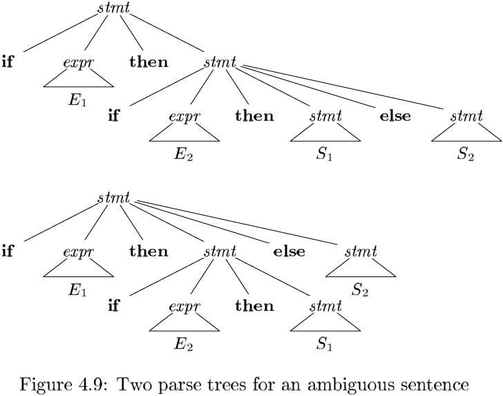
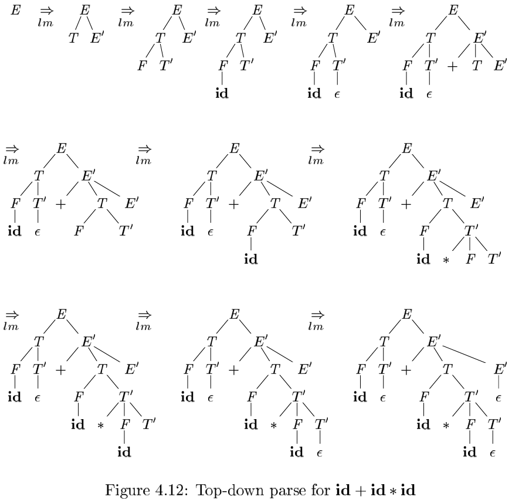
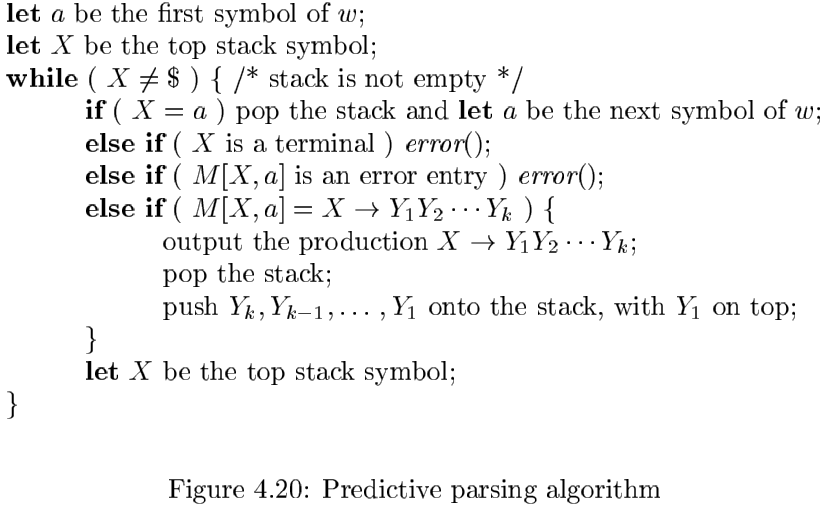
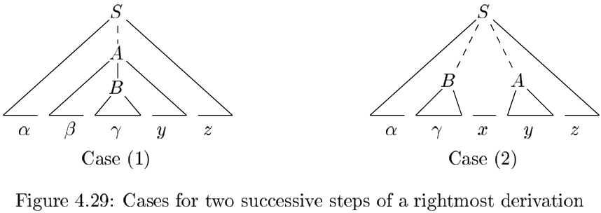
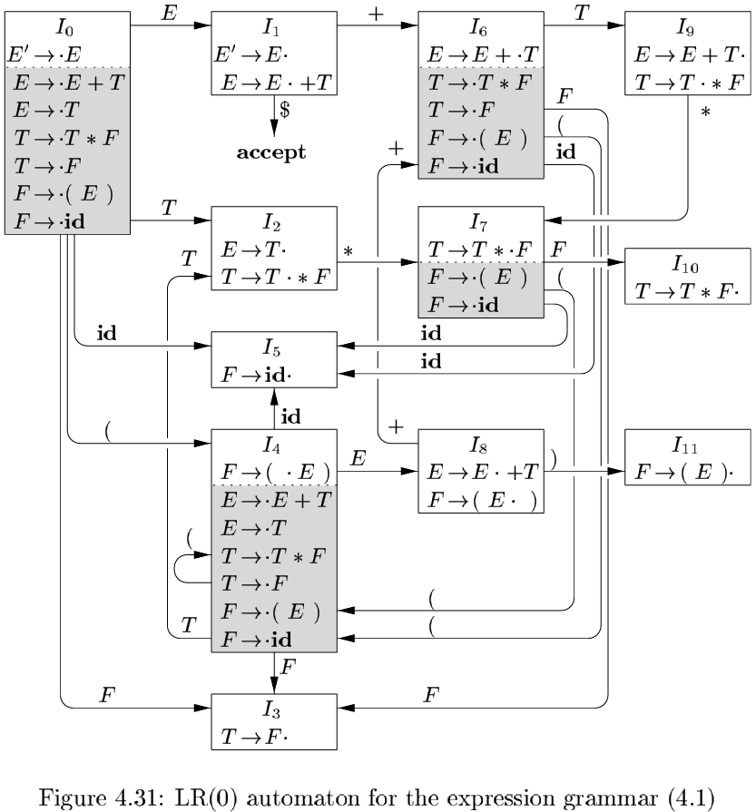
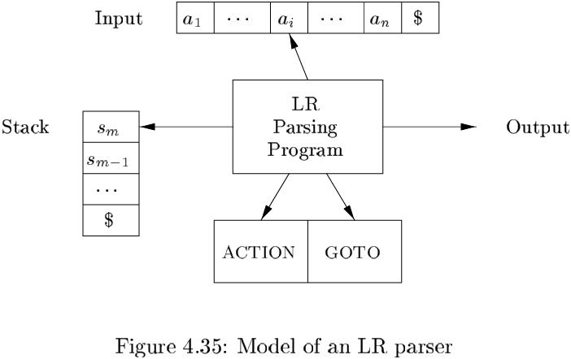
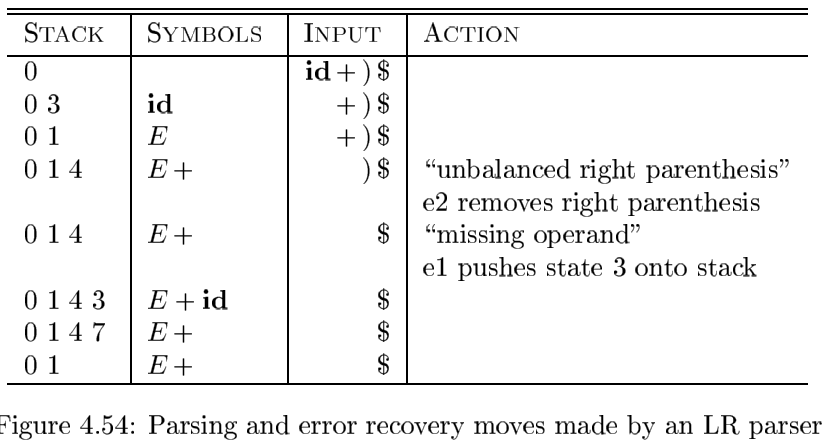

# Chapter 4 Syntax Analysis

[TOC]

## Introduction

### The Role of the Parser

There are three general types of parsers for grammars:

- universal: Universal parsing methods such as the Cocke-Younger-Kasami algorith and Earley's algorithm can parse any grammar. These general methods are, however, to inefficient to use in production compilers.
- top-down: top-down methods build parse trees from the top (root) to the bottom (leaves).
- bottom-up: bottom-up methods start from the leaves and work their way up to the root.

### Representative Grammars

The following expression grammar belongs to the clss of $LR$ grammars that are suitable for bottom-up parsing:
$$
\begin{align}
&E \rightarrow E + T | T \\
&T \rightarrow T * F | F \qquad \qquad (4.1) \\
&F \rightarrow (E) | id
\end{align}
$$
, $E$ represents expressions consisting of terms separated by $+$ signs, $T$ represents terms consisting of factors separated by $*$ signs, and $F$ represents factors that can be either parenthesized expressions or identifiers:

The following non-left-recursive variant of the expression grammar (4.1) will be used for top-down parsing:
$$
\begin{align}
& E \rightarrow TE' \\
& E' \rightarrow + TE'|\epsilon \\
& T \rightarrow FT' \qquad \qquad (4.2)\\
& T' \rightarrow * FT' | \epsilon \\
& F \rightarrow (E) | id \\
\end{align}
$$
The following grammar treats $+$ and $*$ alike, so it is useful for illustrating techniques for hanlding ambiguities during parsing:
$$
E \rightarrow E + E | E * E | (E) | id \qquad (4.3)
$$
, Here, $E$ represents expressions of all types.

### Syntax Error Handling

Common programming errors can occur at many different levels:

- Lexical errors.
- Syntactic errors.
- Semantic errors.
- Logical errors.

The error handler in a parser has goals that are simple to state but challenging to realize:

- Report the presence of errors clearly and accurately.
- Recover from each error quickly enough to detect subsequent errors.
- Add minimal overhead to the processing of correct programs.

### Error-Recovery Strategies

**Panic-Mode Recovery**: With this method, on discovering an error, the parser discards input symbols one at a time until one of a designated set of `synchronizing tokens` is found.

**Phrase-Level Recovery**: 

On discovering an error, a parser may perform local correction on the remaining input; that is, it may replace a prefix of the remaining input by some string that allows the parser to cintinue.

**Error Productions**

By anticipating common errors that might be encountered, we can augment the grammar for the language at hand with productions that generate the erroneous constructs.

**Global Correction**

Given an incorrect input string $x$ and grammar $G$, these algorithms will find a parse tree for a related string $y$, such that the number of insertions, deletions, and changes of tokens required to transform $x$ into $y$ is as small as possible.

## Context-Free Grammars

Using a syntactic variable $stmt$ to denote statements and variable $expr$ to denote expressions, the production:
$$
stmt \rightarrow if(expr)\ stmt\ else\ stme \qquad (4.4)
$$

### The Formal Definition of a Context-Free Grammar

A context-free grammar (grammar for short) consists of terminals, nonterminals, a start symbol, and productions:

1. `Terminals` are the basic symbols from which strings are formed.
2. `Nonterminals` are syntactic variables that denote sets of strings.
3. In a grammar, one nonterminal is distinguished as the `start symbol`, and the set of strings it denotes is the language generated by the grammar.
4. The productions of a grammar specify the manner in which the terminals and nonterminals can be combined to form strings. Each `production` consists of:
   - A nonterminal called the `head` or `left side` of the production; this production defines some of the strings denoted by the head.
   - The symbol $\rightarrow.$ Sometimes $::=$ has ben used in place of the arrow.
   - A `body` or `right side` consisting of zero or more terminals and nonterminals. The components of the body describe one way in which strings of the nonterminal at the head can be constructed.

### Derviations

When a sequence of derivation steps $\alpha_{1} \Rightarrow \alpha_{2} \Rightarrow \cdots \Rightarrow  \alpha_{n}$ rewrites $\alpha_{1}$ to $\alpha_{n}$, we say $\alpha_{1}$ derives $\alpha_{n}$. Often, we wish to say, "derives in zero or more steps." For this purpose, we can use the symbol $\overset{*}{\Rightarrow}$. Thus:

1. $\alpha \overset{*}{\Rightarrow} \alpha$, for any string $\alpha$, and
2. If $\alpha \overset{*}{\Rightarrow} \beta$ and $\beta \Rightarrow \gamma$, then $\alpha \overset{*}{\Rightarrow} \gamma$.

, Likewise, $\overset{+}{\Rightarrow}$ means, "derives in one or more steps". 

If $S \overset{*}{\Rightarrow} \alpha$, where $S$ is the start symbol of a grammar $G$, we say that $\alpha$ is a `sentential form` of $G$.

To understand how parsers work, we shall consider derivations in which the nonterminal to be replaced at each step is chosen as follows:

1. In `leftmost` derivations, the leftmost nonterminal in each sentential is always chosen. If $\alpha \Rightarrow \beta$ is a step in which the leftmost nonterminal in $\alpha$ is replaced, we write $\alpha\ \underset{lm}{\Rightarrow}\ \beta$.
2. In `rightmost` derivations, the rightmost nonterminal is always chosen; we write $\alpha\ \underset{lm}{\Rightarrow}\ \beta$ in this case.

### Parse Trees and Derivations

The leaves of a parse tree are labeled by nonterminals or terminals and, read from left to right, constitute a sentential form, called the `yield` or `frontier` of the tree.

### Ambiguity

A grammar that produce more than one parse tree for some sentence is said to be `ambiguous`. Put another way, an ambiguous grammar is one that produces more than one leftmost derivation or more than one rightmost derivation for the same sentence.

### Verifying the Language Generted by a Grammar

A proof that a grammar $G$ generates a language $L$ has two parts: show that every string generated by $G$ is in $L$, and conversely that every string in $L$ can indeed be generated by $G$.

To show that every sentence derivable from $S$ is balanced, we use an inductive proof on the number of steps $n$ in a derivation:

**BASIS:** The basis is $n = 1$. The only string of terminals derivable from $S$ in on step is the empty string, which surely is balanced.

**BASIS:** If the string is of length 0, it must be $\epsilon$, which is balanced.

## Writing a Grammar

### Lexical Versus Syntactic Analysis

There are several reasons why use regular expressions to define the lexical syntax of a language:

1. Separating the syntactic structure of a language into lexical and nonlexical parts provides a convenient way of modularizing the front end of a compiler into two manageable-sized components.
2. The lexical rules of a language are frequently quite simple, and to describe them we do not need a notation as powerful as grammars.
3. Regular expressions generally provide a more concise and easier-to-understand notation for tokens than grammars.
4. More efficient lexical analyzers can be constructed automatically from regular expressions than from arbitrary grammars.

### Eliminating Ambiguity

### Elimination of Left Recursion

A grammer is `left recursive` if it has a nonterminal $A$ such that there is a derivation $A \overset{+}{\Rightarrow} A\alpha$ for some string $\alpha$.

**Algorithm 4.19:** Eliminating left recursion.

**INPUT:** Grammar $G$ with no cycles or $\epsilon$-productions.

**OUTPUT:** An equivalent grammar with no left recursion.

**METHOD:** Apply the algorithm in Fig. 4.11 to $G$. Note that the resulting non-left-recursive grammar may have $\epsilon$-productions.    

### Left Factoring

Left factoring is a grammar transformation that is useful for producing a grammar suitable for predictive, or top-down, parsing.

**Algorithm 4.21:** Left factoring a grammar.

**INPUT:** Grammar $G$.

**OUTPUT:** An equivalent left-factored grammar.

**METHOD:** For each nonterminal $A$, find the longest prefix $\alpha$ common to two or more of its alternatives. If $\alpha \neq \epsilon$ -- i.e., there is a nontrivial common prefix --replace all of the $A$-productions $A \rightarrow \alpha \beta_{1} | \alpha \beta_{2} | \cdots |\alpha \beta_{n}| \gamma$, where $\gamma$ represents all alternatives that do not begin with $\alpha$​, by:
$$
A \rightarrow \alpha A' | \gamma \\
A' \rightarrow \beta_{1} | \beta_{2} | \cdots | \beta_{n}
$$
, Here $A'$ is a new nonterminal. Repeatedly apply this transformation until no two alternatives for a nonterminal have a common prefix.

## Top-Down Parsing

### Recursive-Descent Parsing

### FIRST and FOLLOW

To compute $FIRST(X)$ for all grammar symbols $X$, apply the following rules until no more terminals or $\epsilon$ can be added to any $FIRST$ set:

1. If $X$ is a terminal, then $FIRST(X) = \{X\}$.
2. If $X$ is a nonterminal and $X \rightarrow Y_1 Y_2 \cdots Y_k$ is a production for some $k \geq 1$, then place $a$ in $FIRST(X)$ if for some $i$, $a$ is in $FIRST(Y_i)$, and $\epsilon$ is in all of $FIRST(Y_1), ..., FIRST(Y_{i- 1})$; that is, $Y_1 ... Y_{i - 1} \overset{*}{\Rightarrow} \epsilon$. If $epsilon$ is in $FIRST(Y_j)$ for all $j = 1, 2, ..., k$, then add $\epsilon$ to $FIRST(X)$.
3. If $X \rightarrow \epsilon$ is a production, then add $\epsilon$ to $FIRST(X)$.

To compute $FOLLOW(A)$ for all nonterminals $A$, apply the following rules until nothing can be added to any $FOLLOW$ set:

1. Place $\$$ in $FOLLOW(S)$, where $S$ is the start symbol, and $\$$ is the input right endmarker.
2. If there is a production $A \rightarrow \alpha B \beta$, then everything in $FIRST(\beta)$ except $\epsilon$ is in $FOLLOW(B)$.
3. If there is a production $A \rightarrow \alpha B$, or a production $A \rightarrow \alpha B \beta$, where $FIRST(\beta)$ contains $\epsilon$, then everything in $FOLLOW(A)$ is in $FOLLOW(B)$.

### LL(1) Grammars

A grammar $G$ is LL(1) if and only if whenever $A \rightarrow \alpha | \beta$ are two distinct productions of $G$, the following conditions hold:

1. For no terminal $a$ do both $\alpha$ and $\beta$ derive strings beginning with $a$.
2. At most one of $\alpha$ and $\beta$ can derive the empty string.
3. If $\overset{*}{\Rightarrow} \epsilon$, then $\alpha$ does not derive any string beginning wth a terminal in $FOLLOW(A)$. Likewise, if $\alpha \overset{*}{\Rightarrow} \epsilon$, then $\beta$ does not derive any string beginning with a terminal in $FOLLOW(A)$.

**Algorithm 4.31:** Construction of a predictive parsing table.

**INPUT:** Grammar $G$.

**OUTPUT:** Parsing table $M$.

**METHOD:** For each production $A \rightarrow \alpha$ of the grammar, do the following:

1. For each terminal $a$ in $FIRST(\alpha)$, add $A \rightarrow \alpha$ to $M [A, a]$.
2. If $\epsilon$ is in $FIRST(\alpha)$, then for each terminal $b$ in $FOLLOW(A)$, add $A \rightarrow \alpha$ to $M[A, b]$. If $\epsilon$ is in $FIRST(\alpha)$ and $\$$ is in $FOLLOW(A)$, add $A \rightarrow \alpha$ to $M[A, \$]$ as well.

### Nonrecursive Predictive Parsing

**Algorithm 4.34:** Table-driven predictive parsing.

**INPUT:** A string $w$ and a parsing table $M$ for grammar $G$.

**OUTPUT:** If $w$ is in $L(G)$, a leftmost derivation of $w$; otherwise, an error indication.

**METHOD:** Initially, the parser is in a configuration with $w\$$ in the input buffer and the start symbol $S'$ of $G$ on top of the stack, above $\$$. The program in Fig.4.20 uses the predictive parsing table $M$ to produce a predictive parse for the input.

  

### Error Recovery in Predictive Parsing

Panic-mode error recovery is based on the idea of skipping over symbols on the input until a token in a selected set of synchronizing tokens appears. Its effectiveness depends on the choice of synchronizing set. The sets should be chosen so that the parser recovers quickly from errors that are likely to occur in practice.

## Bottom-Up Parsing

A bottom-up corresponds to the construction of a parse tree for an input string beginning at the leaves (the bottom) and working up towards the root (the top).

### Handle Pruning

A rightmost derivation in reverse can be obtained by "handle pruning".

### Shift-Reduce Parsing

Shift-reduce parsing is a form of bottom-up parsing in which a stack holds grammar symbols and an input buffer holds the rest of the string to be parsed.

While the primary operations are shift and reduce, there are actually four possible actions a shift-reduce parser can make:

1. `Shift`. Shift the next input symbol onto the top of the stack.
2. `Reduce`. The right end of the string to be reduced must be at the top of the stack. Locate the left end of the string within the stack and decide with what nonterminal to replace the string.
3. `Accept`. Announce successful completion of parsing.
4. `Error`. Discover a syntax error and call an error recovery routine.

### Conflicts During Shift-Reduce Parsing

There are context-free grammars for which shift-reduce parsing cannot be used. Every shift-reduce parser for such a grammar can reach a configuration in which the parser, knowing the entire stack and also the next $k$ input symbols, cannot decide whether to shift or to reduce (`a shift/redcue conflict`), or cannot decide which of several reductions to make (`a reduce/reduce conflict`).

## Introduction to LR Parsing: Simple LR

### Why LR Parsers?

LR parsing is attractive for a variety of reasons:

- LR parsers can be constructed to recognize virtually all parogramming language constructs for which context-free grammars can be written.
- The LR-parsing method is the most general nonbacktracking shift-reduce parsing method known, yet it can be implemented as efficiently as other, more primitive shift-reduce methods (see the bibliographic notes).
- An LR parser can detect a syntactic error as soon as it is possible to do so on a left-to-right scan of the input.
- The class of grammars that can be parsed using LR methods is a proper superset of the class of grammars that can be parsed with predictive or LL methods.

### Items and the LR(0) Automaton

One collection of sets of LR(0) items, called the `canonical` LR(0) collection, provides the basis for constructing a deterministic finite automaton that is used to make parsing decisions.

**Closure of Item Sets**

If $I$ is a set of items for a grammar $G$, then $CLOSURE(I)$ is the set of items constructed from $I$ by the two rules:

1. Initially, add every item in $I$ to $CLOSURE(I)$.
2. If $A \rightarrow \alpha \cdot B \beta$ is in $CLOSURE(I)$ and $B \rightarrow \gamma$ is a production, then add teh item $B \rightarrow \cdot \gamma$ to $CLOSURE(I)$, if it is not already there. Apply this rule until no more new items can be added to $CLOSURE(I)$.

### The LR-Parsing Algorithm

The parsing table consists of two parts:

1. The ACTION function takes as arguments a state $i$ and a terminal $a$ (or $\$$, the input endmarker). The value of $ACTION[i, a]$ can have one of four forms:
   - Shift $j$, where $j$ is a state. The action taken by the parser effectively shifts input $a$ to the stack, but uses state $j$ to represent $a$.
   - Reduce $A \rightarrow \beta$. The action of the parser effectively reduces $\beta$ on the top of the stack  to head $A$
   - Accept. The parser accepts the input and finishes parsing.
   - Error. The parser discovers an error in its input and takes some corrective action.
2. We extend the GOTO function, defined on sets of items, to states: if $GOTO[I_i, A] = I_j$, then GOTO also maps a state $i$ and a nonterminal $A$ to state $j$.

A `configuration` of an LR parser is a pair:
$$
(s_0 s_1 \cdots s_m, a_i a_{i+1} \cdots a_n \$)
$$
, where the first component is the stack contents (top on the right), and the second component is the remaining input. This configuration represents the right-sentential form:
$$
X_1 X_2 \cdots X_m a_i a_{i+1} \cdots a_n
$$
The configurations resulting after each of the four types of move are as follows:

1. If $ACTION[s_m, a_i] = shift\ s$, the parser executes a shift move; it shifts the next state $s$ onto the stack, entering the configuration:
   $$
   (s_0 s_1 \cdots s_m s, a_{i+1} \cdots a_n \$)
   $$

2. If $ACTION[s_m, a_i] = reduce\ A \rightarrow \beta$, then teh parser executes a reduce move, entering the configuration:
   $$
   (s_0 s_1 \cdots s_{m-r} s, a_i a_{i+1} \cdots a_n \$)
   $$

3. If $ACTION[s_m, a_i] = accept$, parsing is completed.

4. If $ACTION[s_m, a_i] = error$, the parser has discovered an error and calls an error recovery routine.

**Algorithm 4.44:** LR-parsing algorithm.

**INPUT:** An input string $w$ and an LR-parsing table with functions ACTION and GOTO for a grammar $G$.

**OUTPUT:** If $w$ is in $L(G)$, the reduction steps of a bottom-up parse for $w$; otherwise, an error indication.

**METHOD:** Initially, the parser has $s_0$ on its stack, where $s_0$ is the initial state, and $w\$$ in the input buffer. The parser then executes the program in Fig.4.36.

  

### Constructing SLR-Parsing Tables

**Algorithm 4.46:** Constructing an SLR-parsing table.

**INPUT:** An augmented grammar $G'$.

**OUTPUT:** The SLR-parsing table functions ACTION and GOTO for $G'$.

**METHOD:**

1. Construct $C = \{I_0, I_1, ..., I_n\}$, the collection of sets of $LR(0)$ items for $G'$.
2. State $i$ is constructed from $I_i$. The parsing actions for state $i$ are determined as follows:
   - If $[A \rightarrow \alpha \cdot a \beta]$ is in $I_i$ and $GOTO(I_i, a) = I_j$, then set $ACTION[i, a]$ to "shift\ j." Here $a$ must be a terminal.
   - If $[A \rightarrow \alpha \cdot]$ is in $I_i$, then set $ACTION[i, a]$ to "$reduce\ A \rightarrow \alpha$" for all $a$ in $FOLLOW(A)$; here $A$ may not be $S'$.
   - If $[S' \rightarrow S\cdot]$ is in $I_i$, then set $ACTION[i, \$]$ to "accept".
3. The goto transitions for state $i$ are constructed for all nonterminals $A$ using the rule: If $GOTO(I_i, A) = I_j$, then $GOTO[i, A] = j$.
4. All entries not defined by rules (2) and (3) are made "error".
5. The initial state of the parser is the one constructed from the set of items containing $[S' \rightarrow \cdot S]$.

### Viable Prefixes

The prefixes of right sentential forms that can appear on the stack of a shift reduce parser are caleld `viable prefixes`.

It is a central theorem of LR-parsing theory that the set of valid items for a viable prefix $\gamma$ is exactly the set of items reached from the initial state along the path labeled $\gamma$ in the LR(0) automaton for the grammar.

## More Powerful LR Parsers

### Canonical LR(1) Items

Formally, we say $LR(1)$ item $[A \rightarrow \alpha \cdot \beta, a]$ is valid for a viable prefix $gamma$ if there is a derivation $S \underset{rm}{\overset{*}{\Rightarrow}} \delta Aw\ \underset{rm}{\Rightarrow}\ \delta \alpha \beta w$, where:

1. $\gamma = \delta \alpha$, and
2. Either $a$ is the first symbol of $w$, or $w$ is $\epsilon$ and $a$ is $\$$.

### Constructing LR(1) Sets of Items

**Algorithm 4.53:** Construction of the sets of $LR(1)$ items.

**INPUT:** An augmented grammar $G'$.

**OUTPUT:** The sets of $LR(1)$ items that are the set of items valid for one or more viable prefixes of $G'$.

**METHOD:** The procedures COLSURE and GOTO and the main routine `items` for constructing the sets of items were shown in Fig. 4.40.

  

### Canonical LR(1) Parsing Tables

**Algorithm 4.56:** Construction of canonical-LR parsing tables.

**INPUT:** An augmented grammar $G'$.

**OUTPUT:** The canonical-LR parsing table functions ACTION and GOTO for $G''$.

**METHOD:**

1. Construct $G' = \{I_0, I_1, \cdots, I_n\}$, the collection of sets of LR(1) items for $G'$​.
2. State $i$ of teh parser is constructed from $I_i$. The parsing action for state $i$ is determined as follows:
   - If $[A \rightarrow \alpha \cdot a \beta, b]$ is in $I_i$ and $GOTO(I_i, a) = I_j$, then set $ACTION[i, a]$ to "shift j." Here $a$ must be a terminal.
   - If $[A \rightarrow \alpha \cdot, a]$ is in $I_i, A \neq S'$, then set $ACTION[i, a]$ to "reduce $A \rightarrow \alpha$".
   - If $[S' \rightarrow S \cdot, \$]$ is in $I_i$, then set $ACTION[i, \$]$ to "accept".
3. The got transitions for state $i$ are constructed for all nonterminals $A$ using the rule: If $GOTO(I_i, A) = I_j$, then $GOTO[i, A] = j$.
4. All entries not defined by rules (2) and (3) are made "error".
5. The initial state of the parser is the one contructed from the set of items containing $[S' \rightarrow \cdot S, \$]$.

### Constructing LALR Parsing Tables

**Algorithm 4.59:** An easy, but space-consuming LALR table construction.

**INPUT:** An augmented grammar $G'$.

**OUTPUT:** The LALR parsing-table functions ACTION and GOTO for $G'$.

**METHOD:**

1. Construct $C = \{I_0, I_1, \cdots, I_n\}$, the collection of sets of LR(1) items.
2. For each core present among the set of LR(1) items, find all sets having that core, and replace these sets by their union.
3. Let $C' = \{J_0, J_1, \cdots, J_m\}$ be the resulting sets of LR(1) items. The parsing actions for state $i$ are constructed from $J_i$ in the same manner as in Algorithm 4.56. If there is a parsing action conflict, the algorithm fails to produce a parser, and the grammar is said not tobe LALR(1).
4. The GOTO table is constructed as follows. If $J$ is teh union of one or more sets of LR(1) items, that is, $J = I_1 \cup I_2 \cup \cdots \cup I_k$, then the cores of $GOTO(I_1, X), GOTO(I_2, X), \cdots, GOTO(I_k, X)$ are the same, since $I_1, I_2, \cdot, I_k$ all have the same core. Let $K$ be the union of all sets of items having the same core as $GOTO(I_1, X)$. Then $GOTO(J, X) = K$.

### Efficient Construction of LALR Parsing Tables

There are several modifications we can make to Algorithm 4.59 to avoid constructing the full collection of sets of LR(1) items in the process of creating an LALR(1) parsing table:

- First, we can represent any set of LR(0) or LR(1) items $I$ by its kernel, that is, by those items that are eiterh the initial item $[S' \rightarrow \cdot S]$ or $[S' \rightarrow \cdot S, \$]$ or that have the dot somewhere other than at the beginning of the production body.
- We can construct the LALR(1)-item kernels from the LR(0)-item kernels by a process of propagation and spontaneous generation of lookaheads, that we shall describe shortly.
- If we have the LALR(1) kernels, we can generate teh LALR(1) parsing table by closing each kernel, using the function $CLOSURE$ of Fig. 4.40, and then computing table entries by Algorithm 4.56, as if the LALR(1) sets of items were canonical LR(1) sets of items.

**Algorithm 4.62:** Determining lookaheads.

**INPUT:** The kernel $K$ of a set of LR(0) items $I$ and a grammar symbol $X$.

**OUTPUT:** The lookaheads spontaneously generated by items in $I$ for kernel items in $GOTO(I, X)$ and the items in $I$ from which lookaheads are propagated to kernel items in $GOTO(I, X)$.

**METHOD:** The algorithm is given in Fig. 4.45.

**Algorithm 4.63:** Efficient computation of the kernels of the LALR(1) collection of sets of items.

**INPUT:** An augmented grammar $G'$.

**OUTPUT:** The kernels of the LALR(1) collection of sets of items for $G'$.

**METHOD:**

1. Construct the kernels of the sets of LR(0) items for $G$.
2. Apply Algorithm 4.62 to the kernel of each set of LR(0) items and grammar symbol $X$ to determine which lookaheads are spontaneously generated for kernel items in $GOTO(I, X)$, and from which items in $I$ lookaheads are propagated to kernel items in $GOTO(I, X)$.
3. Initialize a table that gives, for each kernel item in each set of items, the associated lookaheads.
4. Make repeated passes over the kernel items in all sets.

## Using Ambiguous Grammars

### Error Recovery in LR Parsing

Phrase-level recovery is implemented by examining each error entry in the LR parsing table and deciding on the basis of language usage the most likely programmer error that would give rise to that error. An appropriate recovery procedure can then be constructed; presumably the top of the stack and/or first input symbols would be modified in a way deemed appropriate for each error entry.

