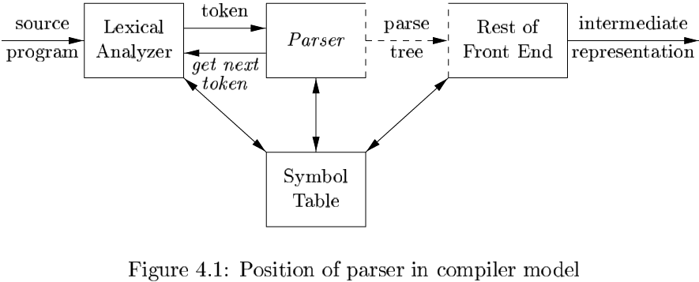
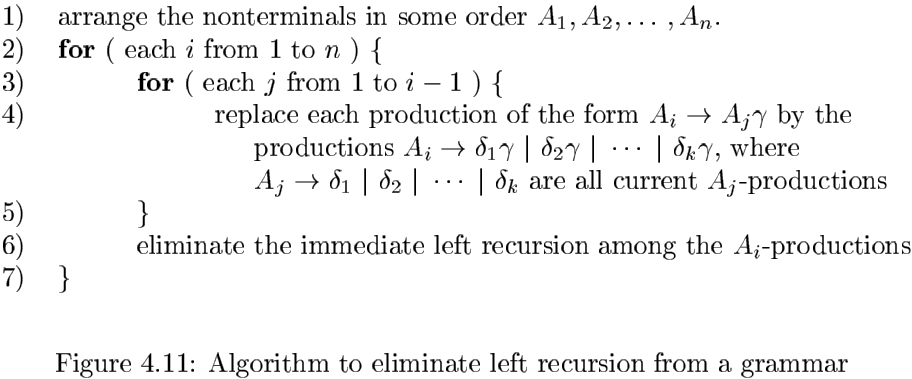
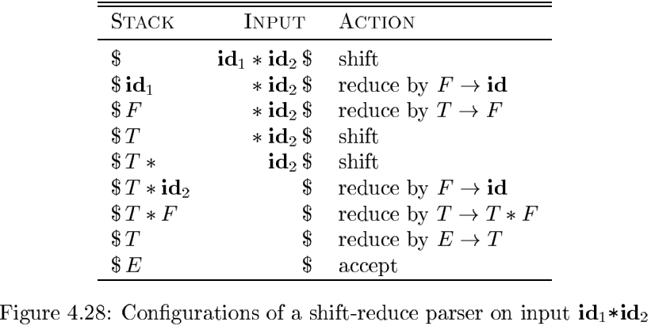
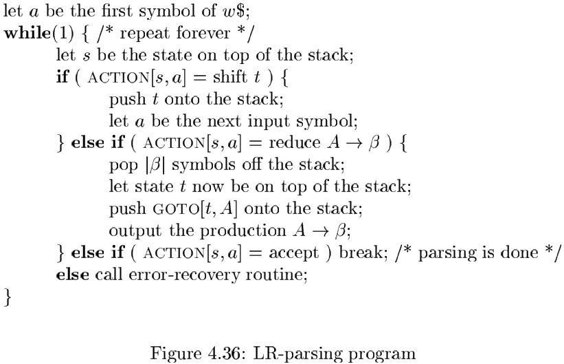
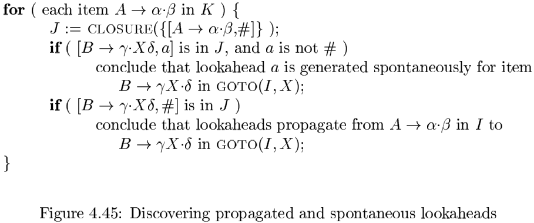

# 第四章 语法分析

## 4.1 引论

### 4.1.1 语法分析器的作用

处理文法的语法分析器可以分为三类：

- 通用的：像Cocke-Younger-Kasami算法和Earley算法这样的通用语法分析方法可以对任意文法进行语法分析。
- 自顶向下：从语法分析树的顶部（根节点）开始向底部（叶子节点）构造语法分析树。
- 自底向上：从叶子节点开始，逐渐向根节点方向构造。

### 4.1.2 代表性的文法

以下表达式文法属于LR文法类，适用于自底向上的语法分析技术：
$$
\begin{align}
&E \rightarrow E + T | T \\
&T \rightarrow T * F | F \qquad \qquad (4.1) \\
&F \rightarrow (E) | id
\end{align}
$$
$E$表示一组以$+$号分隔的项所组成的表达式；$T$表示由一组以$*$号分隔的因子所组成的项；$F$表示因子，它可能是括号括起来的表达式，也可能是标识符。

以下表达式文法是（4.1）的无左递归版本，用于自顶向下的语法分析：
$$
\begin{align}
& E \rightarrow TE' \\
& E' \rightarrow + TE'|\epsilon \\
& T \rightarrow FT' \qquad \qquad (4.2)\\
& T' \rightarrow * FT' | \epsilon \\
& F \rightarrow (E) | id \\
\end{align}
$$
下面的文法以相同的方式处理$+$和$*$，因此它可以用来说明那些在语法分析过程中处理二义性的技术：
$$
E \rightarrow E + E | E * E | (E) | id \qquad (4.3)
$$

### 4.1.3 语法错误的处理

程序有不同层次的错误：

- 词法错误
- 语法错误
- 语义错误
- 逻辑错误

语法分析器中的错误处理程序的目标：

- 清晰精确地报告出现的错误。
- 能很快地从各个错误中恢复，以继续检测后面的错误。
- 尽可能少地增加处理正确程序时的开销。

### 4.1.4 错误恢复策略

恐慌模式的恢复：使用这个方法时，语法分析器一旦发现错误就不断丢弃输入中的符号，一次丢弃一个符号，直到找到`同步词法单元（synchronizing token）`集合中的某个元素为止。

短语层次的恢复：当发现一个错误时，语法分析器可以在余下的输入上进行局部性纠正。也就是说，它可能将余下输入的某个前缀替换为另一个串，使语法分析器可以继续分析。

错误产生式：通过预测可能遇到的常见错误，我们可以在当前语言的文法中加入特殊的产生式。这些产生式能够产生含有错误的构造，从而基于增加了错误产生式的文法构造得到一个语法分析器。

全局纠正：给定一个不正确的输入$x$和文法$G$，这些算法将找出一个相关串$y$的语法分析树，使得将$x$转换为$y$所需要的插入，删除和改变的词法单元的数量最少。

## 4.2 上下文无关文法

下面的产生式使用语法变量stmt来表示语句，使用变量expr表示表达式：
$$
stmt \rightarrow if(expr)\ stmt\ else\ stme \qquad (4.4)
$$

### 4.2.1 上下文无关闻法得正式定义

一个上下文无关文法（简称文法）由终结符号，非终结符号，一个开始符号和一组产生式组成：

- `终结符号` 组成串的基本符号。
- `非终结符号` 表示串的集合的语法变量。
- `开始符号` 表示的串集合即这个文法生成的语言。
- `产生式` 描述了将终结符号和非终结符号组合成串的方法，由下列元素组成：
  1. 一个被称为产生式头或左部的非终结符号。这个产生式定义了这个头所代表的串集合的一部分。
  2. 符号$\rightarrow$。有时也使用$::=$来替代箭头。
  3. 一个由零个或多个终结符号与非终结符号组成的产生式体或右部。产生式体中的成分描述了产生式头上的非终结符号所对应的串的某种构造方法。

### 4.2.2 符号表示的约定

### 4.2.3 推导

当一个推导序列$\alpha_{1} \Rightarrow \alpha_{2} \Rightarrow \cdots \Rightarrow  \alpha_{n}$将$\alpha_{1}$替换为$\alpha_{n}$，我们说$\alpha_{1}$推导出$\alpha_{n}$。我们经常说“经过零步或多步推导出”，我们可以使用符号$\Rightarrow$来表示这种关系。因此：

1. 对于任何串$\alpha, \alpha \Rightarrow \alpha$，并且
2. 如果$\alpha \Rightarrow \beta$且$\beta \Rightarrow \gamma$，那么$\alpha \Rightarrow \gamma$。

如果$S \Rightarrow \alpha$，其中$S$是文法$G$的开始符号，我们说$\alpha$是$G$的一个句型（sentential form）。

在每个推到步骤中按照如下方式选择被替换的非终结符号的两种推导过程：

1. 最左推导（leftmost derivation）：总是选择每个句型的最左非终结符号。如果$\alpha \Rightarrow \beta$是一个推到步骤，且被替换的是$\alpha$中的最左非终结符号，我们写作$\alpha\ \overset{\Rightarrow}{lm}\ \beta$。
2. 最右推导（rightmost derivation）：总是选择最右边的非终结符号。此时我们写作$\alpha\ \overset{\Rightarrow}{lm}\ \beta$。

### 4.2.4 语法分析树和推导

一棵语法分析树的叶子结点的标号既可以是非终结符号，也可以是终结符号。从左到右排列这些符号就可以得到一个句型，它称为这棵树的结果（yield）或边缘（frontier）。

### 4.2.5 二义性

如果一个文法可以为某个句子生成多课语法分析树，那么它就是二义性的（ambiguous）。换句话说，二义性文法就是对同一个句子有多个最左推导或多个最右推导的文法。

### 4.2.6 验证文法生成的语言

证明文法$G$生成语言$L$的过程可以分为两个部分：证明$G$生成的每个串都在$L$中，并且反向证明$L$中的每个串都确实能由$G$生成。

为了证明从$S$推导出的每个句子都是括号对称的，我们对推导步数$n$进行归纳：

**基础**：基础是$n = 1$。唯一可以从$S$经过一步推导得到的终结符号是空串，它当然是括号对称的。

**基础**：如果串的长度是0，它必然是$\epsilon$。这个串是括号对称的，且可以从$S$推导得到。

### 4.2.7 上下文无关文法和正则表达式

### 4.2.8 4.2节的练习

## 4.3 设计文法

### 4.3.1 词法分析和语法分析

使用正则表达式来定义一个语言的词法语法的理由：

1. 将一个语言的语法结构分为词法和非词法两部分可以很方便地将编译器前端模块化，将前端分解为两个大小适中的组件。
2. 一个语言的词法规则通常很简单，我们不需要使用像文法这样的功能强大的表示方法来描述这些规划。
3. 和文法相比，正则表达式通常提供了更加简洁且易于理解的表示词法单元的方法。
4. 根据正则表达式自动构造得到的词法分析器的效率要高于根据任意文法自动构造得到的分析器。

### 4.3.2 消除二义性

### 4.3.3 左递归的消除

如果一个文法中有一个非终结符号$A$使得对某个串$\alpha$存在一个推导$A \overset{+}{\Rightarrow} A \alpha$，那么这个文法就是左递归的（left recursive）。

**算法 4.19** 消除左递归。

  输入：没有环或$\epsilon$产生式的文法$G$。

  输出：一个等价的无左递归文法。

  方法：对$G$应用下图中的算法（请注意，得到的非左递归文法可能具有$\epsilon$产生式）。

​    

### 4.3.4 提取左公因子

提取左公因子是一种文法转换方法，它可以产生适用于预测分析技术或自顶向下分析技术的文法。

**算法 4.21** 对一个文法提取左公因子。

  输入：文法$G$。

  输出：一个等价的提取了左公因子的文法。

  方法：对于每个非终结符号$A$，找出它的两个或多个选项之间的最长公共前缀$\alpha$。如果$\alpha \neq \epsilon$，即存在一个非平凡的公共前缀，那么将所有$A$产生式$A \rightarrow \alpha \beta_{1} | \alpha \beta_{2} | \cdots |\alpha \beta_{n}| \gamma$，替换为：
$$
A \rightarrow \alpha A' | \gamma \\
A' \rightarrow \beta_{1} | \beta_{2} | \cdots | \beta_{n}
$$
  其中，$\gamma$表示所有不以$\alpha$开头的产生式体；$A'$是一个新的非终结符号。不断应用这个转换，制导每个非终结符号的任意两个产生式体都没有公共前缀为止。

### 4.3.5 非上下文无关语言的构造

### 4.3.6 4.3节的练习

## 4.4 自顶向下的语法分析

### 4.4.1 递归下降的语法分析

### 4.4.2 FIRST和FOLLOW

计算各个文法符号$X$的$FIRST(X)$时，不断应用下列规则，直到再没有新的终结符号或$\epsilon$可以被加入到任何$FIRST$集合中为止：

1. 如果$X$时是一个终结符号，那么$FIRST(X) = X$。
2. 如果$X$是一个非终结符号，且$X \rightarrow Y_1 Y_2 \cdots Y_k$是一个产生式，其中$k \geqslant 1$，那么如果对于某个$i, a$在$FIRST(Y_i)$中且$\epsilon$在所有的$FIRST(Y_1), FIRST(Y_2), \cdots, FIRST(Y_{i-1})$中，就把$a$加入到$FIRST(X)$中。
3. 如果$X \rightarrow \epsilon$是一个产生式，那么将$\epsilon$加入到$FIRST(X)$中。

计算所有非中介符号$A$的$FOLLOW(A)$集合时，不断应用下面的规则，直到再没有新的终结符号可以被加入到任意$FOLLOW$集合中为止：

1. 将$\$$放入到$FOLLOW(S)$中，其中$S$是开始符号，而$\$$是输入右端的结束标记。
2. 如果存在一个产生式$A \rightarrow \alpha B \beta$，那么$FIRST(\beta)$中除$\epsilon$之外的所有符号都在$FOLLOW(B)$中。
3. 如果存在一个产生式$A \rightarrow \alpha B$，或存在产生式$A \rightarrow \alpha B \beta$且$FIRST(\beta)$包含$\epsilon$，那么$FOLLOW(A)$中的所有符号都在$FOLLOW(B)$中。

### 4.4.3 LL(1)文法

一个文法$G$是$LL(1)$的，当且仅当$G$的任意两个不同的产生式$A \rightarrow \alpha | \beta$满足下面的条件：

1. 不存在终结符号$a$使得$\alpha$和$\beta$都能推导出以$a$开头的串。
2. $\alpha$和$\beta$中最多只有一个可以推导出空串。
3. 如果$\beta \Rightarrow \epsilon$，那么$\alpha$不能推导出任何以$FOLLOW(A)$中某个终结符号开头的串。类似地，如果$\alpha \Rightarrow \epsilon$，那么$\beta$不能推导出任何以$FOLLOW(A)$中某个终结符号开头的串。

**算法 4.31** 构造一个预测分析表。

  输入：文法$G$。

  输出：预测分析表$M$。

  方法：对于文法$G$的每个产生式$A \rightarrow \alpha$，进行如下处理：

  1. 对于$FIRST(\alpha)$中的每个终结符号$a$，将$A \rightarrow \alpha$加入到$M[A, a]$中。
1. 如果$\epsilon$在$FIRST(\alpha)$中，那么对于$FOLLOW(A)$中的每个终结符号$b$，将$A \rightarrow \alpha$加入到$M[A, b]$中。如果$\epsilon$在$FIRST(\alpha)$中，且$\$$在$FOLLOW(A)$中，也将$A \rightarrow \alpha$加入到$M[A, \$]$中。

### 4.4.4 非递归的预测分析

**算法 4.34** 表驱动的预测语法分析：

  输入：一个串$w$，文法$G$的预测分析表$M$。

  输出：如果$w$在$L(G)$中，输出$w$的一个最左推导；否则给出一个错误指示。

  方法：最初，语法分析器的格局如下：输入缓冲区中是$w\$$，而$G$的开始符号$S$位于栈顶，它的下面是$\$$。

  

### 4.4.5 预测分析中的错误恢复

恐慌模式的错误恢复是基于下面的思想：语法分析器忽略输入中的一些符号，直到输入中出现由设计者选定的同步词法单元集合中的某个词法单元。它的有效性依赖于同步集合的选取。选取这个集合的原则是应该使得语法分析器能够从实践中可能遇到的错误中快速恢复。

短语层次错误恢复的实现方法是在预测语法分析表的空白条目中填写指向处理历程的指针。

### 4.4.6 4.4节的练习

## 4.5 自底向上的语法分析

一个自底向上的语法分析过程对应于为一个输入串构造语法分析树的过程，它从叶子节点（底部）开始逐渐向上到达根节点（顶部）。

### 4.5.1 规约

### 4.5.2 句柄剪枝

通过“句柄剪枝”可以得到一个反向的最右推导。

### 4.5.3 移入-归约语法分析技术

移入-规约语法分析是自底向上语法分析的一种形式。它使用一个栈来保存文法符号，并用一个输入缓冲区来存放将要进行语法分析的其余符号。

虽然主要的语法分析操作是移入和归约，但实际上一个移入-归约语法分析器可采取如下四种可能的动作：

1. 移入（shift）：将下一个输入符号移到栈的顶端。
2. 规约（reduce）：被规约的符号串的右端必然是栈顶。语法分析器在栈中确定这个串的左端，并决定用哪个非终结符号来替换这个串。
3. 接受（accept）：宣布语法分析过程成功完成。
4. 报错（error）：发现一个语法错误，并调用一个错误恢复子例程。

### 4.5.4 移入-归约语法分析中的冲突

有些上下文无关文法不能使用移入-归约语法分析技术。对于这样的文法，每个移入-归约语法分析器都会得到如下的格局：即使知道了栈中的所有内容以及接下来的$k$个输入符号，我们仍然无法判断应该进行移入还是归约操作（移入/归约冲突），或者无法在多个可能的归约方法中选择正确的归约动作（归约/归约冲突）。

### 4.5.5 4.5节的练习

## 4.6 LR语法分析技术介绍：简单LR技术

### 4.6.1 为什么使用LR语法分析器

LR语法分析技术很有吸引力，原因如下：

- 对于几乎所有的程序设计语言构造，只要能够写出该构造的上下文无关文法，就能够构造出识别该构造的LR语法分析器。
- LR语法分析方式是已知的最通用的无回溯移入-归约分析技术，并且它的实现可以和其它更原始的移入-归约方法一样高效。
- 一个LR语法分析器可以在对输入进行从左到右扫描时尽可能早地检测到错误。
- 可以使用LR方法进行语法分析的文法类是可以使用预测方法或LL方法进行语法分析的文法类的真超集。

### 4.6.2 项和LR(0)自动机

一个称为规范LR(0)项集族（canonical LR(0) collection）的一组项集提供了构建一个确定有穷自动机的基础。该自动机可用于做出语法分析决定。

项集的闭包：如果$I$是文法$G$的一个项集，那么$CLOSURE(I)$就是根据下面的两个规则从$I$构造得到的项集：

1. 一开始，将$I$中的各个项加入到$CLOSURE(I)$中。
2. 如果$A \rightarrow \alpha \cdot B \beta$在$CLOSURE(I)$中，$B \rightarrow \gamma$是一个产生式，并且项$B \rightarrow \cdot \gamma$不在$COLSURE(I)$中，就将这个项目加入其中。不断应用这个规则，直到没有新项可以加入到$CLOSURE(I)$中为止。

### 4.6.3 LR语法分析算法

**LR语法分析表**由两个部分组成：

1. 语法分析动作函数ACTION

   ACTION函数有两个参数：

   - $i$ 状态
   - $a$ 终结符号 或 $\$$输入结束标记

   $ACTION[i, a]$的取值可以有下列形式：

   - 移入$j$，其中$j$是一个状态。语法分析器采用的动作是把输入符号$a$高效地移入栈中，但是使用状态$j$来代表$a$。
   - 归约$A \rightarrow \beta$。语法分析器的动作是把栈顶的$\beta$高效地归约为产生式头$A$。
   - 接受。语法分析器接受输入并完成语法分析过程。
   - 报错。语法分析器在它的输入中发现了一个错误并执行某个纠正动作。

2. 转换函数GOTO

   我们把定义在项集上的GOTO函数扩展为定义在状态集上的函数：如果$GOTO[I_i, A] = I_j$，那么GOTO也把状态$i$和一个非终结符号$A$映射到状态$j$。

**LR语法分析器的configuration**是一个形如：
$$
(s_0 s_1 \cdots s_m, a_i a_{i+1} \cdots a_n \$)
$$
的对。这个configuration表示了如下的最右句型：
$$
X_1 X_2 \cdots X_m a_i a_{i+1} \cdots a_n
$$
**LR语法分析器对于四种ACTION动作结束之后的configuration**如下：

1. 如果$ACTION[s_m, a_i]=移入s$，那么语法分析器执行一次移入操作；它将下一个状态$s$移入栈中，进入configuration：
   $$
   (s_0 s_1 \cdots s_m s, a_{i+1} \cdots a_n \$)
   $$

2. 如果$ACTION[s_m, a_i] = 规约A \rightarrow \beta$，那么语法分析器执行一次规约动作，进入格局：
   $$
   (s_0 s_1 \cdots s_{m-r} s, a_i a_{i+1} \cdots a_n \$)
   $$
   其中，$r$是$\beta$的长度，且$s = GOTO[s_{m-r}, A]$。

3. 如果$ACTION[s_m, a_i] = 接受$，那么语法分析过程完成。

4. 如果$ACTION[s_m, a_i] = 报错$，则说明语法分析器发现了一个语法错误，并调用一个错误恢复例程。

**算法 4.44** LR语法分析算法

  输入：一个输入串$w$和一个LR语法分析表，这个表描述了文法$G$的$ACTION$函数和$GOTO$函数。

  输出：如果$w$在$L(G)$中，则输出$w$的自底向上语法分析过程中的规约步骤；否则给出一个错误指示。

  方法：最初，语法分析器栈中的内容为初始状态$s_0$，输入缓冲区中的内容为$w\$$。然后，语法分析器执行下图中的程序：

  

### 4.6.4 构造SLR语法分析表

**算法 4.46** 构造一个SLR语法分析表。

  输入：一个增广文法$G'$。

  输出：$G'$的SLR语法分析表函数$ACTION$和$GOTO$。

  方法：

1. 构造$G'$规范$LR(0)$项集族$C = \{I_0, I_1, \cdots, I_n\}$。

2. 根据$I_i$构造得到状态$i$。状态$i$的语法分析动作按照下面的方法决定：

   - 如果$[A \rightarrow \alpha \cdot a \beta]$在$I_i$中并且$GOTO(I_i, a) = I_j$，那么将$ACTION[i, a]$设置为“移入$j$”。这里$a$必须是一个终结符号。
   - 如果$[A \rightarrow \alpha \cdot]$在$I_i$中，那么对于$FOLLOW(A)$中的所有$a$，将$ACTION[i, a]$设置为“归约$A \rightarrow \alpha$”。这里$A$不等于$S'$。
   - 如果$[S' \rightarrow S\cdot]$在$I_i$中，那么将$ACTION[i, \$]$设置为“接受”。

3. 状态$i$对于各个非终结符号$A$的GOTO转换使用下面的规则构造得到：
   $$
   如果GOTO(I_i, A) = I_j，那么GOTO[I, a] = j
   $$

4. 规则2和3没有定义的所有条目都设置为“报错”。

5. 语法分析器的初始状态就是根据$[S' \rightarrow \cdot S]$所在项集构造得到的状态。

### 4.6.5 可行前缀

可行前缀（viable prefix）：一个可行前缀是一个最右句型的前缀，并且它没有越过该最右句型的最右句柄的右端。

LR语法分析理论的核心定理：如果我们在某个文法的$LR(0)$自动机中从初始状态开始沿着标号为某个可行前缀$\gamma$的路径到达一个状态，那么该状态对应的项集就是$\gamma$的有效项集。

### 4.6.6 4.6 节的练习

## 4.7 更强大的LR语法分析器

### 4.7.1 规范LR(1)项

正式地讲，我们说$LR(1)$项$[A \rightarrow \alpha \cdot \beta, a]$对于一个可行前缀$\gamma$有效的条件是存在一个推导$S \underset{rm}{\overset{\cdot}{\Rightarrow}} \delta Aw\ \underset{rm}{\Rightarrow}\ \delta \alpha \beta w$，其中：

1. $\gamma = \delta \alpha$，且
2. 要么$a$是$w$的第一个符号，要么$w$为$\epsilon$且$a$等于$\$$。

### 4.7.2 构造LR(1)项集

**算法 4.53** LR(1)项集族的构造方法。

  输入：一个增广文法$G'$。

  输出：$LR(1)$项集族，其中的每个项集对文法$G'$的一个或多个可行前缀有效。

  方法：过程CLOSURE和GOTO，以及用于构造项集的主例程items，如图：

  

### 4.7.3 规范LR(1)语法分析表

**算法 4.56** 规范LR语法分析表的构造。

输入：一个增广文法$G'$。

输出：$G'$的规范LR语法分析表的函数ACTION和GOTO。

方法：

1. 构造$G'$的$LR(1)$项集族$G' = \{I_0, I_1, \cdots, I_n\}$。
2. 语法分析器的状态$i$根据$I_i$构造得到。状态$i$的语法分析动作按照下面的规则确定：
   - 如果$[A \rightarrow \alpha \cdot a \beta, b]$在$I_i$中，并且$GOTO(i_i, a) = I_j$，那么将$ACTION[i, a]$设置为“移入$j$”。这里$a$必须是一个终结符号。
   - 如果$[A \rightarrow a \cdot, a]$在$I_i$中且$A \neq S'$，那么将$ACTION[i, a]$设置为"$规约A \rightarrow \alpha$"。
   - 如果$[S' \rightarrow S \cdot, \$]$在$I_i$中，那么将$ACTION[i, \$]$设置为“接受”。
3. 状态$i$相对于各个非终结符号$A$的goto转换按照下面的规则构造得到：如果$GOTO(I_i, A) = I_j$，那么$GOTO[i, A] = j$。
4. 所有没有按照规则（2）和（3）定义的分析表条目都设为“报错”。
5. 语法分析器的初始状态是由包含$[S' \rightarrow \cdot S, \$]$的项集构造得到的状态。

### 4.7.4 构造LALR语法分析表

**算法 4.59** 一个简单，但空间需求大的LALR分析表的构造方法。

输入：一个增广文法$G'$。

输出：文法$G'$的LALR语法分析表函数ACTION和GOTO。

方法：

1. 构造$LR(1)$项集族$C = \{I_0, I_1, \cdots, I_n\}$
2. 对于$LR(1)$项集中的每个核心，找出所有具有这个核心的项集，并将这些项集替换为它们的并集。
3. 令$C' = \{J_0, J_1, \cdots, J_m\}$是得到的$LR(1)$项集族。状态$i$的语法分析动作是按照和算法4.56中的方法根据$J_i$构造得到的。如果存在一个分析动作冲突，这个算法就不能生成语法分析器，这个文法就不是$LALR(1)$的。
4. GOTO表的构造方法如下。如果$J$是一个或多个$LR(1)$项集的并集，也就是说$J = I_1 \cup I_2 \cup \cdots \cup I_k$，那么$GOTO(I_1, X), GOTO(I_2, X), \cdots, GOTO(I_k, X)$的核心是相同的，因为$I_1, I_2, \cdot, I_k$具有相同的核心。令$K$是所有和$GOTO(I_1, X)$具有相同核心的项集的并集，那么$GOTO(J, X) = K$。

### 4.7.5 高效构造LALR语法分析表的方法

对算法4.59进行修改，使得在创建$LALR(1)$语法分析表的过程中不需要构造出完整的规范$LR(1)$项集族。

- 首先，我们可以只使用内核项来表示任意的$LR(0)$或$LR(1)$项集。也就是说，只是用初始项$[S' \rightarrow \cdot S]$或$[S' \rightarrow \cdot S, \$]$以及那些点不在产生式体左端的项来表示项集。
- 我们可以使用一个“传播和自发生成”的过程来生成向前看符号，根据$LR(0)$项的内核生成$LALR(1)$项的内核。
- 如果我们有了$LALR(1)$内核，我们可以使用图4-40中的CLOSURE函数对各个内核求闭包，然后再吧这些$LALR(1)$项集当作规范$LR(1)$项集族，使用算法4.56来计算分析表条目，从而得到$LALR(1)$语法分析表。

**算法 4.62** 确定向前看符号。

输入：一个$LR(0)$项集$I$的内核$K$以及一个文法符号$X$。

输出：由$I$中的项为$GOTO(I, X)$中内核项自发生成的向前看符号，以及$I$中将其向前看符号传播到$GOTO(I, X)$中内核项的项。

方法：

**算法 4.63** $LALR(1)$项集族的内核的高效计算方法。

输入：一个增广文法$G'$。

输出：文法$G'$的$LALR(1)$项集族的内核。

方法：

1. 构造$G$的$LR(0)$项集族的内核。
2. 将算法4.62应用于每个$LR(0)$项集的内核和每个文法符号$X$，确定$GOTO(I, X)$中各内核项的哪些向前看符号是自发生成的，并确定向前看符号从$I$中的哪个项被传播到$GOTO(I, X)$中的内核项上。
3. 初始化一个表格，表中给出了每个项集中的每个内核相关的向前看符号。
4. 不断扫描所有项集的内核项。

### 4.7.6 LR语法分析表的压缩

### 4.7.7 4.7节的练习

## 4.8 使用二义性文法

### 4.8.1 用优先级和结核性解决冲突

### 4.8.2 “悬空-else”的二义性

### 4.8.3 LR语法分析中的错误恢复

实现短语层次错误恢复的方法如下：检查LR语法分析表中的每个报错条目，并根据语言的使用方法来决定程序员所犯的何种错误最有可能引起这个语法错误。然后构造出适当的恢复过程，通常会根据各个报错条目来确定适当的修改方法，修改栈顶状态和/或第一个输入符号。

### 4.8.4 4.8节的练习

## 4.9 语法分析器生成工具

### 4.9.1 语法分析器生成工具Yacc

### 4.9.2 使用带有二义性文法的Yacc规约

### 4.9.3 用Lex创建Yacc的词法分析器

### 4.9.4 Yacc中的错误恢复

### 4.9.5 4.9节的练习

## 4.10 总结

