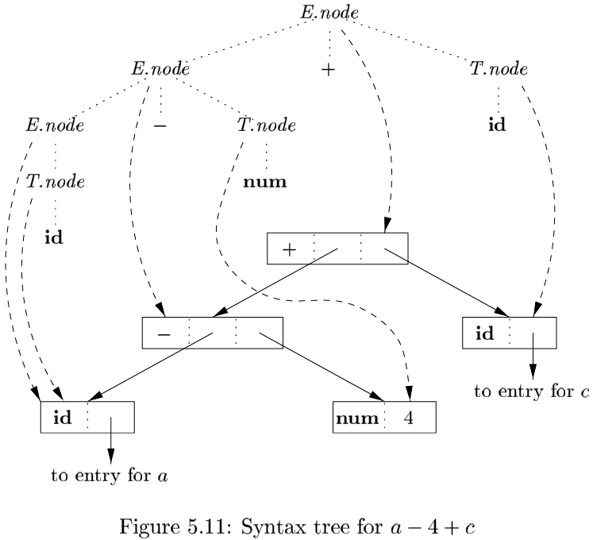

# 第五章 语法制导的翻译

## 5.1 语法制导定义

`语法制导定义（Syntax-Directed Definition, SDD）`是一个上下文无关文法和属性及规则的结合。属性和文法符号相关联，而规则和产生式相关联。

### 5.1.1 继承属性和综合属性

非终结符号的两种属性：

1. 综合属性（synthesized attribute）：在分析树节点$N$上的非终结符号$A$的综合属性是由$N$上的产生式所关联的语义规则来定义的。
2. 继承属性（inherited attribute）：在分析树节点$N$上的非终结符号$B$的继承属性是由$N$的父节点上的产生式所关联的语义规则来定义的。

### 5.1.2 在语法分析树的节点上对SDD求值

一个显示了它的各个属性的值的语法分析树称为注释语法分析树（annotated parse tree）。

### 5.1.3 5.1节的练习

## 5.2 SDD的求值顺序

### 5.2.1 依赖图

依赖图描述了某个语法分析树中的属性实例之间的信息流：

- 对于每个语法分析树的节点，比如一个标号为文法符号$X$的节点，和$X$关联的每个属性都在依赖图中有一个节点。
- 假设和产生式$p$关联的语义规则通过$X.c$的值定义了综合属性$A.b$的值。那么相应的依赖图中有一条从$X.c$到$A.b$的边。更准确地讲，在每个标号为$A$且应用了产生式$p$的节点$N$上，创建一条从该产生式体中的符号$X$的实例所对应的$N$的子节点上的属性$c$到$N$上的属性$b$的边。
- 假设和产生式$p$关联的一个语义规则通过$X.a$的值定义了继承属性$B.c$的值。那么，在相应的依赖图中有一条从$X.a$到$B.c$的边。对于每个标号为$B$，对应于产生式$p$中的这个$B$的节点$N$，创建一条从节点$M$上的属性$a$到$N$上的属性$c$的边。

### 5.2.2 属性求值的顺序

### 5.2.3 S属性的定义

两种类型的SDD：

1. 如果一个SDD的每个属性都是综合属性，它就是$S$属性的。
2. L属性定义（L-attributed definition），每个属性必须要么是：
   - 一个综合属性。
   - 一个继承属性，但是它的规则具有如下限制。假设存在一个产生式$A \rightarrow X_1 X_2 \cdots X_n$，并且有一个通过这个产生式所关联的规则计算得到的继承属性$Xi.a$。那么这个规则只能使用：
     1. 和产生式头$A$关联的继承属性。
     2. 位于$X_i$左边的文法符号实例$X_1, X_2, \cdots, X_{i-1}$相关的继承属性或者综合属性。
     3. 和这个$X_i$的实例本身相关的继承属性或综合属性，但是在由这个$X_i$的全部属性组成的以来图中不存在环。

### 5.2.4 L属性的定义

### 5.2.5 具有受控副作用的语义规则

我们将按照下面的方法之一来控制SDD中的副作用

- 支持那些不会对属性求值产生约束的附带副作用。
- 对允许的求值顺序添加约束，使得以任何允许的顺序求值都会产生相同的翻译结果。

### 5.2.6 5.2节的练习

## 5.3 语法制导翻译的应用

### 5.3.1 抽象语法树的构造

抽象语法树性质：

- 如果节点是一个叶子，那么对象将有一个附加的域来存放这个叶子节点的词法值。构造函数$Leaf(op, val)$创建一个叶子对象。我们也可以把节点看作记录，那么Leaf就会返回一个指向与叶子节点对应的新记录的指针。
- 如果节点是内部节点，那么它的附加字段的个数和该节点的语法树中的子节点个数相同。构造函数Node带有两个和多个参数：$Node(op, c_1, c_2, \cdots, c_k)$，该函数创建一个对象，对一个字段的值为$op$，其余$k$个字段的值为$c_1, \cdots, c_k$。

### 5.3.2 类型的结构

### 5.3.3 5.3节的练习

## 5.4 语法制导的翻译方案

`语法制导的翻译方案（syntax-directed translation scheme, SDT）`是在其产生式体中潜入了程序片段的一个上下文无关文法。这些程序片段为*语义动作*，他们可以出现在产生式体中的任何地方。

### 5.4.1 后缀翻译方案

### 5.4.2 后缀SDT的语法分析栈实现

### 5.4.3 产生式内部带有语义动作的SDT

- 如果语法分析过程是自底向上的，那么我们在$X$的此次出现位于语法分析栈的栈顶时，我们立刻执行动作$a$。
- 如果语法分析过程自顶向下的，那么我们在试图展开$Y$的本次出现（如果$Y$是非终结符号）或者在输入中检测$Y$(如果$Y$是终结符号)之前执行语义动作$a$。

任何SDT都可以按照下列方法实现：

1. 忽略语义动作，对输入进行语法分析，并产生一棵语法分析树。
2. 然后检测每个内部节点$N$，假设它的产生式是$A \rightarrow \alpha$。将$\alpha$中的各个动作当作$N$的附加子节点加入，使得$N$的子节点从左到右和$\alpha$中的符号及动作完全一致。
3. 对这颗语法树进行谦虚遍历，并且当访问到一个以某个动作为标号的节点时立即执行这个动作。

### 5.4.4 从SDT中消除左递归

文法转换保持了由文法生成的符号串中终结符号的顺序。因此，这些动作在任何从左到右的语法分析过程中都按照相同的顺序执行，不管这个分析是自顶向下的还是自底向上的。

### 5.4.5 L属性定义的SDT

将一个$L$属性的SDD转换为一个SDT的规则如下：

1. 把计算某个非终结符号$A$的继承属性的动作插入到产生式体中紧靠在$A$的本次出现之前的位置上。如果$A$的多个继承属性以无环的方式相互依赖，就需要对这些属性的求值动作进行排序，以便先计算需要的属性。
2. 将计算一个产生式头的综合属性的动作放置在这个产生式体的最右端。

### 5.4.6 5.4节的练习

## 5.5 实现L属性的SDD

通过遍历语法分析树来完成翻译工作的几种方法：

1. 建立语法分析树并注释。
2. 构造语法分析树，加入动作，并按照前序顺序执行这些动作。
3. 使用一个递归下降的语法分析器，它为每个非终结符号都建立一个函数。
4. 使用一个递归下降的语法分析器，以边扫描边生成的方式生成代码。
5. 与LL语法分析器结合，实现一个SDT。
6. 与LR语法分析器结合，实现一个SDT。

### 5.5.1 在递归下降语法分析过程中进行翻译

一个递归下降的语法分析器对每个非终结符号$A$都有一个函数$A$。我们可以按照如下方法把这个语法分析器扩展为一个翻译器：

1. 函数$A$的参数是非终结符号$A$的继承属性。
2. 函数$A$的返回值是非终结符号$A$的综合属性的集合。

在函数$A$的函数体中，我们要进行语法分析并处理属性：

1. 决定用哪个产生式来展开$A$。
2. 当需要读入一个终结符号时，在输入中检查这些符号是否出现。
3. 在局部变量中保存所有必要的属性值，这些值将用于计算产生式体中非终结符号的继承属性，或产生式头部的非终结符号的综合属性。
4. 调用对应于被选定产生式体中的非终结符号的函数，向他们提供正确的阐述。

### 5.5.2 边扫描边生成代码

边扫描边生成代码通过执行一个SDT中的语义动作，逐步把各个代码片段添加到一个数组或输出文件中。要保证这项技术能够正确应用，下列要素必不可少：

1. 存在一个（一个或多个非终结符号的）主属性。
2. 主属性是综合属性。
3. 对主属性求值的规则保证：
   - 主属性是将相关产生式体中的非终结符号的主苏醒之连接起来的得到的。
   - 各个非终结符号的主属性值在连接运算中出现的顺序和这些非终结符号在产生式体中的出现顺序相同。

### 5.5.3 L属性的SDD和LL语法分析

我们使用下列两个原则来管理语法分析栈中的属性：

- 非终结符号$A$的继承属性放在表示这个非终结符号的栈记录中。对这些属性求值的代码通常使用紧靠在$A$的栈记录之上的动作记录来表示。
- 非终结符号$A$的综合属性放在一个单独的综合记录中，它在栈中紧靠在$A$的记录之下。

所有的属性拷贝工作能够正确进行的原理是：

- 所有拷贝都发生在对某个非终结符号的一次展开时创建的不同记录之间。因此，这些记录中的每个都知道其他各个记录在栈中离它有多远，因此可以安全地把值写到它下面的记录中。

### 5.5.4 L属性的SDD的自底向上语法分析

### 5.5.5 5.5节的练习

## 5.6 总结

