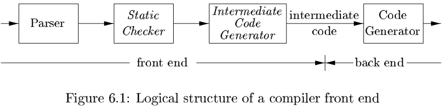
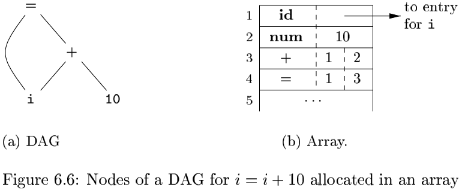

# Chapter 6 Intermediate-Code Generation

[TOC]

## Variants of Syntax Trees

### Directed Acyclic Graphs for Expressions

### The Value-Number Method for Constructing DAG's

**Algorithm 6.3:** The value-number method for constructing the nodes of a DAG.

**INPUT:** Label $op$, node $l$, and node $r$.

**OUTPUT:** The value number of a node in the array with signature $<op, l, r>$.

**METHOD:** Search the array for a node $M$ with label $op$, left child $l$, and right child $r$. If there is such a node, return the value number of $M$. If not, create in the array a new node $N$ with label $op$, left child $l$, and right child $r$, and return its value number.

## Three-Address Code

### Addresses and Instructions

An address can be one of the following:

- A `name`.
- A `constant`.
- A `compiler-generated temporary`.

### Quadruples

A `quadruple` (or just "quad") has four fields, which we call $op$, $arg_1$, $arg_2$, and $result$.

The following are some exceptions to this rule:

1. Instructions with unary operators like $x = minus\ y$ or $x = y$ do not use $arg_2$. Note that for a copy statement like $x = y$, $op$ is $=$, while for most other operations, the assignment operator is implied.
2. Operators like param use neither $arg_2$ nor $result$.
3. COnditional and unconditional jumps put the target label in $result$.

### Triples

A `triple` has only three fields, which we call $op$, $arg_1$, and $arg_2$.

### Static Single-Assignment Form

Static single-assignment form (SSA) is an intermediate representation that facilitates certain code optimizations.

## Types and Declarations

The applications of types can be grouped under checking and translation:

- `Type checking` uses logical rules to reason about the behavior of a program at run time.
- `Translation Applications`. From the type of a name, a compiler can determine the storage that will be needed for that name at run time.

### Type Expressions

Types have structure, which we shall represent using `type expressions`: a type expression is either a basic type or is formed by applying an operator called a `type constructor` to a type expression.

The definition of type expressions:

- A basic type is a type expression.
- A type name is a type expression.
- A type expression can be formed by applying the `array` type constructor to a number and a type expression.
- A record is a data structure with named fields.
- A type expression can be formed by using the type constructor $\rightarrow$ for function types.
- If $s$ and $t$ are type expressions, then their Cartesian product $s \times t$ is a type expression.
- Type expressions may contain variables whose values are type expressions.

### Type Equivalence

When type expressions are represented by graphs, two types are `structurally equivalent` if and only if one of the following conditions is true:

- There are the same basic type.
- They are formed by applying the same constructor to structurally equivalent types.
- One is a type name that denotes the other.

### Sequences of Declarations

### Fields in Records and Classes

$$
T \rightarrow record '\{'D'\}'
$$

The fields in this record type are specified by the sequence of declarations generated by $D$. The approach of Fig. 6.17 can be used to determine the types and relative addresses of fields, provided we are careful about two things:

- The field names within a record must be distinct; that is, a name may appear at most onece in the declarations generated by $D$.
- The offset or relative address for a field name is relative to the data area for that record.

## Translation of Expressions

### Operations Within Expressions

### Incremental Translation

The approach of Fig. 6.20 can also be used to build a syntax tree. The new semantic action for $E \rightarrow E_1 + E_2$ creates a node by using a constructor, as in:
$$
E \rightarrow E_1 + E_2 \{E.addr = new\ Node('+', E_1 \cdot addr, E_2 \cdot addr);\}
$$
, Here, attribute `addr` respresents the address of a node rather than a variable or constant.

### Addressing Array Elements

If the width of each array element is $w$, then the $i$th element of array $A$ begins in location:
$$
base + i \times w \qquad
$$
, where `base` is the relative address of the storage allocated for the array.

The relative address of $A[i_1][i_2]$ can then be calculated by the formula:
$$
base + i_1 \times w_1 + i_2 \times w_2 \qquad
$$
, In $k$ dimensions, the formula is:
$$
base + i_1 \times w_1 + i_2 \times w_2 + \cdots + i_k \times w_k \qquad
$$
, where $w_j$, for $1 \leq j \leq k$, is the generalization of $w_1$ and $w_2$ in $base + i_1 \times w_1 + i_2 \times w_2$.

In two dimensions (i.e., $k = 2$ and $w = w_2$), the location for $A[i_1][i_2]$ is given by:
$$
base + (i_1 \times n_2 + i_2) \times w
$$
, In $k$ dimensions, the following formula calculates the same address as $base + i_1 \times w_1 + i_2 \times w_2 + \cdots + i_k \times w_k$:
$$
base + ((\cdots ((i_1 \times n_2 + i_2) \times n_3 + i_3)\cdots )\times n_k + i_k) \times w
$$
Formula $base + i \times w$ for the address of $A[i]$ is replaced by:
$$
base + (i - low) \times w
$$

### Translation of Array References

Nonterminal $L$ has three synthesized attributes:

1. $L.addr$ denotes a temporary.
2. $L.array$ is a pointer to the symbol-table entry for the array name.
3. $L.type$ is the type of the subarray generated by $L$.

## Type Checking

To do `type checking` a compiler needs to assign a type expression to each component of the source program. The compiler must then determine that these type expressions conform to a collection of logical rules that is called the `type system` for the soruce language.

### Rules fot Type Checking

Type checking can take on two forms:

- `Type synthesis` builds up the type of an expression from the types of its subexpressions.

  A typical rule for type synthesis has the form:
  $$
  \text{if } f \text{ has type } s \rightarrow t \text{ and } x \text{ has type } s, \\
  \text{then expression } f(x) \text{ has type } t
  $$

- `Type inference` determines the type of a language construct from the way it is used.

  A typical rule for type inference has the form:
  $$
  \text{if } f(x) \text{ is an expression,} \\
  \text{then for some } \alpha \text{ and } \beta, f \text{ has type } \alpha \rightarrow \beta \text{ and } x \text{ has type } \alpha
  $$

### Type Conversions

Conversion is said to be `explicit` if the programmer must write something to cause the conversion. Explicit conversions are also called `casts`.

### Overloading of Functions and Operators

The following is a type-synthesis rule for overloaded functions:
$$
\text{if f can have type} s_i \rightarrow t_i, \text{ for } 1 \leq i \leq n, \text{ where } s_i \neq s_j \text{ for } i \neq j \\
\text{and } x \text{ has type } s_k, \text{ for some } 1 \leq k \leq n \\
\text{then expression f(x) has type } t_k
$$

### Type Inference and Polymorphic Functions

The term "polymorphic" refers to any code fragment that can be executed with arguments of different types.

Using the symbol $\forall$ (read as "for any type") and the type constructor `list`, the type of `lenght` can be written as:
$$
\forall \alpha . list(\alpha) \rightarrow integer
$$
, The $\forall$ symbol is the `universal quantifier`, and the type variable to which it is applied is said to be `bound` by it.

**Algorithm 6.16:** Type inference for polymorphic functions.

**INPUT:** A program consisting of a sequence of function definitions followed by an expression to be evaluated. An expression is made up of function applications and names, where names can have predefined polymorphic types.

**OUTPUT:** Inferred types for the names in the program.

**METHOD:** For simplicity, we shall deal with unary functions only. The type of a function $f(x_1, x_2)$ with two parameters can be represented by a type expression $s_1 \times s_2 \rightarrow t$, where $s_1$ and $s_2$ are the types of $x_1$ and $x_2$, respectively, and $t$ is the type of the result $f(x_1, x_2)$. An expression $f(a, b)$ can be checked by matching the type of $a$ with $s_1$ and the type of $b$ with $s_2$.

### An Algorithm for Unification

**Algorithm 6.19:** Unification of a pair of nodes in a type graph.

**INPUT:** A graph representing a type and a pair of nodes $m$ and $n$ to be unified.

**OUTPUT:** Boolean value true if the expressions represented by the nodes $m$ and $n$ unify; false, otherwise.

**METHOD:** A node is implemented by a record with fields for a binary operator and pointers to the left and right children. The sets of equivalent nodes are maintained using the `set` field. One node in each equivalence class is chosen to be the unique representative of the equivalence class by making its `set` field contain a null pointer. The `set` field of the remaining nodes in the equivalence class will point (possibly indirectly through other nodes in the set) to the representative. Initially, each node $n$ is in an equivalence class by itself, with $n$ as its own representative node.

The substitution of an expression for a variable is implemented by adding the leaf for the variable to the equivalence class containing the node for that expression.

## Control Flow

In programming languages, boolean expressions are often used to:

1. Alter the flow of control.
2. Compute logical values.

### Boolean Expressions

The semantic definition of the programming language determines whether all parts of a boolean expression must be evaluated. If the language definition permits (or reuires) portions of a boolean expression to go unevaluated, then the compiler can optimize the evaluation of boolean expressions by computing only enough of an expression to determine its value.

### Short-Circuit Code

In `short-circuit (or jumping)` code, the boolean operators $\&\&, ||\ and\ !$ translate into jumps. The operators themselves do not appear in the code; instead, the value of a boolean expression is represented by a position in the code sequence.

### Flow-of-control Statements

The translation of boolean expressions into three-address code in the context of statements such as those generated by the following grammar:
$$
\begin{align}
&S \rightarrow if(B)\ S_1 \\
&S \rightarrow if(b)\ S_1\ else\ S_2 \\
&S \rightarrow while(B)\ S_1
\end{align}
$$
, In these productions, nonterminal B represents a boolean expression and nonterminal $S$ represents a statement.

### Control-Flow Translation of Boolean Expressions

### Boolean Values and Jumping Code

A clean way of handling both roles of boolea expressions is to first build a syntax tree for expressions, using either of the following approaches:

1. Use two passes.
2. Use one pass for statements, but two passes for expressions.

## Backpatching

### One-Pass Code Generation Using Backpatching

For specificity, we generate instructions into an instruction array, and labels will be indices into this array. To manipulate lists of jumps, we use three functions:

1. $makelist(i)$ creates a new list containing only $i$, an index into the array of instructions; $makelist$ returns a pointer to the newly created list.
2. $merge(p_1, p_2)$ concatenates the lists pointed to by $p_1$ and $p_2$, and returns a pointer to the concatenated list.
3. $backpath(p, i)$ inserts $i$ as the target label for each of the instructions on the list pointed to by $p$.

### Backpatching for Boolean Expressions

$$
B \rightarrow B_1 || M\ B_2 | B_1 \&\& M\ B_2 | !B_1|(B_1)|E_1\ rel\ E_2|true|false \\
M \rightarrow \epsilon
$$

### Flow-of-Control Statements

## Switch-Statements

### Translation of Switch-Statements

The intended translation of a switch is code to:

1. Evaluate the expression $E$.
2. Find the value $V_j$ in the list of cases that is the same as the value of the expression. Recall that the default value matches the expression if non of the values explicitly mentioned in cases does.
3. Execute the statement $S_j$ associated with the value found.

### Syntax-Directed Translation of Switch-Statements

