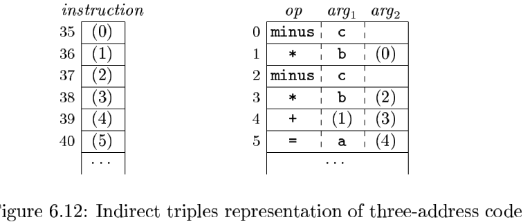
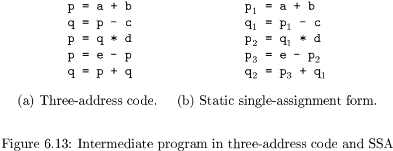
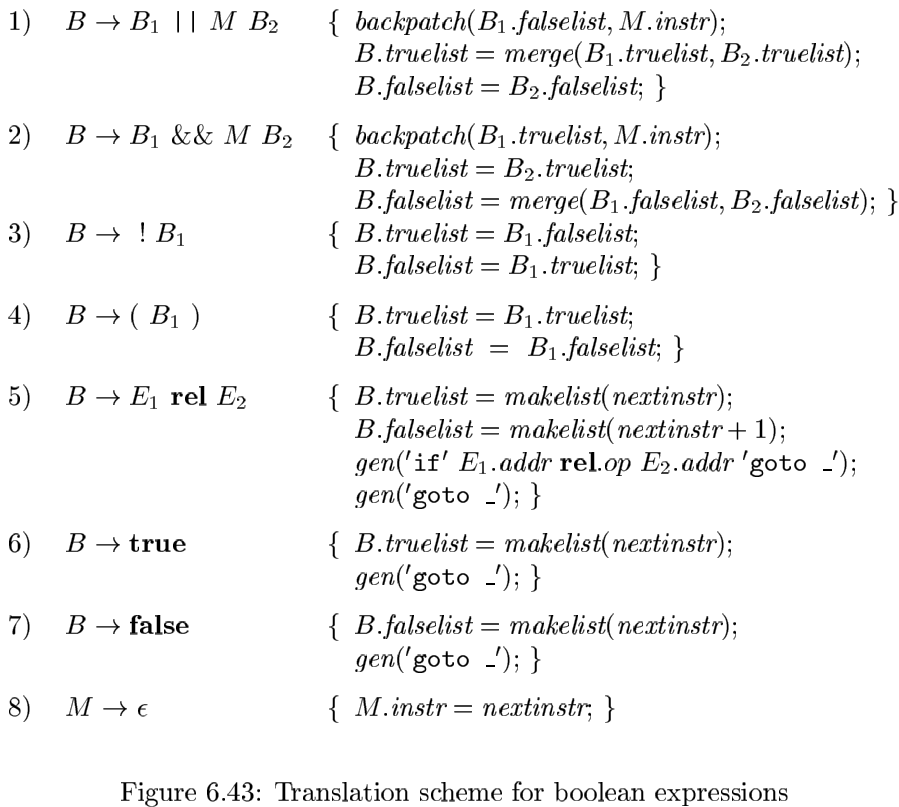
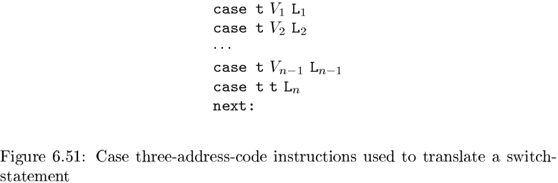

# 第六章 中间代码生成

## 6.1 语法树的变体

### 6.1.1 表达式的有向无环图

### 6.1.2 构造DAG的值编码方法

语法树或DAG图中的节点通常存放在一个记录数组中，如下图所示：

**算法 6.3** 构造DAG的节点的值编码方法。

输入：标号$op$，节点$l$和节点$r$。

输出：数组中具有三元组$<op, l, r>$形式的节点的值编码。

方法：在数组中搜索标号为$op$，左子节点为$l$且右子节点为$r$的节点$M$。如果存在这样的节点，则返回$M$节点的值编码。若不存在这样的节点，则在数组中添加一个节点$N$，其标号为$op$，左右子节点分别为$l$和$r$，返回新建节点对应的值编码。

### 6.1.3 6.1节的练习

## 6.2 三地址代码

### 6.2.1 地址和指令

地址可以具有如下形式之一：

- 名字。
- 常量。
- 编译器生成的临时变量。

### 6.2.2 四元式表示

一个四元式（quadruple）有以下字段：

- $op$
- $arg1$
- $arg2$
- $result$

下面是这个规则的一些特例：

1. 形如$x = minus\ y$的单目运算符指令和赋值指令$x = y$不使用$arg2$。注意，对于像$x = y$这样的赋值语句，$op$是$=$，而对大部分其他运算而言，赋值运算符是隐含表示的。
2. 像param这样的运算既不使用$arg2$，也不使用$result$。
3. 条件或非条件转移指令将目标标号放入$result$字段。

### 6.2.3 三元式表示

一个三元式（triple）有以下字段：

- $op$
- $arg1$
- $args$

### 6.2.4 静态单赋值形式

静态单赋值形式（SSA）是另一种中间表示形式，它有利于实现某些类型的带啊吗优化。

### 6.3 类型和声明

可以把类型的应用划分为类型检查和翻译：

- 类型检查（type checking）：类型检查利用一组逻辑规则来推理一个程序在运行时刻的行为。
- 翻译时的应用（translation application）：根据一个名字的类型，编译器可以确定这个名字在运行时刻需要多大的存储空间。

### 6.3.1 类型表达式

类型表达式（type expression）：用于表示类型自身结构。

使用如下类型表达式的定义：

- 基本类型是一个类型表达式。
- 类名是一个类型表达式。
- 将类型构造算子array作用于一个数字和一个类型表达式可以得到一个类型表达式。
- 一个记录是包含有名字段的数据结构。
- 使用类型构造算子$\rightarrow$可以构造得到函数类型的类型表达式。
- 如果$s$和$t$是类型表达式，则其笛卡尔积$s \times t$也是类型表达式。
- 类型表达式可以包含取值为类型表达式的变量。

### 6.3.2 类型等价

当用图来表示类型表达式的时候，两种类型之间`结构等价（structurally equivalent）`当且仅当下面的某个条件为真：

- 它们是相同的基本类型。
- 它们是将相同的类型构造算子应用于结构等价的类型而构造得到。
- 一个类型是另一个类型表达式的名字。

### 6.3.3 声明

### 6.3.4 局部变量名的存储布局

### 6.3.5 声明的序列

$$
P \rightarrow \{offset = 0; \}D \qquad (6.1)
$$

使用标记非终结符号$M$，上述公式可以被改写为：
$$
P \rightarrow M\ D \\
M \rightarrow \epsilon \{offset = 0;\}
$$

### 6.3.6 记录和类中的字段

$$
T \rightarrow record '\{'D'\}'
$$

这个记录类型中的字段由$D$生成的声明序列描述，我们需要小心处理下面两件事：

- 一个记录中各个字段的名字必须是互不相同的。也就是说，在由$D$生成的声明中，同一个名字最多出现一次。
- 字段名的偏移量，或者说相对地址，是相对于该记录的数据区字段而言的。

### 6.3.7 6.3 节的练习

## 6.4 表达式的翻译

### 6.4.2 增量翻译

上图的方法也可以用来构造语法树，对应于$E \rightarrow E_1 + E_2$的语义动作使用构造算子生成新的节点。规则如下：
$$
E \rightarrow E_1 + E_2 \{E.addr = new\ Node('+', E_1 \cdot addr, E_2 \cdot addr);\}
$$
属性addr表示的是一个节点的地址，而不是某个变量或常量。

### 6.4.3 数组元素的寻址

假设每个数组元素的宽度是$w$，那么数组$A$的第$i$个元素的开始地址为：
$$
base + i \times w \qquad (6.2)
$$
其中$base$是分配给数组$A$的内存块的相对地址。

在二维数组中，$A[i_1][i_2]$的相对地址可以使用下面的公式计算：
$$
base + i_1 \times w_1 + i_2 \times w_2 \qquad (6.3)
$$
对于$k$维数组，相应的公式为：
$$
base + i_1 \times w_1 + i_2 \times w_2 + \cdots + i_k \times w_k \qquad (6.4)
$$
其中，$w_j(1 \leqslant j \leqslant k)$是对公式（6.3）中的$w_1$和$w_2$的推广。

在二维数组中$(k = 2, w = w_2)$，$A[i_1][i_2]$的另一种地址计算公式为：
$$
base + (i_1 \times n_2 + i_2) \times w \qquad (6.5)
$$
对于$k$维数组，下列公式计算得到的地址和公式（6.4）所得到的地址相同：
$$
base + ((\cdots ((i_1 \times n_2 + i_2) \times n_3 + i_3)\cdots )\times n_k + i_k) \times w \qquad (6.6)
$$
得到计算$A[i]$的地址的公式（6.2）就变成：
$$
base + (i - low) \times w \qquad (6.7)
$$

### 6.4.4 数组引用的翻译

非终结符号$L$有三个综合属性：

1. $L.addr$指示一个临时变量。
2. $L.array$是一个指向数组名字对应的符号表条目的指针。
3. $L.type$是$L$生成的子数组的类型。

### 6.4.5 6.4节的练习

## 6.5 类型检查

为了进行`类型检查（type checking）`，编译器需要给源程序的每个组成部分赋予一个类型表达式。然后，编译器要确定这些类型表达式是否满足一组逻辑规则。这些规则称为源语言的`类型系统（type system）`。

### 6.5.1 类型检查规则

类型检查有两种形式：

- 类型综合（type synthesis）：根据子表达式的类型构造出表达式的类型。

  一个典型的类型综合规则具有如下形式：
  $$
  if &f的类型为s \rightarrow t 且 x 的类型为s \\
  then &表达式f(x)的类型为t \qquad (6.8) 
  $$
  

- 类型推导（type inference）：根据一个语言结构的使用方式来确定该结构的类型。

  一个典型的类型推导规则具有下面的形式：
  $$
  \begin{align}
  &if &f(x)是一个表达式 \\
  &then &对某些\alpha和\beta, f的类型为\alpha \rightarrow \beta 且x的类型为\alpha
  \end{align}
  $$

### 6.5.2 类型转换

如果类型转换由编译器自动完成，那么这样的转换就称为`隐式转换`，也叫做`自动类型转换（coercion）`。

### 6.5.3 函数和运算符的重载

以下是针对重载函数的类型综合规则：
$$
\begin{align}
&if\ f可能的类型为s_i \rightarrow t_i (1 \leqslant i \leqslant n)，其中，s_i \neq s_j(i \neq j) \\
&and\ x的类型为s_k(1 \leqslant k \leqslant n) \qquad (6.10) \\
&then\ 表达式f(x)的类型为t_k \\
\end{align}
$$

### 6.5.4 类型推导和多态函数

术语“多态”指的是任何可以在不同的参数类型上运行的代码片段。

使用符号$\forall$（读作“对于任意类型”）以及类型构造算子$list$，$length$的类型可以写作：
$$
\forall \alpha . list(\alpha) \rightarrow integer \qquad (6.12)
$$
符号$\forall$是全称量词（wiversal quantifier），它所作用的类型变量称为`受限的（bound）`。

**算法 6.16** 多态函数的类型推导。

输入：一个由一系列函数定义以及紧跟其后的待求值表达式组成的程序。一个表达式由多个函数应用和名字构成。这些名字具有预定义的多态类型。

输出：推导出的程序中名字的类型。

方法：为简单起见，我们只考虑一元函数。对于带有两个参数的函数$f(x_1, x_2)$，我们可以将其类型表示为$s_1 \times s_2 \rightarrow t$，其中$s_1$和$s_2$分别是$x_1$和$x_2$的类型，而$t$是函数$f(x_1, x_2)$的结果类型。通过检查$s_1$是否和$a$的类型匹配，$s_2$是否和$b$的类型匹配，就可以检查表达式$f(a, b)$的类型。

### 6.5.5 一个合一算法

**算法 6.19** 类型图中的一对节点的合一处理。

输入：一个表示类型的图，以及需要进行合一处理的节点对$m$和$n$。

输出：如果节点$m$和$n$表示的表达式可以合一，返回布尔值true。反之，返回false。

方法：节点用一个记录实现，记录中的字段用于存放一个二元运算符和分别指向其左右子节点的指针。字段$set$用于保存等价节点的集合。每个等价类都有一个节点被选作这个类的唯一代表，它的set字段包含一个空指针。等价类中其他节点的set字段（可能通过该集合中的其他节点间接地）指向该等价类的代表节点。在初始时刻，每个节点$n$自身组成一个等价类，$n$是它自己的代表节点。

上述合一算法在节点上进行如下两种操作：

- $find(n)$ 返回当前包含节点$n$的等价类的代表节点。
- $union(m, n)$将包含节点$m$和$n$的等价类合并。

将一个变量置换为一个表达式的实现方法如下：把代表该变量的叶子节点加入到代表该表达式的节点所在的等价类中。

### 6.5.6 6.5 节的练习

## 6.6 控制流

布尔表达式经常用来：

1. 改变控制流。
2. 计算逻辑值。

### 6.6.1 布尔表达式

程序设计语言的语义定义决定了是否需要对一个布尔表达式的各个部分都进行求值。如果语言的定义允许（或要求）不对布尔表达式的某个部分求值，那么编译器就可以优化布尔表达式的求值过程，只要已经求值的部分足以确定整个表达式值就可以了。

### 6.6.2 短路代码

在短路（跳转）代码中，布尔运算符$\&\&, || 和 !$被翻译成跳转指令。运算符本省不出现在代码中，布尔表达式的值是通过代码序列中的位置来表示的。

例，$if(x < 100\ ||\ x > 200\ \&\&\ x!= y)x=0;$可以被翻译成下图所示的代码：

### 6.6.3 控制流语句

按下列文法生成的语句的上下文中（$B$表示一个布尔表达式，$S$表示一个语句），把布尔表达式翻译成三地址代码：
$$
\begin{align}
&S \rightarrow if(B)\ S_1 \\
&S \rightarrow if(b)\ S_1\ else\ S_2 \\
&S \rightarrow while(B)\ S_1
\end{align}
$$

### 6.6.4 布尔表达式的控制流翻译

### 6.6.5 避免生成冗余的goto指令

### 6.6.6 布尔值和跳转代码

处理布尔表达式的这两种角色的一种简单思路是首先建立表达式的抽象语法树，可以使用下面的两种方法之一：

1. 使用两趟处理的方法。
2. 对语句进行一趟处理，但对表达式进行两趟处理。

### 6.6.7 6.6节的练习

## 6.7 回填

### 6.7.1 使用回填技术的一趟式目标代码生成

我们将生成的指令放入一个指令数组中，而标号就是这个数组的下标。为了处理跳转指令的列表，我们使用下面的三个函数：

- $makelist(i)$创建一个只包含$i$的列表。这里$i$是指令数组的下标。函数$makelist$返回一个指向新创建的列表的指针。
- $merge(p_1, p_2)$将$p_1$和$p_2$指向的列表进行合并，它返回的指针指向合并后的列表。
- $backpath(p, i)$将$i$作为目标标号插入到$p$所指列表中的各指令中。

### 6.7.2 布尔表达式的回填

$$
B \rightarrow B_1 || M\ B_2 | B_1 \&\& M\ B_2 | !B_1|(B_1)|E_1\ rel\ E_2|true|false \\
M \rightarrow \epsilon
$$

### 6.7.3 控制转移语句

### 6.7.4 break语句,continue语句与goto语句

### 6.7.5 6.7节的练习

## 6.8 switch语句

### 6.8.1 switch语句的翻译

一个switch语句的预期翻译结果是完成如下工作的代码：

1. 计算表达式$E$的值。
2. 在case列表中寻找与表达式值相同的值$V_j$。
3. 执行和匹配值关联的语句$S_j$。

### 6.8.2 switch语句的语法制导翻译

### 6.8.3 6.8 节的练习

## 6.9 过程的中间代码

- 函数类型；
- 符号表；
- 类型检查；
- 函数调用。

## 6.10 总结

## 6.11 第六章参考文献

