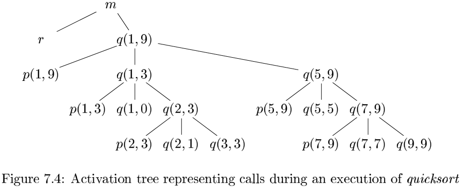
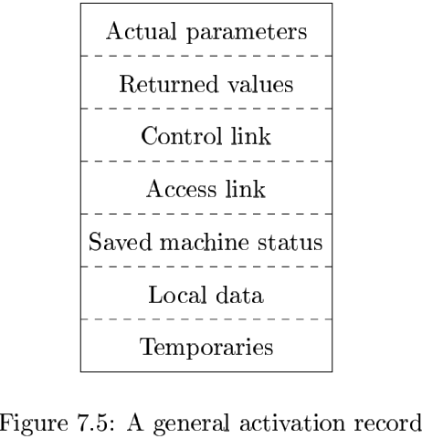
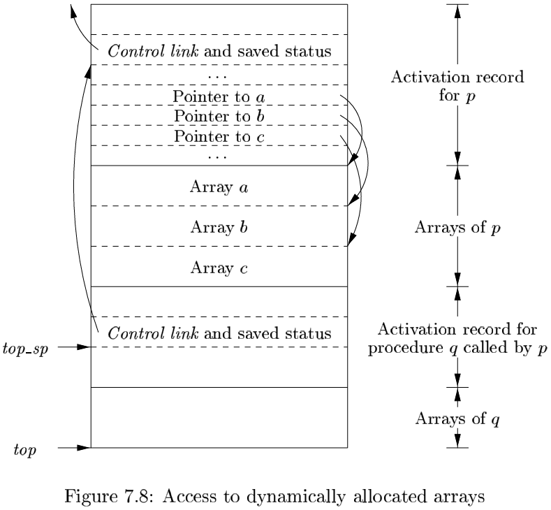
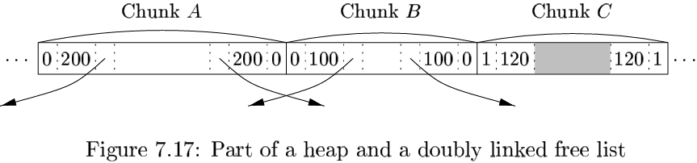
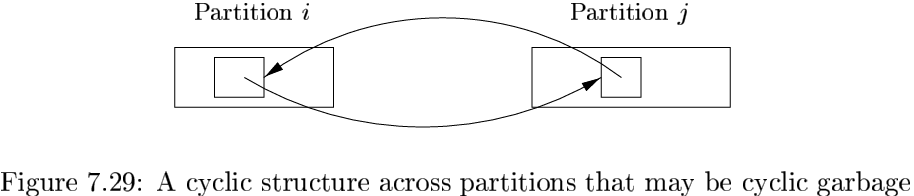

# 第七章 运行时刻环境

## 7.1 存储组织

喝多编译器使用下列的两种策略的某种组合进行动态存储分配：

1. 栈式存储。
2. 堆存储。

## 7.2 空间的栈式分配

### 7.2.1 活动树

假如过程调用（或者说过程的活动）在时间上不是嵌套的，那么栈式分配就不可行了。

我们可以用一棵树来表示在整个程序运行期间的所有过程的活动，这棵树称为活动树（activation tree）。树中的每个节点对应于一个活动，根节点是启动程序执行的main过程的活动。

### 7.2.2 活动记录

过程调用和返回通常由一个称为控制栈（control stack）的运行时刻栈进行管理。每个活跃的活动都有一个位于这个控制栈中的活动记录（activation record，有时也称为帧（frame））。

- 临时值。
- 对应于这个活动记录的过程的局部数据。
- 保存的机器状态，其中包括对此过程的此次调用之前的机器状态信息。
- 一个“访问链”。
- 一个控制链（control link），指向调用者的活动记录。
- 当被调用函数有返回值时，要有一个用于存放这个返回值的空间。
- 调用过程使用的实在参数（actual parameter）。

### 7.2.3 调用代码序列

`调用代码序列（calling sequence）`为一个活动记录在栈中分配空间，并在此记录的字段中填写信息。

`返回代码序列（return sequence）` 是一段类似的代码，它恢复机器状态，使得调用过程能够在调用结束之后继续执行。

在设计调用代码序列和活动记录的布局时，可以使用下列的设计原则：

1. 在调用者和被调用者之间传递的值一般被放在被调用者的活动记录的开始位置，因此它们尽可能地靠近调用者的活动记录。
2. 固定长度的项被放置在中间位置。
3. 那些在早期不知道大小的项将被放置在活动记录的尾部。
4. 我们必须小心地确定栈顶指针所指的位置。

### 7.2.4 栈中的变长数据

### 7.2.5 7.2节的练习

## 7.3 栈中非局部数据的访问

### 7.3.1 没有嵌套过程时的数据访问

对于不允许声明嵌套过程的语言而言，变量的存储分配和访问这些变量是比较简单的：

1. 全局变量被分配在静态区。
2. 其他变量一定是栈顶活动的局部变量。

### 7.3.2 和嵌套过程相关的问题

### 7.3.3 一个支持嵌套过程声明的语言

### 7.3.4 嵌套深度

`嵌套深度（nesting depth）`：如果一个过程$p$在一个嵌套深度为$i$的过程中定义，那么我们设定$p$的嵌套深度为$i+1$。

### 7.3.5 访问链

针对嵌套函数的通常的静态作用域规则的一个直接实现方法是在每个活动记录中增加一个`访问链（access link）`指针。访问链形成了一条链路，它从栈顶活动记录开始，经过嵌套深度逐步递减的活动的序列。沿着这条链路找到的活动就是其数据和对应过程可以被当前正在运行的过程访问的所有活动。

### 7.3.6 处理访问链

### 7.3.7 过程型参数的访问链

### 7.3.8 显示表

### 7.3.9 7.3节的练习

## 7.4 堆管理

### 7.4.1 存储管理器

存储管理器总是跟踪堆区中的空闲空间。它具有两个基本功能：

- 分配。
- 回收。

下面是我们期望存储管理器具有的特性：

- 空间效率。
- 程序效率。
- 低开销

### 7.4.2 一台计算机的存储层次结构

数据以连续存储块的方式进行传输。在主存和告诉缓存之间的数据是按照被称为`高速缓存栈（cache line）`的块进行传输的。

### 7.4.3 程序中的局部性

如果一个程序访问的存储位置很可能将在一个很短的时间段内被再次访问，我们就说这个程序具有`时间局限性（temporal locality）`。

如果被访问过的存储位置的临近位置很可能在一个很短的时间段内被访问，我们就说这个程序具有`空间局部性（spatial locality）`。

通常认为程序把90%的时间用来执行10%的代码。原因如下：

- 程序经常包含很多从来不会被执行的指令。
- 在程序的一次典型运行中，可能被调用的代码中只有一小部分会被实际执行。
- 通常的程序往往将大部分时间花费在执行过程中的最内层循环和最紧凑的递归环上。

### 7.4.4 碎片整理

有两种数据结构可以用于支持相邻空闲块的接合：

- 边界标记。
- 一个双重链接的，嵌入式的空闲列表。

### 7.4.5 人工回收请求

编程规范和工具：

- 当一个对象的声明周期能够被静态推导出来时，`对象所有者（object ownership）`的概念是很有用的。
- 当一个对象的生命周期需要动态确定是，`引用计数（reference counting）`会有所帮助。
- 对于其生命周期局限于计算过程中的某个特定阶段的一组对象，可以使用`基于区域的分配（region-based allocation）`方法。

### 7.4.6 7.4 节的练习

## 7.5 垃圾回收概述

### 7.5.1 垃圾回收器的设计目标

垃圾回收器的性能度量标准：

- 总体运行时间。
- 空间使用。
- 停顿时间。
- 程序局部性。

### 7.5.2 可达性

我们把所有不需要对任何指针解引用就可以被程序直接访问的数据称为`根集（root set）`。

为了使垃圾回收器能够找到正确的根集，优化编译器可以做如下的处理：

- 编译器可以限制垃圾回收机制只能在程序中的某些代码点上被激活。
- 编译器可以写出一些信息供垃圾回收器恢复所有的引用。
- 编译器可以确保当垃圾回收器被激活时每个可达对象都有一个引用指向它的基地址。

一个mutator改变可达对象集合的四种基本操作：

- 对象分配。
- 参数传递和返回值。
- 引用赋值。
- 过程返回。

### 7.5.3 引用计数垃圾回收器

引用计数可以按照下面的方法进行维护：

1. 对象分配。
2. 参数传递。
3. 引用赋值。
4. 过程返回。
5. 可达性的传递丢失。

引用计数有两个主要的缺点：它不能回收不可达的循环数据结构，并且它的开销较大。

### 7.5.4 7.5 节的练习

## 7.6 基于跟踪的回收的介绍

### 7.6.1 基本的标记-清扫式回收器

**算法 7.12** 标记-清扫式垃圾回收。

输入：一个由对象组成的根集，一个堆和一个被称为Free的包含了堆中所有未分配存储块的空闲空间列表（free list）。

输出：在删除了所有垃圾之后的经过修改的Free列表。

方法：

### 7.6.2 基本抽象

所有基于跟踪的算法都计算可达对象集合，然后取这个集合的补集。因此，内存是按照下列方式循环使用的：

1. 程序（或者说增变者）运行并发出分配请求。
2. 垃圾回收器通过跟踪揭示可达性。
3. 垃圾回收器收回不可达对象的存储空间。

虽然不同的基于跟踪的算法可能在实现方法上有所不同，但是它们都可以通过下列状态进行描述：

- 空闲的。
- 未被访问的。
- 待扫描的。
- 已扫描的。

### 7.6.3 标记-清扫式算法的优化

**算法 7.14** Baker的标记-清扫式回收器。

输入：一个由对象组成的根集，一个堆区，一个空闲列表Free，一个名为Unreached的已分配对象的列表。

输出：经过修改的Free列表和Unreached列表。Unreached列表保存了被分配的对象。

方法：

### 7.6.4 标记并压缩的垃圾回收器

**算法 7.15** 一个标记并压缩的垃圾回收器。

输入：一个由对象组成的根集，一个堆，以及一个标记空闲空间的起始位置的指针free。

输出：指针free的新值。

方法：

### 7.6.5 拷贝回收器

**算法 7.16** Cheney的拷贝回收器。

输入：一个由对象组成的根集，一个包含了From半空间和To半空间的堆区，其中From半空间包含了已分配对象，To半空间全部是空闲的。

输出：最后，To半空间保存已分配的对象。free指针指明了To半空间中剩余空闲空间的开始位置。From半空间此时全部空闲。

方法：Cheney算法在From半空间中找出可达对象，并且访问到它们时立刻把它们拷贝到To半空间。这种放置方法将相关对象放在一起，从而提高空间局部性。

### 7.6.6 开销的比较

算法的运行时间开销总结：

- 基本的标记-清扫式算法：与堆区中存储块的数目成正比。
- Baker的标记-清扫式算法：与可达对象的数目成正比。
- 基本的标记并压缩算法：与堆区中存储块的数目和可达对象的总大小成正比。
- Cheney的拷贝回收器：与可达对象的总大小成正比。

### 7.6.7 7.6节的练习

## 7.7 短停顿垃圾回收

### 7.7.1 增量式垃圾回收

### 7.7.2 增量式可达性分析

### 7.7.3 部分回收概述

### 7.7.4 世代垃圾回收

### 7.7.5 列车算法

### 7.7.6 7.7节的练习

## 7.8 垃圾回收中的高级论题

### 7.8.1 并行和并发垃圾回收

如果一个垃圾回收器使用多个线程，我们就称其为`并行的（parallel）`。如果回收器和增变者同时运行，就说它是`并发的（concurrent）`。

一个增量式分析完成下列三个步骤：

1. 找到根集。
2. 增变者的执行和对可达对象的跟踪交替进行。
3. 再次暂停增变者的运行，重新扫描所有可能保存了指向未被访问对象的引用的卡片。

下面给出一个并行，并发垃圾回收算法的大概描述：

1. 扫描每个增变者线程的根集，将所有可以从根集中直接到达的对象设为待扫描状态。
2. 扫描处于待扫描状态的对象。
3. 扫描脏卡片中的对象。
4. 最后一步保证所有的可达对象都标记为已被访问的。

### 7.8.2 部分对象重新定位

### 7.8.3 类型不安全的语言的保守垃圾回收

### 7.8.4 弱引用

### 7.8.5 7.8节的练习

## 7.9 总结

## 7.10 第七章参考文献

