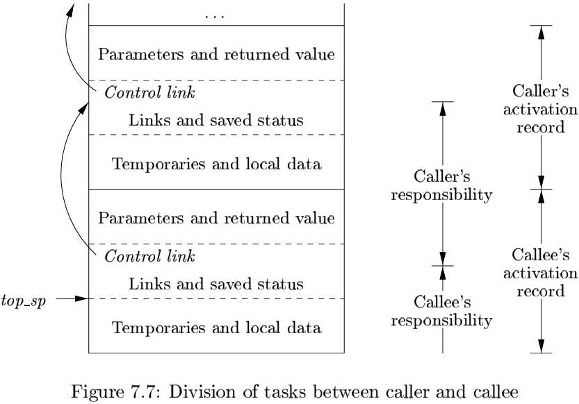
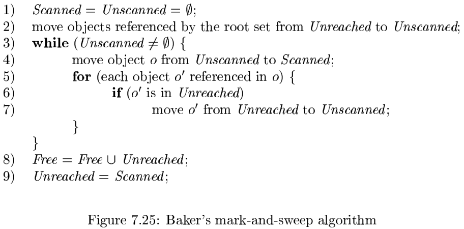
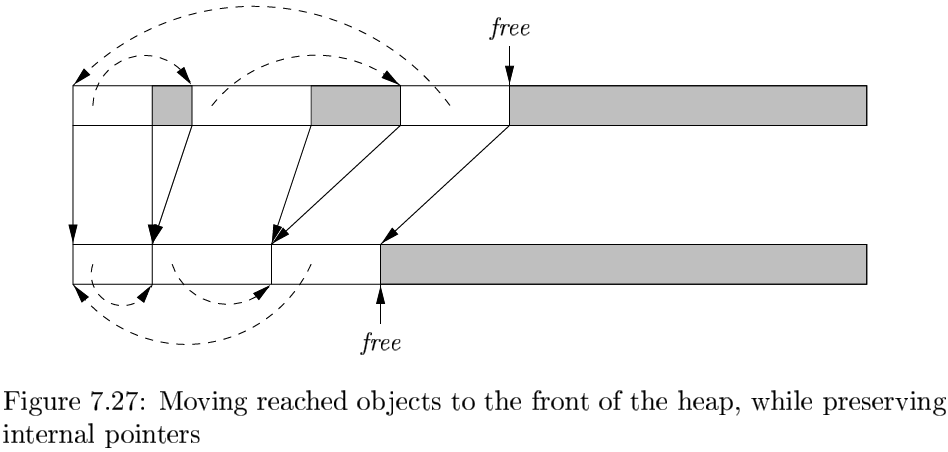

# Chapter 7 Run-Time Environments

[TOC]

## Storage Organization

## Stack  Allocation of Space

### Activation Trees

We therefore can represent the activations of procedures during the running of an entire program by a tree, called an `activation tree`. Each node corresponds to one activation, and the root is the activation of the "main" procedure that initiates execution of the program.

### Activation Records

Procedure calls and returns are usually managed by a run-time stack called the `control stack`. Each live activation has an `activation record` (sometimes called a `frame`) on the control stack, with the root of the activation tree at the bottom, and the entire sequence of activation records on the stack corresponding to the path in the activation tree to the activation where control currently resides.

The contents of activation records vary with the language being implemented. Here is a list of the kinds of data that might appear in an activation record:

1. Temporary values, such as those arising from the evaluation of expressions, in cases where those temporaries cannot be held in registers.
2. Local data belonging to the procedure whose activation record this is.
3. A saved machine status, with inforation about the state of the machine just before the call to the procedure.
4. An "access link" may be needed to locate data needed by the called procedure but found elsewhwere, e.g., in another activation record.
5. A `control link`, pointing to the activation record of the caller.
6. Space for the return value of the called function, if any.
7. The actual parameters used by the calling procedure.

### Calling Sequences

`calling sequences`, which consists of code that allocates an activation record on the stack and enters information into its fields. 

A `return sequence` is similar code to restore the state of the machine so the calling procedure can continue its execution after the call.

When designing calling sequences and the layout of activation records, the following principles are helpful:

1. Values communicated between caller and callee are generally placed at the beginning of the callee's activation record, so they are as close as possible to the caller's activation record.
2. Fixed-length items are generally placed in the middle.
3. Items whose size may not be known early enough are placed at the end of the activation record.
4. We must locate the top-of-stack pointer judiciously.

### Variable-Length Data on the Stack

## Access to Nonlocal Data on the Stack

### Data Access Without Nested Procedures

For languages that do not allow nested procedure declarations, allocation of storage for variables and access to those variables is simple:

1. Global variables are allocated static storage.
2. Any other name must be local to the activation at the top of the stack.

### Nesting Depth

`nesting depth`: if a procedure $p$ is defined immediately within a procedure at nesting depth $i$, then give $p$ the nesting depth $i + 1$.

### Access Links

A direct implementation of the normal static scope rule for nested functions is obtained by adding a pointer called the `access link` to each activation record. Access links form a chain from the activation record at the top of the stack to a sequence of activations at progressively lower nesting depths. Along this chain are all the activations whose data and procedures are accessible to the currently executing procedure.

### Access Links for Procedure Parameters

### Displays

## Heap Management

### The Memory Manager

The memory manager keeps track of all the free space in heap storage at all times. It performs two basic functions:

- Allocation.
- Deallocation.

Here are the properties we desire of memory managers:

- Space Efficiency.
- Program Efficiency.
- Low Overhead.

### The Memory Hierarchy of a Computer

Data is transferred as blocks of contiguous storage. To amortize the cost of access, larger blocks are used with the slower levels of the hierarchy. Between main memory and cache, data is transferred in blocks known as `cache lines`, which are typically from 32 to 256 bytes long. Between virtual memory (disk) and main memory, data is transferred in blocks known as `pages`, typically between 4K and 6K bytes in size.

### Locality in Programs

We say that a program has `temporal locality` if the memory locations it accesses re likely to be accessed again within a short period of time.

We say that a progra has `spatial locality` if memory locations close to the location accessed are likely also to be accessed within a short period of time.

The converntional wisdom is that programs spend 90% of their time executing 10% of the code. Here is why:

- Programs often contain many instructions that are never executed.
- Only a small fraction of the code that could be invoked is actually executed in a typical run of the program.
- The typical program spends most of its time executing innermost loops and tight recursive cycles in a program.

### Reducing Fragmentation

There are two data structures that are useful to support coalescing of adjacent free blocks:

- Boundary Tags.
- A Doubly Linked, Embedded Free List.

### Manual Deallocation Requests

A few of the most popular conventions and tools that have been developed to help programmers cope with the complexity in managing memory:

- `Object ownership` is useful when an objet's lifetime can be statically reasoned about.
- `Reference counting` is useful when an object's lifetime needs to be determined dynamically.
- `Region-based allocation` is useful for collections of objects whose lifetimes are tied to specific phases in a computation.

## Introduction to Garbage Collection

### Design Goals for Garbage Collectors

Enumerate the performance metrics that must be considered when designing a garbage collector:

- Overall Execution Time.
- Space Usage.
- Pause Time.
- Program Locality.

### Reachability

We refer to all the data that can ben accessed directly by a program, without having to dereference any pointer, as the `root set`.

Here are some things an optimizing compiler can do to enable the garbage collector to find the correct root set:

- The compiler can restrict the invocation of garbage collection to only certain code points in the program, when no "hidden" references exist.
- The compiler can write out information that the garbage collector can use to recover all the references, such as specifying which registers contin references, or how to compute the base address of an object that is given an internal address.
- The compiler can assure that there is a reference to the base address of all reachable objects whenever the garbage collector may be invoked.

There are four basic operations that a mutator performs to change the set of reachable objects:

- Object Allocations.
- Parameter Passing and Return Values.
- Reference Assignments.
- Precedure Returns.

### Reference Counting Garbage Collectors

Reference counts can be maintained as follows:

1. Object Allocation.
2. Parameter Passing.
3. Reference Assignments.
4. Procedure Returns.
5. Transitive Loss of Reachability.

Reference countring has two main disadvantages: it cannot collect unreachable, cyclic data structures, and it is expensive.

## Introduction to Trace-Based Collection

### A Basic Mark-and-Sweep Collector

**Algorithm 7.12:** Mark-and-sweep garbage collection.

**INPUT:** A root set of objects, a heap, and a `free list`, called `Free`, with all the unallocated chunks of the heap. As in Section 7.4.4, all chunks of space are marked with boundary tags to indicate their free/used status and size.

**OUTPUT:** A modified `Free` list after all teh garbage has been removed.

### Basic Abstraction

All trace-based algorithms compute the set of reachable objects and then take the complement of this set. Memory is therefore recycled as follows:

1. The program or mutator runs and makes allocation requests.
2. The garbage collector discovers reachability by tracing.
3. The garbage collector reclaims the storage for unreachable objects.

While trace-base algorithms may differ in their implementation, they can all be described in terms of the following states:

1. Free.
2. Unreached.
3. Unscanned.
4. Scanned.

### Optimizing Mrk-and-Sweep

**Algorithm 7.14:** Baker's mark-and-sweep collector.

**INPUT:** A root set of objects, a heap, a free list `Free`, and a list of allocated objects, which we refer to as `Unreached`.

**OUTPUT:** Modified lists `Free` and `Unreached`, which holds allocated objects.

### Mark-and-Compact Garbage Collectors

**Algorithm 7.15:** A mark-and-compact garbage collector.

**INPUT:** A root set of objects, a heap, and `free`, a pointer marking the start of free space.

**OUTPUT:** The new value of pointer `free`.

### Copying collectors

**Algorithm 7.16:** Cheney's copying collector.

**INPUT:** A root set of objects, and a heap consisting of the `From` semispace, containing allocated objects, and the $T_0$​ semispace, all of which is free.

**OUTPUT:** At the end, the $T_0$ semispace holds the allocated objects. A `free` pointer indicates the start of free space remaining in the $T_0$ semispace. The `From` semispace is completely free.

### Comparing Costs

Each estimate ignores the cost of processing the root set:

- `Basic Mark-and-Sweep`(Algorithm 7.12): Proportional to the number of chunks in the heap.
- `Baker's Mark-and-Sweep`(Algorithm 7.14): Proportional to the number of reached objects.
- `Basic Mark-and-Compact`(Algorithm 7.15): Proportional to the number of chunks in the heap plus the total size of the reched objects.
- `Cheney's Copying Collector`(Algorithm 7.16): Proportional to the total size of the reached objects.

## Short-Pause Garbage Collection

### The Train Algorithm

## Advanced Topics in Garbage Collection

### Parallel and Concurrent Garbage Collection

We say a garbage collector is `parallel` if it uses multiple threads; it is `concurrent` if it runs simultaneously with the mutator.

An incremental analysis performs the following three steps:

1. Find the root set.
2. Interleave the tracing of the reachable objects with the execution of the mutator(s).
3. Stop the mutator(s) again to rescan all the cards that may hold references to unreached objects.

Here is an outline of the parallel, concurrent garbage-collection algorith:

1. Scan the root set for each mutator thread, and put all objects directly reachable from that thread into the `Unscanned` state.
2. Scan objects that are in the `Unscanned` state.
3. Scan the objects in dirty cards.
4. The final step guarantees that all reachable objects are marked as reached.
