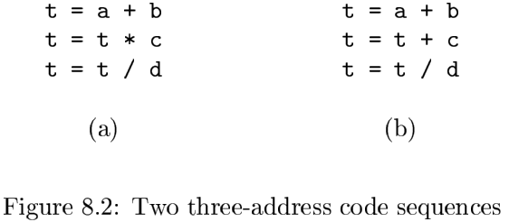
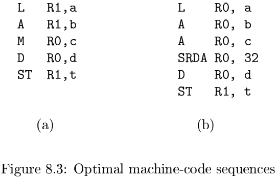
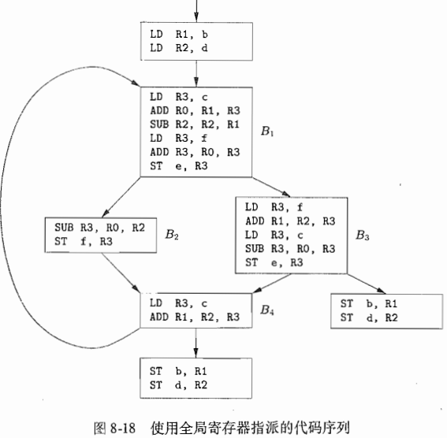
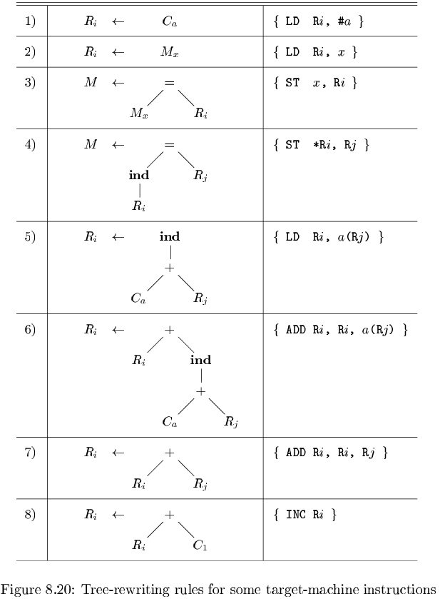
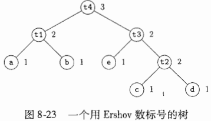

# Chapter 8 Code Generation

[TOC]

## Issues in the Design of a Code Generator

### Instruction Selection

The code generator must map the IR program into a code sequence that can be executed by the target machine. The complexity of performing this mapping is determined by factors such as:

- the level of the IR.
- the nature of the instruction-set architecture.
- the desired quality of the generated code.

### Register Allocation

The use of registers is often subdivided into two subproblems:

1. `Register allocation`, during which we select the set of variables that will reside in registers at each point in the program.
2. `Register assignment`, during which we pick the specific register that a variable will reside in.

### Evaluation Order

The order in which computations are performed can affect the efficiency of the target code.

## The Target Language

### Program and Instruction Costs

For simplicity, we take the cost of an instruction to be one plus the costs associated with the adressing modes of the operands.

## Addresses in the Target Code

### Static Allocation

The size and layout of activation records are determined by the code generator via the information about names stored in the symbol table.

## Basic Blocks and Flow Graphs

Introduces a graph representation of intermediate code, the representation is constructed as follows:

1. Partition the intermediate code into `basic blocks`, which are maximal sequences of consecutive three-address instructions with the properties that:
   - The flow of control can only enter the basic block through the first instruction in the block. That is, there are no jumps into the middle of the block.
   - Control will leav the block without halting or branching, except possibly at the last instruction in the block.
2. The basic blocks become the nodes of a `flow graph`, whose edges indicate which blocks can flow which other blocks.

### Basic Blocks

**Algorithm 8.5:** Partitioning three-address instructions into basic blocks.

**INPUT:** A sequence of three-address instructions.

**OUTPUT:** A list of the basic blocks for that sequence in which each instruction is assigned to exactly one basic block.

**METHOD:** First, we determine those instructions in the intermediate code that are `leaders`,that is, the first instructions in some basic block. The instruction just past the end of the intermediate program is not included as a leader. The rules for finding leaders are:

1. The first three-address instruction in the intermediate code is a leader.
2. Any instruction that is the target of a conditional or unconditional jump is a leader.
3. Any instruction that immediately follows a conditional or unconditional jump is a leader.

### Next-Use Information

**Algorith 8.7:** Determining the liveness and next-use information for each statement in a basic block.

**INPUT:** A basic block $B$ of three-address statements. We assume that the symbol table initially shows all nontemporary variables in $B$ as being live on exit.

**OUTPUT:** At each statement $i: x = y + z$ in $B$, we attach to $i$ the liveness and next-use information of $x, y$, and $z$.

**METHOD:** We start at the last statement in $B$ and sacan backwards to the beginning of $B$. At each statement $i: x = y + z$ in $B$, we do the following:

1. Attach to statement $i$ the information currently found in the symbol table regarding the next use and liveness of $x, y$, and $z$.
2. In the symbol table, set $x$ to "not live" and "no next use".
3. In the symbol table, set $y$ and $z$ to "live" and the next uses of $y$ and $z$ to $i$.

### Loops

We say that a set of nodes $L$ in a flow graph is a `loop` if $L$ contains a node $e$ called the `loop entry`, such that:

1. $e$ is not ENTRY, the entry of the entire flow graph.
2. No node in $L$ besides $e$ has a predecessor outside $L$. That is, every path from ENTRY to any node in $L$ goes through $e$.
3. Every node in $L$ has a nonempty path, completely within $L$, to $e$.

## Optimization of Basic Blocks

### The DAG Representation of Basic Blocks

We construct a DAG for a basic block as follows:

1. There ia a node in the DAG for each of the initial values of the variables appearing in the basic block.
2. There is a node $N$ associated with each statement $s$ within the block. The children of $N$ are those nodes corresponding to statements that are the last definitions, prior to $s$, of the operands used by $s$.
3. Node $N$ is labeled by the operator applied at $s$, and also attached to $N$ is the list of variables for which it is the last definition within the block.
4. Certain nodes are designated `output nodes`. These are the nodes whose variables are `live on exit` from the block; that is, their values may be used later, in another block of the flow graph.

The DAG representation of a basic block lets us perform several code-improving transformations on the code represented by the block:

1. We can eliminate `local common subexpressions`, that is, instructions that compute a value that has already been computed.
2. We can eliminate `dead code`, that is, instructions that compute a value that is never used.
3. We can reorder statements that do not depend on one another; such reordering may reduce the time a temporary value needs to be preserved in a register.
4. We can apply algebraic laws to reorder operands of three-address instructions, and sometimes thereby simplify the computation.

### Reassembling Basic Blocks From DAG's

When reconstructing the basic block from a DAG, we not only need to worry about what variables are used to hold the values of the DAG's nodes, but we also need to worry about the order in which we list the instructions computing the values of the various nodes. The rules to remember are:

1. The order of instructions must respect the order of nodes in the DAG. That is, we cannot compute a node's value until we have computed a value for each of its children.
2. Assignments to an array must follow all previous assignments to, or evaluations from, the same array, according to the order of these instructions in the original basic block.
3. Evaluations of array elements must follow any previous (according to the original block) assignments to the same array. The only permutation allowed is that two evaluations from the same array may be done in either order, as long as neither crosses over an assignment to that array.
4. Any use of a variable must follow all previous (according to the original block) procedure calls or indirect assignments through a pointer.
5. Any procedure call or indirect assignment through a pointer must follow all previous (according to the original block) evaluations of any variable.

## A Simple Code Generator

There are four principal uses of registers:

- In most machine architectures, some or all of the operands of an operation must be in registers in order to perform the operation.
- Registers make good temporaries--places to hold the result of a subexpression while a larger expression is being evaluated, or more generally, a place to hold a variable that is used only within a single basic block.
- Registers are used to hold (`global`) values that are computed in one basic block and used in other blocks.
- Registers are often used to help with run-time storage management.

### Register and Address Descriptors

The desired data structure has the following descriptors:

1. For each available register, a `register descriptor` keeps track of the variable names whose current value is in that register.
2. For each program variable, an `address descriptor` keeps track of the location or locations where the current value of that variable can be found.

## Register Allocation and Assignment

One approach to register allocation and assignment is to assign specific values in the target program to certain registers.

### Global Register Allocation

One strategy for global register allocation is to assign some fixed number of registers to hold the most active values in each inner loop.

### Usage Counts

On the debit side, if $x$ is live on entry to the loop header, we must load $x$ into its register just before entering loop $L$. This load costs two units. Similarly, for each exit block $B$ of loop $L$ at which $x$ is live on entry to some successor of $B$ outside of $L$, we must store $x$ at a cost of two.

An approximate formula for the benefit to the realized from allocating a register for $x$ within loop $L$ is:
$$
\sum_{\text{blocks B in L}}use(x, B) + 2 * live(x, B) \qquad (8.1)
$$
, where $use(x, B)$ is the number of times $x$ is used in $B$ prior to any definition of $x$.

### Register Allocation by Graph Coloring

A `register-interference graph` is constructed in which the nodes are symbolic registers and an edge connects two nodes if one is live at a point where the other is defined.

## Instruction Selection by Tree Rewriting

### Tree-Translation Schemes

The target code is generated by applying a sequence of tree-rewriting rules to reduce the input tree to a single node. Each tree-rewriting rule has the form:
$$
replacement \leftarrow template \{action\}
$$
, where `replacement` is a single node, `template` is a tree, and `action` is a code fragment, as in a syntax-directed translation scheme.

A set of tree-rewriting rules is called a `tree-translation scheme`.

### Pattern Matching by Parsing

The tree-translation scheme can be converted into a syntax-directed translation scheme by replacing the tree-rewriting rules with the productions of a context-free grammar in which the right sides are prefix representations of the instructin templates.

There are some benefits to using LR parsing in code generation:

1. The parsing method is efficient and well understood, so reliable and efficient code generators can be produced using the algorithms.
2. It is relatively easy to retarget the resulting code generator; a code selector for a new machine can be constructed by writing a grammar to describe the instructions of the new machine.
3. The code generated can be made more efficient by adding special-case productions to take advantage of machine idioms.

## Optimal Code Generation for Expressions

### Ershov Numbers

For our machine model, the `Ershow numbers` register rules are:

1. Label all leaves 1.
2. The label of an interior node with one child is the label of its child.
3. The label of an interior node with two children is:
   - The larger of the labels of its children, if those labels are different.
   - One plus the label of its children if the label are the same.

### Generating Code From Labeled Expression Trees

**Algorithm 8.24:** Generating code from a labeled expression tree.

INPUT: A labeled tree with each operand appearing once (this is, no common subexpressions).

OUTPUT: An optimal sequence of machine instructions to evaluate the root into a register.

METHOD: The following is a recursive algorithm to generate the machine code. The steps below are applied, starting at the root of the tree. If the algorithm is applied to a node with label $k$, then only $k$ registers will be used. However, there is "base" $b \geq 1$ for the registers used so that the actual registers used are $R_b, R_{b+1}, \cdots, R_{b+k-1}$. The result always appears in $R_{b+k-1}$:

1. To generate machine code for an interior node with label $k$ and two children with equal labels (which must be $k - 1$) do the following:
   - Recursively generate code for the right child, using base $b + 1$. The result of the right child appears in register $R_{b+k-1}$.
   - Recursively generate code for the left child, using base $b$; the result appears in $R_{b+k-2}$.
   - Generate the instruction OP $R_{b+k-1}, R_{b+k-2}, R_{b+k-1}$, where OP is the appropriate operation for the iterior node in question.
2. Suppose we have an interior node with label $k$ and children with unqual labels. THen one of the children, which we'll call the "big" child, has label $k$, and the other child, the "little" child, has some label $m < k$. Do the following to generate code for this interior node, using base $b$:
   - Recursively generate code for the big child, using base $b$; the result appears in register $R_{b + k - 1}$.
   - Recursively generate code for the little child, using base $b$; the result appears in register $R_{b + m - 1}$. Note that since $m < k$, neither $R_{b + k - 1}$ nor any higher-numbered register is used.
   - Generate the instruction OP $R_{b+k-1}, R_{b+m-1}, R_{b+k-1}$ or the instruction OP $R_{b+k-1}, R_{b+k-1}, R_{b+m-1}$, depending on whether the big child is the right or left child, respectively.
3. For a leaf representing operand $x$, if the base is $b$ generate the instruction LD $R_b, x$.

### Evaluating Expressions with an Insufficient Supply of Registers

**Algorithm 8.26:** Generating code from a labeled expression tree.

INPUT: A labeled tree with each operand appearing once (i.e., no common subexpressions) and a number of registers $r \geq 2$.

OUTPUT: An optimal sequence of machine instructions to evaluate the root into a register, using no more than $r$ registers, which we assume are $R_1, R_2, \cdots, R_r$.

## Dynamic Programming Code-Generation

### Contiguous Evaluation

The dynamic programming algorithm partitions the problem of generating optimal code for an expression into the subproblems of generating optimal code for the subexpressions of the given expression.

### The Dynamic Programming Algorithm

The dynamic programming algorithm proceeds in three phases (suppose the target machine has $r$ registers):

1. Compute bottom-up for each node $n$ of the expression tree $T$ an array $C$ of costs, in which the $i$th component $C[i]$ is the optimal cost of computing the subtree $S$ rooted at $n$ into a register, assuming $i$ registers are available for the computation, for $1 \geq i \geq r$.
2. Traverse $T$, using the cost vectors to determine which subtrees of $T$ must be computed into memory.
3. Traverse each tree using the cost vectors and associated instructions to generate the final target code. The code for the subtrees computed into memory locations is generated first.
