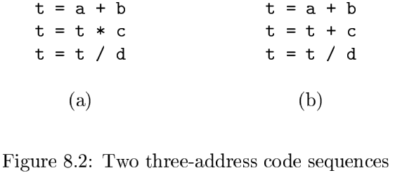
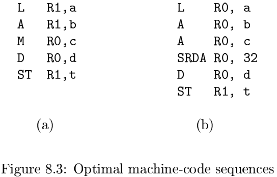
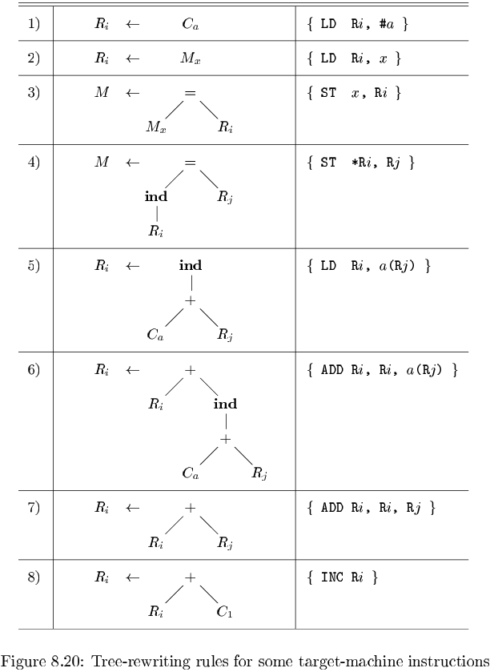

# 第八章 代码生成

[TOC]

## 8.1 代码生成器设计中的问题

### 8.1.1 代码生成器的输入

### 8.1.2 目标程序

### 8.1.3 指令选择

代码生成器必须把IR程序映射成为可以在目标机上运行的代码序列。完成这个映射的复杂性由如下的因素决定：

- IR的层次。
- 指令集体系结构本身的特性。
- 想要达到的生成代码的质量。

### 8.1.4 寄存器分配

寄存器的使用经常被分解为两个子问题：

- 寄存器分配：对于源程序中的每个点，我们选择一组将被存放在寄存器中的变量。
- 寄存器指派：我们指定一个变量被存放在哪个寄存器中。

### 8.1.5 求值顺序

计算执行的顺序会影响目标代码的效率。

## 8.2 目标语言

### 8.2.1 一个简单的目标机模型

我们假设有如下种类的指令可用：

- 加载运算；
- 保存运算；
- 计算运算；
- 无条件跳转；
- 条件跳转。

我们假设目标机具有多种寻址模式：

- 在指令中，一个位置可以是一个变量名$x$，它指向分配给$x$的内存位置（即$x$的左值）。
- 一个位置也可以是一个带有下标的形如$a(r)$的地址，其中$a$是一个变量，而$r$是一个寄存器。$a(r)$所表示的内存位置按照如下方式计算得到：$a$的左值加上存放在寄存器$r$中的值。
- 一个内存位置可以是一个以寄存器作为下标的整数。
- 我们还支持另外两种间接寻址模式：$*r$表示在寄存器$r$的内容所表示的位置上存放的内存位置。而$*100(r)$表示在$r$中内容加上100的和所代表的位置上的内容所戴表的位置。
- 最后，我们支持一个直接常数寻址模式。在常数前面有一个前缀$\#$。

### 8.2.2 程序和指令的代价

为简单起见，我们把一个指令的代价设定为1加上与运算分量寻址模式相关的代价。这个代价对应于指令中字的长度。

### 8.2.3 8.2节的练习

## 8.3 目标代码中的地址

### 8.3.1 静态分配

活动记录的大小和布局是由代码生成器通过存放于符号表中的名字的信息来确定的。

### 8.3.2 栈分配

### 8.3.3 名字的运行时刻地址

### 8.3.4 8.3节的练习

## 8.4 基本块的流图

使用一种图来表示中间代码的，这个表示方法可以按照如下方法构造：

1. 把中间代码划分成为`基本块（basic block）`。每个基本块是满足下列条件的最大的连续三地址指令序列。
   - 控制流只能从基本块中的第一个指令进入该块。也就是说，没有跳转到基本块中间的转移指令。
   - 除了基本块的最后一个指令，控制流在离开基本块之前不会停机或者跳转。
2. 基本块形成了流图（flow graph）的节点。而流图的边指明了哪些基本块可能紧随一个基本块之后运行。

### 8.4.1 基本块

**算法 8.5** 把三地址指令序列划分成为基本块。

输入：一个三地址指令序列。

输出：输入序列对应的一个基本块列表，其中每个指令恰好被分配给一个基本块。

方法：首先，我们确定中间代码序列中哪些指令是`首指令（leader）`，即某个基本块的第一个指令。跟在中间程序末端之后的指令的不包含在首指令集合中。选择首指令的规则如下：

1. 中间代码的第一个三地址指令是一个首指令。
2. 任意一个条件或无条件转移指令的目标指令是一个首指令。
3. 紧跟在一个条件或无条件转移指令之后的指令是一个首指令。

### 8.4.2 后续使用信息

**算法 8.7** 对一个基本块中的每一个语句确定活跃性与后续使用信息。

输入：一个三地址语句的基本块$B$，我们假设在开始的时候符号表显示$B$中的所有非临时变量都是活跃的。

输出：对于$B$的每一个语句$i: x = y + z$，我们将$x$, $y$及$z$的活跃性信息及后续使用信息关联到$i$。

方法：我们从$B$的最后一个语句开始，反向扫描到$B$的开始处。对于每个语句$i: x = y + z$，我们做下面的处理：

1. 把在符号表中找到的有关$x$, $y$和$z$的当前后续使用和活跃性信息与语句$i$关联起来。
2. 在符号表中，设置$x$为”不活跃“和”无后续使用“。
3. 在符号表中，设置$y$与$z$为”活跃“，并把它们的下一次使用设置为语句$i$。

### 8.4.3 流图

### 8.4.4 流图的表示方式

### 8.4.5 循环

如果下列条件成立，我们就说流图中的一个节点集合$L$是一个循环：

1. 在$L$中有一个被称为`循环入口（loop entry）`的节点，它是唯一的其前驱可能在$L$之外的节点。
2. $L$中的每个节点都有一个到达$L$的入口节点的非空路径，并且该路径全部在$L$中。

### 8.4.6 8.4节的练习

## 8.5 基本块的优化

### 8.5.1 基本块的DAG表示

我们按照如下方式为一个基本块构造DAG：

1. 基本块中出现的每个变量有一个对应的DAG的节点表示其初始值。
2. 基本块中的每个语句$s$都有一个相关的节点$N$。$N$的字节带你是基本块中的其他语句的对应节点。这些语句是在$s$之前，最后一个对$s$所使用的某个运算分量进行定值的语句。
3. 节点$N$的标号是$s$中的运算符；同时还有一组变量被关联到$N$，表示$s$是在此基本块内最晚对这些变量进行定值的语句。
4. 某些节点被指明为`输出节点（output node）`。这些节点的变量在基本块的出口处活跃。也就是说，这些变量的值可能以后会在流图的另一个基本块中被使用到。

基本块的DAG表示使我们可以对基本块所代表的代码进行一些转换，以改进代码的质量：

1. 我们可以消除`局部公共子表达式（local common subexpression）`。所谓公共子表达式就是重复计算一个已经计算得到的值的指令。
2. 我们可以消除`死代码（dead code）`，即计算得到的值不会被使用的指令。
3. 我们可以对相互独立的语句进行重新排序，这样的重新排序可以降低一个临时值需要保持在寄存器中的时间。
4. 我们可以使用代数规则来重新排列三地址指令的运算分量的顺序。这么做有时可以简化计算过程。

### 8.5.2 寻找局部公共子表达式

### 8.5.3 消除死代码

### 8.5.4 代数恒等式的使用

### 8.5.5 数组引用的表示

### 8.5.6 指针赋值和过程调用

### 8.5.7 从DAG到基本块的重组

当从DAG重构基本块时，我们不仅要关心用哪些变量来存放DAG中的节点的值，还要关心计算不同节点值的指令的顺序。应记住以下规则：

1. 指令的顺序必须遵守DAG中的节点的顺序。也就是说，只有在计算出一个节点的各个子节点的值之后，才可以计算这个节点的值。
2. 对数组的赋值必须跟在所有（按照原基本块中的指令顺序）在它之前的对同一数组的赋值或求值运算之后。
3. 对数组元素的求值必须跟在所有（在原基本块中）在它之前的对同一数组的赋值指令之后。对同一数组的两个求值运算可以交换顺序，只要在交换时它们都没有越过某个对同一数组的赋值运算即可。
4. 一个变量的使用必须跟在所有（在原基本块）在它之前的过程调用和指针间接赋值运算之后。
5. 任何过程调用或者指针间接赋值都必须跟在所有（在原基本块中）在它之前的对任何变量的求值运算之后。

### 8.5.8 8.5 节的练习

## 8.6 一个简单的代码生成器

寄存器有如下四种主要使用方法：

- 在大部分机器的体系结构中，执行一个运算时该运算的部分或全部运算分量必须存放在寄存器中。
- 寄存器很适合做临时变量，即在计算一个大表达式时存放其子表达式的值。或者更一般地讲，寄存器适合用于存放只在单个基本块内使用的变量的值。
- 寄存器用来存放在一个基本块中计算而在另一个基本块中使用的（全局）值。
- 寄存器经常用来帮助进行运行时刻的存储管理。

### 8.6.1 寄存器和地址描述符

1. 每个可用的寄存器都有一个`寄存器描述符（register descriptor）`。它用来跟踪有哪些变量的当前值存放在此寄存器内。
2. 每个程序变量都有一个`地址描述符（address descriptor）`。它用来跟踪记录在哪个或哪些位置上可以找到该变量的当前值。

### 8.6.2 代码生成算法

### 8.6.3 函数getReg的设计

### 8.6.4 8.6节的练习

## 8.7 窥孔优化

`窥孔优化（peephole optimization）`。

### 8.7.1 消除冗余的加载和保存指令

### 8.7.2 消除不可达代码

### 8.7.3 控制流优化

### 8.7.4 代数化简和强度消减

### 8.7.5 使用机器特有的指令

### 8.7.6 8.7节的练习

## 8.8 寄存器分配和指派

寄存器分配和指派的方法之一是把目标程序中的特定值分配给特定的寄存器。

### 8.8.1 全局寄存器分配

全局寄存器分配的策略之一是分配固定多个寄存器来存放每个内部循环中最活跃的值。

### 8.8.2 使用计数

通过在循环$L$运行时把一个变量$x$保存在寄存器里面，我们可以节省从内存中加载$x$的开销。

在循环$L$中把一个寄存器分配给$x$所得到的好处的一个估算公式是：
$$
\sum_{L中的全部基本块B}use(x, B) + 2 * live(x, B) \qquad (8.1)
$$
其中，$use(x, B)$是$x$在$B$中被定值之前被使用的次数。

### 8.8.3 外层循环的寄存器指派

### 8.8.4 通过图着色方法进行寄存器分配

`寄存器冲突图（register-interference graph）`。

### 8.8.5 8.8节的练习

## 8.9 通过树重写来选择指令

### 8.9.1 树翻译方案

目标代码是通过应用一个树重写规则序列来生成的，这些规则最终会把输入的树归约为单个结点。各个树重写规则形如：
$$
replacement \leftarrow template \{action\}
$$
其中，replacement（被替换节点）是一个节点，template（模板）是一棵树，action（动过）是一个像语法制导翻译方案中那样的代码片段。

一组树重写规则被称为一个`树翻译方案（tree-translation scheme）`。

### 8.9.2 通过覆盖一个输入树来生成代码

### 8.9.3 通过扫描进行模式匹配

一个树翻译方案可以转换为要给语法制导的翻译方案，方法是把每个树重写规则替换为相应的上下文无关文法的产生式。对于一个树重写规则，相应的产生式的右部就是其指令模板的前缀表示方式。

在代码生成中使用LR语法分析方法有多个好处：

1. 语法分析方法是高效的，并且容易被人们理解。
2. 比较容易为所得代码生成器重新确定目标。
3. 可以通过增加特殊产生式来利用机器特有的指令，从而产生高效的代码。

### 8.9.4 用于语义检查的例程

### 8.9.5 通用的树匹配方法

在实践中，树重写过程可以按照如下方法实现：对输入树进行深度优先遍历的同时运行树模式匹配程序，并且在最后一次访问这个节点的时候进行归约。

### 8.9.6 8.9 节的练习

## 8.10 表达式的优化代码的生成

### 8.10.1 Ershov数

对我们的机器模型而言，计算Ershov数的规则如下：

1. 所有叶子节点的标号为1.
2. 只有一个子节点的内部节点的标号和其子节点的标号相同。
3. 具有两个子节点的内部节点的标号按照如下方式确定：
   - 如果两个子节点的标号不同，那么选择较大的标号。
   - 如果两个子节点的标号相同，那么它的标号就是子节点的标号值加一。

### 8.10.2 从带标号的表达式树生成代码

**算法 8.24** 根据一个带标号的表达式树生成代码。

输入：一个带有标号的表达式树，其中的每个运算分量只出现一次（即没有公共子表达式）。

输出：计算根节点对应的值并将该值存放在一个寄存器中的最优的机器指令序列。

方法：下面是一个用来生成机器代码的递归算法。从树的根节点开始应用下面的步骤。如果算法被应用于一个标号为$k$的节点，那么得到的代码只使用$k$个寄存器。然而，这些代码从某个基线$b(b \geqslant 1)$开始使用寄存器，实际使用的寄存器是$R_b, R_{b+1}, \cdots, R_{b+k-1}$。计算结果总是存放在$R_{b+k-1}$中。

1. 为一个标号为$k$且两个子节点的标号相同（它们的标号必然是$k - 1$）的内部节点生成代码时，做如下处理：
   - 使用基线$b+1$递归地为它的右子树生成代码。其右子树的结果讲存放在寄存器$R_{b+k-1}$中。
   - 使用基线$b$，递归地为它的左子树生成代码。其左子树的结果讲存放在寄存器$R_{b+k-2}$中。
   - 生成指令$"OP\ R_{b+k-1}, R_{b+k-2}, R_{b+k-1}"$，其中$OP$时标号为$k$的节点对应的运算。
2. 假设我们有一个标号为$k$的内部节点，其子节点的标号不相等。使用基线$b$，通过下列步骤为这个内部节点生成代码：
   - 使用基线$b$，递归地为大子节点生成代码，其结果存放在寄存器$R_{b+k-1}$中。
   - 使用基线$b$，递归地为小子节点生成代码，其结果存放在寄存器$R_{b+m-1}$中。
   - 根据大子节点是该内部节点的右子节点还是左子节点，分别生成指令$"OP\ R_{b+k-1}, R_{b+m-1}, R_{b+k-1}"$或者$"OP\ R_{b+k-1}, R_{b+k-1}, R_{b+m-1}"$。
3. 对于代表运算分量$x$的叶子节点，当基线为$b$时生成指令$"LD\ R_b, x"$。

### 8.10.3 寄存器数量不足时的表达式求值

**算法 8.26** 根据一个带标号的表达式树生成代码。

输入：一个带有标号的表达式树和寄存器的数量$r \geqslant 2$。表达式树的每个运算分量只出现一次（即没有公共子表达式）。

输出：计算根节点对应的值并将其存放到一个寄存器中的最优的机器指令序列。代码使用的寄存器的数量不大于$r$。我们假设这些寄存器为$R_1, R_2, \cdots, R_r$。

方法：令基线$b = 1$，从根结点开始应用下面的递归算法。对于标号为$r$或者更小的结点$N$, 本算法和算法8.24完全一样。对于标号$k > r$的内部结点，我们要分别处理该内部结点的各个子结点，并把较大子树的结果保存到内存中。该结果在对结点N求值之前才从内存重新加载，而最后的求值步骤将在$R_{r - 1}$和$R_r$内进行。对于基本算法的改动如下：

1. 结点N至少有一个子结点的标号为$r$或者大于$r$。选择较大的子结点（如果子结点标号相同则选择任意一个）作为“大”子结点，并把另外一个子结点作为“小”子结点。
2. 令基线 b = 1，递归地为大子结点生成代码。这个求值的结果将存放在寄存器$R_r$中。
3. 生成及其指令"ST $t_k$, $R_r$", 其中$t_k$是一个用于存放中间结果的临时变量。这个变量用于对标号为$k$的结点求值。
4. 按照如下方式为小子结点生成代码。如果小子结点的标号大于或等于$r$，选取基线$b = 1$。如果小子结点的标号为$j < r$，选取基线$b = r - j$。然后递归地把本算法应用于小子结点，其结果存放在$R_r$中。
5. 生成指令"LD $R_{r - 1}$, $t_k$"。
6. 如果大子结点是$N$的右子结点，生成指令"$OP\ R_r, R_r, R_{r - 1}$"。如果大子结点是N的左子结点，生成代码“$OP\ R_r, R_{r - 1}, R_r$”。

### 8.10.4 8.10节的练习

## 8.11 使用动态规划的代码生成

### 8.11.1 连续求值

动态规划算法把为一个表达式生成最优代码的问题分解成为多个为该表达式的子表达式生成最优代码的子问题。

### 8.11.2 动态规划的算法

动态规划算法有三个步骤（假设目标机器具有$r$个寄存器）：

1. 对表达式树$T$的每个节点$n$自底向上地计算得到一个代价数组$C$，其中$C$的第$i$个元素$C[i]$是在假设有$i(1 \leqslant i \leqslant r)$个可用寄存器的情况下对以$n$为根的子树$S$求值并将结果存放在一个寄存器中的最优代价。
2. 遍历$T$，使用代价向量（数组）来决定$T$的哪棵子树应该被计算并保存到内存中。
3. 使用每个节点的代价向量和相关指令来遍历各棵子树并生成最终的目标代码。

### 8.11.3 8.11节的练习

## 8.12 第8章总结

## 8.13 第8章参考文献
