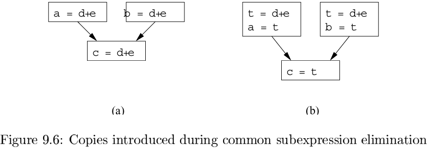
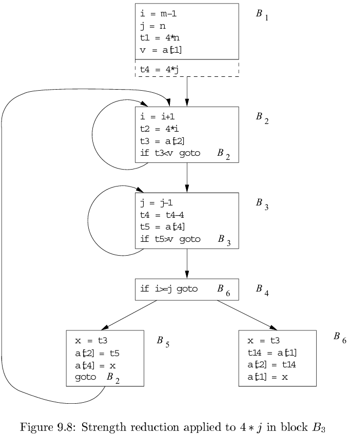
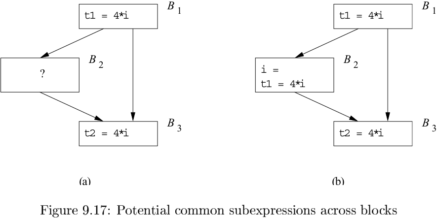
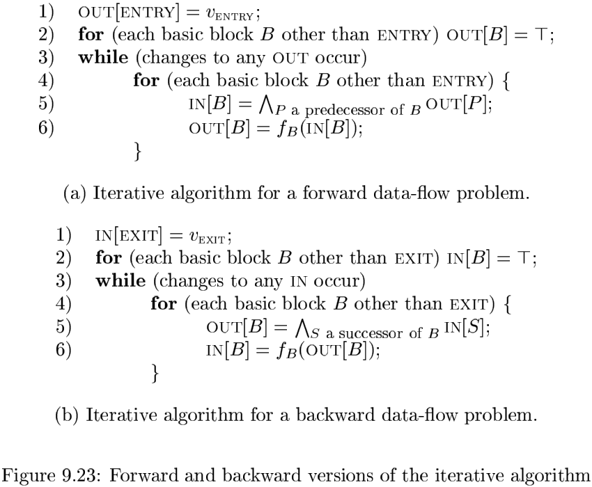
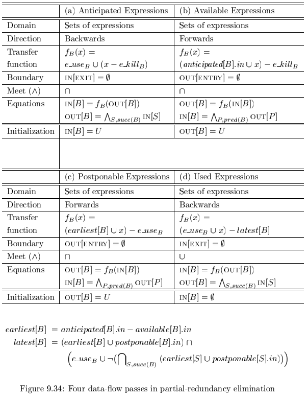

# Chapter 9 Machine-Independent Optimizations

[TOC]

## The Principal Sources of Optimization

### Causes of Redundancy

### Global Common Subexpressions

An occurrence of an expression $E$ is called a `common subexpression` if $E$ was previously computed and the values of the variables in $E$ have not changed since the previous computation.

### Copy Propagation

### Dead-Code Elimination

A variable is `live` at a point in a program if its value cna be used subsequently; otherwise, it is `dead` at that point.

### Code Motion

An important modification that decreases the amount of code in a loop is `code motion`. This transformation takes an expression that yields tha same result independent of the number of times a loop is executed (a `loop-invariant computation`) and evaluates the expression before the loop.

### Induction Variables and Reduction in Strength

A variable $x$ is said to be an "induction variable" if there is a positive or negative constant $c$ such that each time $x$ is assigned, its value increases by $c$.

The transformation of replacing an expensive operation, such as multiplication, by a cheaper one, such as addition, is known as `strength reduction`.

## Introduction to Data-Flow Analysis

### The  Data-Flow Abstraction

We may define an `execution path` (or just `path`) from point $p_1$ to point $p_n$ to be a sequence of points $p_1, p_2, ..., p_n$ such that for each $i = 1, 2, ..., n - 1$, either:

1. $p_i$ is the point immediately preceding a statement and $p_{i + 1}$ is the point immediately following that same statement, or
2. $p_i$  is the end of some block and $p_{i + 1}$ is the beginning of a successor block.

### The Data-Flow Analysis Schema

The relationship between the data-flow values before and after the assignment statement is known as a `transfer function`.

Transfer functions come in two flavors: information may propagate forward along execution paths, or it may flow backwards up the execution path. We denote the transfer function of a statement $f_s$, that is:
$$
OUT[s] = f_s(IN[s]) \\
IN[s] = f_s(OUT[s])
$$
If a block $B$ consists of statements $s_1, s_2, ..., s_n$ in that order, then the control-flow value out of $s_i$ is the same as the control-flow value into $s_{i + 1}$. That is:
$$
IN[s_{i+1}] = OUT[s_i] \text{, for all } i = 1, 2, \cdots, n - 1
$$

### Reaching Definitions

**Algorithm 9.11:** Reaching definitions.

INPUT: A flow graph for which $kill_{B}$ and $gen_{B}$ have been computed for each block $B$.

OUTPUT: $IN[B]$ and $OUT[B]$, the set of definitions reaching the entry and exit of each block $B$ of the flow graph.

### Live-Variable Analysis

In `live-variable analysis` we wish to know for variable $x$ and point $p$ whether the value of $x$ at $p$ could be used along some path in the flow graph starting at $p$. If so, we say $x$ is `live` at $p$; otherwise, $x$ is `dead` at $p$.

An important use for live-variable information is register allocation for basic blocks.

We define the data-flow equations directly in terms of $IN[B]$ and $OUT[B]$, which represent the set of variables live at the points immediately before and after block $B$, respectively. These equations can also be derived by first defining the transfer function of individual statements and composing the to create the transfer function of a basic block. Define:

1. $def_{B}$ as the set of variables `defined`(i.e., definitely assigned values) in $B$ prior to any use of that variable in $B$, and 
2. $use_{B}$ as the set of variables whose values may be used in $B$ prior to nay definition of the variable.

**Algorithm 9.14:** Live-variable analysis.

INPUT: A flow graph with $def$ and $use$ computed for each block.

OUTPUT: $IN[B]$ and $OUT[B]$, the set of variables live on entry and exit of each block $B$ of the flow graph.

METHOD: 

### Available Expressions

The following equations relate the unknowns $IN$ and $OUT$ to each other and the known quantities `e_gen` and `e_kill`:
$$
OUT[ENTRY] = \empty
$$
, and for all basic blocks $B$ other than $ENTRY$:
$$
OUT[B] = e\_gen_{B} \cup (IN[B] - e\_kill_{B}) \\
IN[B] = \cap_{\text{P a predecessor of B }}OUT[P]
$$
**Algorithm 9.17:** Available expressions.

INPUT: A flow graph with $e\_kill_{B}$ and $e\_gen_{B}$ computed for each block $B$. The initial block is $B_1$.

OUTPUT: $IN[B]$ and $OUT[B]$, the set of expressions available at the entry and exit of each block $B$ of the flow graph.

METHOD:

## Foundations of Data-Flow Analysis

A `data-flow analysis framework`$(D, \bigvee, \wedge, F)$ consists of:

1. A direction of the data flow $D$, which is either $FORWARDS$ or $BACKWARDS$.
2. A semilattice, which includes a `domain` of values $V$ and `a meet operator` $\wedge$.
3. A family $F$ of transfer functions from $V$ to $V$. This family must include functions suitable for the boundary conditions, which are constant transfer functions for the special nodes $ENTRY$ and $EXIT$ in any flow graph.

### Semilattices

A `semilattice` is a set $V$ and a binary meet operator $\wedge$ such that for all $x, y$ and $z$ in $V$:

1. $x \wedge x = x$（meet is indempotent）。
2. $x \wedge y = y \wedge x$（meet is commutative）。
3. $x \wedge (y \wedge z) = (x \wedge y) \wedge z$（meet is associative）。

A relation $\leq$ is a `partial order` on a set $V$ if for all $x, y$ and $z$ in $V$:

1. $x \leq x$ (the partial order is `reflexive`).
2. If $x \leq y$ and $y \leq x$, then $x = y$ (the partial order is `antisymmetric`).
3. If $x \leq y$ and $y \leq z$, then $x \leq z$ (the partial order is `transitive`).

**The Partial Order for a Semilattice:** It is useful to define a partial order $\leq$ for a semilattice $(V, \wedge)$. For all $x$ and $y$ in $V$, we define:
$$
x \leq y \text{ if and only if } x \wedge y = x.
$$
, Because the meet operator $\wedge$ is idempotent, commutative, and associative, the $\leq$ order as defined is reflexive, antisymmetric, and transitive. To see why, observe that:

- Reflexivity: for all $x, x \leq x$. The proof is that $x \wedge x = x$ since meet is idempotent.
- Antisymmetry: if $x \leq y$ and $y \leq x$, then $x = y$. In proof, $x \leq y$ means $x \wedge y = x$ and $y \leq x$ means $y \wedge x = y$. By commutativity of $\wedge$, $x = (x \wedge y) = (y \wedge x) = y$.
- Transitivity: if $x \leq y$ and $y \leq z$, then $x \leq z$. In proof, $x \leq y$ and $y \leq z$ means that $x \wedge y = x$ and $y \wedge z = y$. Then $(x \wedge z) = ((x \wedge y) \wedge z) = (x \wedge (y \wedge z)) = (x \wedge y) = x$, using associativity of meet. Since $x \wedge z = x$ has been shown, we have $x \leq z$, proving transitivity.

A `greatest lower bound(or glb)` od domain elements $x$ and $y$ is an element $g$ such that

1. $g \leq x$,
2. $g \leq y, and$
3. If $z$ is any element such that $z \leq x$ and $z \leq y$, then $z \leq g$.

It often helps to draw the domain $V$ as a lattice diagram, which is a graph whose nodes are the elements of $V$, and whose edges are directed downward, from $x$ to $y$ if $y \leq x$.

Formally, we may build product lattices as follows. Suppose $(A, \wedge_{A})$ and $(B, \wedge_{B})$ are (semi)lattices. The `product lattice` for these two lattices is defined as follows:

1. The domain of the product lattice is $A \times B$.

2. The meet $\wedge$ for the product lattice is defined as follows. If $(a, b)$ and $(a', b')$ are domain elements of the product lattice, then:
   $$
   (a, b) \wedge (a', b') = (a \wedge_{A}a', b \wedge_{B}b')
   $$

It is simple to express the $\leq$ partial order for the product lattice in terms of the partial orders $\leq_{A}$ and $\leq_{B}$ for $A$ and $B$:
$$
(a, b) \leqslant (a', b') \text{ if an only if } a \leqslant_{A}a' \text{ and } b \leqslant_{B}b'
$$

### Transfer Functions

The family of transfer functions $F: V \rightarrow V$ in a data-flow framework has the following properties:

1. $F$ has an identity function $I$, such that $I(x) = x$ for all $x$ in $V$.
2. $F$ is closed under composition; that is, for any two functions $f$ and $g$ in $F$, the function $h$ defined by $h(x) = g(f(x))$ is in $F$.

Formally, a data-flow framework $(D, F, V, \wedge)$ is `monotone` if:
$$
\text{For all } x \text{ and } y \text{ in } V \text{ and } f \text{ in } F, x \leq y \text{ implies } f(x) \leq f(y) \qquad (9.22)
$$
, Equivalently, monotonicity can be defined as:
$$
\text{For all } x \text{ and } y \text{ in } V \text{ and } f \text{ in } F, f(x \wedge y) \leq f(x) \wedge f(y) \qquad (9.23)
$$
**Distributive Frameworks**

Often, a frameowrk obeys a condition stronger than (9.23), which we call the `distributivity condition`,
$$
f(x \wedge y) = f(x) \wedge f(y)
$$
, for all $x$ and $y$ in $V$ and $f$ in $F$. Certainly, if $a = b$, then $a \wedge b = a$ by idempotence, so $a \leq b$. Thus, distributivity implies monotonicity, although the converse is not true.

### The Iterative Algorithm for General Frameworks

**Algorithm 9.25:** Iterative solution to general data-flow frameworks.

INPUT: A data-flow framwork with the following components:

1. A data-flow graph, with specially labeled $ENTRY$ and $EXIT$ nodes.
2. A direction of the data-flow $D$,
3. A set of values $V$,
4. A meet operator $\wedge$,
5. A set of functions $F$, where $f_{B}$ in $F$ is the transfer function for block $B$, and
6. A constant value $v_{ENTRY}$ or $v_{EXIT}$ in $V$, representing the boundary condition for forward and backward frameworks, respectively.

OUTPUT: Values in $V$ for $IN[B]$ and $OUT[B]$ for each block $B$ in the data-flow graph.

METHOD:

### Meaning of a Data-Flow Solution

For each block $B$ in a flow graph, let $f_B$ be the transfer function for $B$. Consider any path:
$$
P = ENTRY \rightarrow B_1 \rightarrow B_2 \rightarrow \cdots \rightarrow B_{k - 1} \rightarrow B_k
$$
, from the initial node $ENTRY$ to some block $B_k$.

We claim that, in terms of the lattice-theoretic partial order $\leq$ for the framework in question:

- Any answer that is greater than $IDEAL$ is incorrect.
- Any value smaller than or equal to the ideal is conservative, i.e., safe.

## Constant Propagation

### Data-Flow Values for the Constant-Propagation Framework

For all values $v$,
$$
UNDEF \wedge v = v 且 NAC \wedge v = NAC
$$
For any constant $c$,
$$
c \wedge c = c
$$
, and given two distinct constants $c_1$ ad $c_2$,
$$
c_1 \wedge c_2 = NAC
$$

### The Meet for the Constant-Propagation Framework

$m \leq m'$ if and only if for all variables $v$ we have $m(v) \leq m'(v)$. Put another way, $m \wedge m' = m''$ if $m(v) \wedge m'(v) = m''(v)$ for all variables $v$.

### Transfer Functions for the Constant-Propagation Framework

In general, let $f_s$ be the transfer function of statement $s$, and let $m$ and $m'$ represent data-flow values such that $m' = f_s(m)$. We shall describe $f_s$ in terms of the relationship between $m$ and $m'$.

1. If $s$ is not an assignment statement, then $f_s$ is simply the identity function.

2. If $s$ is an assignment to variable $x$, then $m'(v) = m(v)$, for all variables $v \neq x$, and $m'(x)$ is defined as follows:

   - If the right-hand-side (RHS) of the statement $s$ is a constant $c$, then $m'(x) = c$.

   - If the RHS is of the form $y + z$, then
     $$
     m'(x)
     \begin{cases}
     m(y) + m(z) &\text{if m(y) and m(z) are constant values}\\
     NAC &\text{if either m(y) or m(z) is NAC}\\
     UNDEF &\text{otherwise}\\
     \end{cases}
     $$

   - If the RHS is any other expression (e.g. a function call or assignment through a pointer), then $m'(x) = NAC$.

### Monotonicity of the Constant-Propagation

### Nondistributivity of the Constant-Propagation Framework

Let $f_1, f_2$ and $f_3$ be the transfer functions representing blocks $B_1, B_2$ and $B_3$, respectively:
$$
f_3(f_1(m_0) \wedge f_2(m_0)) < f_3(f_1(m_0)) \wedge f_3(f_2(m_0))
$$
, rendering the framework nondistributive.

## Partial-Redundancy Elimination

### The Sources of Redundancy

### The Lazy-Code-Motion Problem

It is desirable for programs optimized with a partial-redundancy-elimination algorithm to have the following properties:

1. All redundant computations of expressions that can be eliminated without code duplication are eliminated.
2. The optimized program does not perform any computation that is not in the original program execution.
3. Expressions are computed at the latest possible time.

### The Lazy-Code-Motion Algorithm

An expression is available on exit from a block if it is:

1. Either

   - A vailable on entry, or
   - In the set of anticipated expressions upon entry (i.e., it could be made available if we chose to compute it here),

   and

2. Not killed in the block.

**Algorithm 9.36:** Lazy code motion.

INPUT: A flow graph for which $e\_use_{B}$ and $e\_kill_{B}$ have been computed for each block $B$.

OUTPUT: A modified flow graph satisfying the four lazy code motion conditions in Section 9.5.3.

METHOD: 

1. Insert an empty block along all edges entering a block with more than one predecessor.

2. Find $anticipated[B].in$ for all blocks $B$, as defined in Fig. 9.34(a).

3. Find $available[B].in$ for all blocks $B$ as defined in Fig. 9.34(b).

4. Compute the earliest placements for all blocks $B$:
   $$
   earliest[B] = anticipated[B].in - available[B].in
   $$

5. Find $postponable[B].in$ for all blocks $B$ as defined in Fig. 9.34(c).

6. Compute the latest placements for all blocks $B$:
   $$
   latest[B] = (earliest[B] \cup postponable[B].in) \cap (e\_use_{B} \cap \neg (\cup_{S\ in\ succ[B]}(earliest[S] \cup postponable[S].in)))
   $$
   Note that $\neg$ denotes complementation with respect to the set of all expressions computed by the program.

7. Find $used[B].out$ for all blocks $B$, as defined in Fig. 9.34(d).

8. For each expression, say $x + y$, computed by the program, do the following:

   - Create a new temporary, say $t$, for $x + y$.

   - For all blocks $B$ such that $x + y$ is in $latest[B] \cap used[B].out$, add $t = x + y$ at the beginning of $B$.

   - For all blocks $B$ such that $x + y$ is in
     $$
     e\_use_{B} \cap (\neg latest[B] \cup used.out[B])
     $$
     replace every original $x + y$ by $t$.

## Loops in Flow Graphs

### Dominators

We say node $d$ of a flow graph `dominates` node $n$, written $\text{d dom n}$, if every path from the entry node of the flow graph to $n$ goes through $d$. Note that under this definition, every node dominates itself.

A useful way of presenting dominator information is in a tree, called the `dominator tree`, in which the entry node is the root, and each node $d$ dominates only its descendants in the tree:

The existence of dominator trees follows from a property of dominators: each node $n$ has a unique $immediate\ dominator\ m$ that is the last dominator of $n$ on any path from the entry node to $n$. In terms of the $dom$ relation, the immediate dominator $m$ has that property that if $d \neq n$ and $d\ dom\ n$, then $d\ dom\ m$.

**Algorithm 9.38:** Finding dominators.

INPUT: A flow graph $G$ with set of nodes $N$, set of edges $E$ and entry node $ENTRY$.

OUTPUT: $D(n)$, the set of nodes that dominate node $n$, for all nodes $n$ in $N$.

METHOD: 

### Depth-First Ordering

**Algorithm 9.41:** Depth-first spanning tree and depth-first ordering.

INPUT: A flow graph $G$.

OUTPUT: $A\ DFST\ T$ of $G$ and an ordering of the nodes of $G$.

### Edges in a Depth-First Spanning Tree

Wehen we construct a $DFST$ for a flow graph, the edges of the flow graph fall into three categories.

1. There are edges, called `advancing edges`, that go from a node $m$ to a proper descendant of $m$ in the tree. All edges in the DFST itself are advancing edges.
2. There are edges that go from a node $m$ to an ancestor of $m$ in the tree (possibly to $m$ itself). These edges we shall term `retreating edges`.
3. There are edges $m \rightarrow n$ such that neither $m\ nor\ n$ is an ancestor of the other in the $DFST$. We call these edges `cross edges`. An important property of cross edges is that if we draw the DFST so children of a node are drawn from left to right in the order in which they were added to the tree, then all cross edges travel from right to left.

### Natural Loops

A `natural loop` is defined by two essential properties:

1. It must have a single-entry node, called the `header`. This entry node dominates all nodes in the loop, or it would not be the sole entry to the loop.
2. There must be a back edge that enters the loop header. Otherwise, it is not possible for the flow of control to return to the header directly from the "loop"; i.e., there really is no loop.

**Algorithm 9.46:** Constructing the ntural loop of a back edge.

INPUT: A flow graph $G$ and a back edge $n \rightarrow d$​.

OUTPUT: The set loop consisting of all nodes in the natural loop of $n \rightarrow  d$.

METHOD: Let `loop` be $\{n, d\}$. Mark $d$ as "visited", so that the search does not reach beyond $d$. Perform a depth-first search on the reverse control-flow graph starting with node $n$. Insert all the nodes visited in this search into `loop`. This procedure finds all the nodes that reach $n$ without going through $d$.

### Speed of Convergence of Iterative Data-Flow Algorithms

Among the data-flow analyses discussed so far, reaching definitions, available expressions and live variables have this property, but constant propagation does not. More specifically:

- If a definition $d$ is in $IN[B]$, then there is some acyclic path from the block containing $d$ to $B$ such that $d$ is in the IN's and OUT's all along that path.
- If an expression $x + y$ is not available at the entrance to block $B$, then there is some acyclic path that demonstrates that either the path is from the entry node and includes no statement that kills or generates $x + y$, or the path is from a block that kills $x + y$ and along the path there is no subsequent generation of $x + y$.
- If $x$ is live on exit from block $B$, then there is an acyclic path from $B$ to a use of $x$, along which there are no definitions of $x$.

## Region-Based Analysis

### Regions

Formally, a `region` of a flow graph is a collection of nodes $N$ and edges $E$ such that:

1. There is a header $h$ in $N$ that dominates all the nodes in $N$.
2. If some node $m$ can reach a node $n$ in $N$ without going through $h$, then $m$ is also in $N$.
3. $E$ is the set of all the control flow edges between nodes $n_1$ and $n_2$ in $N$, except (possibly) for some that enter $h$.

### Region Hierarchies for Reducible Flow Graphs

**Algorithm 9.52:** Constructing a bottom-up order of regions of a reducible flow graph.

INPUT: A reducible flow graph $G$.

OUTPUT: A list of regions of $G$ that can be used in region-based data-flow problems.

METHOD:

1. Begin the list with all the leaf regions consisting of single blocks of $G$, in any order.
2. Repeatedly choose a natural loop $L$ such that if there are any natural loops contained within $L$, then these loops have had their body and loop regions added to the list already. Add first the region consisting of th ebody of $L$ (i.e., $L$ without the back edges to the header of $L$), and then the loop region of $L$.
3. If the entire flow graph is not itself a natural loop, add at the end of the list the region consisting of the entire flow graph.

### An Algorithm for Region-Based Analysis

**Algorithm 9.53:** Region-based analysis.

INPUT: A data-flow framework with the properties outlined in Section 9.7.4 and a reducible flow graph $G$.

OUTPUT: Data-flow values $IN[B]$ for each block $B$ of $G$.

METHOD:

1. Use Algorithm 9.52 to construct the bottom-up sequence of regions of $G$, say $R_1, R_2, \cdots, R_n$, where $R_n$ is the topmost regions.
2. Perform the bottom-up analysis to compute the transfer functions summarizing the effect of executing a region. For each region $R_1, R_2, \cdots, R_n$, in the bottom-up order, do the following:
   - If $R$ is a leaf region corresponding to block $B$, let $f_{R, IN[B]} = I, f_{R, OUT[B]} = f_{B}$, the transfer function associated with block $B$.
   - If $R$ is a body region, perform the computation of Fig.9.50(a).
   - If $R$ is a loop region, perform the computation of Fig.9.50(b).
3. Perform the top-down pass to find the data-flow values at the beginning of each region.
   - $IN[R_n] = IN[ENTRY]$.
   - For each region $R$ in $\{R_1, R_2, \cdots, R_{n - 1}\}$, in the top-down order, compute $IN[R] = f_{R', IN[R]}(IN[R'])$, where $R'$ is the immediate enclosing region of $R$.

### Handling Nonreducible Flow Graphs

## Symbolic Analysis

### Affine Expressions of Reference Variables

The transfer function of statement $s$, denoted $f_s$ is defined as follows:

1. If $s$ is not an assignment statement, then $f_s$ is the identity function.

2. If $s$ is an assignment statement to variable $x$, then
   $$
   f_s(m)(x) = 
   \begin{cases}
   m(v) &\text{for all variables } u \neq x \\
   c_0 + c_1m(y) + c_2m(z) &\text{if x is assigned } c_0 + c_1y + c_2z, (c_1 = 0, or\ m(y) \neq NAA)，and\ (c_2 = 0, or\ m(z) \neq NAA) \\
   NAA &otherwise
   \end{cases}
   $$
   The expression $c_0 + c_1m(y) + c_2m(z)$ is intended to represent all the possible forms of expressions involving arbitrary variables $y$ and $z$ that may appear on the right side of an assignment to $x$ and that give $x$ a value that is an affine transformation on prior values of variables.

To compute $f_2 \cdot f_1$, where $f_1$ and $f_2$ are defined in terms of input map $m$, we substitute the value of $m(v_i)$ in the definition of $f_2$ with the definition of $f_1(m)(v_i)$. We replace all operations on NAA values with NAA. That is,

1. If $f_2(m)(v) = NAA$, then $(f_2 \cdot f_1)(m)(v) = NAA$.

2. If $f_2(m)(v) = c_0 + \sum_{i}c_i m(v_i)$, then
   $$
   (f_2 \cdot f_1)(m)(v) =
   \begin{cases}
   NAA &if\ f_1(m)(v_i) = NAA \text{ for some } i \neq 0, c_i \neq 0 \\
   c_0 + \sum_i c_i f_1(m)(v_i) &\text{otherwise}
   \end{cases}
   $$

### Region-Based Symbolic Analysis

When computing the meet of two functions, the value of a variable is NAA unless the two functions map the variable to the same value and the value is not NAA. Thus,
$$
(f_1 \wedge f_2)(m)(v) = 
\begin{cases}
f_1 (m) (v) &if\ f_1(m)(v) = f_2(m)(v) \\
NAA &otherwise
\end{cases}
$$
**Algorithm 9.63:** Region-base symbolic analysis.

INPUT: A reducible flow graph $G$.

OUTPUT: Symbolic maps $IN[B]$ for each block $B$ of $G$.

