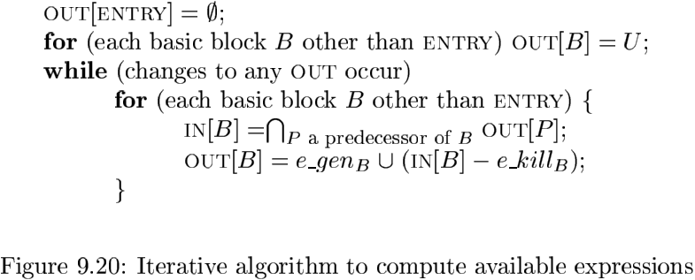
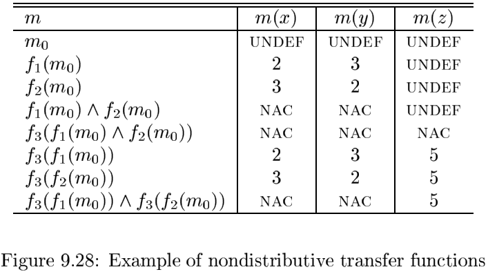
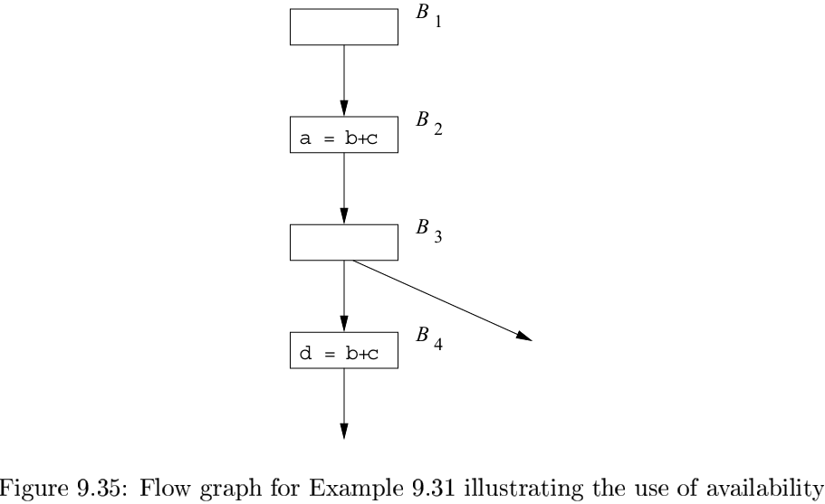
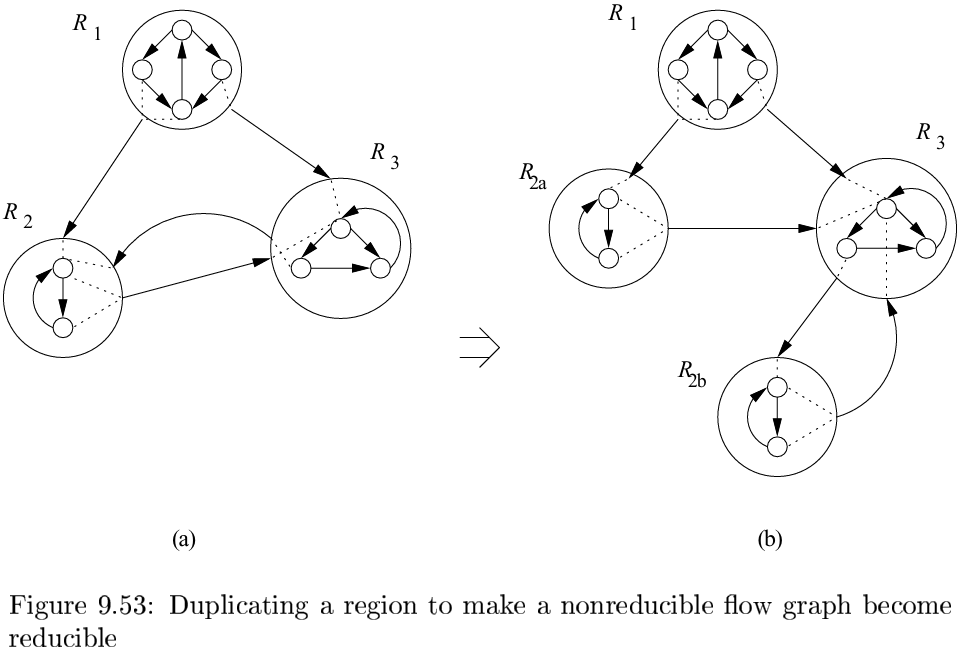

# 第九章 机器无关优化

## 9.1 优化的主要来源

### 9.1.1 冗余的原因

### 9.1.2 一个贯穿本章的例子：快速排序

### 9.1.3 保持语义不变的转换

### 9.1.4 全局公共子表达式

如果表达式$E$在某次出现之前已经被计算过，并且$E$中变量的值从那次计算之后就一直没被改变，那么$E$的该次出现就称为一个`公共子表达式（common subexpression）`。

### 9.1.5 复制传播

`复制语句（copy statement）`。

### 9.1.6 死代码消除

如果一个变量在某一程序点上的值可能会在以后被使用，那么我们就说这个变量在该点上活跃（live）。否则，它在该点上就是死的（dead）。

### 9.1.7 代码移动

减少循环内部代码数量的一个重要改动是`代码移动（code motion）`。这个转换处理的是那些不管循环执行多少次都得到相同结果的表达式（即循环不变计算），在进入循环之前就对它们求值。

### 9.1.8 归纳变量和强度消减

对于一个变量$x$，如果存在一个正的或负的常数$c$使得每次$x$被赋值时它的值总是增加$c$，那么$x$就称为”归纳变量“。

把一个高代价的运算（比如乘法）替换为一个代价较低的运算（比如加法）的转换被称为`强度消减（strength reduction）`。

### 9.1.9 9.1节的练习

## 9.2 数据流分析简介

### 9.2.1 数据流抽象

我们把从点$p_1$到点$p_n$的一个执行路径（excution path，简称路径）定义为满足下列条件的点的序列$p_1, p_2, \cdots, p_n$：对于每个$i = 1, 2, \cdots, n - 1$：

1. 要么$p_i$是紧靠在一个语句前面的点，且$p_{i+1}$是紧跟在该语句后面的点。
2. 要么$p_i$是某个基本块的结尾，且$p_{i+1}$是该基本块的一个后继基本块的开头。

### 9.2.2 数据流分析模式

一个赋值语句之前和之后的数据流值的关系被称为`传递函数（transfer function）`。

**传递函数**

传递函数有两种风格：信息可能沿着执行路径向前传播，或者沿着执行路径逆向流动。也就是：
$$
OUT[s] = f_s(IN[s]) \\
IN[s] = f_s(OUT[s])
$$
**控制流约束**

如果一个基本块$B$由语句$s_1, s_2, \cdots, s_n$顺序组成，那么$s_i$输出的控制流值和输入$s_{i+1}$的控制流值相同。也就是：
$$
IN[s_{i+1}] = OUT[s_i] \qquad i = 1, 2, \cdots, n - 1
$$

### 9.2.3 基本块上的数据流模式

### 9.2.4 到达定值

**算法 9.11** 到达定值。

输入：一个流图，其中每个基本块$B$的$kill_{B}$集和$gen_{B}$集都已经计算出来。

输出：到达流图中各个基本块$B$的入口点和出口点的定值的集合，即$IN[B]$和$OUT[B]$。

方法：TODO

### 9.2.5 活跃变量分析

在`活跃变量分析（live-variable analysis）`中，我们希望制导对于变量$x$和程序点$p$，$x$在点$p$上的值是否会在流图中的某条从点$p$出发的路径中使用。

活跃变量信息的重要用途之一是为基本块进行寄存器分配。

我们给出下面的定义：

1. $def_{B}$是指如下变量的集合，这些变量在$B$中的定值（即被明确地赋值）先于任何对它们的使用。
2. $use_{B}$是指如下变量的集合，它们的值可能在$B$中先于任何对它们的定值被使用。

**算法 9.14** 活跃变量分析。

输入：一个流图，其中每个基本块的$use$和$def$已经计算出来。

输出：该流图的各个基本块$B$的入口和出口处的活跃变量集合，即$IN[B]$和$OUT[B]$。

方法：

### 9.2.6 可用表达式

下面的方程给出了未知的$IN$和$OUT$值之间，以及它们和已知量$e_gen$与$e_kill$之间的关系：
$$
OUT[ENTRY] = \empty
$$
并且对于除$ENTRY$之外的所有基本块$B$，有：
$$
OUT[B] = e_gen_{B} \cup (IN[B] - e_kill_{B}) \\
IN[B] = \cap_{P是B的一个前驱}OUT[P]
$$
**算法 9.17** 可用表达式。

输入：一个流图，对其中的每个基本块$B$，$e\_kill_{B}$和$e\_gen_{B}$的值已经计算得到。流图的初始基本块是$B_1$。

输出：在流图的各个基本块$B$的入口处和出口处的可用表达式集合，即$IN[B]$和$OUT[B]$。

方法：

### 9.2.7 小结

### 9.2.8 9.2节的练习

## 9.3 数据流分析基础

一个数据流分析框架$(D, \bigvee, \bigwedge, F)$由下列元素组成：

1. 一个数据流方向$D$，它的取值包括$FORWARD(向前)$或$BACKWARD(逆向)$。
2. 一个半格，它包括值集$\bigvee$和一个交汇运算$\bigwedge$。
3. 一个从$\bigvee$到$\bigvee$的传递函数族$F$。这个传递函数族中必须包括可用于刻划边界条件的函数，即作用域任何数据流图中的特殊节点$ENTRY$和$EXIT$的常值传递函数。

### 9.3.1 半格

`半格（semilattice）`是满足下列条件的一个集合$\bigvee$和一个二元交汇运算$\bigwedge$。对于$\bigvee$中的所有$x$， $y$和$z$：

1. $x \bigwedge x = x$（交汇运算是等幂的）。
2. $x \bigwedge y = y \bigwedge x$（交汇运算是可变换的）。
3. $x \bigwedge (y \bigwedge z) = (x \bigwedge y) \bigwedge z$（交汇运算是符合结合律的）。

`偏序（partial order）` 假设$\leqslant$为$\bigvee$上的一个关系，如果对于$\bigvee$上的所有$x$, $y$和$z$都有：

1. $x \leqslant x$（该偏序是自反的）。
2. 如果$x \leqslant y$且$y \leqslant x$，那么$x = y$（该偏序是反对称的）。
3. 如果$x \leqslant y$且$y \leqslant z$，那么$x \leqslant z$（该偏序是传递的）

`半格的偏序` 对于$\bigvee$中的所有$x$和$y$，我们定义$x \leqslant y$当且仅当$x \bigwedge y = x$，因为交汇运算$\bigwedge$是等幂的，可交换的且满足集合律，上面定义的序$\leqslant$就是自反的，反对称和传递的。原因如下：

- 自反性：即对于所有的$x, x \leqslant x$。因为交汇运算是等幂的，因此$x \bigwedge x = x$。
- 反对称性：即如果$x \leqslant y$且$y \leqslant x$，那么$x = y$。在证明中，$x \leqslant y$意味着$x \bigwedge y = x$，而$y \leqslant x$意味着$y \bigwedge x = y$。根据$\bigwedge$的可交换性，$x = (x \bigwedge y) = (y \bigwedge x) = y$。
- 传递性：即如果$x \leqslant y$且$y \leqslant z$，那么$x \leqslant z$。证明如下：$x \leqslant y$且$y \leqslant z$意味着$x \bigwedge y = x$且$y \bigwedge z = y$。那么使用交汇运算的结合律得到$(x \bigwedge z) = ((x \bigwedge y) \bigwedge z) = (x \bigwedge (y \bigwedge z)) = (x \bigwedge y) = x$。因为已经证明了$x \bigwedge z = x$，我们有$x \leqslant z$，从而证明了传递性。

假设$(\bigvee, \bigwedge)$是一个半格。域元素$x$和$y$的最大下界（greatest lower bound, glb）是一个满足下列条件的元素$g$：

1. $g \leqslant x$
2. $g \leqslant y$
3. 如果$z$是使用$z \leqslant x$且$z \leqslant y$成立的元素，那么$z \leqslant g$。

**格图** 格图的节点是$\bigvee$的元素，而它的边是向下的，即如果$y \leqslant x$，那么从$x$到$y$有一个边。

**乘积格** 假设$\{A, \bigwedge_{A}\}$和$\{B, \bigwedge_{B}\}$是两个（半）格。这两个格的乘积格定义如下：

1. 乘积格的域是$A \times B$。

2. 乘积格的交汇运算$\bigwedge$定义如下：

   如果$(a, b)$和$(a', b')$是乘积格域中的元素，那么：
   $$
   (a, b) \bigwedge (a', b') = (a \bigwedge_{A}a', b \bigwedge_{B}b')
   $$
   乘积格的偏序可以很简单地用$A$的偏序$\leqslant_{A}$和$B$的偏序$\leqslant_{B}$来表示：
   $$
   (a, b) \leqslant (a', b') 当且仅当 a \leqslant_{A}a'且b \leqslant_{B}b'
   $$

偏序集($\bigvee$, $\leqslant$)的一个上升链（ascending chain）是一个满足$x_1 < x_2 < \cdots < x_n$的序列。一个半格的高度（height）是所有上升链中的$<$关系个数的最大值。

### 9.3.2 传递函数

一个数据流框架中的传递函数族$F: V \rightarrow V$具有下列性质：

1. $F$有一个单元函数$I$，使得对于$V$中的所有$x, I(x) = x$。
2. $F$对函数组合运算封闭。也就是说，对于$F$中的任意函数$f$和$g$，定义为$h(x) = g(f(x))$的函数$h$也在$F$中。

一个数据流框架$(D, F, V, \bigwedge)$是单调的（monotone），如果
$$
对于所有的V中的x和y以及F中的f, x \leqslant y 蕴含f(x) \leqslant f(y) \qquad (9.22)
$$
单调性可以被等价地定义为：
$$
对于所有的V中的x和y以及F中的f, f(x \bigwedge y) \leqslant f(x) \bigwedge f(y) \qquad (9.23)
$$
**可分配的框架** 数据分析框架遵守`可分配条件（distributivity condition）`，即对于$V$中的所有$x$和$y$以及$F$中的所有$f$，有：$f(x \bigwedge y) = f(x) \bigwedge f(y)$。

### 9.3.3 通用框架的迭代算法

**算法 9.25** 通用数据流框架的迭代解法。

输入：一个由下列部分组成的数据流框架：

1. 一个数据流图，它有两个被特别标记为$ENTRY$和$EXIT$的节点。
2. 数据流的方向$D$。
3. 一个值集$V$。
4. 一个交汇运算$\bigwedge$。
5. 一个函数的集合$F$，其中$f_{B}$表示基本块$B$的传递函数。
6. $V$中的一个常量值$v_{ENTRY}$或者$v_{EXIT}$。它们分表表示前向和逆向框架的边界条件。

输出：上述数据流图中各个基本块$B$的$IN[B]$和$OUT[B]$的值。这些值在$V$中。

方法：

### 9.3.4 数据流解的含义

**理想解** 对于一个流图中的每个基本块$B$，令$f_B$是$B$的传递函数。考虑任意从初始节点$ENTRY$到某个基本块$B_k$中的路径
$$
P = ENTRY \rightarrow B_1 \rightarrow B_2 \rightarrow \cdots \rightarrow B_{k - 1} \rightarrow B_k
$$
程序的路径可能包含环，因此一个基本块可能在路径$P$中多次出现。

按照问题中数据流框架的格理论偏序关系$\leqslant$，我们有下面的结论：

- 任何比IDEAL更大的答案都是错误的。
- 任何小于或者等于这个理想值的值都是保守的，即安全的。

### 9.3.5 9.3节的练习

## 9.4 常量传播

### 9.4.1 常量传播框架的数据流值

对于所有的值$v$，有
$$
UNDEF \bigwedge v = v 且 NAC \bigwedge v = NAC
$$
对于任意的常量$c$，有
$$
c_1 \bigwedge c_2 = NAC
$$

### 9.4.2 常量传播框架的交汇运算

$m \leqslant m'$当且仅当对于所有的变量$v$都有$m(v) \leqslant m'(v)$。换句话说，$m \bigwedge m' = m''$当且仅当对于所有的变量$v, m(v) \bigwedge m'(v) = m''(v)$。

### 9.4.3 常量传播框架的传递函数

一般来说，令$f_s$为语句$s$的传递函数，并令$m$和$m'$表示满足$m' = f_s(m)$的两个数据流值。我们将用$m$和$m'$之间的关系来描述$f_s$。

1. 如果$s$不是一个赋值语句，那么$f_s$就是单元函数。

2. 如果$s$是一个对变量$x$的赋值，那么对于所有变量$v \neq x, m'(v) = m(v)$；其中$m'(x)$的定义如下：

   - 如果语句$s$的右部（RHS）是一个常量$c$，那么$m'(x) = c$。

   - 如果RHS形如$y + z$，那么
     $$
     m'(x)
     \begin{cases}
     m(y) + m(z) &如果m(y)和m(z)都是常量值\\
     NAC &如果m(y)或者m(z)是NAC\\
     UNDEF &否则\\
     \end{cases}
     $$

   - 如果RHS是其他表达式（比如一个函数调用，或者使用指针的赋值），那么$m'(x) = NAC$。

### 9.4.4 常量传递框架的单调性

### 9.4.5 常量传播框架的不可分配性

令$f_1, f_2, f_3$分别是代表基本块$B_1, B_2, B_3$的传递函数，有：
$$
f_3(f_1(m_0) \bigwedge f_2(m_0)) < f_3(f_1(m_0)) \bigwedge f_3(f_2(m_0))
$$
体现了这个框架的不可分配性。

### 9.4.6 对算法结果的解释

### 9.4.7 9.4节的练习

## 9.5 部分冗余消除

### 9.5.1 冗余的来源

### 9.5.2 可能消除所有冗余吗

### 9.5.3 懒惰代码移动问题

我们期望使用部分冗余消除算法进行优化而得到的程序能够具有下列性质：

1. 所有不复制代码就可以消除的表达式冗余计算都被消除掉了。
2. 优化后的程序不会执行原来的程序中不执行的任何计算。
3. 表达式的计算时刻应该尽量靠后。

### 9.5.4 表达式的预期执行

### 9.5.5 懒惰代码移动算法

一个表达式在一个基本块的出口处可用的条件有两个：

1. 下列条件之一成立：
   - 在入口处可用。
   - 在基本块的入口处所预期执行的表达式集合中（即如果我们选择在入口处计算这个表达式，它就会在入口处变得可用）。
2. 没有被这个基本块杀死。

**算法 9.36** 懒惰代码移动。

输入：一个流图，其中每个基本块$B$的$e\_use_{B}$和$e\_kill_{B}$已经计算得到了。

输出：一个经过修改且满足9.5.3节所描述的懒惰代码移动的四个条件的数据流图。

方法：

1. 在每条进入某个具有多个前驱的基本块的边上插入一个空基本块。

2. 按照9-34a中的定义，计算出所有基本块$B$的$anticipated[B].in$的值。

3. 按照9-34b中的定义，计算除所有基本块$B$的$available[B].in$的值。

4. 为每个基本块$B$计算它的最早放置位置；
   $$
   earliest[B] = anticipated[B].in - available[B].in
   $$

5. 按照图9-34c的定义，计算出所有基本块$B$的$postponable[B].in$的值。

6. 计算所有基本块$B$的最后放置集合：
   $$
   latest[B] = (earliest[B] \cup postponable[B].in) \cap (e\_use_{B} \cap \neg (\cup_{S在succ[B]中}(earliest[S] \cup postponable[S].in)))
   $$
   请注意，其中的$\neg$表示的是以程序中所计算的全部表达式的集合作为全集的补集运算。

7. 按照图9-34d中的定义，找到所有基本块$B$的$used[B].out$值。

8. 对于程序计算的每个表达式，比如$x + y$，做下列处理：

   - 为$x + y$创建一个新的临时变量，比如说$t$。
   - 对于所有基本块$B$，如果$x + y$在$latest[B] \cap used[B].out$中，就把$t = x + y$加入到$B$的开头。
   - 对于所有基本块$B$，如果$x + y$在集合$e\_use_{B} \cap (\neg latest[B] \cup used.out[B])$中，就用$t$来替换原来的每个$x + y$。

### 9.5.6 9.5节的练习

## 9.6 流图中的循环

### 9.6.1 支配节点

如果每一条从流图的入口节点到节点$n$的路径都经过节点$d$，我们就说$d$支配（dominate）$n$，记为$d\ dom\ n$。请注意，在这个定义下每个节点支配它自己。

一种有用的表示支配节点信息的方法是用所谓的`支配节点树(dominator tree)`来表示。在树中，入口节点就是根节点，并且每个节点$d$只支配它在树中的后代节点。如图所示：

支配节点的一个性质决定了一定存在支配节点树：每个节点$n$具有唯一的`直接支配节点(immediate dominator)m`。在从入口节点到达节点$n$的任何路径中，它是$n$的最后一个支配节点。用$dom$关系来表示，$n$的直接支配节点$m$具有以下性质：如果$d \neq n 且 d\ dom\ n, 那么d\ dom\ m$。

**算法 9.38** 寻找支配节点。

输入：一个流图$G$，$G$的节点集是$N$，边集是$E$，而入口节点是$ENTRY$。

输出：对于$N$中的各个节点$n$，给出$D(n)$，即支配$n$的所有节点的集合。

方法：

### 9.6.2 深度优先排序

**算法 9.41** 深度优先生成树和深度优先排序。

输入：一个流图$G$。

输出：$G$的一个DFST树$T$和$G$中节点的一个深度优先排序。

方法：

### 9.6.3 深度优先生成树中的边

当我们为一个流图构造DFST时，流图的边可以被分为三大类：

1. 前进边（advancing edge），即那些从一个节点$m$到达$m$在树中的一个真后代节点的边。
2. 有些边从一个节点$m$到达$m$在树中的某个祖先（包括$m$自身），我们将把这些边称为`后退边（retreating edge）`。
3. 对于有些边$m \rightarrow n$，在DFST中$m$和$n$都不是对方的祖先。我们把这种边称为`交叉边（cross edge）`。交叉边的一个重要性质是：如果我们把一个节点的子节点按照它们被加入到树中的顺序从左到右排列，那么所有的交叉边都是从右到左的。

### 9.6.4 回边和可归约性

### 9.6.5 流图的深度

### 9.6.6 自然循环

自然循环（natural loop）通过两个重要的性质来定义：

1. 它必须具有一个唯一的入口节点，称为循环头（header）。这个入口节点支配了循环中的所有节点，否则它就不会成为循环的唯一入口。
2. 必然存在一条进入循环头的回边，否则控制流就不可能从”循环“中直接回到循环头，也就是说实际上并没有循环。

**算法 9.46** 构造一条回边的自然循环。

输入：一个流图$G$和一条回边$n \rightarrow d$。

输出：由回边$n \rightarrow d$的自然循环中的所有节点组成的集合loop。

方法：令loop等于$\{n, d\}$。把$d$标记为"visited"，以便搜索过程不至于越过节点$d$。从节点$n$开始对输入的反向控制流图进行深度优先的搜索。把所有访问到的节点都加入loop。这个过程可以找到所有不经过$d$就可以到达$n$的节点。

### 9.6.7 迭代数据流算法的收敛速度

更明确地说：

- 如果一个定值$d$在$IN[B]$中，那么必然有一条从包含$d$的基本块到达$B$的无环路径使得$d$在该路径上的所有$IN$和$OUT$值中。
- 如果表达式$x + y$在基本块$B$的入口处不可用，那么必然有一条具有下列性质的无环路径：要么该路径从程序的入口节点出发并且不包含任何杀死或产生$x + y$的语句；要么该路径从一个杀死了$x + y$的基本块出发，并且从此之后该路径中没有产生表达式$x + y$。
- 如果$x$在基本块$B$的出口处活跃，那么必然有一个从$B$开始到达对$x$的某次使用的无环路径，在此路径上没有对$x$的定值。

### 9.6.8 9.6节的练习

## 9.7 基于区域的分析

### 9.7.1 区域

正式地讲，流图的一个区域是满足如下条件的一个节点集$N$和边集$E$：

1. 在$N$中有一个支配$N$中所有节点的头节点$h$。
2. 如果某个节点$m$能够不经过$h$到达$N$中的$n$，那么$m$也在$N$中。
3. $E$是所有位于$N$中的任意两个节点$n_1$和$n_2$之间的控制流边的集合。有些进入$h$的边（可能）不在其中。

### 9.7.2 可归约流图的区域层次结构

**算法 9.52** 构造一个可归约流图的自底向上的区域序列。

输入：一个可归约流图$G$。

输出：$G$的区域的列表，该列表可用于基于区域的数据流问题。

方法：

1. 一开始，列表中以某种顺序包含了由$G$的各个基本块组成的所有叶子区域。
2. 不断选择满足如下条件的自然循环$L$：如果$L$中包含了其他的自然循环，那么这些被包含的循环对应的循环体区域和循环区域已经被加入到列表中。首先把由$L$的循环体（即循环$L$中除了到达$L$的循环头的各条回边之外的其余部分）组成的区域加入到列表中，然后再加入$L$的循环区域。
3. 如果整个流图本身不是一个自然循环，在列表的最后加入由整个流图组成的区域。

### 9.7.3 基于区域的分析技术概述

### 9.7.4 有关传递函数的必要假设

### 9.7.5 一个基于区域的分析算法

**算法 9.5.3** 基于区域的分析。

输入：一个具有9.7.4节中所列性质的数据流框架和一个可归约流图$G$。

输出：$G$中的每个基本块$B$的数据流值$IN[B]$。

方法：

1. 使用算法9.52来构造$G$的自底向上的区域序列，假设它们是$R_1, R_2, \cdots, R_n$，其中$R_n$是最顶层的区域。

2. 进行自底向上的分析，计算概括了每个区域的执行效果的传递函数。对于按照自底向上顺序排列的每个区域$R_1, R_2, \cdots, R_n$，进行下列计算：

   - 如果$R$是一个对应于基本块$B$的叶子区域，令$f_{R, IN[B]} = I, f_{R, OUT[B]} = f_{B}$。其中，$f_B$是基本块$B$的传递函数。
   - 如果$R$是一个循环体区域，执行下图a的计算。
   - 如果$R$是一个循环区域，执行下图b的计算。

3. 进行自顶向下的扫描，找出各个区域开始处的数据流值。

   - $IN[R_n] = IN[ENTRY]$。

   - 按照自顶向下的顺序，对$\{R_1, R_2, \cdots, R_{n - 1}\}$中的每个区域$R$计算
     $$
     IN[R] = f_{R', IN[R]}(IN[R'])
     $$
     其中$R'$是直接包含区域$R$的区域。

### 9.7.6 处理不可归约流图

### 9.7.7 9.7节的练习

## 9.8 符号分析

### 9.8.1 参考变量的放射表达式

### 9.8.2 数据流问题的公式化

**单个语句的传递函数**

一个语句$s$的传递函数记为$f_x$，其定义如下：

1. 如果$s$不是一个赋值语句，那么$f_s$就是一个单元函数。

2. 如果$s$是一个对$x$赋值的语句，那么
   $$
   f = 
   \begin{cases}
   m(v) &对于所有的变量u \neq x \\
   c_0 + c_1m(y) + c_2m(z) &如果x被赋值为c_0 + c_1y + c_2z, (c_1 = 0, 或者m(y) \neq NAA)，并且(c_2 = 0, 或者m(z) \neq NAA) \\
   NAA &否则
   \end{cases}
   $$
   其中表达式$c_0 + c_1m(y) + c_2m(z)$用来表示所有可能出现在对$x$赋值的语句的右部，关于变量$y$和$z$的各种形式的表达式。

**传递函数的组合**

令$f_1$和$f_2$是两个以其输入映射$m$来定义的传递函数。为了计算$f_2 \cdot f_1$，我们把$f_2$的定义中的$m(v_i)$的值替换为$f_1(m)(v_i)$的定义。我们把$f_2$的定义中的$m(v_1)$的值替换为$f_1(m)(v_i)$的定义。我们把所有对NAA的运算都替换为NAA。也就是：

1. 如果$f_2(m)(v) = NAA$，那么($f_2 \cdot f_1$)(m)(v) = NAA。

2. 如果$f_2(m)(v) = c_0 + \sum_{i}c_im(v_i)$，那么
   $$
   (f_2 \cdot f_1)(m)(v) =
   \begin{cases}
   NAA &如果对于某个i \neq 0, c_i \neq 0 且f_1(m)(v_i) = NAA \\
   c_0 + \sum_i c_i f_1(m)(v_i) &否则
   \end{cases}
   $$

### 9.8.3 基于区域的符号化分析

**传递函数的交汇运算**

当计算两个函数的的交时，除非两个函数把一个变量映射成同一个不是NAA的值，这个变量的值就是NAA。因此
$$
(f_1 \bigwedge f_2)(m)(v) = 
\begin{cases}
f_1 (m) (v) &如果f_1(m)(v) = f_2(m)(v) \\
NAA &否则
\end{cases}
$$
**算法 9.63** 基于区域的符号化分析。

输入：一个可归约的流图$G$。

输出：$G$的每个基本块$B$的符号化映射$IN[B]$。

方法：我们对算法9.53做出如下修改：

1. 我们改变了为一个循环区域构造传递函数的方法。
2. 如果一个区域的迭代次数已知，该区域的执行效果的描述是把上面定义中的$i$替换为实际迭代次数。
3. 在算法的自顶向下处理过程中，我们计算$f_{R, i, IN[s]}$就可以找出与一个循环的第$i$次迭代的入口处相关的符号化映射。
4. 如果一个变量的输入值$m(v)$被区域$R$中的某个符号化映射的右部使用，并且在该区域的入口处$m(v) = NAA$，则我们引入一个新的参考变量$t$，在区域$R$的开始处加上赋值语句$t = v$，并且所有对$m(v)$的引用都被替换为$t$。如果我们不在这个点上引入一个参考变量，那么$v$的取值NAA将被传递到内层循环。

### 9.8.4 9.8节的练习

## 9.9 第九章总结

## 9.10 参考文献

