# Chapter1 Computer Networks and the Internet

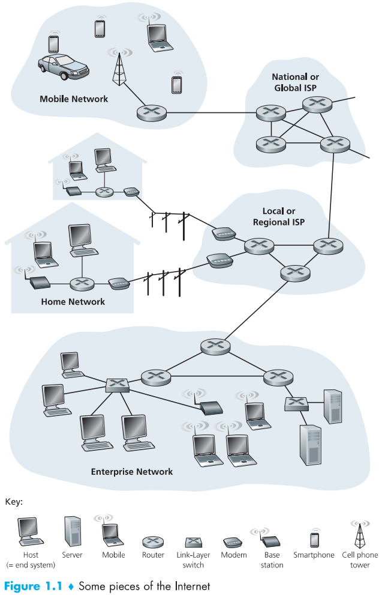

End systems are connected together by a network of `communication links` and `packet switches`. 

Different links can transmit data at different rates, with the transmission rate of a link measured in bits/second. When one end system has data to send to another end system, the sending end system segments the data and adds header bytes to each segment. The resulting packages of information, known as `packets` in the jargon of computer networks, are then sent through the network to the destination end system, where they are reassembled into the original data.

End systems access the Internet through `Internet Service Providers (ISPs)`.

End systems, packet switches, and other pieces of the Internet run `protocols` that control the sending and receiving of information within the Internet. The `Transmission Control Protocol (TCP)` and the `Internet Protocol (IP)` are two of the most important protocols in the Internet. The IP protocol specifies the format of the packets that are sent and received among routers and end systems.

The applications are said to be `distributed applications`, since they involve multiple end systems that exchange data with each other.

End systems attached to the Internet provide an `Application Programming Interface(API)` that specifies how a program running on one end system asks the Internet infrastructure to deliver data to a specific destination program running on another end system.

**A protocol defines the format and the order of messges exchanged between two or more communicating entities, as well as the actions taken on the transmission and/or receipt of a message or other event.**

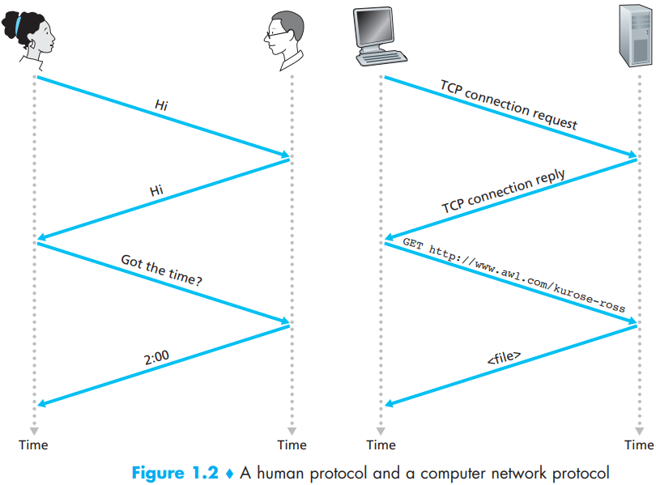

End systems are also referred to as `hosts` because they host application programs. Hosts are sometimes further divided into two categories: `clients` and `servers`.

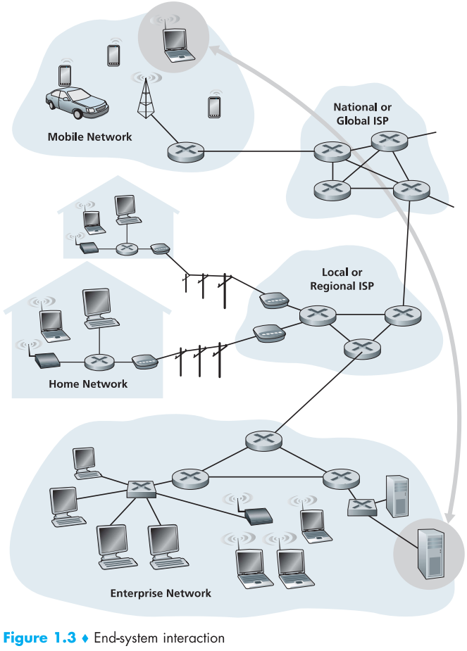

In a network application, end systems exchange `messages` with each other. To send a message from a source end system to a destination end system, the source breaks long messages into smaller chunks of data known as `packets`. Between source and destination, each packet travels through communication links and `packet switches`(for which there are two predominant types, `routers` and `linklayer switches`). Packets are transmitted over each communication link at a rate equal to the `full` transmission rate of the link. So, if a source end system or a packet switch is sending a packet of $L$ bits over a link with transmission rate $R$ bits/sec, then the time to transmit the packet is $L/R$ seconds.

Most packet switches use `store-and-forward transmission` at the inputs to the links. Store-and-forward transmission means that the packet switch must receive the entire packet before it can begin to transmit the first bit of the packet onto the outbound link.

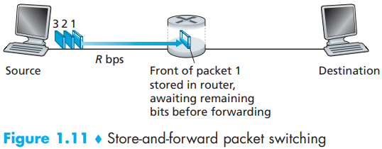

Sending one packet from source to destination over a path consisting of $N$ links each of rate $R$(thus, there are $N - 1$ routers between source and destination). Applying the same logic as above, we see that the end-to-end delay is:
$$
d_{end-to-end} = N \frac{L}{R} \qquad (1.1)
$$
`queuing delays`. These delays are variable and depend on the level of congestion in the network. Since the amount of buffer space is finite, an arriving packet may find that the buffer is completely full with other packets waiting for transmission. In this case, `packet loss` will occur--either the arriving packet or one of the already-queued packets will be dropped.

There are two fundamental approaches to moving data through a network of links and switches: `circuit switching` and `packet switching`. 

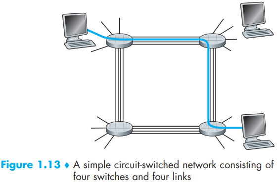

A circuit in a link is implemented with either `frequency-division multiplexing (FDM)` or `time-division multiplexing (TDM)`. With FDM, the frequency spectrum of a link is divided up among the connections established across the link.

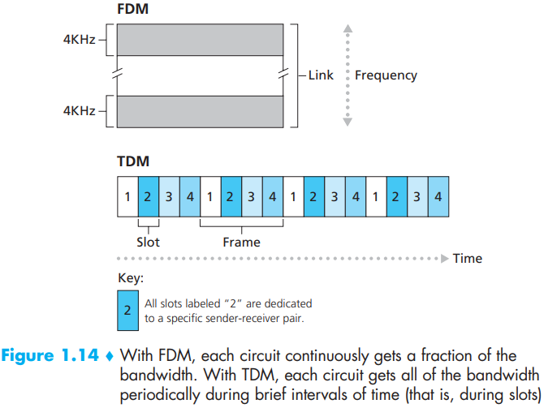

As a packet travels from one node (host or router) to the subsequent node (host or router) along this path, the packet suffers from several types of delays at each node along the path. The most important of these delays are:

- `Processing Delay`.
- `Queuing Delay`.
- `Transmission Delay`.
- `Propagation Delay`.

If we let $d_{proc}$, $d_{queue}$, $d_{trans}$, and $d_{prop}$ denote the processing, queuing, transmission, and propagation delays, then the total nodal delay is given by:
$$
d_{nodal} = d_{proc} + d_{queue} + d_{trans} + d_{prop}
$$
The contribution of these delay components can vary significantly.

As the traffic intensity approaches 1, the average queuing delay increases rapidly. A small percentage increase in the intensity will result in a much larger percentage-wise increase in delay.

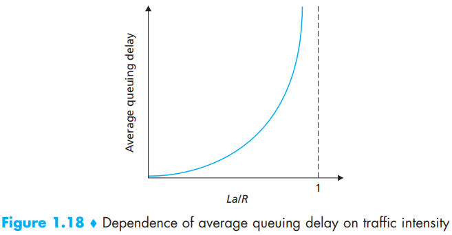

Suppose there are $N - 1$ routers between the source host and the destination host. Let's also suppose for the moment that the network is uncongested (so that queuing delays are negligible), the processing delay at each router and at the source host is $d_{proc}$, the transmission rate out of each router and out of the source host is $R$ bits/sec, and the propagation on each link is $d_{prop}$. The nodal delays accumulate and give an end-to-end delay,
$$
d_{end-end} = N(d_{proc} + d_{trans} + d_{prop}) \qquad (1.2)
$$
where, once again, $d_{trans} = L/R$, where $L$ is the packet size.

The `instantaneous throughput` at any instant of time is the rate (in bits/sec) at which Host B is receiving the file. If the file consists of $F$ bits and the transfer takes $T$ seconds for Host $B$ to receive all $F$ bits, then th `average throughput` of the file transfer is $F/T$ bits/sec.

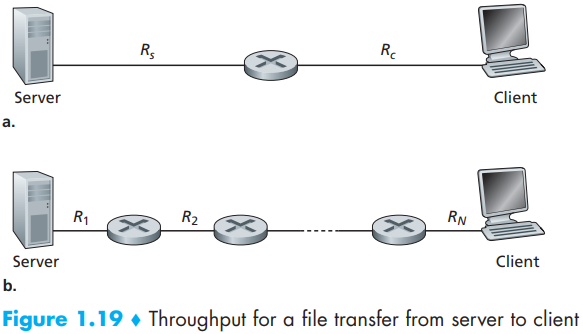

Network designers organize protocols--and the network hardware and software that implement the protocols in `layers`. the protocols of the various layers are called the `protocol stack`. 

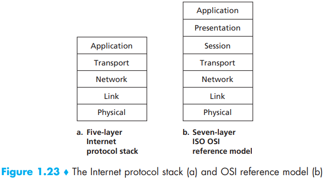

- Application
- Transport
- Network
- Link
- Physical

Data takes down a sending end system's protocol stack, up and down the protocol stacks of an intervening link-layer switch and router, and then up the protocol stack at the receiving end system. 

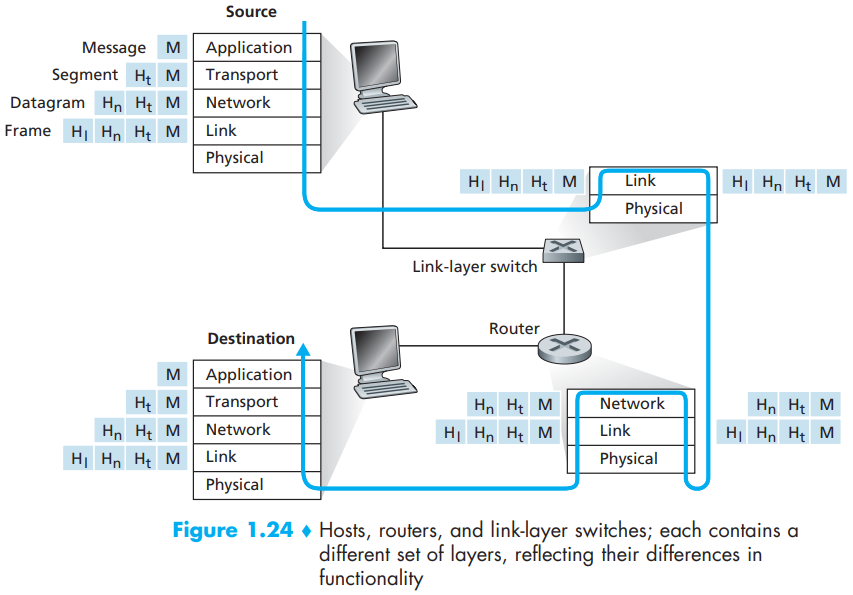

`self-replicating`: once it infects one host, from that host it seeks entry into other hosts over the Internet, and from the newly infected hosts, it seeks entry into yet more hosts.

`Viruses` are malware that require some form of user interaction to infect the user's device.

`Worms` are malware that can enter a device without any explicit user interaction.

`denial-of-service (DoS) attacks` attack renders a network, host, or other piece of infrastructure unusable by legitimate users. Most Internet DoS attacks fall into one of three categories:

- Vulnerability attack.
- Bandwidth flooding.
- Connection flooding.

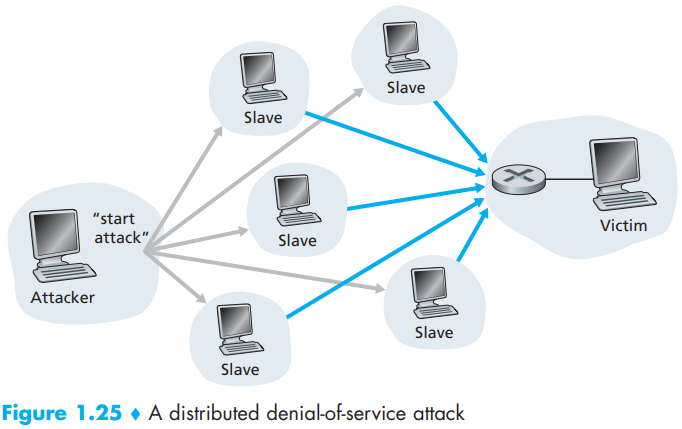

## Summary

TODO