# Chapter 2 Application Layer

[TOC]

The application architecture, on the other hand, is designed by the application developer and dictates how the application is structured over the various end systems.

In a `client-server` architecture, there is an always-on host, called the `server`, which services requests from many other hosts, called `clients`.

In a `P2P architecture`, there is minimal (or no) reliance on dedicated servers in data centers. Instead, the application exploits direct communication between pairs of intermittently connected hosts, called `peers`.

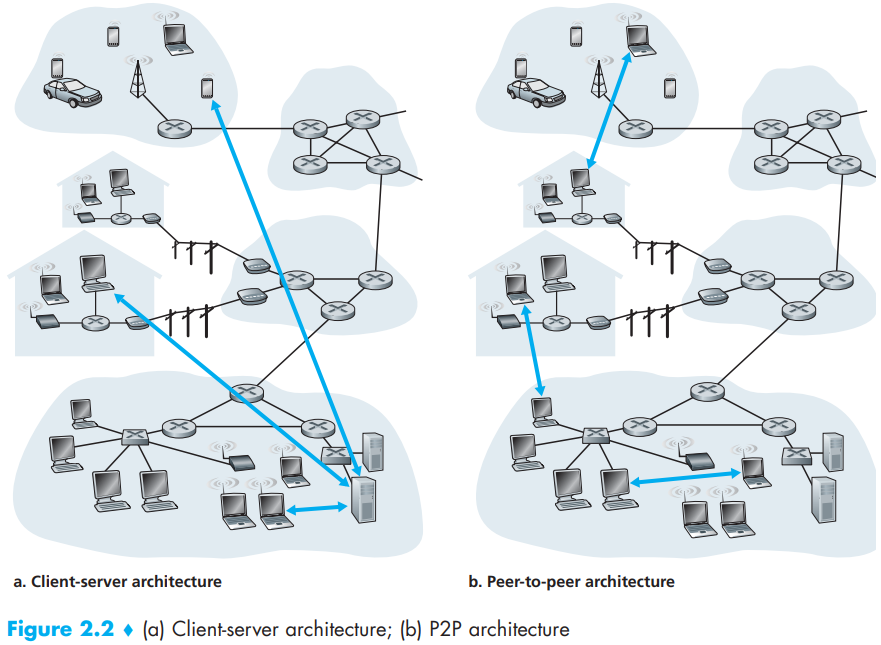

The services that a transport-layer protocol can offer the possible services along four dimensions:

- Reliable Data Transfer.
- Throughput.
- Timing.
- Security.

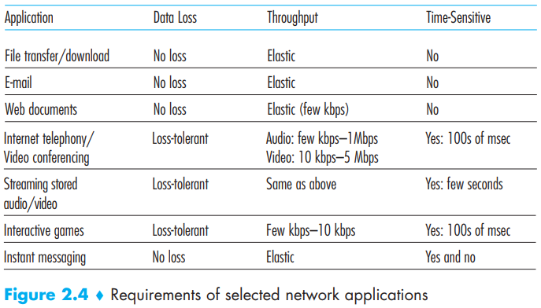

The TCP service model includes a connection-oriented service and a reliable data transfer service. When an application invokes TCP as its protocol, the application receives both of these services from TCP:

- Connection-oriented service.
- Reliable data transfer service.

UDP is a no-frills, lightweight transport protocol, providing minimal services, includeing: an unreliable data transfer service. Does not include a congestion-control mechanism, so the sending side of UDP can pump data into the layer below (the network layer) at any rate it pleases.

An `application-layer protocol` defines how an application's processes, running on different end systems, pass messages to each other. In particular, an application-layer protocol defines:

- The types of messages exchanged.
- The syntax of the various message types.
- The semantics of the fields, that is, the meaning of the information in the fields.
- Rules for determining when and how a process sends messages and responds to messages.

The `HyperText Transfer Protocol (HTTP)`, the Web's application-layer protocol, is at the heart of the Web.

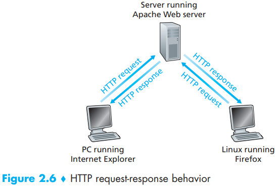

`round-trip time (RTT)`, which is the time it takes for a small packet to travel from client to server and then back to the client. The `RTT` includes packet-propagation delays, packet-queuing delays in intermediate routers and switches, and packet-processing delays.

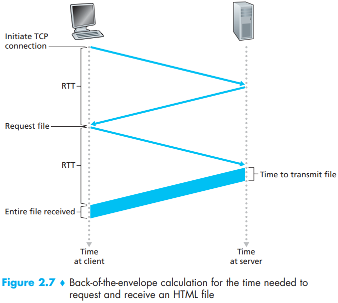

Non-persistent connections have some shortcomings:

- First, a brand-new connection must be established and maintained for `each requested object`.
- Second, as we just described, each object suffers a delivery delay of two RTTs, one RTT to establish the TCP connection and one RTT to request and receive an object.

There are two types of HTTP messages, request messages and response messages, both of which are discussed below:

- HTTP Request Message

  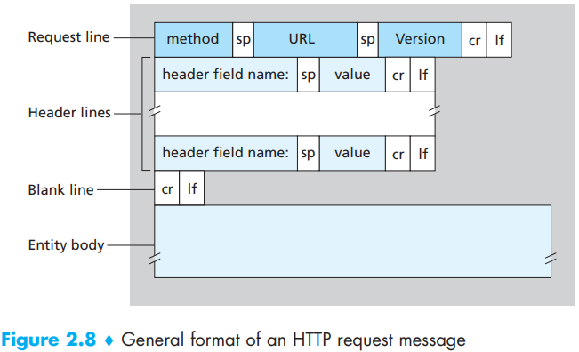

- HTTP Response Message

  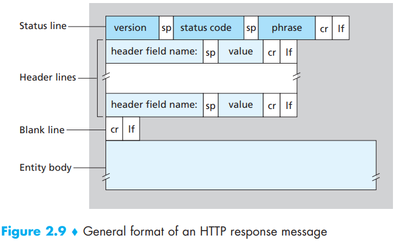

Cookies allow sites to keep track of users. Cookie technology has four components:

1. a cookie header line in the HTTP response message;
2. a cookie header line in the HTTP request message;
3. a cookie file kept on the user's end system and managed by the user's browser;
4. a back-end database at the website.

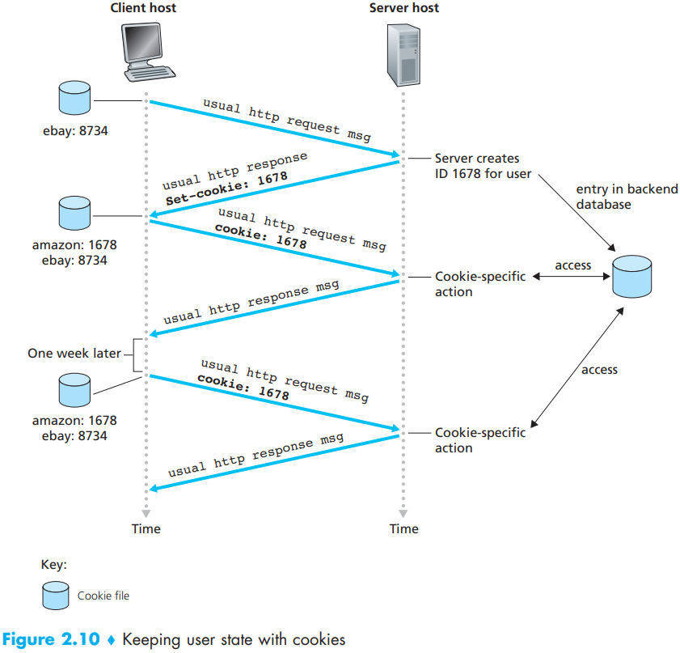

A `Web cache` -- also called a `proxy server` -- is a network entity that satisfies HTTP requests on behalf of an origin Web server. The Web cache has its own disk storage and keeps copies of recently requested objects in this storage.

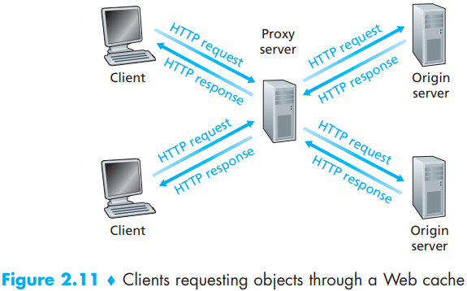

The Domain Name System (DNS)` is :

1. A distributed database implemented in a hierarchy of `DNS servers`
2. An application-layer protocol that allows hosts to query the distributed database.

The DNS's main task is to provide a directory service that translates hostnames to IP addresses and performs other tasks:

- Host aliasing.
- Mail server aliasing.
- Load distribution.

In order to deal with the issue of scale, the DNS uses a large number of servers, organized in a hierarchical fashion and distributed around the world. No single DNS server has all of the mappings for all of the hosts on the Internet. Instead, the mappings are distributed across the DNS servers. To a first approximation, there are three classes of DNS servers:

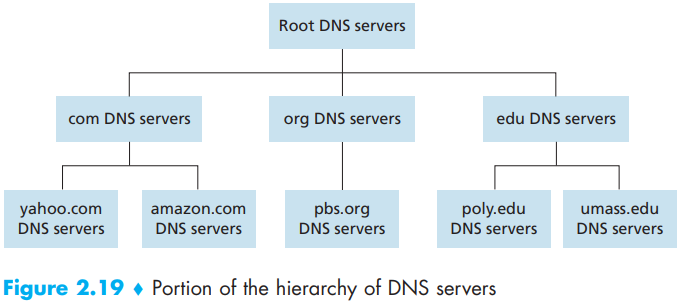

- Root DNS servers.
- Top-level domain (TLD) servers.
- Authoritative DNS servers.

DNS message format:

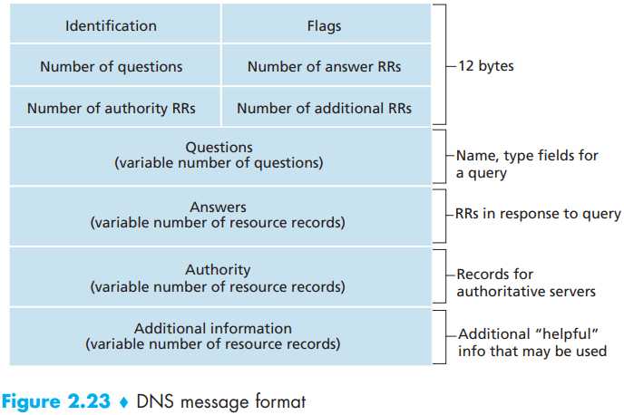

- The first 12 bytes is the `header section`, which has a number of fields. The first field is a 16-bit number that identifies the query. This identifier is copied into the reply message to a query, allowing the client to match received replies with sent queries. There are a number of flags in the flag field. A 1-bit query/reply flag indicates whether the message is a query (0) or a reply (1). A 1-bit authoritative flag is set in a reply message when a DNS server is an authoritative server for a queried name. A 1-bit recursion-desired flag is set when a client (host or DNS server) desires that the DNS server perform recursion when it doesn't have the record A 1-bit recursion available field is set in a reply if the DNS server supports recursion. In the header, there are also four number-of fields. These fields indicate the number of occurrences of the four types of data sections that follow the header.
- The `question section` contains information about the query that is being made. This section includes:
  1. a name field that contains the name that is being queried.
  2. a type field that indicates the type of question being asked about the name.
- In a reply from a DNS server, the `answer section` contains the resource records for the name that was originally queried. Recall that in each resource record, there is the Type, the Value, and the TTL. A reply can return multiple RRs in the answer, since a hostname can have multiple IP addresses.
- The `authority section` contains records of other authoritative servers.
- The `additional section` contains other helpful records.

Scalability of P2P Architectures: Denote the upload rate of the server's access link by $u_s$, the upload rate of the $i$the peer's access link by $u_i$, and the download rate of the $i$the peer's access link by $d_i$. Also, denote the size of the file to be distributed (in bits) by $F$ and the number of peers that want to obtain a copy of the file by $N$. The `distribution time` is the time it takes to get a copy of the file to all $N$ peers.

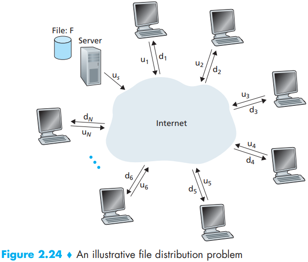

Let's first determine the distribution time for the client-server architecture, which we denote by $D_{cs}$. In the client-server architecture, none of the peers aids in distributing the file. We make the following observations:

- The server must transmit one copy of the file to each of the $N$ peers. Thus, the server must transmit $NF$ bits. Since the server's upload rate is $u_s$, the time to distribute the file must be at least $NF/u_s$.
- Let $d_{min}$ denote the download rate of the peer with the lowest download rate, that is, $d_{min} = min\{d_1, d_p, ..., d_N\}$. The peer with the lowest download rate cannot obtain all $F$ bits of the file in less than $F/d_{min}$ seconds. Thus the minimum distribution time is at least $F/d_{min}$.

Putting these two observations together, we obtain
$$
D_{cs} \geq max \lbrace \frac{NF}{u_s}, \frac{F}{d_{min}} \rbrace
$$
This provides a lower bound on the minimum distribution time for the client-server architecture. So Let's take this lower bound provided above as the actual distribution time, that is
$$
D_{cs} = max\{\frac{NF}{u_s}, \frac{F}{d_{min}}\} \qquad (2.1)
$$
We see from Equation 2.1 that for $N$ large enough, the client-server distribution time is given by $NF/u_s$. Thus, the distribution time increase linearly with the number of peers $N$.

Calculating the distribution time for the P2P architecture is somewhat more complicated than for the client-server architecture, since the distribution time depends on how each peer distributes portions of the file to the other peers. Nevertheless, a simple expression for the minimal distribution time can be obtained [Kumar 2006]. To this end, we first make the following observations:

- At the beginning of the distribution, only the server has the file. To get this file into the community of peers, the server must send each bit of the file at least once into its access link. Thus, the minimum distribution time is at least $F/u_s$. (Unlike the client-server scheme, a bit sent once by the server may not have to be sent by the server again, as the peers may redistribute the bit among themselves.)
- As with the client-server architecture, the peer with the lowest download rate cannot obtain all $F$ bits of the file in less than $F/d_{min}$ seconds. Thus the minimum distribution time is at least $F/d_{min}$.
- Finally, observe that the total upload capacity of the system as a whole is equal to the upload rate of the the server plus the upload rates of each of the individual peers, that is, $u_{total} = u_s + u_1 + ... + u_N$. The system must deliver (upload) $F$ bits to each of the $N$ peers, thus delivering a total of $NF$ bits. This cannot be done at a rate faster than $u_{total}$. Thus, the minimum distribution time is also at least $NF/(u_s + u_1 + ... + u_N)$.

Putting these three observations together, we obtain the minimum distribution time for P2P, denoted by $D_{p2p}$:
$$
D_{p2p} \geq max \{\frac{F}{u_s}, \frac{F}{d_{min}}, \frac{NF}{u_s + \sum_{i=1}^{N}u_i}\} \qquad (2.2)
$$
Equation 2.2 provides a lower bound for the minimum distribution time for the P2P architecture. It turns out that if we imagine that each peer can redistribute a bit as soon as it receives the bit, then there is a redistribution scheme that actually achieves this lower bound [Kumar 2006]. In reality, where chunks of the file are redistributed rather than individual bits, Equation 2.2 serves as a good approximation of the actual minimum distribution time. Thus, let's take the lower bound provided by Equation 2.2 as the actual minimum distribution time, that is:
$$
D_{P2P} = max\{ \frac{F}{u_s}, \frac{F}{d_{min}}, \frac{NF}{u_s + \sum_{i=1}^{N} u_i} \} \qquad (2.3)
$$
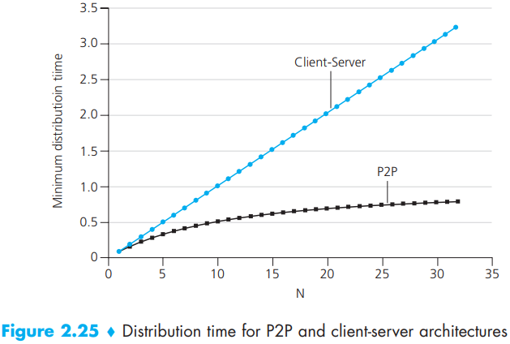

BitTorrent is a popular P2P protocol for the distribution.

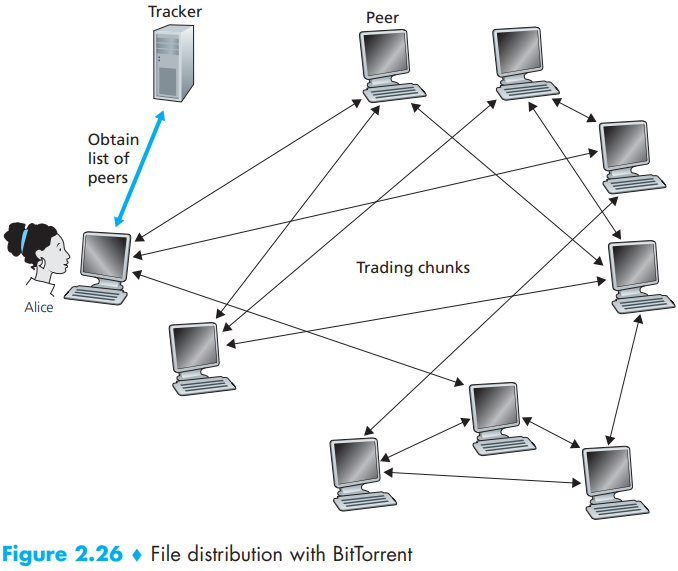

Socket Programming with UDP:

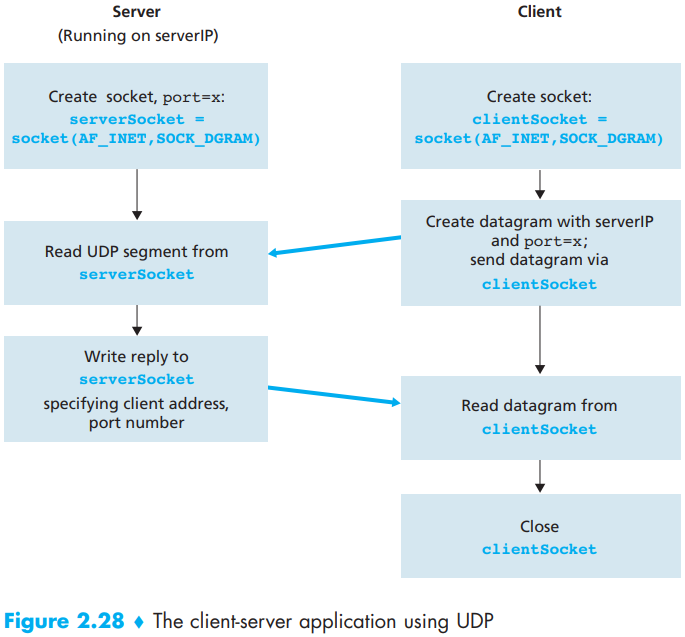

Socket Programming with TCP:

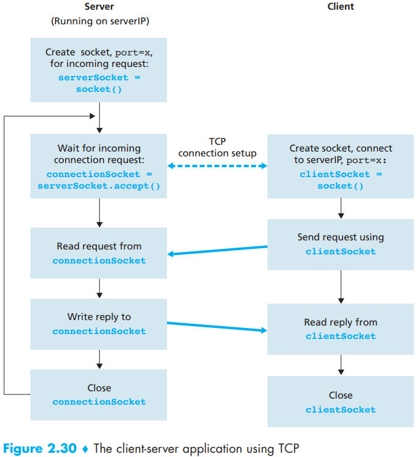
