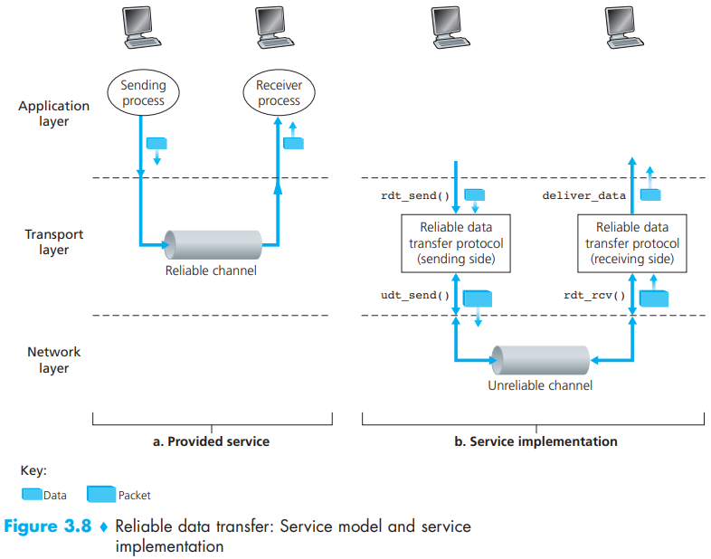

# CHAPTER3 Transport Layer

A transport-layer protocol provides for `logical communication` between application processes running on different hosts.

From the discussion above, we know that transport-layer multiplexing requires: (1) that sockets have unique identifiers, and (2) that each segment have special fields that indicate the socket to which the segment is to be delivered. 

As many applications are better suited for UDP for the following reasons:

- Finer application-level control over what data is sent, and when.
- No connection establishment.
- No connection state.
- Small packet header overhead.

Summary of reliable data transfer mechanisms and their use:

| Mechanism               | Use, Comments                                                |
| ----------------------- | ------------------------------------------------------------ |
| Checksum                | Used to detect bit errors in a transmitted packet.           |
| Timer                   | Used to timeout/retransmit a packet, possibly because the packet (or its ACK) was lost within the channel. Because timeouts can occur when a packet is delayed but not lost (premature timeout), or when a packet has been received by the receiver but the receiver-to-sender ACK has been lost, duplicate copies of a packet may be received by a receiver. |
| Sequence number         | Used for sequential numbering of packets of data flowing from sender to receiver. Gaps in the sequence numbers of received packets allow the receiver to detect a lost packet. Packets with duplicate sequence numbers allow the receiver to detect duplicate copies of a packet. |
| Acknowledgment          | Used by the receiver to tell the sender that a packet or set of packets has been received correctly. Acknowledgments will typically carry the sequence number of the packet or packets being acknowledged. Acknowledgments may be individual or cumulative, depending on the protocol. |
| Negative acknowledgment | Used by the receiver to tell the sender that a packet has not been received correctly. Negative acknowledgments will typically carry the sequence number of the packet that was not received correctly. |
| Window, pipelining      | The sender may be restricted to sending only packets with sequence numbers that fall within a given range. By allowing multiple packets to be transmitted but not yet acknowledged, sender utilization can be increased over a stop-and-wait mode of operation. We’ll see shortly that the window size may be set on the basis of the receiver’s ability to receive and buffer messages, or the level of congestion in the network, or both. |

- `Source port`
- `Dest port`
- `sequence number field`
- `acknowledgment number field`
- `receive window`
- `header length field`
- `options field`
- `flag field`
  - `URG`
  - `ACK`
  - `PSH`
  - `SYN`
  - `FIN`
- `Internet checksum`
- `Urgent data pointer`
- `Options`

Upon obtaining a new SampleRTT, TCP updates EstimatedRTT according to the following formula:
$$
EstimatedRTT = (1 - \alpha) \cdot EstimatedRTT + \alpha \cdot SampleRTT
$$
The recommended value of $\alpha$ is $\alpha = 0.125$ (this is, $1/8$) [RFC 6298], in which case the formula above becomes:
$$
EstimatedRTT = 0.875 \cdot EstimatedRTT + 0.125 \cdot SampleRTT
$$
Note that $EstimatedRTT$ is a weighted average of the $SampleRTT$ values.

All of these considerations are taken into account in TCP's method for determining the retransmission timeout interval:
$$
TimeoutInterval = EstimatedRTT + 4 \cdot DevRTT
$$
An initial $TimeoutInterval$ value of 1 second is recommended [RFC 6298]. Also, when a timeout occurs, the value of $TimeoutInterval$ is doubled to avoid a premature timeout occurring for a subsequent segment that will soon be acknowledged. However, as soon as a segment is received and $EstimatedRTT$ is updated, the $TimeoutInterval$ is again computed using the formula above.

TCP ACK Generation Recommendation [RFC 5681]:

| Event                                                        | TCP Receiver Action                                          |
| ------------------------------------------------------------ | ------------------------------------------------------------ |
| Arrival of in-order segment with expected sequence number. All data up to expected sequence number already acknowledged. | Delayed ACK. Wait up to 500 msec for arrival of another in-order segment. If next in-order segment does not arrive in this interval, send an ACK. |
| Arrival of in-order segment with expected sequence number. One other in-order segment waiting for ACK transmission. | Immediately send single cumulative ACK, ACKing both in-order segments. |
| Arrival of out-of-order segment with higher-than-expected sequence number. Gap detected. | Immediately send duplicate ACK, indicating sequence number of next expected byte (which is the lower end of the gap). |
| Arrival of segment that partially or completely fills in gap in received data. | Immediately send ACK, provided that segment starts at the lower end of gap. |

TCP provides flow control by having the sender maintain a variable called the `receive window`. Informally, the receive window is used to give the sender an idea of how much free buffer space is available at the receiver. Because TCP is full-duplex, the sender at each side of the connection maintains a distinct receive window. Let’s investigate the receive window in the context of a file transfer. Suppose that Host A is sending a large file to Host B over a TCP connection. Host B allocates a receive buffer to this connection; denote its size by `RcvBuffer`. From time to time, the application process in Host B reads from the buffer. Define the following variables:

- LastByteRead: the number of the last byte in the data stream read from the buffer by the application process in B.
- LastByteRcvd: the number of the last byte in the data stream that has arrived from the network and has been placed in the receive buffer at B.

Because TCP is not permitted to overflow the allocated buffer, we must have:
$$
LastByteRcvd - LastByteRead \leq RcvBuffer
$$
The receive window, denoted `rwnd` is set to the amount of spare room in the buffer:
$$
rwnd = RcvBuffer - [LastByteRcvd - LastByteRead]
$$
Because the spare room changes with time, `rwnd` is dynamic. The variable `rwnd` is illustrated in Figure 3.38.

The TCP in the client then proceeds to establish a TCP connection with the TCP in the server in the following manner:

- Step 1. The client-side TCP first sends a special TCP segment to the server-side TCP.
- Step 2. Once the IP datagram containing the TCP SYN segment arrives at the server host (assuming it does arrive!), the server extracts the TCP SYN segment from the datagram, allocates the TCP buffers and variables to the connection, and sends a connection-granted segment to the client TCP.
- Step 3. Upon receiving the SYNACK segment, the client also allocates buffers and variables to the connection.

At the broadest level, we can distinguish among congestion-control approaches by whether the network layer provides any explicit assistance to the transport layer for congestion-control purposes:

- End-to-end congestion control.
- Network-assisted congestion control.

Specifically, the amount of unacknowledged data at a sender may not exceed the minimum of cwnd and rwnd, that is:
$$
LastByteSent - LastByteAcked \leq min\lbrace cwnd, rwnd \rbrace
$$
Are TCP senders explicitly coordinated, or is there a distributed approach in which the TCP senders can set their sending rates based only on local information? TCP answers these questions using the following guiding principles:

- A lost segment implies congestion, and hence, the TCP sender’s rate should be decreased when a segment is lost.
- An acknowledged segment indicates that the network is delivering the sender’s segments to the receiver, and hence, the sender’s rate can be increased when an ACK arrives for a previously unacknowledged segment.
- Bandwidth probing. 

Because TCP’s throughput (that is, rate) increases linearly between the two extreme values, we have:
$$
average throughput of a connection = \frac{0.75 \cdot W}{RTT}
$$
Using this highly idealized model for the steady-state dynamics of TCP, we can also derive an interesting expression that relates a connection’s loss rate to its available bandwidth [Mahdavi 1997].

## Summary

