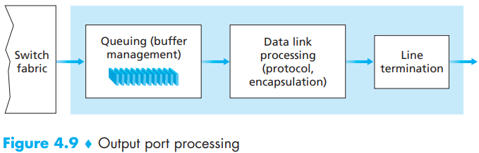
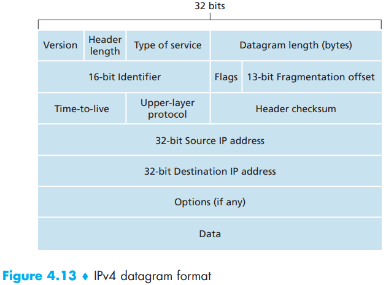
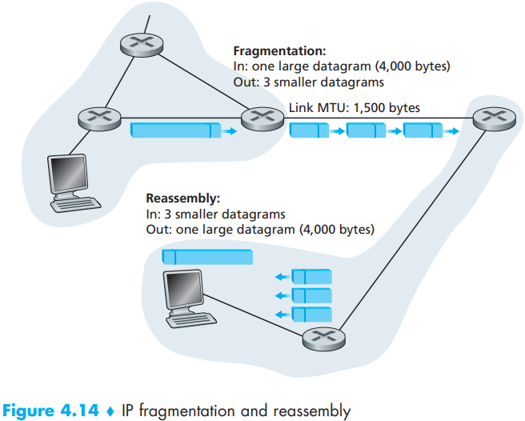

# Chapter 4 The Network Layer

The role of the network layer is thus deceptively simple -- to move packets from a sending host to a receiving host. To do so, two important network-layer functions can be identified:

- Forwarding. When a packet arrives at a router's input link, the router must move the packet to the appropriate output link.
- Routing. The network layer must determine the route or path taken by packets as they flow from a sender to a receiver. The algorithms that calculate these paths are referred to as `routing algorithms`.

The `network service model` defines the characteristics of end-to-end transport of packets between sending and receiving end systems. It provided the following services:

- `Guaranteed delivery`.
- `Guaranteed delivery with bounded delay`.
- `In-order packet delivery`.
- `Guaranteed minimal bandwidth`.
- `Guaranteed maximum jitter`.
- `Security services`.

There are three identifiable phases in a virtual circuit:

- VC setup.
- Data transfer.
- VC teardown.

In a `datagram network`, each time an end system wants to send a packet, it stamps the packet with the address of the destination end system and then pops the packet into the network.

A high-level view of a generic router architecture is shown in Figure 4.6. Four router components can be identified:

- Input ports.
- Switching fabric.
- Output ports.
- Routing processor.

- Input Processing

  

- Switching

  The switching fabric is at the very heart of a router, as it is through this fabric that the packets are actually switched (that is, forwarded) from an input port to an output port. Switching can be accomplished in a number of ways:

  - Switching via memory.
  - Switching via a bus.
  - Switching via an interconnection network.

  

- Output Processing

  

IPv4 datagram format:

- `Version number`. These 4 bits specify the IP protocol version of the datagram. By looking at the version number, the router can determine how to interpret the remainder of the IP datagram. Different versions of IP use different datagram formats.
- `Header length`. Because an IPv4 datagram can contain a variable number of options(which are included in the IPv4 datagram header), these 4 bits are needed to determine where in the IP datagram the data actually begins. Most IP datagrams do not contain options, so the typical IP datagram has a 20-byte header.
- `Type of service`. The type of service (TOS) bits were included in the IPv4 header to allow different types of IP datagrams to be distinguished from each other.
- `Datagram length`. This is the total length of the IP datagram (header plus data), measured in bytes. Since this field is 16 bits long, the theoretical maximum size of the IP datagram is 65,535 bytes. However, datagrams are rarely larger than 1,500 bytes.
- `Identifier, flags, fragmentation offset`. These three fields have to do with so-called IP fragmentation.
- `Time-to-live`. The time-to-live (TTL) field is included to ensure that datagrams do not circulate forever in the network. This field is decremented by one each time the datagram is processed by a router. If the TTL field reaches 0, the datagram must be dropped.
- `Protocol`. This field is used only when an IP datagram reaches its final destination. The value of this field indicates the specific transport-layer protocol to which the data portion of this IP datagram should be passed.
- `Header checksum`. The header checksum aids a router in detecting bit errors in a received IP datagram.
- `Source and destination IP addresses`. When a source creates a datagram, it inserts its IP address into the source IP address field and inserts the address of the ultimate destination into the destination IP address field.
- `Options`. The options fields allow an IP header to be extended.
- `Data (payload)`. 

The maximum amount of adata that a link-layer frame can carry is called the maximum transmission unit (MTU). 

An IP address is technically associated with an interface, rather than with the host or router containing that interface.

We can use the following recipe to define the subnets in the system:

*To determine the subnets, detach each interface from its host or router, creating islands of isolated networks, with interfaces terminating the end points of the isolated networks. Each of these isolated networks is called a subnet.*

The `Dynamic Host Configuration Protocol (DHCP)` allows a host to obtain (be allocated) an IP address automatically.

1. `DHCP server discovery`. The first task of a newly arriving host is to find a DHCP server with which to interact. This is done using a `DHCP discover message`, which a client sends within a UDP packet to port 67.
2. `DHCP server offer(s)`. A DHCP server receiving a DHCP discover message responds to the client with a `DHCP offer message` that is broadcast to all nodes on the subnet, again using the IP broadcast address of 255.255.255.255.
3. `DHCP request`. The newly arriving client will choose from among one or more server offers and  respond to its selected offer with a `DHCP request message`, echoing back the configuration parameters.
4. `DHCP ACK`. The server responds to the DHCP request message with a `DHCP ACK message`, confirming the requested parameters.

Network Address Translation (NAT):

IPv6 Datagram Format:

- `Version`. This 4-bit field identifies the IP version number.
- `Traffic class`. This 8-bit field is similar in spirit to the TOS field we saw in IPv4.
- `Flow label`. As discussed above, this 20-bit field is used to identify a flow of datagrams.
- `Payload length`. This 16-bit value is treated as an unsigned integer giving the number of bytes in the IPv6 datagram following the fixed-length, 40-byte datagram header.
- `Next header`. This field identifies the protocol to which the contents (data field) of this datagram will be delivered (for example, to TCP or UDP). The field uses the same values as the protocol field in the IPv4 header.
- `Hop limit`. The contents of this field are decremented by one by each router that forwards the datagram. If the hop limit count reaches zero, the datagram is discarded.
- `Source and destination addresses`. The various formats of the IPv6 128-bit address are described in RFC 4291.
- `Data`.

An alternative to the dual-stack approach, also discussed in RFC 4213, is known as `tunneling`.

The link-state routing algorithm we prsent below is known as `Dijkstra's algorithm`, named after its inventor. Dijkstra's algorithm is iterative and has the property that after the $k$th iteration of the algorithm, the least-cost paths are known to $k$ destination nodes, and among the least-cost paths to all destination nodes, these $k$ paths will have the $k$ smallest costs. Let us define the following notation:

- $D(v)$: cost of the least-cost path from the source node to destination $v$ as of this iteration of the algorithm.
- $p(v)$: previous node (neighbor of $v$) along the current least-cost path from the source to $v$.
- $N'$: subset of nodes; $v$ is in $N'$ if the least-cost path from the source to $v$ is definitively known.

The `distance vector (DV)` algorithm is iteratve, asynchronous, and distributed. Let $d_x(y)$ be the cost of the least-cost path from node $x$ to node $y$. Then the least costs are related by the celebrated Bellman-Ford equation, namely,
$$
d_x(y) = min_v\{c(x, v) + d_v(y)\} \qquad (4.1)
$$
where the $min_v$ in the equation is taken over all of x's neighbors. The Bellman-Ford equation is rather intuitive. Indeed, after traveling from $x$ to $v$, if we then tak the least-cost path from $v$ to $y$, the path cost will be $c(x, v) + d_v(y)$. Since we must begin by traveling to some neighbor $v$, the least cost from $x$ to $y$ is the minimum of $c(x, v) + d_v(y)$ taken over all neighbors $v$.

The basic idea is as follows. Each node $x$ begins with $D_x(y)$, an estimate of the cost of the least-cost path from itselft to node $y$, for all nodes in $N$. Let $D_x = [D_x(y):y\ in\ N]$ be node x's distance vector, which is the vector of cost estimates from $x$ to all other nodes, $y$, in $N$. With the DV algorithm, each node $x$ maintains the following routing information:

- For each neighbor $v$, the cost $c(x, v)$ from $x$ to directly attached neighbor, $v$.
- Node x's distance vector, that is, $D_x = [D_x(y): y\ in\ N]$, containing x's estimate of tis cost to all destinations, $y$, in $N$.
- The distance vectors of each of its neighbors, that is, $D_v = [D_v(y): y\ in\ N]$ for each neighbor $v$ of $x$.

In the distributed, asynchronous algorithm, from time to time, each node sends a copy of its distance vector to each of its neighbors. When a node $x$ receives a new distance vector from any of its neighbors $v$, it saves v's distance vector, and then uses the Bellman-Ford equation to update its own distance vector as follows:
$$
D_x(y) = min_v\{c(x, v) + D_v(y)\} \qquad for\ each\ node\ y\ in\ N
$$

Conclude LS and DV algorithms with a quick comparison of some of their attributes. Recall that $N$ is the set of nodes (routers) and $E$ is the set of edges (links).

- `Message complexity`.
- `Speed of convergence`.
- `Robustness`.

In practice, this model and its view of a homogenous set of routers all executing the same routing algorithm is a bit simplistic for at least two important reasons:

- `Scale`.
- `Administrative autonomy`.

